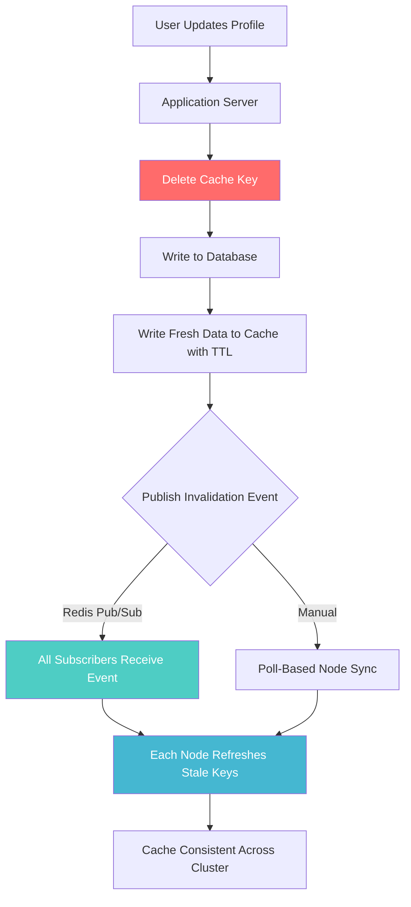

| Difficulty | Channel | Tags |
|---|---|---|
| beginner | backend | redis, memcached, cache-invalidation |

On March 3, 2026, GitHub deployed what looked like a routine optimization to reduce writes on their user settings cache. Within minutes, every single cached user profile expired simultaneously, triggering a chain reaction that took down 40% of all requests for over an hour [1]. This is the story of why cache invalidation remains one of the hardest problems in distributed systems — and how to get it right before your pager goes off.

---

> ### Real-World Case — GitHub
>
> On March 3, 2026, GitHub deployed a change to reduce writes to their user settings caching mechanism. A bug caused every user's cached settings/profile to expire simultaneously, triggering a cascade of recalculations and rewrites that overwhelmed the system. Replication delays cascaded across all dependent services.
>
> | | |
> |---|---|
> | **Challenge** | Cache invalidation at GitHub's massive scale — how to update user profile/settings caches without causing cascading failures. A single deployment intended to reduce cache writes instead amplified them by invalidating all cached entries at once, with recalculation reads hitting lagging database replicas and persisting stale data. |
> | **Solution** | Immediate rollback of the faulty deployment, plus architectural fixes: added a killswitch to disable the caching code path instantly without full deployment rollbacks, improved monitoring for early detection, and migrated the cache mechanism to a dedicated host to isolate blast radius from other services. |
> | **Outcome** | 40% of github.com requests and 43% of API calls failed for 1 hour 10 minutes. Git HTTP operations had 6% errors, Copilot saw 21% error rates, and all dependent services (Actions, webhooks, etc.) were degraded. The shared root cause with a similar February incident revealed systemic fragility in their cache invalidation architecture. |
> | **Lesson** | Cache invalidation at scale is dangerously non-local: a change intended to reduce writes can accidentally mass-expire cache entries, causing a thundering herd of recalculations that overloads both database replicas and the cache itself. Cache recalculation reads should target the primary database — routing them through replicas introduces latent coupling to replication lag that becomes catastrophic under write spikes. |

---

## Hook — The 3 AM Scenario You Didn’t Plan For

You push a seemingly harmless change: reduce cache writes to improve efficiency. The deployment looks clean. Metrics start flat. Then, like dominos, everything collapses. Your user profile cache — designed to make things faster — just became the single point of failure that brought down the entire platform [1]. This is not a hypothetical. This is what happened at GitHub, and it could happen to your team too. The problem is not caching itself. The problem is what happens when you do not think deeply enough about how your cache expires.

## Problem — The Cache Inversion of Control

Cache invalidation sounds simple: when data changes, remove the old copy. But in a distributed system, every node holds a potentially stale version of the truth. The tension is fundamental — you want speed, so you cache aggressively. But you also want consistency, so you invalidate carefully. The two goals pull in opposite directions [2]. Most teams reach for TTL-based expiration as the default, and for good reason: it is simple, predictable, and requires no coordination between nodes. However, GitHub’s incident reveals the hidden danger. When every key expires at the same time, you create a thundering herd problem that can take down your database, your cache backend, and every service that depends on them. The stakes? A single misconfigured cache can degrade your API latency from milliseconds to timeouts, cascade across your entire service mesh, and turn a routine deploy into a company-wide incident.

## Real-World Case — GitHub’s March 2026 Meltdown

The numbers from GitHub’s March 3, 2026 incident are sobering: 40% of all github.com requests failed, 43% of API calls errored out, and Copilot — the AI pair programmer millions depend on — saw a 21% error rate [1]. Git HTTP operations suffered 6% failure rates, and every dependent service from Actions to webhooks degraded in sympathy. The root cause? A change to the user settings caching mechanism that unintentionally expired all cached profiles at once. The resulting storm of recalculations cascaded through replication delays across the entire system. GitHub had seen a nearly identical failure in February 2026 — a pattern the post-mortem called “systemic fragility in cache invalidation architecture” [1]. When a cache invalidation bug survives two incidents in two months, it is no longer a bug. It is an architectural weakness.

## Deep Dive — Write-Through vs Cache-Aside and the Redis/Memcached Decision

This leads to the core architectural choice: how do you keep your cache in sync with your source of truth? The two dominant patterns are write-through and cache-aside. Write-through ensures every write goes to both the database and cache atomically — slower writes, but no stale reads [3]. Cache-aside lets the application populate the cache on read when data is missing — faster writes, but the first read after a write may serve stale data. Your choice determines everything about your invalidation strategy.

Now, the storage layer. Redis and Memcached are the two most popular in-memory caches, but they are not interchangeable. Memcached is a pure cache — simple, fast, minimal memory overhead. It does exactly one thing: store key-value pairs in RAM and serve them quickly [4]. This simplicity makes horizontal scaling straightforward. You add nodes, you rebalance keys, you move on. But there is a catch: Memcached has no built-in mechanism for distributed coordination. If one node needs to tell another that data has changed, you have to build that yourself.

Redis, on the other hand, brings an entire platform. Pub/sub channels let any node broadcast invalidation events to every other node instantly [5]. Persistence options mean you can recover from restarts without a cold cache. Advanced data structures (sorted sets, hyperloglogs, streams) let you build smarter caching patterns beyond simple key-value lookups [6]. The trade-off? Higher memory overhead per key, a more complex operational surface, and — for teams that do not need the extras — unnecessary complexity.

The decision matrix is clear on paper but messy in practice. Memcached wins when your caching needs are straightforward and you prioritize raw throughput and simplicity. Redis wins when you need distributed invalidation, data durability, or complex cache hierarchies [7]. But here is the plot twist: neither choice matters if your invalidation strategy itself is flawed. GitHub’s incident was not a Memcached problem or a Redis problem. It was a TTL synchronization problem — every key happened to expire at the same moment, regardless of the underlying cache engine.

## Workflow — The Write-Through Invalidation Pipeline

Building on the architectural decision, here is the invalidation workflow that prevents thundering herds while keeping your cache consistent. The flow below shows how a write-through pattern with staggered TTLs, distributed invalidation, and circuit breakers protects against cascading failures.

## Code Example — Building a Production-Grade Write-Through Cache in Python

The theory matters, but execution is everything. Here is a production-ready implementation of write-through caching with Redis pub/sub for distributed invalidation, complete with jittered TTLs to prevent the thundering herd problem that brought down GitHub [1].

## Lessons Learned — What Every Developer Should Steal From GitHub’s Post-Mortem

Three takeaways from GitHub’s double-incident that you can apply tomorrow:

**1. Never synchronize TTLs.** When setting expiration times, add random jitter. If every cached profile expires at the exact same moment, you have created a time bomb. The fix is trivial — add a random offset to each TTL — but the consequences of skipping it are catastrophic [1].

**2. Cache invalidation is a distributed systems problem, not a caching problem.** You cannot think about cache invalidation in isolation. Every invalidate operation is an implicit request to every downstream service. What happens when 100 million caches expire at once? Your database gets 100 million recalculation requests. Your replication lag spikes. Your circuit breakers trip. You need rate limiting on your invalidations just like you do on your API endpoints [8].

**3. Test the failure case, not just the happy path.** Most teams test “does the cache work?” but never test “what happens when the entire cache expires at once?” GitHub’s February incident should have caught the March one. That it did not means their testing did not cover cache-invalidation storm scenarios [1]. Add a chaos experiment that force-expires all keys in a production-like environment and observe what breaks.

---

## Write-Through Cache Invalidation Pipeline

<strong>Original Interview Question</strong>

**Q:** You're building a user profile service that caches frequently accessed profiles. How would you implement cache invalidation when a user updates their profile, and what trade-offs would you consider between Redis and Memcached?

**A:** Implement write-through caching with TTL-based expiration. On profile update, invalidate the cache by deleting the key and writing new data to both the database and cache. Redis offers pub/sub for automatic distributed invalidation, while Memcached requires manual coordination across nodes.

## Conclusion

GitHub’s March 2026 outage [1] is not a cautionary tale about Redis vs Memcached. It is a story about how the simplest thing — a TTL — can become the deadliest thing when you do not respect the physics of distributed systems. The fix is not a better cache. The fix is thinking about your cache as a distributed protocol, not a performance optimization. Add jitter to your TTLs, test your invalidation storms, and never assume the next deploy will not be the one that makes every key expire at once.

---

## References

1. [GitHub Availability Report — March 2026](https://github.blog/news-insights/company-news/github-availability-report-march-2026/) — blog
2. [Cache Invalidation — Wikipedia](https://en.wikipedia.org/wiki/Cache_invalidation) — documentation
3. [Cache (Computing) — Write-Through Pattern](https://en.wikipedia.org/wiki/Cache_(computing)#Write-through) — documentation
4. [Memcached — A Distributed Memory Object Caching System](https://memcached.org/) — documentation
5. [Redis Pub/Sub Documentation](https://redis.io/docs/latest/develop/interact/pubsub/) — documentation
6. [Redis Data Structures Documentation](https://redis.io/docs/latest/develop/data-types/) — documentation
7. [Cache-Aside Pattern (Microsoft Azure Architecture Center)](https://learn.microsoft.com/en-us/azure/architecture/patterns/cache-aside) — documentation
8. [Distributed Caching on AWS](https://aws.amazon.com/caching/distributed-caching/) — documentation

---

**Author:** Satishkumar Dhule — [GitHub](https://github.com/satishkumar-dhule) · [LinkedIn](https://linkedin.com/in/satishkumar-dhule) · [Website](https://satishkumar-dhule.github.io)
