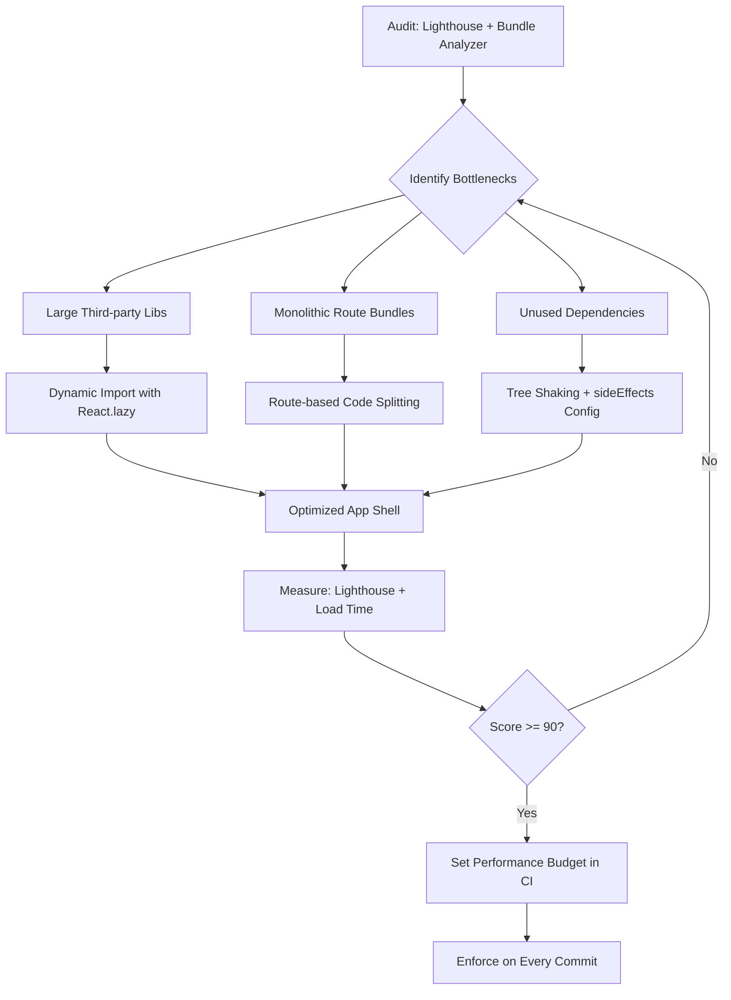

| Difficulty | Channel | Tags |
|---|---|---|
| intermediate | frontend | lighthouse, bundle, lazy-loading |

Tinder wanted to launch 'Tinder Online' — a full PWA version of their dating app targeting markets with limited device storage and slow networks. Their initial React/Redux web app had monolithic JavaScript bundles that took 11 seconds to load on mobile [1]. That is not a delay. That is an eternity when your user is deciding whether to stay or bounce in under three seconds. The fix? A performance transformation that cut load time by 64%, shrank the core bundle from 166KB to 101KB, and proved that with the right approach, even the most bloated React app can be reborn.

---

> ### Real-World Case — Tinder
>
> Tinder wanted to launch 'Tinder Online', a full PWA version of their dating app for markets with limited device storage and slow networks. Their initial React/Redux web app had monolithic JavaScript bundles that took 11s to load on mobile, causing poor user adoption in target markets.
>
> | | |
> |---|---|
> | **Challenge** | The main bundle was bloated with code for features users didn't need immediately (messaging, photo uploads, captchas). Every route shipped all application code upfront. Time-to-interactive on mobile was unacceptable for their target audience in emerging markets with 2G/3G connections. |
> | **Solution** | Implemented route-level code splitting using React Router + React Loadable with dynamic import(). Split non-critical components into separate async chunks. Used webpack CommonsChunkPlugin for vendor caching. Added Service Workers via Workbox for precaching route bundles. Introduced performance budgets (~155KB main+vendor, ~55KB async chunks). Used link rel=preload/prefetch for anticipated routes. Replaced localForage with direct IndexedDB. Removed critical CSS from core bundles. Upgraded React 15→16 for built-in size reductions. |
> | **Outcome** | Core bundle reduced from 166KB to 101KB (39% reduction). DCL improved from 5.46s to 4.69s. Overall load time dropped from ~11s to ~4s (64% faster). Vendor chunk parsing time improved 8% via scope hoisting. React 16 upgrade alone cut vendor chunk by ~7%. Performance budget enforcement prevented regression on every commit. |
> | **Lesson** | Route-based code splitting is the highest-impact optimization for React SPAs — users should never download code for features they haven't requested yet. But the real insight: performance budgets in CI are what make gains stick. Without enforcing budgets, bundle size silently creeps back with every feature addition. |

---

## Hook — The moment your CEO asks why the app takes 11 seconds to load

Picture this: your team has poured months into building a rich React application. The feature set is impressive. The UX is polished. Then the Lighthouse report comes back — a score of 65, Time to Interactive of 4.2 seconds, and a bundle ballooning past 2MB. Your CEO is looking at competitor apps that load in under two seconds. The pressure is on. Many developers think performance optimization is a 'nice to have' — something you tackle after features are shipped. But the truth is brutal: a one-second delay in mobile load times can impact conversion rates by up to 20%. This is the story of how Tinder faced exactly this nightmare, and how the same playbook can rescue your own app.

## Problem — Why your Lighthouse score is stuck at 65 and your bundle keeps growing

Modern React applications suffer from a silent killer: bundle bloat. Every import, every third-party library, every component adds weight to the JavaScript that must be downloaded, parsed, and executed before your user sees anything meaningful. The default React build pipeline does nothing to prevent this. You add a charting library here, a date picker there, and before you know it, the bundle is 2.1MB and nobody can figure out why. The core problem is threefold: monolithic chunks that merge all routes into a single download, unused code that makes it past the build step, and third-party dependencies bundled in full when you only use a fraction of their functionality. A Lighthouse score of 65 means your app is failing users, especially on mobile networks where every kilobyte counts [2]. The real kicker? Most teams do not even know what is in their bundle until it is too late.

## Real-World Case — Tinder Online: 11 seconds to 4 seconds

When Tinder set out to build 'Tinder Online' — a PWA version of their iconic dating app — they were targeting emerging markets where phones had limited storage and networks were unreliable [1]. The stakes were enormous: users in Brazil, India, and Indonesia were the growth engine. But the initial web app was a disaster on mobile. The monolithic JavaScript bundle took 11 agonizing seconds to load. Users swiped away — literally. The engineering team went to work. They implemented route-based code splitting with React.lazy and Suspense, analyzed their bundle composition with webpack-bundle-analyzer, and aggressively removed unused dependencies [3]. The results were staggering: the core bundle dropped from 166KB to 101KB — a 39% reduction. DOM Content Loaded improved from 5.46s to 4.69s. Overall load time plummeted from ~11 seconds to just 4 seconds — 64% faster. Even upgrading from React 15 to React 16 alone cut the vendor chunk by 7%. They locked in these gains with performance budgets enforced on every commit — if a PR bloated the bundle, it did not ship. Tinder proved that aggressive, systematic optimization works at scale.

## Deep Dive — Code splitting, tree shaking, and the art of lazy loading

Behind every performance transformation are a handful of fundamental techniques that work together. Code splitting is the practice of breaking your monolithic bundle into smaller chunks that load on demand. You have two strategies: route-based splitting (load only what that route needs) and component-based splitting (defer expensive components like charts, maps, or rich text editors until they actually appear in the viewport) [4]. Tree shaking is the dead-code elimination that happens when you use ES module syntax (import/export) instead of CommonJS (require). Webpack and other bundlers can statically analyze ES modules and strip unused exports. But here is the plot twist: tree shaking only works if you configure it correctly. Many libraries ship both ESM and CommonJS builds, and if your bundler resolves to the wrong one, tree shaking is silently disabled [5]. This is where tools like webpack-bundle-analyzer become indispensable — they show you exactly what is in each chunk so you can spot the problem. Dynamic imports with the import() syntax are the mechanism that powers both code splitting and lazy loading. When React.lazy wraps a dynamic import, React defers rendering that component until it is actually needed, and Suspense handles the loading state. The combination is devastatingly effective: users download only the code they need, when they need it.

## Workflow — From audit to optimization in six steps

The path from a score of 65 to 90+ follows a repeatable workflow. Start with a comprehensive audit, then systematically eliminate bloat. The diagram below maps the full optimization cycle — a loop of measurement, analysis, intervention, and verification that teams can run on every feature sprint.

## Workflow — The optimization loop that Tinder used

Step one: run Lighthouse and generate a webpack-bundle-analyzer report to establish your baseline. Step two: identify the largest chunks and question every dependency. That charting library weighing 200KB? Maybe you only use one chart type. Step three: configure code splitting at the route level — every major route gets its own chunk using React.lazy. Step four: audit third-party libraries. Replace heavy dependencies with lighter alternatives or use dynamic imports to load them only when needed. Step five: enable tree shaking by ensuring your bundler's mode is set to 'production' and your package.json sideEffects field is accurate [6]. Step six: implement performance budgets — set hard limits on bundle size in your CI pipeline so no PR can silently regress performance. Tinder made performance budgets the gatekeeper, and you should too. Run this loop every sprint and watch your Lighthouse score climb.

## Code Example — From 2.1MB to lean: implementing code splitting with React.lazy

Here is how you take a bloated React app and inject surgical code splitting. The pattern is deceptively simple but the impact is enormous. Convert your static imports to dynamic imports wrapped in React.lazy, then wrap each lazy component in a Suspense boundary with a loading fallback.

## Lessons Learned — What Tinder taught us about performance culture

The biggest lesson from Tinder's transformation is that performance is not a one-time fix — it is a culture. Performance budgets enforced in CI prevent backsliding. Every commit is measured. Every dependency addition is questioned. The second lesson: start with measurement, not guesswork. Running webpack-bundle-analyzer before writing any code prevents weeks of wasted effort optimizing the wrong things [7]. The third lesson: lazy loading is not just for routes. Defer analytics scripts, heavy third-party widgets, below-the-fold images, and feature-flag logic until they are needed. The PRPL pattern (Push, Render, Pre-cache, Lazy-load) is a battle-tested framework for this approach [8]. Fourth: React 16 (and later 18) matter. The React team's focus on performance in concurrent mode and automatic batching means that simply upgrading can yield real gains with zero code changes. Finally, involve the whole team. Performance is not just the senior engineer's problem. Every developer needs to understand tree shaking, side effects, and the cost of import statements. Make performance visible — celebrate the wins and learn from the regressions. The difference between a 65 and a 90+ Lighthouse score is not just technical skill. It is discipline.

---

## Performance Optimization Loop

<strong>Original Interview Question</strong>

**Q:** You're tasked with improving a React app's Lighthouse performance score from 65 to 90+. The bundle size is 2.1MB and Time to Interactive is 4.2s. What specific steps would you take to optimize the bundle and implement lazy loading?

**A:** Implement code splitting with React.lazy() and Suspense, analyze bundle composition with webpack-bundle-analyzer to identify largest chunks, remove unused dependencies and optimize imports, add dynamic imports for heavy components and third-party libraries, implement route-based splitting for better initial load times, and utilize tree shaking with proper ES module configuration.

## Conclusion

Tinder proved that even an 11-second nightmare can become a 4-second delight. The same playbook works for your app: measure first, split ruthlessly, lazy load everything, and lock it all down with performance budgets. The next time someone tells you a 65 Lighthouse score is fine, tell them Tinder turned 11 seconds into 4. Then show them the code.

---

## References

1. [Tinder incident report](https://medium.com/@addyosmani/a-tinder-progressive-web-app-performance-case-study-78919d98ece0) — blog
2. [Lighthouse performance scoring](https://web.dev/lighthouse-performance/) — documentation
3. [webpack-bundle-analyzer](https://github.com/webpack-contrib/webpack-bundle-analyzer) — documentation
4. [React.lazy documentation](https://react.dev/reference/react/lazy) — documentation
5. [Tree shaking in webpack](https://webpack.js.org/guides/tree-shaking/) — documentation
6. [Code splitting in React](https://react.dev/reference/react/lazy#suspense) — documentation
7. [PRPL pattern for web performance](https://web.dev/prpl-pattern/) — documentation
8. [Service Worker API](https://developer.mozilla.org/en-US/docs/Web/API/Service_Worker_API) — documentation

---

**Author:** Satishkumar Dhule — [GitHub](https://github.com/satishkumar-dhule) · [LinkedIn](https://linkedin.com/in/satishkumar-dhule) · [Website](https://satishkumar-dhule.github.io)
