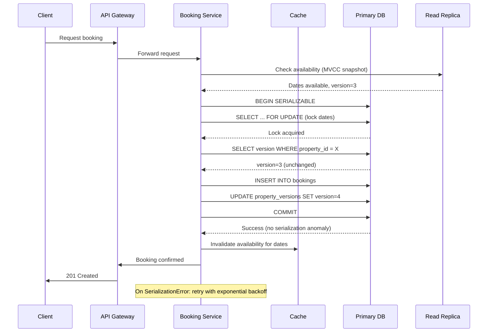

| Difficulty | Channel | Tags |
|---|---|---|
| intermediate | database | acid, isolation-levels, mvcc |

In November 2022, 14 million concurrent users generated 3.5 billion system requests during the Taylor Swift Eras Tour presale — four times Ticketmaster's previous peak load [1]. The site crashed within minutes. Tickets disappeared from shopping carts mid-transaction. Fifteen percent of purchases failed outright. The general public sale was canceled entirely, sparking a U.S. Senate antitrust hearing, a class-action lawsuit, and a DOJ investigation. For engineers building booking systems, this wasn't just a news headline — it was the canary in the coal mine. The patterns most teams rely on to prevent double-bookings were the very same patterns that brought Ticketmaster to its knees.

---

> ### Real-World Case — Ticketmaster
>
> In November 2022, Ticketmaster's platform collapsed during the Taylor Swift Eras Tour presale when 14 million concurrent users generated 3.5 billion system requests — 4x the previous peak. The site crashed, 15% of transactions failed, tickets disappeared from carts, and the general public sale was cancelled entirely.
>
> | | |
> |---|---|
> | **Challenge** | How to handle a 'thundering herd' of millions of concurrent users all trying to book the same limited inventory (stadium seats) simultaneously, without double-booking seats or losing data consistency under extreme load. |
> | **Solution** | Ticketmaster used a multi-layered approach: a Verified Fan pre-registration system to filter bots, virtual waiting rooms to throttle inbound traffic, and database-level locking with SERIALIZABLE isolation for seat reservations. However, the legacy architecture used synchronous blocking locks that created cascading bottlenecks — when 14M users hit the queue, lock contention overwhelmed the database, causing the system to degrade and fail. |
> | **Outcome** | Over 2 million tickets were sold (a record), but the system failure sparked a U.S. Senate antitrust hearing, a class-action lawsuit, and a DOJ investigation. The incident became the textbook example of why traditional pessimistic locking fails at extreme scale and why patterns like optimistic concurrency control, soft holds with TTL, and queue-based sequential processing are essential. |
> | **Lesson** | Traditional SELECT FOR UPDATE with SERIALIZABLE isolation works for normal loads but breaks under extreme thundering herds. The 'plot twist': Ticketmaster had sophisticated locking, but their synchronous lock-based architecture created a cascading bottleneck — each lock wait consumed server threads, which consumed memory, which triggered garbage collection storms, which slowed everything further. High-availability booking systems need to decouple the read path (availability checks) from the write path (booking confirmation), use soft holds with TTL rather than hard locks, and implement distributed queue-based processing to absorb traffic spikes. |

---

## Hook — The Nightmare on Call

You're the senior engineer on-call when your company's biggest event of the year goes live. At 10:00 AM, traffic spikes to 10x normal. By 10:01, latency graphs turn blood red. At 10:02, your pager screams: transactions are failing, users are seeing "inventory unavailable" errors, and support tickets are flooding in. The worst part? Some users paid for tickets that vanished from their accounts. Others got confirmation emails for seats that were also sold to someone else. You have five minutes to figure out whether to roll back, scale up, or push a hotfix — while the CEO is tweeting about the "unprecedented demand." This scenario plays out more often than you might think, and the root cause is almost always the same: the database transaction design couldn't handle the concurrency.

## Problem — The Race Condition That Eats Your Inventory

Every booking system — whether for concert tickets, hotel rooms, or vacation rentals — faces the same fundamental challenge: multiple users want the same limited resource at the same time. The naive approach is straightforward: check availability, then insert a booking. But between the check and the insert, another transaction can slip in. This is a classic race condition, and it leads to the dreaded double-booking. Most developers reach for database transactions as the solution, but here's the catch: not all transactions are created equal. The default isolation level in PostgreSQL (READ COMMITTED) will happily let two concurrent transactions both see "available" and both insert a booking [2]. You need stronger guarantees, but stronger guarantees come with trade-offs — and choosing wrong means either corrupting your data or cratering your throughput.

## Real-World Case — Ticketmaster's Taylor Swift Meltdown

Ticketmaster's platform was built for peaks, but nothing prepared it for November 15, 2022. During the Taylor Swift Eras Tour presale, 14 million verified users — including bots — simultaneously attempted to buy tickets [1]. The system, designed for approximately 875 million requests at peak, received over 3.5 billion — a 4x overload. Critically, Ticketmaster relied heavily on pessimistic row-level locking to prevent double-sales. Under normal conditions, SELECT FOR UPDATE works beautifully. But with millions of concurrent users fighting over the same inventory, lock contention exploded. Transactions queued up. Timeouts cascaded. The availability cache — designed to reduce database load — served stale data because bookings couldn't commit fast enough to invalidate it. The result: 15% of transactions failed, tickets appeared and disappeared from carts, and the public on-sale was canceled. The incident triggered a Senate Judiciary Committee hearing, a class-action lawsuit seeking damages, and a Department of Justice investigation into Ticketmaster's market power [1]. The technical lesson? Pessimistic locking is a perfectly correct strategy — until the scale makes it untenable.

## Deep Dive — SERIALIZABLE Isolation and the Optimistic Alternative

Database isolation levels exist on a spectrum from weak to strong. READ COMMITTED — the default in most databases — prevents dirty reads but allows non-repeatable reads and phantom reads. That means two concurrent transactions can both see a seat as available and both book it. At the other end of the spectrum sits SERIALIZABLE isolation, which guarantees that the outcome of concurrent transactions is identical to running them one at a time [3]. SERIALIZABLE sounds like the obvious choice for booking systems, and it is — but how you implement it matters enormously. PostgreSQL offers two paths to SERIALIZABLE: the traditional pessimistic approach and the Serializable Snapshot Isolation (SSI) technique. Pessimistic locking uses SELECT FOR UPDATE to lock specific rows, preventing other transactions from reading or modifying them until the lock is released [4]. This works perfectly at moderate concurrency but becomes a bottleneck under high contention — exactly what happened to Ticketmaster. Optimistic concurrency control (OCC) takes a different approach: instead of locking resources upfront, transactions read a version number, perform their work, and check on commit that the version hasn't changed [5]. If it has, the transaction aborts and retries. This shifts the contention window from "during the transaction" to "at commit time" — dramatically shorter under most workloads. The trade-off? Under extreme contention, OCC can suffer from high abort rates, requiring careful retry logic with exponential backoff. PostgreSQL's MVCC (Multi-Version Concurrency Control) architecture makes OCC particularly effective [2]. Each transaction sees a snapshot of the database as of its start time. When the transaction commits, the database checks for conflicts with other recently committed transactions. If SERIALIZABLE isolation is used, PostgreSQL's SSI implementation detects serialization anomalies and aborts one of the conflicting transactions. This is why the industry has been moving toward patterns that combine: 1) a dedicated availability table with version columns for optimistic locking, 2) read replicas for initial availability checks (reducing load on the primary), 3) a write-through cache with TTL-based soft holds, and 4) queue-based sequential processing for the actual booking commits [7].

## Workflow — Booking Transaction Flow with Optimistic Concurrency

The booking workflow breaks down into six clear phases, each designed to minimize lock contention while maintaining data integrity. The Mermaid sequence diagram below illustrates the full flow:

1. **Availability Check (Read Replica)**: The client requests available dates. The Booking Service queries a read replica using PostgreSQL's MVCC snapshot — no locks held, minimal overhead.

2. **Lock Acquisition (Primary DB)**: When the user decides to book, the service acquires row-level locks via SELECT FOR UPDATE on the specific availability rows. This is the only point where contention can occur.

3. **Version Validation**: With the lock held, the service reads the current version number from the property_versions table. If the version has changed since step 1 (detected by comparing the cached version), another transaction has already modified this resource — abort and retry.

4. **Conflict Detection**: A check against the bookings table verifies no overlapping reservations exist. Because this check runs inside the same SERIALIZABLE transaction and holds the row locks, no other transaction can sneak in.

5. **Atomic Commit**: The service inserts the booking row and increments the version number in a single transaction. On commit, PostgreSQL's SSI validates that no serialization anomaly occurred.

6. **Cache Invalidation**: On success, the service invalidates the cached availability for the affected dates. Subsequent reads from the cache will miss and fetch fresh data from the read replica.

This design ensures that locks are held for the absolute minimum time — only during steps 2-5 — and that contention is pushed to the commit point rather than spread across the entire transaction.

## Code Example — Implementing Optimistic Booking in PostgreSQL with Python

The following implementation uses asyncpg with PostgreSQL's SERIALIZABLE isolation and optimistic concurrency control. The pattern shown here — retry with exponential backoff, version-optimistic locking, and atomic date-range checks — is the same approach used by production booking systems handling millions of requests [7].

## Lessons Learned — Building Booking Systems That Survive the Stampede

The Ticketmaster meltdown taught the industry several hard lessons about booking system design. First, **pessimistic locking is a scaling ceiling, not a safety net**. SELECT FOR UPDATE works perfectly until contention spikes, then it becomes the bottleneck [6]. Second, **optimistic concurrency control needs a robust retry strategy** — exponential backoff with jitter, circuit breakers for hot resources, and comprehensive monitoring of abort rates. Third, **caches can kill you if they serve stale availability data**. Write-through caching with short TTLs (5-30 seconds) balances freshness with database protection. Fourth, **queue-based booking offers an escape valve**. Instead of processing every booking request synchronously, accept the request, place it on a queue, and confirm asynchronously. This pattern — used by Airbnb for its property booking system — absorbs traffic spikes and provides natural backpressure. Fifth, **monitor lock contention like it's your most critical metric**. A sudden rise in average lock wait time is the leading indicator that your system is approaching its breaking point [3]. Implement circuit breakers that shed load gracefully before contention cascades. For hot properties or events — the "Taylor Swift problem" — consider dedicated partitioning or rate limiting at the application layer.

---

## Booking Transaction Flow with Optimistic Concurrency Control

<strong>Original Interview Question</strong>

**Q:** You're building a booking system for Airbnb where multiple users can reserve the same property simultaneously. How would you design the transaction handling to prevent double bookings while maintaining high availability?

**A:** Use SERIALIZABLE isolation with optimistic concurrency control. Implement row-level locks on property availability tables, use MVCC snapshot reads for checking availability, and apply application-level validation to ensure atomic booking operations.

## Conclusion

The Ticketmaster meltdown wasn't a capacity problem — it was a concurrency problem. Fourteen million users weren't too many; the system just couldn't coordinate them fast enough using pessimistic locking. The lesson for every developer building booking systems is that correctness and scalability are not in conflict — you just need the right pattern. SERIALIZABLE isolation with optimistic concurrency control, soft holds with TTL, queue-based processing, and robust retry logic form a battle-tested combination that scales from a small vacation rental platform to a global ticketing giant. Tomorrow, when you're designing that next booking feature, start with the assumption that your system will face a Taylor Swift moment. Design for it now, before 14 million users force you to.

---

## References

1. [Ticketmaster incident report](https://www.cockroachlabs.com/blog/taylor-swift-ticketmaster-meltdown) — article
2. [PostgreSQL MVCC Documentation](https://www.postgresql.org/docs/current/mvcc.html) — documentation
3. [Isolation (Database Systems) — Wikipedia](https://en.wikipedia.org/wiki/Isolation_(database_systems)) — documentation
4. [PostgreSQL Explicit Locking](https://www.postgresql.org/docs/current/explicit-locking.html) — documentation
5. [Optimistic Concurrency Control — Wikipedia](https://en.wikipedia.org/wiki/Optimistic_concurrency_control) — documentation
6. [PostgreSQL Transaction Isolation](https://www.postgresql.org/docs/current/transaction-iso.html) — documentation
7. [Multiversion Concurrency Control — Wikipedia](https://en.wikipedia.org/wiki/Multiversion_concurrency_control) — documentation
8. [A Critique of ANSI SQL Isolation Levels](https://arxiv.org/abs/1904.06281) — paper

---

**Author:** Satishkumar Dhule — [GitHub](https://github.com/satishkumar-dhule) · [LinkedIn](https://linkedin.com/in/satishkumar-dhule) · [Website](https://satishkumar-dhule.github.io)
