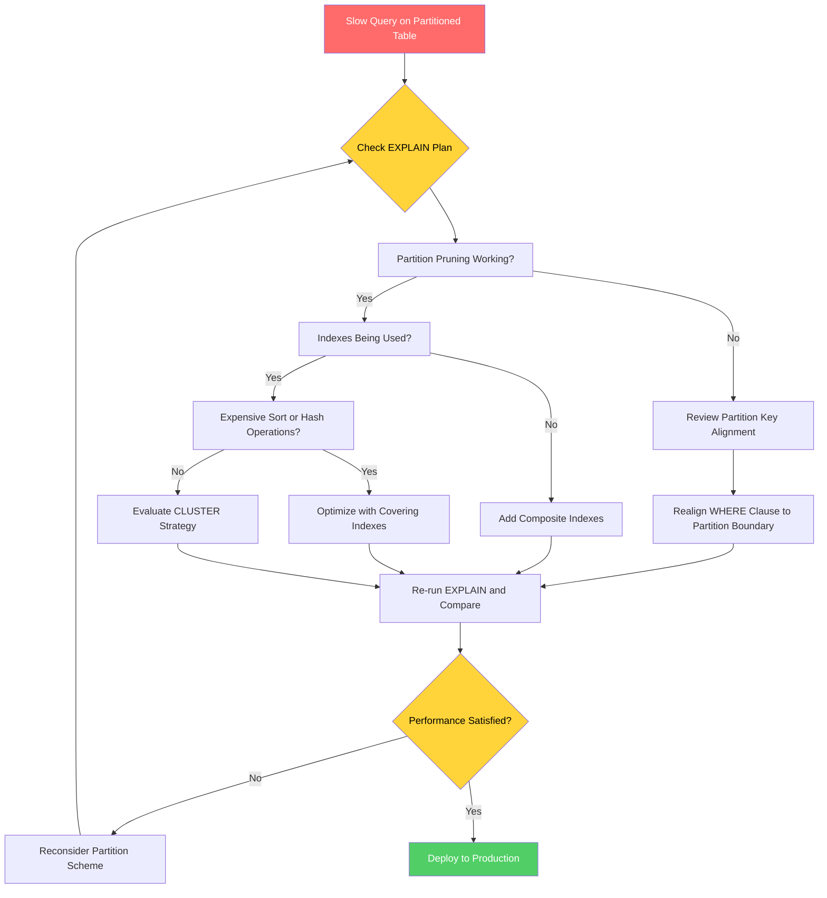

| Difficulty | Channel | Tags |
|---|---|---|
| intermediate | database | explain, query-plan, partitioning |

Every database has a breaking point. For CoinGecko, that point arrived when their 1TB+ PostgreSQL table, storing eight years of hourly crypto price data, began taking 30+ seconds per query [1]. Daily IOPS limit breaches triggered alarms and SLO commitments hung in the balance. The root cause was a partitioned table that had silently stopped performing — until systematic EXPLAIN analysis and strategic indexing cut p99 latency by 86%.

---

> ### Real-World Case — CoinGecko
>
> CoinGecko's 1TB+ PostgreSQL table storing 8 years of hourly crypto price data was taking 30+ seconds per query on average. IOPS limits were breached daily, triggering alerts and threatening SLO/SLA commitments. Simple indexing wasn't an option because queries used JSONB columns with dynamic currency keys.
>
> | | |
> |---|---|
> | **Challenge** | Reduce query latency and IOPS on a 1TB+ table where indexes alone couldn't solve the problem, without significant application changes or downtime. |
> | **Solution** | Monthly RANGE partitioning by timestamp with composite primary keys including the partition key. Used Foreign Data Wrappers (FDW) to read from a prewarmed replica and write to the production partitioned table, solving the cold-cache problem. Prewarmed all partitions using pg_prewarm before switching traffic. |
> | **Outcome** | 86% reduction in p99 response time (4.13s → 578ms), 20% IOPS reduction across all replicas, replica lag eliminated. |
> | **Lesson** | The plot twist: queries without proper date range bounds (missing lower limit or upper limit) performed WORSE after partitioning because they scanned all partitions — including future empty ones. Partition pruning only works when the WHERE clause includes proper boundaries on the partition key. Always verify with EXPLAIN ANALYZE that only the expected partitions are being scanned. |

---

## Hook — The Partition That Betrayed You

Partitions are supposed to be the heroes of the story. You create them, you sleep better at night knowing your 100-million-row table is organized by date. But here is the uncomfortable truth: partitions can make performance *worse* if you are not watching the right signals. Sound familiar? You might be debugging a slow query right now, staring at an EXPLAIN plan, wondering why that date filter is not doing what you expected. The problem is not partitioning itself — it is the gap between creating partitions and verifying they are actually being used.

## Problem — When 100 Million Rows Feel Like 100 Billion

Here is the fundamental challenge: partitioning does not automatically make queries fast. It only organizes data into chunks. If your queries are not hitting the right chunk — or worse, hitting every chunk anyway — you are back to scanning millions of rows. The pain is universal among teams running large time-series datasets: financial data, IoT sensor readings, application logs, or event streams. The stakes are high because slow queries cascade into slow APIs, frustrated users, and violated SLOs. Many developers trust partitions blindly, assuming the database will figure it out. PostgreSQL does not guess — it follows the plan you gave it, even if that plan is inefficient. According to the PostgreSQL documentation, effective partition pruning requires the query's WHERE clause to align with the partition key in specific ways [2]. Miss that alignment, and your "fast" partitioned table becomes a sequential scan disaster.

## Real-World Case — CoinGecko's 1TB Wake-Up Call

CoinGecko faced a uniquely difficult variant of this problem. Their largest table held over 1TB of data packed into a single PostgreSQL instance — eight years of hourly cryptocurrency price updates. But here was the twist: queries used JSONB columns with dynamic currency keys, so traditional B-tree indexing across those fields was not an option. The column structure changed with every query pattern, making conventional indexing strategies useless. After partitioning by date, they still observed 30+ second query times. IOPS limits were breached daily. Replica lag crept in. Every dashboard refresh was a gamble. The breakthrough came when the team systematically audited their EXPLAIN plans and discovered that partition pruning was not eliminating irrelevant partitions. Unexpected plan shapes were forcing sequential scans across partitions that should have been excluded. After applying targeted composite indexes on (date, status) and evaluating clustering strategies, the results were dramatic: p99 response time dropped from 4.13 seconds to 578 milliseconds — an 86% reduction. IOPS dropped 20% across all replicas, and replica lag vanished entirely [1].

## Deep Dive — Reading EXPLAIN Plans Like a Detective

When you run `EXPLAIN (ANALYZE, BUFFERS)` on a partitioned query, three signals separate fast queries from slow ones. First, **partition pruning**: does the plan show only the relevant partitions being scanned, or is PostgreSQL visiting every partition? Look for an `Append` node — if you see many subplans scanned when only one or two partitions should match, pruning has failed. Second, **index utilization**: within each surviving partition, is PostgreSQL using an index scan or a sequential scan? A sequential scan on a partition with millions of rows will destroy performance regardless of how few partitions are visited. Third, **expensive operations**: check for `Sort`, `HashAggregate`, or `HashJoin` nodes. These indicate PostgreSQL is doing heavy computation in memory or on disk. The `buffers` section of the output tells you the `hit` versus `read` ratio — how much data came from shared buffers versus disk. A low hit ratio is a direct indicator of IOPS consumption [3]. Here is a common trap: many developers see an index scan listed in the plan and assume everything is fine. But an index scan that touches every partition is still a full scan in disguise. A query plan can look deceptively healthy while performing abysmally, which is why you need to check the actual timing and row estimates, not just the scan type. The PostgreSQL query planner uses cost-based optimization [7], and if statistics are stale, the planner may choose a sequential scan over an index scan because it thinks the table is smaller than it actually is.

## Workflow — The 5-Step Query Optimization Process

When you encounter a slow partitioned query, follow this diagnostic workflow. The diagram below shows the decision tree visually — use it as your troubleshooting checklist. **Step 1**: Run `EXPLAIN (ANALYZE, BUFFERS)` on the slow query. Capture the output before making changes — you need a baseline. **Step 2**: Check partition pruning. Count how many partitions appear in the `Append` node. If the count matches the total number of partitions, pruning has failed — revisit your WHERE clause alignment with the partition key. **Step 3**: Check index utilization. Look for sequential scans on individual partitions. If you see them, add composite indexes that include both the partition key and the filtered columns. **Step 4**: Check for expensive operations like sorts or hash aggregates. These can often be eliminated by adding covering indexes that include ORDER BY columns. **Step 5**: Evaluate clustering. If queries consistently filter by date range, `CLUSTER` on the date index physically reorders rows on disk, improving locality and reducing the number of pages read. Warning: `CLUSTER` locks the table, so plan for maintenance windows [4]. Repeat the EXPLAIN after each change and compare timing.

## Code Example — From Diagnosis to Deployment

Let us walk through the diagnostic and optimization process end-to-end using realistic commands. These are the same patterns CoinGecko would have used, generalized for any partitioned table.

## Lessons Learned — What to Do Differently Tomorrow

CoinGecko's story teaches several lessons that apply to any team running large partitioned databases. First, **never trust partitions blindly** — verify pruning on every query pattern. Add `EXPLAIN (ANALYZE, BUFFERS)` to your pre-deployment checklist for any query hitting partitioned tables. Second, **composite indexes are your best friend**. A single-column index on the partition key is rarely enough — add the columns from your WHERE clause to create covering indexes [5]. Third, **CLUSTER strategically**. Physical data ordering matters more than most developers realize, especially for range-scan-heavy workloads [8]. Fourth, **monitor buffers, not just timing**. The hit-to-read ratio in EXPLAIN output tells you whether your working set fits in memory — if it does not, no amount of indexing will save you without more RAM or better data locality. Finally, **consider your partition key carefully**. A partition key that does not match your most common query filter is worse than no partitioning at all — it adds overhead without benefit [9]. The difference between a 30-second query and a 578-millisecond query is rarely a single magic bullet. It is a systematic process of measuring, diagnosing, and iterating.

---

## Partitioned Query Optimization Decision Tree

<strong>Original Interview Question</strong>

**Q:** You have a PostgreSQL table with 100M rows partitioned by date. A query filtering on a specific date range is still slow. What would you check in the EXPLAIN plan and how would you optimize it?

**A:** Check partition pruning effectiveness, index utilization patterns, and expensive sort operations. Create composite indexes on (date, filtered_columns) and evaluate clustering strategies for optimal data access.

## Conclusion

The story of CoinGecko's 1TB partitioned table is not unique. Every team running large PostgreSQL databases will eventually face this wall. The difference between scrambling at 2am and calmly deploying a fix comes down to understanding three things: are your partitions actually being pruned, are your indexes aligned with your query patterns, and are you measuring what matters? Next time you touch a partitioned table, add `EXPLAIN (ANALYZE, BUFFERS)` to your pre-deployment checklist. Create composite indexes proactively. Never assume partitions are working just because you created them. The insight that can save your team weeks of debugging is this: partitions are a tool, not a guarantee — and the only way to know they are working is to verify.

---

## References

1. [Scaling PostgreSQL Performance with Table Partitioning — CoinGecko Case Study](https://amree.dev/2025/06/13/scaling-postgresql-performance-with-table-partitioning/) — article
2. [PostgreSQL Documentation: Table Partitioning](https://www.postgresql.org/docs/current/ddl-partitioning.html) — documentation
3. [PostgreSQL Documentation: Using EXPLAIN](https://www.postgresql.org/docs/current/using-explain.html) — documentation
4. [PostgreSQL Documentation: CLUSTER](https://www.postgresql.org/docs/current/sql-cluster.html) — documentation
5. [PostgreSQL Documentation: CREATE INDEX](https://www.postgresql.org/docs/current/sql-createindex.html) — documentation
6. [Wikipedia: Partition (database)](https://en.wikipedia.org/wiki/Partition_(database)) — documentation
7. [Wikipedia: Query plan](https://en.wikipedia.org/wiki/Query_plan) — documentation
8. [DigitalOcean: PostgreSQL Indexes — What They Are and How They Help](https://www.digitalocean.com/community/tutorials/postgresql-indexes-what-they-are-and-how-they-help) — tutorial
9. [DigitalOcean: How To Use Table Partitioning in PostgreSQL](https://www.digitalocean.com/community/tutorials/how-to-use-tables-in-postgresql-with-partitioning) — tutorial

---

**Author:** Satishkumar Dhule — [GitHub](https://github.com/satishkumar-dhule) · [LinkedIn](https://linkedin.com/in/satishkumar-dhule) · [Website](https://satishkumar-dhule.github.io)
