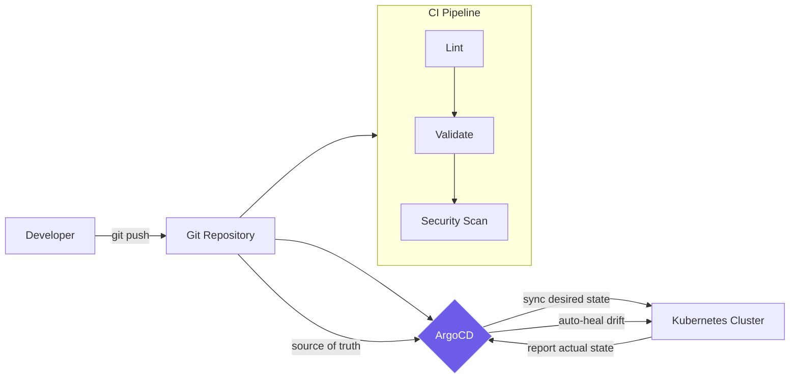

| Difficulty | Channel | Tags |
|---|---|---|
| beginner | devops | argocd, flux, declarative |

In 2020, Auth0's platform engineering team faced a problem that might sound familiar: their Kubernetes clusters were multiplying like rabbits. Twelve became twenty, then fifty, then hundreds. By 2025, they had crossed 1,000 clusters — an 83x explosion — with ArgoCD managing over a million resources and orchestrating hundreds of daily deployments [1]. This is the story of why GitOps became their survival strategy, and why it might just save your sanity too.

---

> ### Real-World Case — Okta (Auth0)
>
> In 2020, Auth0's platform engineering team chose Argo Workflows and ArgoCD for their new private cloud. Over five years, they scaled from 12 Kubernetes clusters to over 1,000 — an 83x increase — managing 1M+ resources and hundreds of daily deployments.
>
> | | |
> |---|---|
> | **Challenge** | At scale, the ArgoCD application controller frequently crashed under load, the UI became unusably slow (degrading at ~1,000 applications), and application statuses became misleading. Auto-sync couldn't be used because it couldn't handle Terraform dependencies or respect customer-specific deployment windows. Transient failures like crash loops, sync conflicts, and stuck syncs were constant. A race condition in the application controller caused intermittent failures. |
> | **Solution** | Implemented controller sharding (crossing the 100-cluster threshold triggered this), adopted an ArgoCD Agent hub-spoke model, used ApplicationSets for templating, and built a custom CLI wrapper that classifies failures, enforces timeouts, and controls retries. They replaced naive auto-sync with a custom orchestration using Argo Workflows that respects deployment windows and Terraform dependencies. Built purpose-built observability for the multi-cluster setup. |
> | **Outcome** | Scaled from 12 to 1,000+ Kubernetes clusters with ArgoCD managing 1M+ resources across all of them. Achieved hundreds of daily deployments with zero-downtime red/black deployment strategies. |
> | **Lesson** | GitOps declarative sync via auto-sync breaks down at massive scale — you need custom orchestration that respects infrastructure dependencies and deployment windows. Controller sharding becomes essential past ~100 clusters. At extreme scale, even mature CNCF tools require significant custom tooling investment. |

---

## Hook — The Night Kubernetes Became a Zoo

Ever wondered what happens when Kubernetes clusters breed faster than you can name them? Auth0's platform engineering team lived that nightmare. In 2020, they had 12 clusters. Five years later: 1,000 clusters, 1.2 million resources, and hundreds of deployments every single day [1]. The tool that made this possible? ArgoCD. The philosophy that kept it from collapsing into chaos? GitOps. But here is the twist — their journey started exactly where yours probably is: with a few clusters, a handful of manifests, and the creeping feeling that things were about to get out of control.

## Problem — The Configuration Drift Epidemic

Here is the dirty secret about Kubernetes at scale: the platform is brilliant at running containers, but it offers almost no guardrails against human chaos. The imperative approach — typing `kubectl create deployment`, `kubectl expose service`, `kubectl scale` — works beautifully for a single cluster with one developer. Scale that to a dozen teams running microservices across staging, canary, and production, and you have a recipe for disaster. Configuration drift is the result: subtle differences between what should be identical environments, manifesting as impossible-to-reproduce bugs, phantom outages, and the dreaded "it works on my cluster" syndrome [2]. Every manual `kubectl` command you run is a snowflake landing on a mountain — harmless alone, catastrophic as an avalanche. Most teams do not realize they have a drift problem until their CEO asks why staging works but production is on fire.

## Real-World Case — Okta (Auth0): The 83x Cluster Explosion

Auth0's platform engineering team made a bet on Argo Workflows and ArgoCD in 2020 when they began migrating to a new private cloud infrastructure [1]. What started as 12 clusters for their identity platform grew into an empire of over 1,000 clusters — a 1,200-node Kubernetes fleet. Think about that number: 1,000 clusters means 1,000 separate control planes, 1,000 sets of RBAC policies, 1,000 network configurations that all need to be identical. Without GitOps, this scale does not just break your deployment pipeline — it breaks your team. The impact was staggering: hundreds of daily deployments achieved with zero-downtime red/black deployment strategies. ArgoCD managed over one million resources across the entire fleet. The key insight? They treated every cluster as cattle, not pets, and ArgoCD was the herder keeping the herd moving in the same direction.

## Deep Dive — Declarative vs. Imperative: Why Your Brain Picks the Wrong One

Most developers learn Kubernetes imperatively. You open a terminal, type `kubectl run nginx --image=nginx`, and the pod appears. Immediate feedback. Dopamine hit. This feels productive, but it creates a fundamental problem: that running pod is now a ghost. No Git history, no review, no rollback. The declarative approach flips this on its head. Instead of telling Kubernetes what to do, you tell it what you want and let it figure out how to get there [3]. You write a YAML manifest, commit it to Git, and ArgoCD reconciles the cluster to match. The difference is not philosophical — it is measurable:

- **Auditability**: every change has a commit hash, an author, and a PR review
- **Instant rollbacks**: `git revert` becomes your production recovery mechanism
- **Environment consistency**: Helm charts and Kustomize overlays eliminate drift between staging and production [4]
- **Self-healing**: ArgoCD detects unauthorized changes and reverts them automatically within the next sync cycle [5]

🔥 **Hot Take**: Many developers think GitOps is about tooling. It is not. GitOps is about creating an immutable audit trail for every single change to your infrastructure. ArgoCD, Flux, and the rest are just the enforcement mechanism. Okta's 1,000 clusters survived because they eliminated the gap between "what we declared" and "what is running."

## Workflow — The GitOps Pipeline: From Commit to Cluster

Here is how the GitOps workflow transforms a code change into a production deployment without anyone touching a terminal — the same loop that runs hundreds of times daily at Okta:

**1. Developer commits changes** to a Git repository containing Kubernetes manifests, Helm charts, or Kustomize configurations. A CI pipeline validates the manifests — linting, schema checks, security scanning — before the PR is merged.

**2. ArgoCD detects drift** between the desired state (your Git repo) and the actual state (your live cluster). By default, ArgoCD polls every 3 minutes, though you can configure webhooks for near-instant sync [6].

**3. ArgoCD synchronizes the cluster** with the desired state. Deployments are updated, new ConfigMaps are rolled out, and resources deleted from Git are pruned — if you enabled auto-prune.

**4. Self-healing kicks in** — anyone running `kubectl delete pod` or manually scaling a Deployment will find their changes reverted within minutes. Git is the law; ArgoCD is the sheriff.

The diagram below captures this continuous reconciliation loop — the heartbeat of any GitOps pipeline.

## Code Example — Setting Up Your First ArgoCD Application

The beauty of ArgoCD is that it lets you experience the contrast between imperative and declarative approaches firsthand. Here is both side by side:

```bash
# IMPERATIVE APPROACH (quick start, not GitOps)
argocd app create guestbook \
  --repo https://github.com/argoproj/argocd-example-apps.git \
  --path guestbook \
  --dest-server https://kubernetes.default.svc \
  --dest-namespace default \
  --sync-policy automated \
  --auto-prune \
  --self-heal
# This runs immediately but lives only in ArgoCD's DB

# DECLARATIVE APPROACH (the GitOps way)
cat <<EOF | kubectl apply -f -
apiVersion: argoproj.io/v1alpha1
kind: Application           # Application CRD defines what ArgoCD manages
metadata:
  name: guestbook
  namespace: argocd
spec:
  project: default
  source:
    repoURL: https://github.com/argoproj/argocd-example-apps.git
    targetRevision: HEAD     # Tracks the latest commit
    path: guestbook
  destination:
    server: https://kubernetes.default.svc
    namespace: guestbook
  syncPolicy:
    automated:
      prune: true            # Removes resources deleted from Git
      selfHeal: true         # Reverts manual kubectl changes
    syncOptions:
      - Validate=true
EOF
# This Application manifest should live in its own Git repo!
```

The imperative command gets you running fast, but the declarative CRD is what you want in production. The critical insight: the Application manifest itself should be committed to a Git repository — this way, ArgoCD manages its own configuration through the same GitOps loop. You get self-managing ArgoCD, audit trails for every change to your deployment configuration, and a setup that scales exactly the way Okta proved possible.

## Lessons Learned — Battle Scars from the GitOps Trenches

After watching teams from Okta's hyperscale operation to two-person startups adopt GitOps, several patterns emerge — along with traps that will cost you:

⚠️ **Watch Out**: Auto-sync with self-heal is powerful but dangerous. A bad commit can cascade across every cluster before anyone notices. Start with manual sync, add automated sync to staging first, then graduate to production. Okta did not flip every switch on day one.

💡 **Insight**: Keep your Application manifests in a separate "config" repository, not your application code repo. This prevents a broken application PR from taking down your deployment pipeline — a mistake that has woken up many an on-call engineer.

🎯 **Key Point**: GitOps does not eliminate the need for CI. Your CI pipeline must validate manifests with tools like Kubeconform, check for security vulnerabilities, and enforce policies before ArgoCD ever sees the change [7]. ArgoCD is the delivery mechanism, not the quality gate.

**The single most important lesson?** Start declaratively, even when it feels slower. Those imperative `kubectl` commands are addictive because they give instant gratification. But every imperative command you run today is technical debt that your future self pays with interest — when staging and production drift apart and nobody can explain why. Commit the manifest, review the PR, let ArgoCD reconcile. Okta proved that this approach scales from 12 clusters to 1,000. It will work for your 3 clusters too.

---

## GitOps Continuous Reconciliation Loop



<details>
<summary><strong>Original Interview Question</strong></summary>

**Q:** You're setting up GitOps for a microservices deployment. How would you configure ArgoCD to automatically sync changes from your Git repository to Kubernetes, and what's the difference between declarative and imperative approaches in this context?

**A:** I'd configure ArgoCD by setting up a Git repository containing Kubernetes manifests or Helm charts, creating an Application CRD that points to the Git repository, enabling auto-sync with a health check interval of 3 minutes, and implementing self-healing to automatically revert any manual changes. The declarative approach involves defining the desired state in Git through YAML manifests, Helm charts, or Kustomize configurations, where ArgoCD continuously reconciles the actual state with the desired state. In contrast, the imperative approach uses kubectl commands to make direct changes to the cluster, bypassing the Git repository as the single source of truth.

</details>

## Conclusion

Okta did not scale from 12 to 1,000 clusters by hiring an army of cluster operators. They did it by treating Git as the single source of truth and letting ArgoCD enforce it relentlessly. The declarative approach is not just a technical choice — it is an organizational discipline that transforms how your team thinks about deployments. Start small: pick one application, define it as an ArgoCD Application CRD, commit it to a config repo, and let the self-healing loop do its work. Your cluster will thank you, and your on-call rotation will be quieter for it.

---

## References

1. [How Okta Scaled From 12 to 1,000 Kubernetes Clusters With Argo CD](https://thenewstack.io/how-okta-scaled-from-12-to-1000-kubernetes-clusters-with-argo-cd/) — article
2. [Kubernetes Declarative Management](https://kubernetes.io/docs/tasks/manage-kubernetes-objects/declarative-config/) — documentation
3. [Helm Charts Documentation](https://helm.sh/docs/) — documentation
4. [ArgoCD Auto Sync and Self-Healing](https://argo-cd.readthedocs.io/en/stable/user-guide/auto_sync/) — documentation
5. [ArgoCD Declarative Setup Guide](https://argo-cd.readthedocs.io/en/stable/operator-manual/declarative-setup/) — documentation
6. [An Introduction to GitOps](https://www.digitalocean.com/community/tutorials/an-introduction-to-gitops) — article
7. [GitOps on Wikipedia](https://en.wikipedia.org/wiki/GitOps) — article
8. [CNCF Argo Project](https://cncf.io/projects/argo/) — documentation
9. [Kustomize Configuration Management Guide](https://kubectl.docs.kubernetes.io/guides/config_management/kustomize/) — documentation

---

**Author:** Satishkumar Dhule — [GitHub](https://github.com/satishkumar-dhule) · [LinkedIn](https://linkedin.com/in/satishkumar-dhule) · [Website](https://satishkumar-dhule.github.io)
