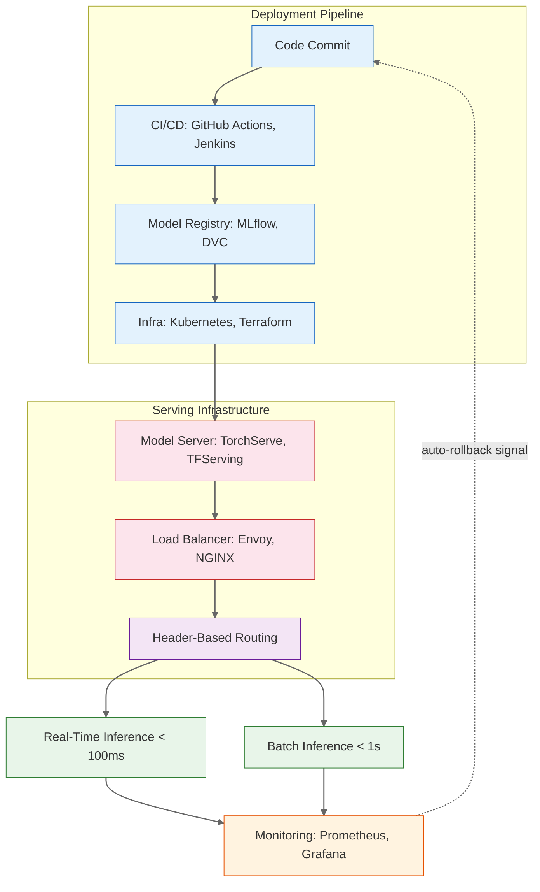

| Difficulty | Channel | Tags |
|---|---|---|
| beginner | devops | mlops, deployment |

Netflix's ML platform handles over 1 million requests per second across hundreds of model types — personalization, payments, search, content recommendation — for 250 million users [1]. Their routing infrastructure, a centralized proxy called Switchboard, had a hidden cost: every request was deserialized just to determine which model version to route to. That deserialization tax added 10-20ms per request. At 1M+ RPS, that isn't just a latency problem — it is an architectural constraint that reshapes everything downstream. What Netflix discovered about the gap between model deployment and model serving holds lessons for any team running ML in production.

---

> ### Real-World Case — Netflix
>
> Netflix's ML serving platform handles hundreds of model types across personalization, payments, search, and content recommendation for 250M+ users at over 1 million requests per second. Their initial serving architecture used a centralized routing proxy called Switchboard that deserialized every request payload to determine which model version to route to, but this became a latency bottleneck and single point of failure.
>
> | | |
> |---|---|
> | **Challenge** | Netflix needed to route inference requests to the correct model version/instance across hundreds of model types while enabling researchers to run A/B experiments with new model versions—all without client services knowing which model they were calling. Off-the-shelf solutions like AWS API Gateway couldn't handle ML-specific routing (A/B testing, shadow traffic, context-aware selection). Switchboard, their initial custom proxy, added 10-20ms of serialization/deserialization latency per request and amplified tail latency, causing timeouts for latency-sensitive clients. |
> | **Solution** | Netflix built Lightbulb, a decoupled routing-metadata service that cleanly separates the control plane from the data plane. Clients send lightweight context (user ID, experiment cohort) to Lightbulb, which returns a routingKey injected as an HTTP header. The existing Envoy proxy then uses this lightweight header to forward the request to the correct inference cluster — without ever deserializing the heavy model input payload mid-flight. Routing rules remained centralized and versioned as JavaScript rules, but the data path became zero-overhead. |
> | **Outcome** | Eliminated the serialization-deserialization bottleneck entirely, removed a critical single point of failure, preserved centralized experimentation control for researchers, and maintained the ability to handle 1M+ RPS across hundreds of model types without the previous 10-20ms routing tax. The architecture now allows safe, rapid rollout of new model versions with auto-rollback, all while keeping the routing logic decoupled from inference traffic. |
> | **Lesson** | Model serving infrastructure should strictly separate the control plane (routing decisions, experiment assignment, A/B test logic) from the data plane (payload forwarding, inference execution). Trying to combine them in a monolithic router creates unavoidable latency overhead and operational risk. At scale, off-loading routing metadata to lightweight headers and using an existing service mesh (Envoy) for the hot path is far more efficient than building a smart proxy that touches every payload. |

---

## Hook — The 20ms Tax on a Billion-Dollar Pipeline

It started as a seemingly harmless design decision: deserialize every incoming request payload at the routing layer to inspect its metadata and forward it to the right model version. At low traffic, nobody noticed. The engineering team moved on to more pressing problems. But as Netflix grew from millions to hundreds of millions of subscribers, that 10-20ms per-request tax compounded into a critical bottleneck. A single centralized proxy — Switchboard — became the gate through which every ML prediction had to pass. When it slowed, everything slowed. This is the story of how a tightly coupled deployment-and-serving architecture nearly capsized one of the world's largest ML platforms, and how decoupling them unlocked a new performance ceiling.

## Problem — Deployment and Serving Are Not the Same Thing

Many developers treat model deployment and model serving as interchangeable terms. They are not, and confusing them leads to architectures that are brittle at scale.

**Deployment** is the infrastructure layer: CI/CD pipelines, container orchestration, model registry, monitoring dashboards, rollback strategies. It answers the question: *How do I get this model into production safely?* Tools like Kubernetes, Terraform, MLflow, and SageMaker dominate this space [2]. Deployment is about process — repeatability, audit trails, environment parity.

**Serving** is the runtime layer: inference APIs, request routing, model loading and unloading, batching, response optimization. It answers a different question: *How do I make this model respond to requests fast enough?* Frameworks like TorchServe [3], TensorFlow Serving [4], BentoML, and FastAPI [5] handle this. Serving is about performance — latency percentiles, throughput ceilings, cold starts.

The trap is that teams build monolithic systems that bundle both concerns together. Netflix's Switchboard was exactly this: a routing proxy that served double duty as an inference gateway *and* a traffic orchestrator. The coupling meant that changing routing logic required touching inference infrastructure, and vice versa. Every deserialization was the symptom of a deeper architectural sin — mixing deployment concerns with serving concerns.

## Real-World Case — Netflix Switchboard: Routing at Planetary Scale

Netflix's model serving platform needed to route requests across hundreds of model types — recommendation algorithms, artwork personalization, search ranking, payment fraud detection — each with multiple versions running simultaneously for A/B experiments. Their original approach used Switchboard, a centralized routing proxy that:

1. Deserialized every incoming HTTP request to extract model type and version metadata
2. Consulted an internal routing table to determine the target model version
3. Forwarded the request to the appropriate inference server
4. Serialized the response and sent it back

At Netflix's scale — over 1 million requests per second — that serialize-deserialize-serialize round trip added 10-20ms of pure overhead on *every* request. For latency-sensitive use cases like real-time personalization where sub-100ms response times are expected, this tax consumed 10-20% of the entire latency budget before a single model ran inference [1].

The breaking point came when a routing table update caused cascading failures across the inference fleet. Because routing logic was embedded in the serving proxy, a configuration change intended to shift 5% of traffic to a new model version triggered a thundering herd problem that overwhelmed backend servers. Switchboard became both a throughput bottleneck and a single point of failure.

**Netflix's solution** was radical: decouple routing from inference entirely. Instead of a centralized proxy, they moved routing metadata into the request itself using lightweight headers. The load balancer (Envoy) could inspect headers without deserializing the body, route to the correct model server pool, and let each server handle model version selection independently. This eliminated the serialization-deserialization bottleneck, removed the single point of failure, preserved centralized experimentation control for researchers via a configuration service, and maintained the ability to handle 1M+ RPS without the routing tax [1].

## Deep Dive — The Great Divide: Latency, Throughput, and Cold Starts

Netflix's story illustrates the fundamental trade-offs in ML infrastructure. To build systems that scale, you need to understand three dimensions where deployment and serving diverge:

**Latency vs. Throughput**
Real-time serving demands p99 latency under 100ms — often 50ms for interactive use cases. This means keeping models warm in memory, pre-allocating GPU memory, and avoiding JIT compilation on the critical path. Batch serving optimizes for throughput, processing thousands of requests together to maximize GPU utilization. You might accept 5-second latency if you are scoring 10,000 customer records at once. The choice cascades into infrastructure: real-time needs horizontal pod autoscaling with rapid spin-up; batch needs job queues and spot instances [6].

**Cold Starts: The Hidden Tax**
Every deployment framework handles cold starts differently. Kubernetes might take 30-60 seconds to spin up a new pod with a loaded model. Serverless inference platforms like SageMaker Serverless or custom solutions using AWS Lambda reduce this but introduce their own trade-offs — function timeouts, package size limits, and the dreaded cold start latency spike. Many teams discover too late that their autoscaling policy looks good on paper but causes a 5-second latency spike whenever a new pod spawns.

**A/B Testing and Gradual Rollouts**
Here is where deployment and serving truly collide. A/B testing requires traffic splitting at the serving layer while model version management lives in the deployment layer. If your architecture couples them, every experiment launch becomes a deployment event — with all the risk and ceremony that entails. Netflix's architecture fixed this by making routing a data-plane concern (header-based) while keeping experiment configuration a control-plane concern (separate configuration service).

> **🔥 Hot Take**: If your A/B test requires a deployment, your architecture is wrong.

## Workflow — The ML Pipeline: From Commit to Inference

Here is how a mature ML system separates deployment and serving concerns end-to-end, starting from a developer's code commit to a user's prediction response. The diagram below traces the full path.

**Step 1: Model Development** — Data scientists train models using notebooks or training pipelines. Artifacts are logged to a model registry (MLflow, DVC) with metadata about performance, data version, and hyperparameters.

**Step 2: Deployment Pipeline** — When a model passes validation gates, CI/CD triggers (GitHub Actions, Jenkins). Terraform provisions or updates infrastructure. Kubernetes manifests are applied. The model artifact is downloaded to the serving environment [2].

**Step 3: Model Loading** — The model server loads the new version into memory. This is where cold starts hurt — loading a 2GB transformer model into GPU memory takes time. Pre-warming and model caching strategies matter here.

**Step 4: Serving Layer** — Requests arrive via a load balancer (Envoy, NGINX). Headers indicate model type and desired version. The load balancer routes to the correct server pool without inspecting the body — Netflix's key insight [1].

**Step 5: Inference** — The model executes prediction. Response is returned with latency and version metadata for observability.

**Step 6: Monitoring & Feedback** — Prometheus metrics fire: latency, error rate, request count. If error rate spikes past threshold, an auto-rollback triggers. The deployment pipeline reverts to the previous healthy version [7].

See the architecture diagram below showing the complete flow from deployment pipeline through serving infrastructure.

## Code Example — Building a Versioned Model Serving Endpoint

Let's implement a simplified version of what a decoupled serving architecture looks like. This FastAPI service handles model versioning, A/B traffic splitting, and per-request latency tracking — the core patterns Netflix used at scale.

## Lessons Learned — What Your ML Platform Can Do Differently

The Netflix story and the deployment-versus-serving framework point to several actionable insights:

**1. Decouple routing from inference early.**
If your routing proxy deserializes request payloads, you have already lost. Use header-based routing so your load balancer can make decisions without touching the body. This applies whether you use Envoy, NGINX, or a cloud load balancer [1].

**2. Measure your latency budget ruthlessly.**
Many teams track p50 or p99 latency but ignore infrastructure overhead. The time spent in the proxy, in serialization, in framework overhead — each millisecond you reclaim here is a millisecond the model can use for better predictions. Set alerts on *infrastructure latency* separately from *inference latency* [8].

**3. A/B testing should never require a deployment.**
If launching a 5% traffic experiment means running a CI/CD pipeline, your deployment and serving layers are too coupled. A control plane for experiment configuration should be separate from the data plane for inference traffic.

**4. Plan for cold starts before they plan for you.**
At 1M RPS, a cold start isn't a blip — it is a cascading failure vector. Pre-warm models, use model repository polling, and set conservative HPA minimums. If using serverless inference, benchmark cold start latency across model sizes and set timeouts accordingly [6].

**5. Your monitoring must distinguish deployment health from serving health.**
A model can be deployed successfully (pipeline green) but serving degraded (high latency). Track: pipeline success rate, model load time, p50/p95/p99 latency per model version, error rate by version, request throughput, and GPU/CPU utilization.

> **💡 Insight**: The teams that handle ML at scale — Netflix, Uber, Meta — all arrived at the same conclusion: deployment and serving are separate disciplines that deserve separate architectures. The moment you treat them as one, you pay the tax. The only question is whether you notice.

---

## ML System Architecture: End-to-End Deployment and Serving Flow

<strong>Original Interview Question</strong>

**Q:** Explain the key differences between model serving and model deployment in ML systems, including specific technologies, scaling considerations, and real-world implementation patterns?

**A:** Deployment encompasses CI/CD pipelines, infrastructure setup, and monitoring using tools like Kubernetes, MLflow, and SageMaker. Serving focuses on runtime inference APIs with frameworks like TensorFlow Serving, TorchServe, or BentoML, handling request routing, model versioning, and autoscaling. Key trade-offs include latency vs throughput, batch vs real-time inference, and cold start optimization.

## Conclusion

Netflix discovered that a 10-20ms routing tax at 1M+ requests per second isn't a latency problem — it is an architecture problem. The fix wasn't faster deserialization or better hardware. It was recognizing that deployment and serving are fundamentally different disciplines that deserve separate architectures. Before you build your next ML platform, ask yourself: is this a deployment problem or a serving problem? The answer will save you from paying Netflix's tax.

---

## References

1. [State of Routing in Model Serving — Netflix TechBlog](https://netflixtechblog.com/state-of-routing-in-model-serving-16e22fe18741) — blog
2. [Kubernetes Production Best Practices](https://kubernetes.io/docs/concepts/architecture/) — documentation
3. [TorchServe — PyTorch Model Serving](https://github.com/pytorch/serve) — documentation
4. [TensorFlow Serving — High-Performance Inference](https://github.com/tensorflow/serving) — documentation
5. [FastAPI — Modern Python Web Framework](https://fastapi.tiangolo.com/) — documentation
6. [Docker Container Orchestration](https://docs.docker.com/) — documentation
7. [gRPC — A High Performance RPC Framework](https://grpc.io/docs/) — documentation
8. [MLflow — ML Lifecycle Management](https://mlflow.org/docs/latest/index.html) — documentation

---

**Author:** Satishkumar Dhule — [GitHub](https://github.com/satishkumar-dhule) · [LinkedIn](https://linkedin.com/in/satishkumar-dhule) · [Website](https://satishkumar-dhule.github.io)
