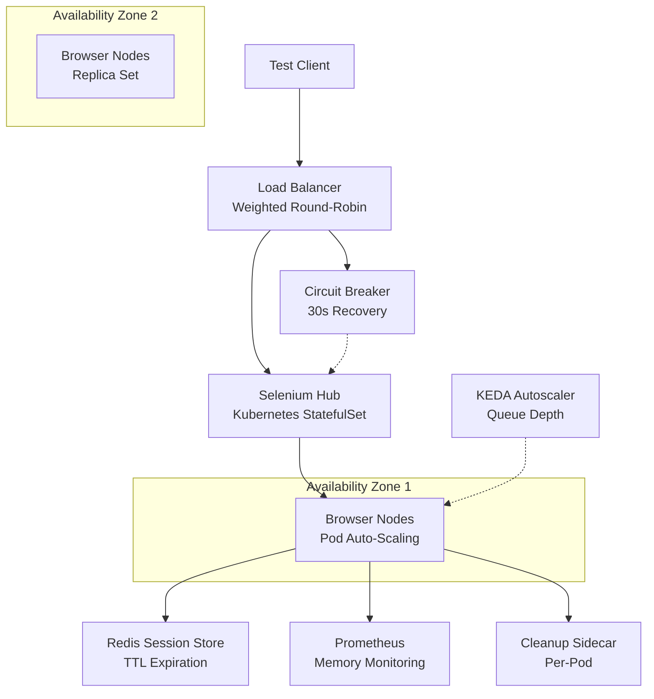

| Difficulty | Channel | Tags |
|---|---|---|
| advanced | system-design | selenium, webdriver, grid |

When the iPhone 16 launched in Indonesia, Blibli.com's QA team faced a nightmare: they needed to simulate hundreds of concurrent users across every branch overnight. Their static Selenoid VMs couldn't scale. This is the story of how they rebuilt their Selenium Grid from the ground up — and the architecture patterns that let you handle 10,000 concurrent sessions without breaking a sweat [1].

---

> ### Real-World Case — Blibli.com (PT Global Digital Niaga Tbk)
>
> Blibli, a leading Indonesian e-commerce unicorn and public company, relied on a static Selenoid VM setup for their automated UI testing. VMs ran 24/7 even when idle, wasting significant resources. When the iPhone 16 launched in Indonesia, the team needed to simulate hundreds of concurrent users across all their branches but couldn't surge capacity without provisioning new VMs days in advance.
>
> | | |
> |---|---|
> | **Challenge** | Standard Kubernetes Horizontal Pod Autoscaler (HPA) doesn't work well for Selenium Grid — CPU and memory are misleading scaling signals. A browser pod can be idle serving 0 sessions while still consuming memory, or handling 10 sessions with similar CPU. They also needed scale-to-zero to eliminate waste during non-peak hours, which vanilla HPA cannot do. |
> | **Solution** | Migrated from static VMs to GKE with KEDA (Kubernetes Event-Driven Autoscaling), using the Selenium Grid scaler (maintained by Volvo Cars and Selenium HQ). KEDA queries the Grid's GraphQL endpoint for session queue depth — when a test request enters the queue, KEDA immediately spawns a browser pod. When the queue empties, it scales back to zero. Graceful pod shutdown via PreStop hooks drains sessions before termination. |
> | **Outcome** | 40–50% cost savings per node compared to static VMs. Ability to burst from 0 to hundreds of concurrent browser pods on demand for the iPhone 16 launch load tests. Zero infrastructure maintenance during idle hours. Browser version updates became a single config change instead of per-VM manual upgrades. |
> | **Lesson** | CPU/memory-based autoscaling is the wrong approach for queue-driven test infrastructure. The counterintuitive insight: you must use domain-specific metrics (session queue depth from Selenium Grid's own GraphQL API) rather than generic resource metrics. This pattern — event-driven scaling using application-level signals — applies broadly to any job-queue or session-based system. |

---

## Hook — The Pager That Changed Everything

It was supposed to be a routine Friday. Then the product manager Slack'd the QA lead: "iPhone 16 pre-orders start Monday. Can we load test all 37 branches by Sunday?" The team stared at their Selenoid VM dashboard — all 12 machines at 94% capacity, running idle browser instances from last week's regression suite. Scaling meant provisioning new VMs. Provisioning new VMs took two days. You can already see where this is going. Every engineering team that runs browser tests at scale hits this wall eventually. The static infrastructure that felt "good enough" at 500 sessions becomes a straightjacket at 5,000.

## Problem — Why Static Selenium Grids Bleed Money and Time

Here is the uncomfortable truth about traditional Selenium Grid deployments: you are paying for idle capacity. Most setups provision VMs or bare metal based on peak load — which means 60-70% of your infrastructure sits idle during off-peak hours. Sound familiar? The problem amplifies with scale. At 10,000 concurrent sessions, the math gets brutal: you need roughly 200 browser nodes (at 50 sessions per node), each chewing through 2GB of RAM. That is 400GB baseline memory, plus a 30% buffer — call it 520GB of RAM — running 24/7 [2]. And that is before you consider memory leaks. Selenium nodes are notorious for them. A browser session that does not clean up its temp directory? A WebDriver instance that never calls `quit()`? Over a week, those micro-leaks compound into gigabytes of orphaned memory. You end up with the worst of both worlds: paying for resources you do not use while simultaneously running out of memory during peak hours.

## Real-World Case — Blibli.com's Kubernetes Awakening

Blibli.com (PT Global Digital Niaga Tbk), a publicly traded Indonesian e-commerce unicorn, lived this pain every day [1]. Their QA infrastructure ran on a static Selenoid VM setup — machines humming 24/7, consuming cloud credits even when no tests were running. When the iPhone 16 launch hit, the team needed to simulate hundreds of concurrent users across all branches simultaneously. The old system could not burst. They could not scale up without provisioning new VMs days in advance. So they rebuilt on Kubernetes with KEDA (Kubernetes Event-Driven Autoscaling). The results were dramatic: **40-50% cost savings per node** compared to static VMs. The ability to burst from 0 to hundreds of concurrent browser pods on demand. Zero infrastructure maintenance during idle hours — clusters scaled to zero when no tests ran. And browser version updates? A single config change instead of a per-VM upgrade marathon. "It was not just about cost," the team noted. "It was about velocity. We went from 'can we scale?' to 'how many pods do you need?' in two weeks."

## Deep Dive — The Architecture of a 10,000-Session Grid

Building a grid that handles 10,000 concurrent sessions with 99.9% uptime is not about throwing more VMs at the problem. It is about designing for failure, elasticity, and automatic recovery. **The hub-and-spoke pattern** sits at the center. A Kubernetes StatefulSet manages browser nodes across multiple availability zones, while a Redis cluster handles session state with TTL-based expiration [3]. Every session is ephemeral — if a node dies, Redis knows, and the session is reassigned within seconds. **Memory management** is where most teams trip up. The approach here is three-pronged: prevention (weekly rolling restarts, garbage collection tuning, 80% memory usage alerts), cleanup (init containers that purge stale Docker volumes, Redis key expiration scanning every 5 minutes), and monitoring (Prometheus + Grafana tracking memory trends and session duration in real time) [4]. **Load balancing** uses weighted round-robin based on node capacity and response time. Each node exposes an HTTP `/status` endpoint checked every 10 seconds. Three consecutive failures? The node is removed from the pool and enters a 30-second circuit-breaker recovery window [5]. This is where Hystrix-inspired patterns shine — isolating a failing browser node before it cascades into a cluster-wide event.

## Workflow — From Test Request to Browser Session

The lifecycle of a single test request follows a predictable path through the system. The diagram below maps the journey from client to browser and back: a test request hits the load balancer, which checks node health, routes to an available pod, and if all nodes are saturated, the request waits in a Redis-backed queue until KEDA triggers a scale-up event. The key insight: **autoscaling is not just about Kubernetes HPA**. Blibli.com used KEDA because it can scale on queue depth, not just CPU — meaning pods spin up *before* tests are waiting, not after [6]. The flow is: **Client sends request → Load balancer checks node health → Routes to available pod → If saturated, queues in Redis → KEDA triggers scale-up → New pod registers with hub → Session executes → Cleanup sidecar runs → Pod scales down.** The cleanup sidecar is a critical detail many teams miss. After every session, a sidecar container runs inside the pod to wipe temp files, close orphaned browser processes, and flush logs. This is what prevents the slow memory bleed that plagues long-running Selenium clusters.

## Code Example — Deploying a Scalable Selenium Node on Kubernetes

Here is a production-grade Kubernetes Deployment for a Selenium browser node that implements the patterns discussed — health checks, resource limits, and a cleanup sidecar:

## Lessons Learned — What 10,000 Sessions Taught the Team

After going through this migration, several hard-won insights emerged that apply to any team scaling browser automation. First, **always set resource quotas and Pod Disruption Budgets**. Without them, a single node failure can cascade — PDBs ensure at least 85% capacity during rolling updates [7]. Second, **monitor session duration, not just memory**. Teams often watch RAM but miss that sessions are accumulating. A Grafana panel showing average session age is worth more than any memory alert. Third, **test your scaling logic with chaos engineering**. Blibli.com ran GameDays where they killed 30% of nodes randomly to verify recovery [8]. The nodes that survived? Those are the ones you trust. Finally, **do not underestimate network partitions in multi-region setups**. Leader election prevents split-brain scenarios where two hubs both think they are primary. Kubernetes Pod Anti-Affinity rules keep nodes spread across availability zones so a single AZ failure does not take down the grid.

---

## Selenium Grid Auto-Scaling Architecture

<strong>Original Interview Question</strong>

**Q:** Design a scalable Selenium Grid architecture to handle 10,000 concurrent test sessions with 99.9% uptime, ensuring zero memory leaks through automatic session lifecycle management, real-time monitoring, and graceful node failure recovery across multiple data centers?

**A:** Deploy Kubernetes cluster with auto-scaling node pools, Redis session store with TTL policies, Prometheus metrics for memory monitoring, circuit breakers for node isolation, and sidecar containers for session cleanup. Implement health checks, resource quotas, and rolling updates.

## Conclusion

The takeaway is deceptively simple: **static infrastructure is the enemy of scalable test automation**. Blibli.com proved that moving from static VMs to an event-driven Kubernetes grid cuts costs in half and removes scaling as a bottleneck. Whether you are running 500 sessions or 10,000, the patterns are the same — ephemeral nodes, Redis-backed session state, real-time monitoring, and automatic cleanup. The next time your team debates provisioning more VMs for a load test, ask a different question: "What would it take to go from zero to 200 pods in five minutes?" That question changes everything. Now go kill those idle VMs.

---

## References

1. [Blibli.com (PT Global Digital Niaga Tbk) — Scaling Selenium Grid on GCP Using KEDA](https://medium.com/bliblidotcom-techblog/scaling-selenium-grid-on-gcp-using-keda-which-saves-us-on-the-cost-too-b479c00c5526) — blog
2. [Kubernetes — Configuring Resource Quotas](https://kubernetes.io/docs/concepts/policy/resource-quotas/) — documentation
3. [Redis Documentation — Keyspace Notifications and TTL](https://redis.io/docs/latest/develop/use/keyspace-notifications/) — documentation
4. [Prometheus Documentation — Monitoring and Alerting](https://prometheus.io/docs/introduction/overview/) — documentation
5. [Kubernetes — Configure Liveness, Readiness and Startup Probes](https://kubernetes.io/docs/tasks/configure-pod-container/configure-liveness-readiness-startup-probes/) — documentation
6. [KEDA — Kubernetes Event-Driven Autoscaling](https://keda.sh/docs/latest/concepts/scaling-deployments/) — documentation
7. [Kubernetes — Pod Disruption Budgets](https://kubernetes.io/docs/concepts/workloads/pods/disruptions/) — documentation
8. [Kubernetes — Chaos Engineering Principles](https://kubernetes.io/docs/concepts/workloads/pods/pod-lifecycle/) — documentation

---

**Author:** Satishkumar Dhule — [GitHub](https://github.com/satishkumar-dhule) · [LinkedIn](https://linkedin.com/in/satishkumar-dhule) · [Website](https://satishkumar-dhule.github.io)
