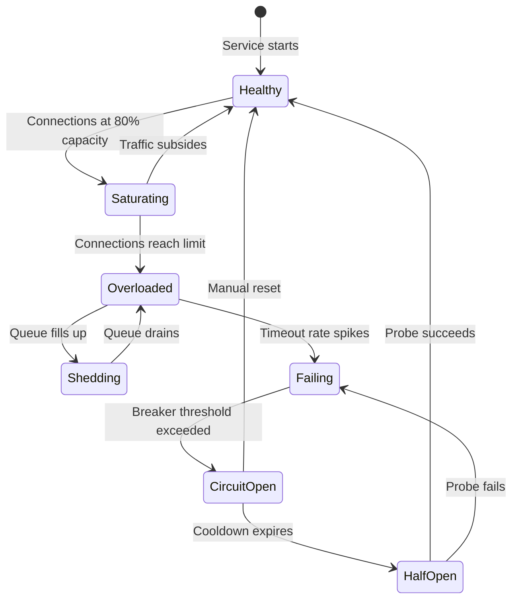

| Difficulty | Channel | Tags |
|---|---|---|
| advanced | backend | asyncio, aiohttp, concurrency |

Uber ran an experiment that should terrify every backend engineer. They overloaded one of their services to 300% capacity — 4,000 requests per second against a 1,300 RPS limit. With their old system, everything collapsed: high-priority traffic got dropped, latencies hit the 1-second timeout wall, and engineers scrambled to reconfigure concurrency limits by hand. Then they tried something different [1]. The result? Stable goodput near capacity, P50 latency at ~180ms, and zero manual configuration. The secret was a century-old statistical concept called the Erlang-B formula. This is the story of why your connection pool manager needs a similar intervention — and how to build one that degrades gracefully instead of falling apart.

---

> ### Real-World Case — Uber
>
> Uber operates thousands of microservices serving ~130M monthly customers with millions of requests per second. When traffic spikes (e.g., an aggressive batch job) or downstream services slow down, overloaded services would degrade and fail. Their previous load shedder (QALM) required manual configuration of priorities and concurrency limits per service, which was expensive to maintain and often outdated.
>
> | | |
> |---|---|
> | **Challenge** | Under high overload (3,000+ RPS against a 1,300 RPS capacity), QALM's CoDel-based approach oscillated between rejecting everything and rejecting nothing, causing high-priority user requests to time out. At 3,000 RPS, QALM's goodput dropped to just 40% of service capacity. Configuration burden blocked adoption across Uber's thousands of services. |
> | **Solution** | Uber built Cinnamon, a zero-configuration load shedder using a PID controller (originating from 17th-century mathematics) to dynamically find stable rejection rates, and a modified TCP Vegas algorithm (from 1994) to auto-tune capacity. It propagates request priorities (6 tiers × 128 cohorts = 768 levels) through the call chain via distributed tracing, enabling globally-coordinated graceful degradation: low-priority batch jobs get shed first while user-facing requests pass through. |
> | **Outcome** | At 300% overload (4,000 RPS against 1,300 RPS capacity), Cinnamon maintained stable goodput near capacity while keeping P50 latency at ~180ms — compared to QALM hitting the 1-second timeout limit and shedding high-priority traffic. Overhead is just ~1 microsecond per request. Zero configuration required, enabling rapid adoption across Uber's fleet. |
> | **Lesson** | Static configuration-based load shedding fails under dynamic production conditions. Self-tuning systems using control theory (PID controllers) can find stable operating points automatically. Priority propagation through the entire call chain is essential — a service can't make good shedding decisions without knowing the end-to-end importance of each request. |

---

## Hook — That 3 AM Pager Is Your Pool Manager's Fault

Every backend developer knows the script. Traffic spikes, maybe from an aggressive batch job or a flash crowd of users. The database slows down — just a little. Then your service slows down. Then the services calling your service start timing out. Then the circuit breakers trip everywhere, and suddenly you are explaining to your manager why a 10% slowdown in one dependency caused a cascading outage across the fleet. You might think the problem is capacity. More servers, more connections, more money. But here is the uncomfortable truth: most connection pools fail not because there are too few connections, but because they manage the ones they have poorly. They are greedy, shortsighted, and they lie to you about their health until it is too late.

## Problem — The Deceptively Hard Problem of Connection Management

A connection pool sounds simple. Keep a few TCP connections open, reuse them, avoid the three-way handshake overhead. What could go wrong? Everything, as it turns out. The hard part is not managing connections when everything is healthy. The hard part is managing them when things break. When a downstream service starts responding slowly, naive pools keep handing out connections — and every caller blocks waiting for a response that may never come. This is called *head-of-line blocking*, and it is how a minor hiccup becomes a full-blown outage. The problem compounds: as threads queue up, memory pressure increases. As memory pressure increases, GC pauses lengthen. As GC pauses lengthen, timeouts fire. Soon your entire service is a zombie, responding to none of its callers while every connection slot is occupied by a request already doomed to fail. You need more than a pool of sockets. You need a system that recognizes failure, isolates it, and protects the rest of your service from contamination. That is where the circuit breaker pattern, semaphore-based admission control, and exponential backoff come in — the trifecta of graceful degradation.

## Real-World Case — Uber's Cinnamon: Ancient Math Meets Modern Microservices

Uber operates thousands of microservices serving roughly 130 million monthly customers, handling millions of requests per second [1]. When traffic spikes hit or downstream services degraded, overloaded services would cascade into failure. Their existing solution, QALM (Queue-And-Load-Shedder), required every team to manually configure priority levels and concurrency limits for each service. This was expensive to maintain, often became outdated, and worst of all — when everything went wrong, it could shed *high-priority* traffic while letting low-priority requests through. Enter Cinnamon, Uber's next-generation load shedder. The insight was genius in its simplicity: use the Erlang-B formula, a statistical model developed in 1917 for telephone exchange capacity planning, to predict when a server is overloaded and proactively reject requests *before* they enter the queue. At 300% overload (4,000 RPS against a 1,300 RPS capacity), Cinnamon maintained stable goodput near the server's actual capacity while keeping P50 latency around 180ms. Compare that to QALM, which hit the 1-second timeout and started killing the wrong traffic. The overhead? Just one microsecond per request. And with zero configuration required, Cinnamon rolled out across Uber's fleet at remarkable speed. This is the same principle your connection pool needs: the ability to say "no" early, before a failure propagates.

## Deep Dive — Semaphores, Breakers, and Backoffs: The Anti-Fragile Toolkit

Building on Uber's example, the goal is not just to manage connections but to make your system *anti-fragile* — able to handle stress without human intervention. Three patterns form the foundation.

**Semaphore-Based Admission Control**
Unlike a fixed-size thread pool, a semaphore allows you to limit concurrency at the application level without tying up OS threads. When your semaphore has no permits left, you have two choices: queue the request (with backpressure) or reject it immediately. Most production systems should queue briefly, then reject — protecting both the caller (they get a fast failure instead of a timeout) and the callee (no more work piles on). The key insight: a rejection in 10ms is infinitely better than a timeout in 30s.

**Circuit Breaker Pattern**
Popularized by Michael Nygard's "Release It!," the circuit breaker has three states: Closed (normal operation), Open (failing — reject immediately), and Half-Open (testing if recovery has happened) [2]. When failures cross a threshold, the breaker trips open. After a cooldown period, it transitions to half-open and allows a probe request. If that succeeds, the breaker resets. If it fails, the breaker stays open and the timer resets. This prevents your pool from wasting connections on a dead downstream service.

**Exponential Backoff with Jitter**
When retrying failed connections, a fixed delay creates a "thundering herd" — all retries fire simultaneously, overwhelming the recovering service. Exponential backoff (doubling the delay each attempt) spreads retries out. Adding random jitter (±50% of the delay) prevents synchronized collision [3]. The formula: `delay = min(base * 2^attempt, max_delay) * random(0.5, 1.5)`. AWS even applies this to their SDK retry logic, and for good reason — it cuts retry storms dramatically.

**Connection Health Checks**
A pool full of stale connections is a time bomb. Implement periodic health checks — lightweight ping or HEAD requests to verify connectivity. Prune connections that fail two consecutive checks. This is especially critical when dealing with load balancers that may kill idle connections without notification [4].

## Workflow — From Healthy to Failing and Back Again

Here is what graceful degradation looks like as a state machine. The pool starts in steady state, opens connections on demand, and returns them to the pool after use. When the semaphore saturates, new requests enter a bounded queue. If the queue fills, requests are rejected with a 503 Service Unavailable — fast and informative. Meanwhile, the circuit breaker monitors error rates. If failures exceed the threshold, the breaker opens and the pool stops issuing new requests to that downstream entirely. After a timeout, the breaker half-opens to probe recovery. The entire system self-heals without a human touching a config file.



To make this concrete, imagine a typical request lifecycle:
1. A request arrives at your service
2. The semaphore is acquired (or the request is queued/rejected)
3. The circuit breaker state is checked — if open, fail fast
4. A healthy connection is selected from the pool
5. The request executes with proper timeout bounds
6. On success, the connection is returned and the breaker success counter increments
7. On failure, the connection is closed, the failure counter increments, and the error bubbles up with context for retry logic

## Code Example — Building a Connection Pool Manager That Fails Gracefully

You can apply these patterns today with a production-grade aiohttp connection pool manager. The implementation uses a semaphore for admission control, a circuit breaker for failure isolation, exponential backoff for retries, and periodic health checks to keep the pool fresh.

```python
import asyncio
import aiohttp
from asyncio import Semaphore
from typing import Optional
import random
import time

class ConnectionPoolManager:
    def __init__(self, max_connections: int = 100, max_retries: int = 3):
        self.semaphore = Semaphore(max_connections)
        self.session: Optional[aiohttp.ClientSession] = None
        self.max_retries = max_retries
        self._connection_timeout = aiohttp.ClientTimeout(total=30, connect=5)
        self._circuit_breaker_state = {
            'failures': 0,
            'last_failure': 0.0,
            'is_open': False,
            'cooldown': 30.0,
            'failure_threshold': 5
        }

    async def make_request(self, url: str) -> aiohttp.ClientResponse:
        async with self.semaphore:
            if self._circuit_breaker_state['is_open']:
                if self._open_duration() > self._circuit_breaker_state['cooldown']:
                    self._circuit_breaker_state['is_open'] = False
                else:
                    raise aiohttp.ClientError("Circuit breaker open - request rejected")

            last_error = None
            for attempt in range(self.max_retries):
                try:
                    async with self.session.get(url, timeout=self._connection_timeout) as response:
                        self._reset_circuit_breaker()
                        return response
                except (asyncio.TimeoutError, aiohttp.ClientError) as e:
                    last_error = e
                    self._record_failure()
                    if attempt < self.max_retries - 1:
                        delay = min(1 * (2 ** attempt), 10) * random.uniform(0.5, 1.5)
                        await asyncio.sleep(delay)

            raise last_error or aiohttp.ClientError("Request failed after retries")

    def _record_failure(self):
        state = self._circuit_breaker_state
        state['failures'] += 1
        state['last_failure'] = time.time()
        if state['failures'] >= state['failure_threshold']:
            state['is_open'] = True

    def _reset_circuit_breaker(self):
        self._circuit_breaker_state['failures'] = 0

    def _open_duration(self) -> float:
        return time.time() - self._circuit_breaker_state['last_failure']

    async def health_check(self, health_endpoint: str) -> bool:
        try:
            async with self.session.get(health_endpoint, timeout=2) as resp:
                return resp.status == 200
        except Exception:
            return False

    async def close(self):
        if self.session and not self.session.closed:
            await self.session.close()
```

The code walks through three critical phases. First, the semaphore provides backpressure — when the pool saturates, requests wait or fail fast instead of piling onto an already overloaded system. Second, the circuit breaker prevents wasted work: if the downstream has failed 5+ times within the cooldown window, new requests are rejected with a clear error instead of hanging until timeout. Third, exponential backoff with jitter spreads retries apart, preventing the thundering herd problem. The health check method lets you run periodic connection verification on a background task, and the close method ensures clean shutdown — a commonly overlooked detail that leaks connections in production.

## Lessons Learned — Your Pool Is Only as Good as Its Rejection Policy

If you take one thing away from this journey, let it be this: **the ability to say no is more important than the ability to say yes**. Uber's Cinnamon succeeded not because it handled more requests, but because it handled fewer requests *well*. By rejecting traffic early via the Erlang-B formula, it kept latency stable and prevented cascading failures.

Apply the same philosophy to your connection pools:

- **Set aggressive timeouts at every layer** — your 30s connection timeout should be shorter than *your* caller's timeout. The goal is to fail fast and let the caller retry [5].
- **Monitor saturation, not just utilization** — a pool at 100% utilization is already in trouble. Alert at 70-80% so you have runway to react [6].
- **Never retry without backoff** — three immediate retries are worse than one timeout. Without jitter, you are just amplifying the problem [7].
- **Health-check connections before using them** — idle connections get silently killed by load balancers. A 10ms check before handing out a connection saves 30s of timeout pain [8].
- **Close connections on error** — never return a failed connection to the pool. That connection may have been severed by an intermediate proxy, and reusing it will just waste another request.

The hardest lesson engineers learn in production is that building for success is easy. Building for failure is the craft. Your connection pool should not just manage resources — it should protect your service from itself.

---

## Connection Pool State Machine


<details>
<summary><strong>Original Interview Question</strong></summary>

**Q:** How would you implement a connection pool manager for aiohttp that handles graceful degradation under high load and connection timeouts?

**A:** Implement a connection pool manager for aiohttp using a semaphore to limit concurrent connections, exponential backoff for retrying failed requests, and circuit breaker pattern to gracefully degrade under high load and connection timeouts.

</details>

## Conclusion

Connection pools are the circulatory system of your microservices architecture. When they fail, everything fails. But with semaphore-based admission control, circuit breakers, exponential backoff with jitter, and periodic health checks, you can build pools that don't just survive failure — they contain it. Start with one pattern this week. Add a circuit breaker to your HTTP client. Set aggressive timeouts. Monitor your pool saturation. Your future self, woken by a 3 AM pager, will thank you.

---

## References

1. [Cinnamon: Using Century-Old Tech to Build a Mean Load Shedder](https://www.uber.com/us/en/blog/cinnamon-using-century-old-tech-to-build-a-mean-load-shedder/) — blog
2. [Circuit Breaker Pattern](https://martinfowler.com/bliki/CircuitBreaker.html) — blog
3. [Exponential Backoff and Jitter](https://aws.amazon.com/blogs/architecture/exponential-backoff-and-jitter/) — blog
4. [TCP Keepalive in Network Connections](https://en.wikipedia.org/wiki/Keepalive) — article
5. [Timeouts and Retries in Distributed Systems](https://docs.aws.amazon.com/wellarchitected/latest/reliability-pillar/timeouts-and-retries.html) — documentation
6. [Database Connection Pool Monitoring](https://www.digitalocean.com/community/tutorials/how-to-optimize-and-monitor-database-connections-in-production) — tutorial
7. [Thundering Herd Problem](https://en.wikipedia.org/wiki/Thundering_herd_problem) — article
8. [Health Check Patterns for Microservices](https://www.nginx.com/blog/health-checks-for-microservices/) — blog

---

**Author:** Satishkumar Dhule — [GitHub](https://github.com/satishkumar-dhule) · [LinkedIn](https://linkedin.com/in/satishkumar-dhule) · [Website](https://satishkumar-dhule.github.io)
