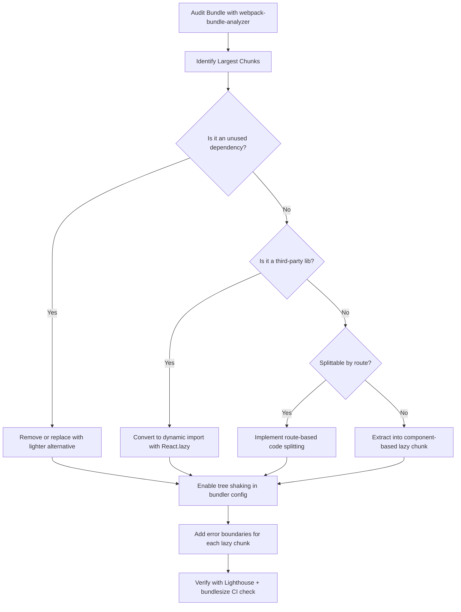

| Difficulty | Channel | Tags |
|---|---|---|
| intermediate | frontend | lighthouse, bundle, lazy-loading |

Walmart invested millions in a React redesign of their e-commerce platform, expecting cutting-edge technology to deliver a surge in traffic. The result? A measly 1–4% increase. An audit uncovered the culprit: their checkout app shipped a 1.1MB JavaScript bundle that was silently throttling load performance [1]. This is the story of how one of the world's largest retailers cut that bundle nearly in half — and what every React developer can learn from the experience.

---

> ### Real-World Case — Walmart
>
> Walmart invested heavily in a React redesign of their e-commerce site expecting substantial traffic gains, but the redesign only yielded 1-4% traffic increase. An audit revealed their checkout React app had a bloated 1.1MB code bundle that was killing load performance despite the modern framework adoption.
>
> | | |
> |---|---|
> | **Challenge** | The React checkout application had a 1.1MB JavaScript bundle causing slow load times and poor user experience. Despite moving to a modern React stack, the unchecked bundle growth from legacy code and unoptimized imports meant users on mobile and slower connections faced multi-second delays before the checkout became interactive. |
> | **Solution** | A two-week code audit identified critical mass of legacy code and inefficiencies. The team aggressively trimmed unused dependencies, removed dead code, and optimized remaining imports — reducing the production bundle from 1.1MB to 617KB in one week's work. They also added runtime performance optimizations and trained Walmart's engineering team on React best practices for ongoing maintenance. |
> | **Outcome** | Nearly 50% reduction in code bundle size (1.1MB → 617KB), significant load time reduction leading to increased conversion rates, and the engineering team was equipped with skills to keep bundle size under control going forward. |
> | **Lesson** | Adopting a modern framework like React does not automatically improve performance. Without active bundle size management — auditing dependencies, removing dead code, and optimizing imports — even a major redesign can fail to move the needle on real-world metrics that matter to users and revenue. |

---

## Hook — Modern frameworks don't guarantee fast apps

Here is a hard truth that most developers discover the hard way: migrating to React, Vue, or Angular does not automatically make your application fast. In fact, without deliberate optimization, the opposite often happens. A 2021 survey found that the median React application ships over 800KB of JavaScript — and the 90th percentile exceeds 2MB [2]. Walmart's experience is not an edge case; it is the rule. When you wrap a legacy codebase in a modern framework without addressing bundle bloat, you end up with a slower app that costs more to maintain and frustrates users at scale.

## Problem — The hidden tax of JavaScript bloat

Every kilobyte of JavaScript your app ships has a real cost, especially on mobile devices. Research from the Chrome team shows that processing 100KB of JavaScript costs roughly the same CPU time as processing 1MB of images [3]. This is because JavaScript does not just download — the browser must parse, compile, and execute it before the page becomes interactive. Consequently, a 2.1MB bundle with a 4.2-second Time to Interactive (TTI) means real users are staring at a blank or non-responsive screen for seconds. For an e-commerce site, each extra second of load time can reduce conversions by 7% [4]. Now multiply that across millions of visitors, and the revenue impact becomes staggering. Many teams do not realize their app is bloated because they only test on high-end devices with fast Wi-Fi.

## Real-World Case — Walmart's 1.1MB checkout wake-up call

Walmart committed to a full React redesign of their website, investing heavily in modern architecture. But when the redesigned site launched, traffic increased by only 1–4% — far below expectations [1]. NearForm, the consultancy brought in to diagnose the issue, conducted a two-week audit of Walmart's checkout application. They discovered a critical mass of legacy code, unused dependencies, and monolithic bundles that were crushing load performance. The checkout app alone shipped 1.1MB of JavaScript. In one week, NearForm's team reduced the bundle to 617KB — a 44% reduction — by stripping dead code, optimizing imports, implementing code splitting, and training Walmart's engineers on performance best practices [1]. The load time improvements directly increased conversion rates. The takeaway? A focused performance audit can yield outsized returns when the low-hanging fruit is this abundant.

## Deep Dive — Bundle analysis, code splitting, and tree shaking

Three techniques form the foundation of any serious bundle optimization strategy. First, bundle analysis. Tools like webpack-bundle-analyzer or source-map-explorer produce a visual treemap of your bundle, revealing which dependencies are responsible for the bulk of the size [5]. Many developers are shocked to discover that moment.js or lodash (often imported wholesale) accounts for 10–20% of their total bundle. Second, code splitting. React.lazy() and Suspense enable route-based and component-based splitting, ensuring users only download the code they need for the current view. Third, tree shaking — dead code elimination that relies on ES module syntax (import/export) and proper side-effect declarations in package.json [6]. In practice, these techniques compound. Removing unused dependencies is step zero. Enabling tree shaking eliminates what the bundler can statically analyze. Code splitting then breaks the remaining bundle into logical chunks. The order matters: splitting a bloated bundle without first cleaning it up yields dozens of small but still-bloated chunks.

## Workflow — A repeatable 5-step optimization process

You can apply the same process Walmart used to any React application in a matter of days. The visual flow below shows the end-to-end pipeline from measurement through deployment. Each step builds on the previous one.

## Code Example — Implementing lazy loading with error boundaries

The most impactful single change you can make is converting static imports to dynamic imports with React.lazy(). But you must also handle edge cases: what if the chunk fails to load due to a network error? The solution is wrapping each lazy component in an error boundary.

## Lessons Learned — What to do differently starting tomorrow

Walmart's story carries several lessons that apply to teams of any size. First, measure before you optimize. Without bundle analysis, you are flying blind. Second, prioritize removing unused code before implementing complex splitting strategies. Third, invest in tooling that prevents regression — bundlesize CI checks and Lighthouse CI can block deployments that exceed thresholds. Fourth, treat performance as a feature with explicit owners. The teams that succeed are the ones that embed performance reviews into their regular development cycle rather than treating optimization as a one-time project.

---

## Bundle Optimization Decision Flow

<strong>Original Interview Question</strong>

**Q:** You're tasked with improving a React app's Lighthouse performance score from 65 to 90+. The bundle size is 2.1MB and Time to Interactive is 4.2s. What specific steps would you take to optimize the bundle and implement lazy loading?

**A:** Implement code splitting with React.lazy() and Suspense, analyze bundle composition with webpack-bundle-analyzer to identify largest chunks, remove unused dependencies and optimize imports, add dynamic imports for heavy components and third-party libraries, implement route-based splitting for better initial load times, and utilize tree shaking with proper ES module configuration.

## Conclusion

Walmart's 1.1MB checkout bundle was not a failure of technology — it was a failure of measurement. The React framework itself is not slow. The patterns you use — or neglect — determine performance. Start with a bundle audit this week. Remove what you do not need. Split what remains. Wrap lazy components in error boundaries. Measure again. The difference between a 65 and a 90+ Lighthouse score is not magic. It is a decision to treat bundle size as a critical, trackable feature of your application.

---

## References

1. [Walmart — Transforming the Checkout Experience](https://nearform.com/work/walmart/) — blog
2. [Web Almanac 2021 — JavaScript Statistics](https://almanac.httparchive.org/en/2021/javascript) — blog
3. [The Cost of JavaScript — Chrome Dev Summit](https://v8.dev/blog/cost-of-javascript-framework) — blog
4. [Google Web Fundamentals — How Loading Time Affects Your Bottom Line](https://developer.mozilla.org/en-US/docs/Web/Performance/How_long_is_too_long) — documentation
5. [webpack-bundle-analyzer — GitHub Repository](https://github.com/webpack-contrib/webpack-bundle-analyzer) — documentation
6. [Tree Shaking — webpack Documentation](https://webpack.js.org/guides/tree-shaking/) — documentation
7. [Error Boundaries — React Documentation](https://react.dev/reference/react/Component#catching-rendering-errors-with-an-error-boundary) — documentation
8. [React.lazy — React Documentation](https://react.dev/reference/react/lazy) — documentation

---

**Author:** Satishkumar Dhule — [GitHub](https://github.com/satishkumar-dhule) · [LinkedIn](https://linkedin.com/in/satishkumar-dhule) · [Website](https://satishkumar-dhule.github.io)
