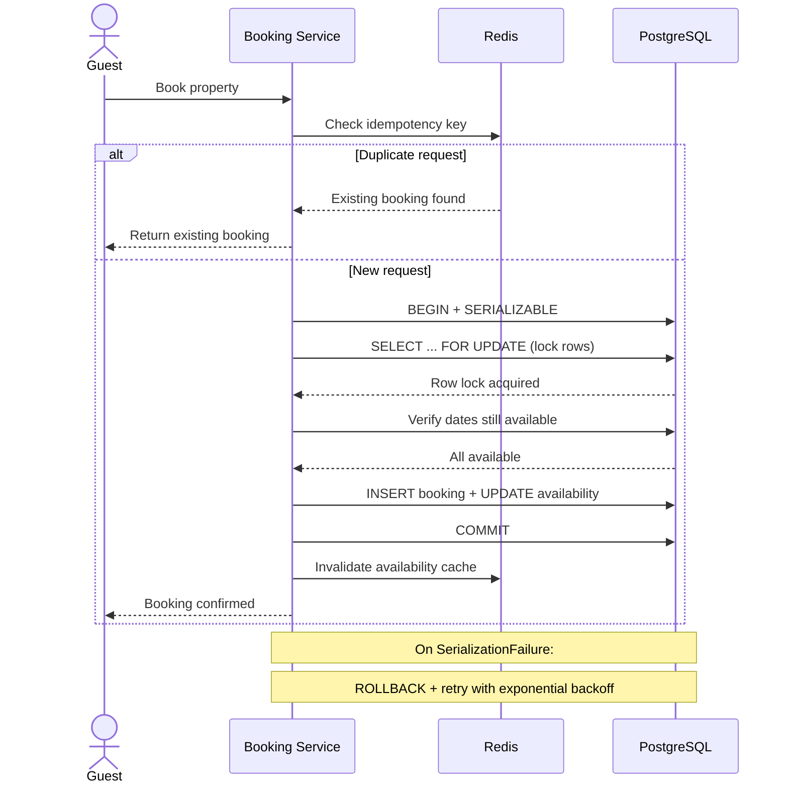

| Difficulty | Channel | Tags |
|---|---|---|
| intermediate | database | acid, isolation-levels, mvcc |

On April 4, 2019, at 17:22 UTC, Booking.com's iCal synchronization feeds went completely empty [1]. Within hours, millions of property calendars synced across platforms like Airbnb showed every date as available—including dates with confirmed bookings—triggering thousands of double bookings across millions of properties worldwide [1]. The incident took nearly 19 hours to resolve and left customer support departments in chaos [1]. For any engineer building transaction-critical systems, this is the nightmare scenario: a silent data corruption event that turns customer trust into dust overnight.

---

> ### Real-World Case — Booking.com
>
> On April 4, 2019, Booking.com's iCal synchronization feeds suddenly went empty globally, causing millions of property calendars synced across platforms like Airbnb to show all dates as available — even dates with existing confirmed bookings. This triggered thousands of double bookings within hours as previously blocked dates suddenly appeared free across synchronized platforms.
>
> | | |
> |---|---|
> | **Challenge** | The iCal sync mechanism — the primary way property owners keep calendars consistent across multiple booking platforms — failed catastrophically by returning empty feeds instead of erroring. The fail-open behavior (empty feed = no bookings) cascaded across millions of properties, creating a massive double-booking surface that no amount of per-platform transaction isolation could prevent. |
> | **Solution** | Booking.com eventually restored the iCal files; affected hosts had to manually block dates or disable instant booking. The incident exposed the need for fail-closed defaults in sync mechanisms, defensive calendar integration design, and the critical role of channel managers as intermediary synchronization layers with their own conflict detection. |
> | **Outcome** | Thousands of confirmed double-bookings occurred across millions of properties worldwide within hours. The incident lasted from 17:22 UTC on April 4 until approximately noon on April 5, 2019, triggering mass chaos across customer support departments at both Booking.com and Airbnb. |
> | **Lesson** | Transaction isolation at the database level is not enough — synchronization mechanisms between systems are a critical single point of failure. Booking systems must fail closed (block dates when sync breaks) rather than fail open (free dates), and any integration point between booking platforms must have its own conflict detection and defense-in-depth. |

---

## Hook — The 19-Hour Nightmare That Broke Trust

If you manage any reservation system—hotel rooms, cloud instances, meeting rooms, or concert tickets—the Booking.com story should make your palms sweat. The root cause was not a sophisticated cyberattack or a hardware failure. A synchronization feed went empty. That is it. And yet this single failure cascaded through the entire travel ecosystem, proving that system fragility often hides in the most mundane places [1].

For engineers, this raises an uncomfortable question: if a feed going empty can cause thousands of double bookings, what happens when your database transactions fail silently? The answer is worse than you think. A silent transaction failure does not send an alert—it just corrupts your data, one booking at a time, until a customer arrives at a property that is already occupied.

## Problem — The Race Condition Hiding in Plain Sight

The double-booking problem is deceptively simple. Two guests search for the same property. Both see “available.” Both click “Book Now.” If the database does not coordinate these concurrent operations correctly, both succeed. You now have two guests arriving at the same property on the same dates.

In database theory, this is a lost update—also called a write-write conflict. Transaction A reads a row, Transaction B reads the same row, Transaction A writes, Transaction B writes, overwriting A’s changes without ever knowing they existed. The first booking disappears into a silent void [7]. The guest shows up, the property manager has no record of their reservation, and trust evaporates.

The scary part? Many developers never think about this until it happens to them. You might think READ COMMITTED—the default isolation level in PostgreSQL—is sufficient. It prevents dirty reads, but it does nothing to prevent the phantom reads and non-repeatable reads that cause double bookings [2]. The gap between “my database works” and “my database is correct under concurrency” is where production incidents are born.

## Real-World Case — Booking.com’s iCal Catastrophe

Here is how the nightmare unfolded. On April 4, 2019, at 17:22 UTC, Booking.com’s iCal synchronization feeds stopped producing data. These feeds are how property calendars stay synchronized across platforms—when a booking is made on Booking.com, the iCal feed updates so the same property on Airbnb, VRBO, and other platforms shows those dates as blocked.

When the feeds went empty, external platforms interpreted the missing data as “all dates available.” Properties with confirmed guests suddenly appeared unbooked across the web. Within hours, thousands of double bookings cascaded across millions of properties worldwide [1]. The incident lasted until approximately noon on April 5, 2019—nearly 19 hours of chaos for customer support teams at both Booking.com and partner platforms [1].

What makes this particularly painful is that Booking.com’s own database was likely consistent. The failure was in the data propagation layer—a reminder that transaction isolation is only as strong as your weakest synchronization link. You can have perfect SERIALIZABLE isolation in your primary database, but if a downstream sync mechanism fails, you still get double bookings.

## Deep Dive — Why Isolation Levels Matter (And Which One You Actually Need)

To prevent double bookings, you need to understand how databases handle concurrent transactions. The SQL standard defines four isolation levels: READ UNCOMMITTED, READ COMMITTED, REPEATABLE READ, and SERIALIZABLE [2]. Each prevents a different set of anomalies, and choosing the wrong one is how production incidents happen.

READ COMMITTED—PostgreSQL’s default—prevents dirty reads but allows non-repeatable reads and phantom reads. In a booking system, a non-repeatable read means Transaction A reads a date as available, Transaction B books it, and Transaction A’s subsequent read still shows it as available. The first booking disappears [2]. REPEATABLE READ prevents non-repeatable reads but can still allow serialization anomalies under specific write patterns.

Only SERIALIZABLE guarantees true serializability: concurrent transactions produce the same result as if they ran one after another [8]. PostgreSQL implements SERIALIZABLE through predicate locking, detecting conflicts between transactions on overlapping predicate ranges [2]. But here is the plot twist: even SERIALIZABLE does not prevent all anomalies if you do not lock the right rows.

MVCC (Multi-Version Concurrency Control) is the mechanism that makes higher isolation levels performant [3]. Instead of blocking readers when a writer holds a lock, MVCC gives each transaction a consistent snapshot of the database at a point in time [9]. Readers never block writers, and writers never block readers—but this also means two transactions can see conflicting versions of reality.

This leads to a critical design decision: optimistic vs. pessimistic concurrency control. Optimistic concurrency control (OCC) lets transactions run freely and checks for conflicts at commit time [4]. If a conflict is detected, one transaction is aborted and must retry. Pessimistic concurrency control (SELECT FOR UPDATE) avoids retries by locking rows upfront, preventing conflicting transactions from starting at all [5].

Which should you choose? For hot properties that receive hundreds of booking attempts per minute, pessimistic locking with SERIALIZABLE isolation reduces retry overhead. For low-contention properties, optimistic locking with version columns is more efficient. Many production systems use a hybrid: optimistic availability checks against a cache, then pessimistic locking at commit time.

## Workflow — The Booking Transaction in Action

A robust booking transaction follows a specific sequence designed to eliminate race conditions. The sequence diagram below illustrates the complete lifecycle of a booking request, from the guest’s initial request to the final confirmation.

Start with a cache check for idempotency to prevent duplicate processing if the client retries. Then, and only then, enter the database transaction with SERIALIZABLE isolation. The critical step is SELECT FOR UPDATE on the availability rows for the requested dates—this creates a row-level lock that prevents any other transaction from reading or writing those rows until this transaction completes [5].

After acquiring the lock, verify that all requested dates are still available. If a concurrent transaction already booked some of those dates, the verification fails and you roll back gracefully. If everything checks out, insert the booking record and update the availability table atomically within the same transaction. Commit releases all locks, and invalidate the cache so subsequent reads fetch fresh data.

If a serialization failure occurs—PostgreSQL detects a true serialization anomaly—the transaction is aborted. The application must catch this, roll back, and retry with exponential backoff. This retry loop is what makes the system resilient under high contention.

## Code Example — Building a Bulletproof Booking Transaction

Here is a production-ready implementation in Python using PostgreSQL and psycopg2. The pattern combines SERIALIZABLE isolation, row-level locks, exponential backoff retries, and idempotency keys to prevent duplicate bookings.

## Lessons Learned — What Booking.com Taught Us About Transaction Design

The Booking.com incident and the mechanisms that prevent double bookings reveal several hard-won insights.

First, transaction isolation is a chain—and it is only as strong as its weakest link. Even with perfect SERIALIZABLE isolation in your primary database, a synchronization failure in a downstream system can corrupt your data [1]. Audit every data path, not just your primary database. The Booking.com outage was not a database failure—it was a feed failure. No amount of SELECT FOR UPDATE inside PostgreSQL could have prevented it.

Second, idempotency is a superpower. If every booking request carries a unique idempotency key, retries become safe. The database can detect and reject duplicate booking attempts before they create double reservations. This pattern is well-established in payment systems and equally applicable to booking systems [10].

Third, lock contention is real and must be planned for. Implement retry logic with exponential backoff, monitor lock wait times, and consider circuit breakers for hot properties—listings that receive hundreds of booking attempts per minute. At a certain point, in-memory queuing per property can be more efficient than database-level locking.

Fourth, caching is a double-edged sword. Caching availability reduces database load and improves response times, but stale cache data can lead to conflicts [6]. Use write-through caching with immediate invalidation on successful bookings, and always validate availability against the database before confirming a booking. Never trust the cache for the final decision.

Finally, test your failure modes. The Booking.com incident was caused by a component most engineers never think about: a calendar synchronization feed. Simulate failures in every layer—database, cache, message queue, sync pipeline—and observe how your system behaves. The failure that breaks your system will not be the one you expected.

---

## Booking Transaction Flow

<strong>Original Interview Question</strong>

**Q:** You're building a booking system for Airbnb where multiple users can reserve the same property simultaneously. How would you design the transaction handling to prevent double bookings while maintaining high availability?

**A:** Use SERIALIZABLE isolation with optimistic concurrency control. Implement row-level locks on property availability tables, use MVCC snapshot reads for checking availability, and apply application-level validation to ensure atomic booking operations.

## Conclusion

The next time someone questions why you use SERIALIZABLE isolation for your booking system, tell them about the night Booking.com’s iCal feeds went silent. Tell them about the thousands of guests who arrived at properties that were already occupied [1]. Tell them about the 19 hours of customer support chaos that followed. Transaction design is not an academic exercise—it is the difference between a platform people trust and a platform people abandon after one disastrous booking. Start by auditing your own system: what happens when two concurrent requests hit your booking endpoint? What happens when a downstream sync fails? If you cannot answer those questions with confidence, you have found your first improvement opportunity. Use SERIALIZABLE isolation for critical booking paths, implement idempotency keys, add retry logic with exponential backoff, and monitor your lock contention. Your future self—and your customers—will thank you.

---

## References

1. [Booking.com iCal Problem of 4th April 2019 Explained](https://www.hosthub.com/blog/booking-com-ical-problem-of-4th-april-2019-explained/) — article
2. [PostgreSQL Documentation: Transaction Isolation](https://www.postgresql.org/docs/current/transaction-iso.html) — documentation
3. [Wikipedia: Multiversion Concurrency Control](https://en.wikipedia.org/wiki/Multiversion_concurrency_control) — paper
4. [Wikipedia: Optimistic Concurrency Control](https://en.wikipedia.org/wiki/Optimistic_concurrency_control) — paper
5. [PostgreSQL Documentation: SELECT FOR UPDATE](https://www.postgresql.org/docs/current/sql-select.html#SQL-FOR-UPDATE-SHARE) — documentation
6. [PostgreSQL Documentation: Explicit Locking](https://www.postgresql.org/docs/current/explicit-locking.html) — documentation
7. [Wikipedia: ACID](https://en.wikipedia.org/wiki/ACID) — paper
8. [Wikipedia: Serializability](https://en.wikipedia.org/wiki/Serializability) — paper
9. [PostgreSQL Documentation: MVCC Introduction](https://www.postgresql.org/docs/current/mvcc-intro.html) — documentation
10. [RFC 7231: HTTP Semantics (Idempotent Methods)](https://datatracker.ietf.org/doc/html/rfc7231) — documentation

---

**Author:** Satishkumar Dhule — [GitHub](https://github.com/satishkumar-dhule) · [LinkedIn](https://linkedin.com/in/satishkumar-dhule) · [Website](https://satishkumar-dhule.github.io)
