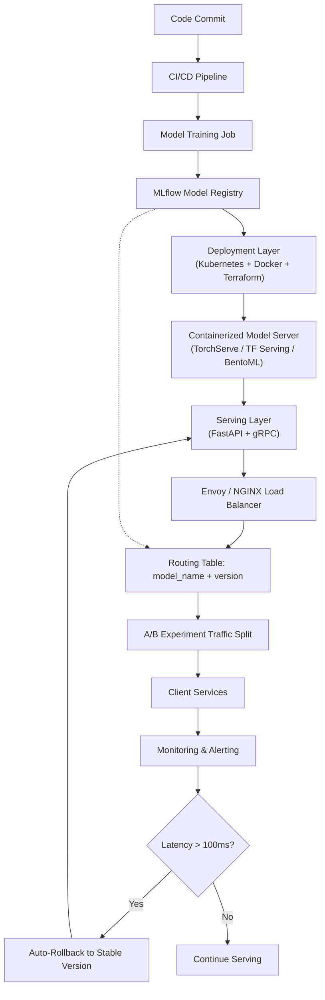

| Difficulty | Channel | Tags |
|---|---|---|
| beginner | devops | mlops, deployment |

Netflix's ML platform processes over 1 million inference requests every second across 250 million users, powering everything from your personalized homepage to fraud detection on your payment. But here is the catch — when every client service needs the right model version for the right user in the right A/B test, you cannot afford to confuse deployment with serving [1]. Many teams do, and the result is brittle infrastructure, cold-start latency spikes, and rollbacks that take hours instead of seconds.

---

> ### Real-World Case — Netflix
>
> Netflix's ML platform serves hundreds of model types powering recommendations, search, fraud detection, and artwork personalization for 250M+ users. As of 2025, their centralized ML serving platform handles over 1 million requests per second. The challenge was that each client service (homepage, search, payments) needed to route inference requests to the right model version for the right user in the right A/B test, without exposing ML complexity.
>
> | | |
> |---|---|
> | **Challenge** | Off-the-shelf solutions like AWS API Gateway and standard service meshes handle generic HTTP routing but lack awareness of ML-specific needs: experimental model variant routing, A/B test traffic splitting across 10+ concurrent experiments per user, request body enrichment for inference parameters, and the ability to decouple model version deployment cycles from service deployment cycles. |
> | **Solution** | Netflix built Switchboard, a custom ML serving proxy layer that decouples client services from model infrastructure. It handled request routing, model versioning, and A/B experiment configuration. As scale grew, they evolved to Lightbulb + Envoy: Lightbulb became a dedicated routing metadata service (decoupled from the request path), while Envoy handled the actual traffic routing at the proxy layer. This separated the deployment control plane (model version registration, experiment configs) from the serving data plane (low-latency inference requests). |
> | **Outcome** | The platform serves 1M+ requests per second across 30+ client services with high availability. The Switchboard-to-Lightbulb evolution eliminated a single-point-of-failure risk and reduced per-request latency by offloading routing metadata from the hot path. The architecture enables researchers to deploy new model variants and run A/B experiments without touching service code or modifying client deployment pipelines. |
> | **Lesson** | Model deployment (registering versions, managing A/B test configs, CI/CD) and model serving (request routing, low-latency inference, traffic splitting) require fundamentally different infrastructure patterns. Deploying them as a single monolithic proxy works initially but creates coupling that hurts both reliability and iteration velocity at scale. Separating the control plane (deployment metadata) from the data plane (serving) is essential for both safety and performance. |

---

## Hook — The 2 AM Pager That Changed Everything

Picture this: your team just pushed a new recommendation model to production. The deploy looked clean — Kubernetes pods rolled out, MLflow registered the new artifact, and monitoring showed green across the board. Then at 2 AM, the pager goes off. Response times jumped from 40ms to 800ms. Users are seeing the wrong recommendations. The A/B experiment just routed 50% of traffic to a model that was never meant to serve real users. What went wrong? You confused deployment with serving. This is not a hypothetical — Netflix's engineering team spent years untangling exactly this problem across their massive ML platform [1].

## Problem — The Deployment vs Serving Trap

Here is a confession that few engineers admit: most teams use the words "deployment" and "serving" interchangeably, and it costs them dearly. Deployment is about getting your model into production — the CI/CD pipelines, the infrastructure provisioning, the monitoring setup, and the rollback strategies. Serving is about what happens next — the runtime inference API, the request routing, the model version resolution, and the autoscaling under load [2]. Sound like the same thing? Think again. Deployment happens once (or a few times) per model version. Serving happens millions of times per second. When you treat them as identical, you end up with a single monolithic pipeline that cannot handle the fundamental asymmetry between "getting the model there" and "answering requests for it." The stakes are high: a deployment mistake means a bad rollout. A serving mistake means a cascading outage that takes down every client service that depends on your models.

## Real-World Case — Netflix: From Switchboard to Lightbulb

Netflix's ML platform serves hundreds of model types — recommendations, search ranking, fraud detection, artwork personalization — across 30+ client services. By 2025, their centralized serving platform handles over 1 million requests per second [1]. The core challenge was routing: each client service (homepage, search, payments) needed the right model version for the right user in the right A/B experiment, all without exposing ML complexity to those services. Their original architecture, codenamed Switchboard, used a centralized routing layer that became a single point of failure. Every inference request carried routing metadata that had to be resolved before the request could even reach a model server. Under load, that metadata resolution became the bottleneck. Their evolution to Lightbulb — a decentralized architecture that embeds routing decisions into the serving infrastructure itself — eliminated the single point of failure and slashed per-request latency by offloading routing metadata from the hot path. Researchers could now deploy new model variants and run A/B experiments without touching a single line of client service code [1]. The lesson? When your serving architecture cannot evolve independently from your deployment pipeline, you are one bad release away from a platform-wide outage.

## Deep Dive — Deployment vs Serving: The Technical Reality

Let us break this down into the concrete technologies and patterns that define each layer.

**Deployment infrastructure** is where your MLOps maturity shows. Tools like Kubernetes handle container orchestration and pod lifecycle [2], Docker packages your model with its dependencies [3], and Terraform provisions the underlying compute resources [4]. MLflow tracks experiments, registers model versions, and maintains a lineage of which training run produced which artifact [5]. This is the world of CI/CD — GitHub Actions building containers, Jenkins running validation suites, and rollback strategies that swap entire deployments.

**Serving infrastructure** operates at a completely different cadence. Here, you care about inference latency, request batching, and model version pinning. TensorFlow Serving [6] and TorchServe [7] are purpose-built for loading models into memory and exposing prediction endpoints. BentoML [8] adds a higher-level abstraction that packages models with their preprocessing logic into deployable units. FastAPI and gRPC handle the transport layer, with frameworks like Envoy or NGINX managing traffic splitting for A/B testing [9].

If you try to manage serving concerns (request routing, model version resolution, autoscaling) through deployment tooling, you end up rebuilding your entire pipeline for every model update. If you try to handle deployment concerns (infrastructure provisioning, CI/CD, monitoring) through serving tooling, you get fragile systems that cannot recover from failures.

⚠️ **Watch Out:** The most common anti-pattern is embedding A/B experiment configuration inside your model deployment scripts. When the experiment changes, you have to redeploy. Instead, keep routing logic in the serving layer where it can be updated independently [1].

## Workflow — The End-to-End Model Lifecycle

A mature ML platform connects deployment and serving through a well-defined workflow. Here is how it flows, from code commit to production inference:

The journey begins with a model training job that produces an artifact — typically a serialized model file with version metadata. That artifact gets registered in MLflow (or your model registry of choice [5]), which triggers a CI/CD pipeline. The pipeline builds a container image with the model and its serving dependencies, runs validation tests (can the model load? does inference return correct shapes?), and deploys the containerized model to a Kubernetes cluster [2].

But here is where the separation matters: deployment puts the model into the cluster, but serving decides which requests go to which model version. The serving layer — built with TensorFlow Serving, TorchServe, or BentoML [8] — maintains a routing table that maps (model_name, model_version) to running model server instances. An Envoy proxy or NGINX load balancer sits in front, handling traffic splitting for A/B experiments without touching the deployment pipeline [9].

Meanwhile, monitoring metrics — latency percentiles (p50, p99), request throughput, error rates, and prediction drift — feed back into the CI/CD pipeline through automated rollback triggers. If p99 latency exceeds 100ms for more than 30 seconds, the serving layer can automatically re-route traffic to the previous stable version.

Below is the architecture in practice:

## Code Example — A Production Model Serving Gateway

Here is a practical implementation of a model serving gateway in Python that separates routing from model loading — the exact pattern Netflix uses to keep deployment and serving concerns independent.

The `ModelRouter` class maintains a lazy-loaded cache of model instances. It resolves model versions from a routing table (which can be updated at runtime via a configmap or feature flag), loads models on first request, and serves predictions without blocking. The key insight: the FastAPI endpoint does not know or care what deployment pipeline produced the model. It only knows the (model_name, model_version) tuple. This separation means researchers can deploy a new model version without modifying the serving code, and operators can change routing without redeploying the model.

## Lessons Learned — Separating Concerns at Scale

After watching teams (including Netflix) struggle with the deployment-serving boundary, here are the patterns that separate smooth operations from late-night war rooms.

**1. Treat the model registry as the contract.** Both your deployment pipeline and serving layer should read from the same registry [5]. If they disagree on what version is "production," you have a bug.

**2. Never embed routing in deployment scripts.** A/B testing, canary releases, and gradual rollouts are serving concerns. Use a load balancer or service mesh (Envoy, Istio) to split traffic at the request level [9], not at the Kubernetes manifest level [2].

**3. Monitor at both layers separately.** Deployment monitoring tracks build success, container health, and resource usage. Serving monitoring tracks latency, throughput, and prediction quality. A model can be "deployed" (container is running) but not "serving correctly" (predictions are wrong). These are two different alerts [10].

**4. Design for cold-start latency.** Model servers that load large models (GBs of weights) can take 30+ seconds to become ready. Your serving layer needs pre-warming, model caching, and readiness probes that do not mark a pod healthy until the model is actually loaded [2].

**5. Build rollback into the serving layer, not the deployment pipeline.** Rolling back a Kubernetes deployment takes minutes. Changing a routing table takes milliseconds. When the pager goes off at 2 AM, you want a routing change, not a container rebuild.

---

## ML Model Deployment and Serving Architecture Flow

<strong>Original Interview Question</strong>

**Q:** Explain the key differences between model serving and model deployment in ML systems, including specific technologies, scaling considerations, and real-world implementation patterns?

**A:** Deployment encompasses CI/CD pipelines, infrastructure setup, and monitoring using tools like Kubernetes, MLflow, and SageMaker. Serving focuses on runtime inference APIs with frameworks like TensorFlow Serving, TorchServe, or BentoML, handling request routing, model versioning, and autoscaling. Key trade-offs include latency vs throughput, batch vs real-time inference, and cold start optimization.

## Conclusion

Next time your team plans an ML platform, draw two boxes: one for deployment and one for serving. They talk to each other through the model registry, but they evolve independently, scale independently, and fail independently. Netflix learned this the hard way at 1 million requests per second, but you do not need Netflix-scale to apply the lesson. Start today: move your A/B routing logic out of your deployment scripts and into your serving layer. Your 2 AM self will thank you.

---

## References

1. [State of Routing in Model Serving — Netflix Tech Blog](https://netflixtechblog.com/state-of-routing-in-model-serving-16e22fe18741) — blog
2. [Kubernetes Documentation — Production-Grade Container Orchestration](https://kubernetes.io/docs/concepts/overview/) — documentation
3. [Docker Documentation — Containerize Applications](https://docs.docker.com/) — documentation
4. [Terraform Documentation — Infrastructure as Code](https://developer.hashicorp.com/terraform/docs) — documentation
5. [MLflow Documentation — Machine Learning Lifecycle](https://mlflow.org/docs/latest/index.html) — documentation
6. [TensorFlow Serving — Production ML Serving](https://www.tensorflow.org/tfx/guide/serving) — documentation
7. [TorchServe — PyTorch Model Serving](https://pytorch.org/serve/) — documentation
8. [BentoML Documentation — Unified Model Serving Framework](https://docs.bentoml.com/en/latest/) — documentation
9. [Envoy Proxy — Load Balancing for ML Serving](https://www.envoyproxy.io/docs/envoy/latest/) — documentation
10. [Prometheus Monitoring — Metrics Collection for ML Systems](https://prometheus.io/docs/introduction/overview/) — documentation

---

**Author:** Satishkumar Dhule — [GitHub](https://github.com/satishkumar-dhule) · [LinkedIn](https://linkedin.com/in/satishkumar-dhule) · [Website](https://satishkumar-dhule.github.io)
