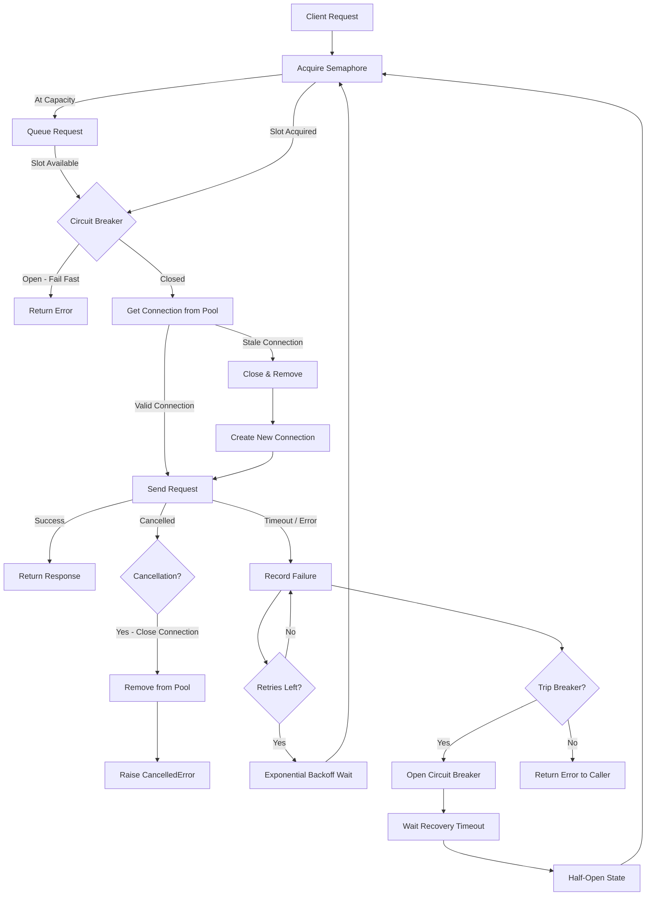

| Difficulty | Channel | Tags |
|---|---|---|
| advanced | backend | asyncio, aiohttp, concurrency |

It was a routine dependency bump — the kind you merge without a second thought. Amazon engineers upgraded aiohttp from 3.13.5 to 3.14.0 in a production service communicating with DynamoDB via aiobotocore. No other changes, no red flags. Then the timeouts started. Connections that should have taken 3 seconds to time out were failing in 2 milliseconds. Something deep inside the connection pool had broken, and the fix would reveal just how fragile even battle-tested async HTTP clients can be [1].

---

> ### Real-World Case — Amazon (DynamoDB via aiobotocore/aiohttp)
>
> A production service using aioboto3/aiobotocore to communicate with Amazon DynamoDB started seeing mysterious read timeouts immediately after upgrading aiohttp from 3.13.5 to 3.14.0 — with no other dependency changes. Connections from the keep-alive pool were failing in ~2ms instead of the configured 3s sock_read timeout.
>
> | | |
> |---|---|
> | **Challenge** | DynamoDB closes idle keep-alive connections after ~20s of inactivity, so pooled connections routinely go stale while parked. After aiohttp 3.14.0, broken connections were being returned to the pool instead of closed and discarded, poisoning the entire pool. Every subsequent request that picked up a poisoned connection failed in single-digit milliseconds, creating a cascading failure pattern indistinguishable from a downstream outage. |
> | **Solution** | The root cause was traced to a single-line change in exception handling: `except BaseException` was narrowed to `except Exception` in `ResponseHandler.data_received()`. This accidentally allowed `asyncio.CancelledError` (a BaseException subclass since Python 3.8) to bypass the transport cleanup branch. Connections whose reads were interrupted by cancellation were released back into the keep-alive pool in a half-read, desynchronized state instead of being torn down. The fix restored proper cleanup of cancelled connections so they are discarded, not recycled. |
> | **Outcome** | Downgrading to aiohttp 3.13.5 eliminated the failures immediately. The fix (PR #12798) prevents connection pool poisoning by ensuring that connections interrupted by cancellation are closed and removed from the pool. A single-character-scope change to exception handling had silently introduced a connection-leak bug that turned idle pool staleness into a cascading failure — measurable as ~2ms failures vs the configured 3s timeout. |
> | **Lesson** | Connection pool hygiene is fragile: even well-intentioned refactors to exception handling can silently poison the pool. A connection whose read/parse was interrupted by cancellation must always be discarded, never returned to the pool. When pooled connections go stale (like DynamoDB's ~20s idle timeout), the pool must detect and evict dead connections rather than handing them out to unsuspecting callers. The difference between graceful degradation and cascading failure was a single word: `BaseException` vs `Exception`. |

---

## Hook — The 2ms Mystery That Had Engineers Scratching Their Heads

Imagine debugging a problem where connections fail in 2ms instead of the configured 3-second timeout. You check your code. Nothing changed. You check your dependencies. Wait — aiohttp went from 3.13.5 to 3.14.0. Could a minor version bump really cause this? Downgrading confirms it: the old version works perfectly. Something in the new release silently poisoned the connection pool. The fix, when it came, was a single-character-scope change to exception handling. But the root cause was something much deeper: connection pool poisoning, where stale connections remain in the pool, fail instantly, and cascade into system-wide degradation. This is not an edge case. Every backend developer working with async HTTP clients will face this problem eventually.

## Problem — Why Connection Pool Management Is Harder Than You Think

At its core, a connection pool sounds simple: maintain a set of reusable TCP connections to avoid the overhead of establishing new ones for every request. In practice, it is a distributed systems problem in miniature. You need to handle concurrent access without deadlocks. You need to detect and prune dead connections. You need to manage timeouts at multiple layers — TCP connect, TLS handshake, socket read, and total request. And when downstream services slow down or fail, your pool must degrade gracefully instead of amplifying the problem.

Many developers discover these challenges the hard way, during an incident. The failure modes are well documented in systems engineering literature: cascading failures where a small slowdown in one service spreads to others [2], thundering herd problems where retries overwhelm an already-strained system [3], and resource leaks that silently degrade performance over hours or days. The connection pool sits at the intersection of all these failure modes. Get it wrong, and your entire application collapses under load that it could have handled.

## Real-World Case — Amazon DynamoDB and aiohttp's Connection Pool Poisong

The aiohttp issue #12795 [1] tells a cautionary tale about how a seemingly innocuous change can break connection pools in production. A service using aioboto3 and aiobotocore to communicate with Amazon DynamoDB upgraded aiohttp from 3.13.5 to 3.14.0. Immediately, connections from the keep-alive pool started failing in approximately 2 milliseconds — far below the configured 3-second sock_read timeout. The investigation traced the root cause to PR #12798, which fixed a subtle bug: connections interrupted by task cancellation were being left in the pool in an invalid state. Rather than being closed and removed, these poisoned connections would instantly fail when reused by subsequent requests.

What makes this incident particularly instructive is the scale of the impact. A single-character-scope change to exception handling had introduced a connection-leak bug. The keep-alive pool, meant to optimize performance by reusing connections, became a vector for rapid, cascading failure. New connection attempts succeeded and were added to the pool, but the pool itself had become a graveyard of zombie connections that looked alive but died instantly on use. The signal that should have taken 3 seconds to manifest was arriving in 2ms — fast enough to look like a timeout configuration issue, but actually masking a much deeper structural problem.

## Deep Dive — The Anatomy of a Resilient Connection Pool

Building on what this incident revealed, a production-grade connection pool must address several interconnected concerns. Think of it as a multi-layered defense system, where each layer handles a specific failure mode while the others keep operating.

**Semaphore-based concurrency limiting** is the first line of defense. Without it, an unbounded number of concurrent requests can overwhelm both your application and the downstream service. The Python asyncio Semaphore provides a clean primitive for this: before acquiring a connection, your code acquires the semaphore, ensuring you never exceed the configured maximum [4].

**Exponential backoff with jitter** sits at the retry layer. When a request fails, you do not retry immediately — that would create a thundering herd. Instead, you wait 2^n seconds for the nth retry, plus random jitter to desynchronize retry attempts across clients [5]. The AWS architecture blog provides a canonical implementation: base_delay * 2^attempt + random(0, jitter). Without jitter, multiple clients retrying simultaneously will pile onto the same schedule, creating synchronized waves of traffic.

**The circuit breaker pattern** is the strategic layer. Unlike retries, which handle transient failures, the circuit breaker detects when a downstream service is persistently failing and stops all requests to it for a configured period. The Microsoft documentation on the circuit breaker pattern describes three states: closed (normal operation), open (fail fast without attempting), and half-open (allow a test request to check if the service has recovered) [6]. This prevents wasted resources on doomed requests and gives the downstream service time to recover.

**Health checking and connection pruning** is the maintenance layer. Connections in the pool can become stale — TCP connections that the remote side has closed but your pool has not detected yet. This is exactly what happened in the aiohttp incident. When a connection is interrupted by cancellation, it must be removed from the pool immediately. The aiohttp TCPConnector provides configuration options like `enable_cleanup_closed` and `keepalive_timeout` that help, but as the incident shows, exception handling in async code can bypass these safeguards.

⚠️ **Watch Out**: The most dangerous failure mode is a silent degradation. When your connection pool is poisoning connections, the symptoms may look like configuration issues ("our timeouts are too short") when the real problem is structural ("our pool is full of zombie connections"). The aiohttp incident is a perfect example: the 2ms failure signal looked like a timeout problem, but tweaking timeouts would not have fixed it.

## Workflow — The Complete Request Lifecycle Through a Resilient Pool

Here is the full flow that a production-grade connection pool manager should follow for every request. The Mermaid diagram below illustrates this journey from client request to response or graceful failure.

1. **Acquire semaphore**: Before anything else, acquire the concurrency limiter. If the pool is saturated, queue the request rather than rejecting it outright.
2. **Check circuit breaker**: Is the downstream service in a failure state? If the circuit breaker is open, fail fast without attempting a connection.
3. **Get connection from pool**: Retrieve an existing keep-alive connection or create a new one if none is available.
4. **Send request with timeout**: Execute the HTTP request with a multi-layer timeout (connect, read, total).
5. **Handle success**: Return the response and return the connection to the pool for reuse.
6. **Handle failure**: Record the failure, check if the circuit breaker should trip, and either retry with backoff or propagate the error.
7. **Clean up on cancellation**: If the request is cancelled, ensure the connection is closed and removed from the pool — not returned to it. This is the critical step that the aiohttp incident highlighted [1].

A flowchart of these transitions is shown below, illustrating how control moves through the system under normal operation, under load, and during failure recovery.

## Code Example — Building a Production-Grade Connection Pool Manager

The following implementation brings together semaphore limiting, circuit breaker protection, and exponential backoff into a single reusable class. Each component is deliberately isolated so you can test and tune them independently.

## Lessons Learned — What Every Developer Should Take Away

The aiohttp incident [1] and the patterns discussed here converge on several hard-won insights that every backend developer should internalize:

**Connection pools are state machines, not caches.** Treating them as simple caches ignores the complex lifecycle of TCP connections. Every connection goes through states — idle, in-use, stale, closed — and your code must handle transitions between all of them. The aiohttp bug was fundamentally a missing state transition: cancelled connections were not moved from "in-use" to "closed" before being returned to the pool.

**Cancellation is not cleanup.** In async Python, cancelling a task raises `asyncio.CancelledError`. If your exception handler catches this alongside `TimeoutError` and `ClientError`, it can silently swallow the cancellation and return a poisoned connection to the pool. Always let `CancelledError` propagate unless you are explicitly handling it.

**Instrument everything.** The 2ms failure signal was only detectable because someone was monitoring timeout distributions. If you measure request latency percentiles, you will spot anomalies before they become incidents. Add metrics for pool size, connection age, failure rate per downstream, and circuit breaker state transitions [10].

**Test your failure modes.** Unit tests that verify success paths are not enough. Inject connection failures, TCP timeouts, and task cancellations at every layer and verify that your pool degrades gracefully. The aiohttp bug would have been caught by a test that cancelled an in-flight request and then verified the pool did not reuse the cancelled connection.

**Downgrade is a valid strategy.** When the Amazon team hit this bug, they downgraded to aiohttp 3.13.5 and it fixed everything immediately. Sometimes the best operational move is to roll back, stabilize, and understand the root cause afterwards. Having pinned and tested dependency versions makes this possible.

---

## Connection Pool Request Lifecycle

<strong>Original Interview Question</strong>

**Q:** How would you implement a connection pool manager for aiohttp that handles graceful degradation under high load and connection timeouts?

**A:** Implement a connection pool manager for aiohttp using a semaphore to limit concurrent connections, exponential backoff for retrying failed requests, and circuit breaker pattern to gracefully degrade under high load and connection timeouts.

## Conclusion

The aiohttp incident reminds us that connection pools are not infrastructure plumbing — they are distributed systems in miniature. A single-character-scope change to exception handling was all it took to transform a performance optimization (connection keep-alive) into a cascade amplifier (connection pool poisoning). The patterns covered here — semaphore limiting, circuit breakers, exponential backoff, and proper cancellation handling — are not academic exercises. They are the difference between a service that degrades gracefully under load and one that collapses silently at 2ms. Review your connection pool code today. Check how it handles cancellations. Add metrics for failure rates and pool health. And next time you upgrade a dependency, watch the timeout distributions closely. That 2ms spike might be telling you something deeper.

---

## References

1. [Amazon (DynamoDB via aiobotocore/aiohttp) incident report](https://github.com/aio-libs/aiohttp/issues/12795) — article
2. [Graceful Degradation - Wikipedia](https://en.wikipedia.org/wiki/Graceful_degradation) — documentation
3. [Thundering Herd Problem - Wikipedia](https://en.wikipedia.org/wiki/Thundering_herd_problem) — documentation
4. [asyncio Synchronization Primitives - Python Documentation](https://docs.python.org/3/library/asyncio-sync.html) — documentation
5. [Exponential Backoff and Jitter - AWS Architecture Blog](https://aws.amazon.com/blogs/architecture/exponential-backoff-and-jitter/) — blog
6. [Circuit Breaker Pattern - Microsoft Azure Architecture Center](https://learn.microsoft.com/en-us/azure/architecture/patterns/circuit-breaker) — documentation
7. [aiohttp ClientSession Documentation](https://docs.aiohttp.org/en/stable/client_reference.html) — documentation
8. [aiohttp TCPConnector Reference](https://docs.aiohttp.org/en/stable/client_reference.html#connectors) — documentation
9. [HTTP Connection Management in HTTP/1.1 - MDN](https://developer.mozilla.org/en-US/docs/Web/HTTP/Connection_management_in_HTTP_1.x) — documentation
10. [asyncio — Asynchronous I/O - Python Documentation](https://docs.python.org/3/library/asyncio.html) — documentation

---

**Author:** Satishkumar Dhule — [GitHub](https://github.com/satishkumar-dhule) · [LinkedIn](https://linkedin.com/in/satishkumar-dhule) · [Website](https://satishkumar-dhule.github.io)
