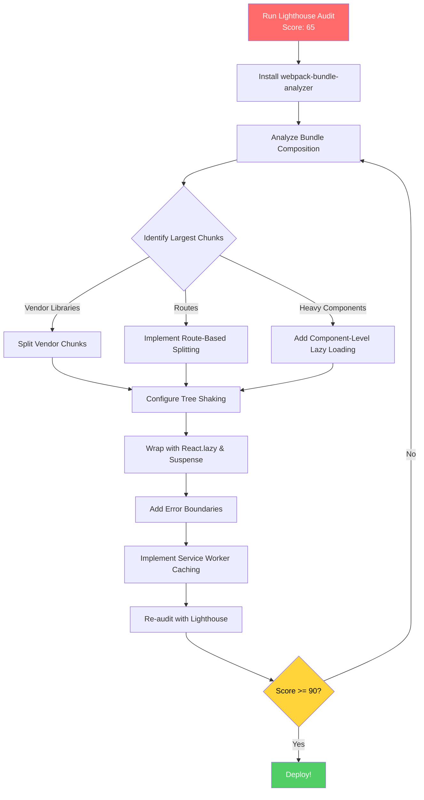

| Difficulty | Channel | Tags |
|---|---|---|
| intermediate | frontend | lighthouse, bundle, lazy-loading |

In 2017, Tinder's engineering team faced a nightmare. Their native app simply could not run on most phones in emerging markets — too heavy, too storage-hungry, too dependent on fast networks. Millions of potential users were locked out. Their response was Tinder Online, a React/Redux Progressive Web App designed to run on mid-range Android phones over 3G [1]. The results stunned even their own team: first paint dropped from ~1000ms to ~500ms, the app became interactive in under 5 seconds on 4G, and total payload landed at ~3MB. But the real shocker? The PWA outperformed their native app in swipe engagement, profile editing, and time spent per session — driving an all-time high in user engagement [1]. Now ask yourself: if your Lighthouse score sits at 65 with a 2.1MB bundle and 4.2 seconds to interactive, what could you achieve with the same approach?

---

> ### Real-World Case — Tinder
>
> Tinder built a React/Redux Progressive Web App (Tinder Online) to reach users in data-scarce or storage-limited environments where the native app couldn't run. They needed to deliver a fast, interactive experience on mid-range Android phones over 3G/4G networks.
>
> | | |
> |---|---|
> | **Challenge** | Initial monolithic JavaScript bundles (~3MB total) delayed interactivity. The main bundle alone was 166KB (min+gzip), and the app took 5.46s to reach DOM Content Loaded on a Galaxy S7 over 4G. Lighthouse scores were poor, and first paint was ~1000ms — users would abandon before seeing anything useful. |
> | **Solution** | Implemented route-based code splitting using React Loadable and dynamic import(), reducing the main bundle from 166KB to 101KB. Set hard performance budgets (~155KB main+vendor, ~55KB async chunks, ~20KB CSS). Replaced localForage with direct IndexedDB. Updated React 15→16, reducing vendor chunk by 7%. Used Webpack scope hoisting (8% parsing time improvement), Workbox for service worker caching, bundle analysis to identify optimization targets, and preloaded critical chunks to cut load time by 1s. |
> | **Outcome** | DOM Content Loaded improved from 5.46s to 4.69s. First paint dropped from ~1000ms to ~500ms. The app loaded and became interactive in under 5 seconds on 4G. Total experience was ~3MB. Tinder's PWA outperformed their native app in swipe engagement, profile editing, and time spent per session — leading to an all-time high in user engagement. They presented at Google I/O 2017 and Chrome Dev Summit as a showcase PWA. |
> | **Lesson** | Shipping less JavaScript upfront — through aggressive code splitting, performance budgets enforced per-commit, and library slimming — can make a React PWA match or exceed native app performance. The 'plot twist': Tinder enforced harder budgets (~155KB total for critical path) than most teams would think possible, and this constraint forced better architecture rather than limiting features. |

---

## Hook — The 2.1MB Problem

Here is the uncomfortable question every team avoids: does your app have a performance problem you have not measured yet? Most developers discover the truth the hard way — when a Lighthouse audit comes back with a score that makes the product manager's eye twitch. The conversation goes something like, "Wait, we just added that charting library last sprint. And the analytics dashboard. And the date picker. And..."

Each dependency seemed harmless in isolation. Together, they created a 2.1MB monster that takes 4.2 seconds to become interactive. The stakes are higher than developer pride. Google uses Core Web Vitals as a ranking signal [5]. Users abandon pages that take more than 3 seconds to load. Every 100ms of delay costs conversion rates by up to 7% [5]. You are not just fighting bundle size — you are fighting for your business's bottom line.

But Tinder proved something important: this fight is winnable. And the techniques they used are not secret. They are documented, battle-tested, and available to every React team starting today.

## Problem — Why Performance Feels Like a Losing Battle

Bundle bloat rarely happens because of a single bad decision. It is death by a thousand cuts. A team adds moment.js for date formatting (526KB minified). Someone pulls in lodash but imports the entire library instead of cherry-picking individual functions. A charting library like d3 adds 250KB+ before a single visualization renders. Before long, the bundle looks less like a carefully curated application and more like a junk drawer of npm packages.

The situation compounds because many developers import libraries without thinking about bundle impact. How many times have you seen `import _ from 'lodash'` instead of `import debounce from 'lodash/debounce'`? The difference between those two imports can be 500KB or more [4].

But here is the plot twist: the real problem is not the total bundle size. It is what you load upfront versus what you defer. Tinder's total experience was ~3MB — larger than many apps today — yet they achieved sub-5-second interactivity on 4G. The difference? They controlled the order and timing of what loaded.

## Real-World Case — Tinder's PWA Performance Journey

Tinder's approach to performance was systematic and relentless. They started where every optimization journey should start: measurement. Using Chrome DevTools and Lighthouse, they profiled every stage of the loading experience.

Here is what they found: their DOM Content Loaded event took 5.46 seconds. First meaningful paint hovered around 1000ms. On a 4G connection, users stared at a blank screen for over a second before seeing anything useful [1].

Their fix was a multi-pronged strategy:
- **Code splitting at the route level**: Each view (swipe card, chat, profile) loaded as its own chunk
- **Critical CSS inlining**: Above-the-fold styles loaded immediately, deferred styles loaded asynchronously
- **Service worker caching**: Once loaded, the app cached resources aggressively for repeat visits [7]
- **Image optimization**: Compressed images, lazy-loaded off-screen content
- **PRPL pattern**: Push critical resources, Render initial route, Pre-cache remaining routes, Lazy-load non-critical routes [8]

The results: DOM Content Loaded improved from 5.46s to 4.69s. First paint dropped from ~1000ms to ~500ms. The app loaded and became interactive in under 5 seconds on 4G. But the most surprising outcome was qualitative: user engagement on the PWA surpassed the native app in swipe engagement, profile editing, and time spent per session — leading to an all-time high in user engagement [1]. Sometimes, constraints produce better design.

## Deep Dive — Code Splitting, Lazy Loading, and Tree Shaking

Behind Tinder's success were three interconnected techniques. Think of them as layers of an optimization onion — you peel back each one to reveal the next.

**Layer 1: Tree Shaking**
Tree shaking eliminates dead code. When you use ES module syntax (`import`/`export`) instead of CommonJS (`require`/`module.exports`), bundlers like webpack can statically analyze which exports are actually used and drop the rest [6]. This sounds simple, but many libraries ship both ES and CommonJS builds. If your bundler picks up the wrong one, tree shaking fails silently.

The fix: configure webpack's `resolve.mainFields` to prefer the `module` field over `main`. Check that your dependencies ship ES module builds. Use the `sideEffects` field in package.json to tell webpack it is safe to prune entire modules.

**Layer 2: Code Splitting**
Code splitting takes the output of tree shaking and divides it into smaller chunks that load on demand [3]. There are three levels:
- **Route-level splitting**: Each page becomes its own chunk. The user only downloads what they navigate to
- **Component-level splitting**: Heavy components (charts, data grids, rich text editors) load only when rendered
- **Library-level splitting**: Large third-party libraries can be extracted into vendor chunks that load separately

Tinder used route-level splitting as their primary strategy because it maps naturally to user behavior. Users on the swipe screen do not need the chat code [1].

**Layer 3: Dynamic Imports**
Dynamic imports using the `import()` syntax are the mechanism that enables code splitting [4]. When webpack encounters a dynamic import, it automatically creates a separate chunk. Wrapping these in `React.lazy()` tells React to defer rendering until the chunk loads [2].

## Workflow — From 65 to 90+ Lighthouse

Translating theory into practice requires a repeatable workflow. The diagram below shows the decision flow that takes a bundle from bloated to lean, based on patterns used by Tinder and documented by performance teams at Google [8].

The workflow follows a loop: audit, analyze, optimize, re-audit. You never get it perfect on the first pass. The key is to identify your largest chunks first — chasing 1KB savings while ignoring a 500KB vendor bundle is a distraction.

Start with `webpack-bundle-analyzer` to visualize exactly what is in your bundle [3]. Sort by size. Identify the top offenders. Ask three questions about each:
1. Does the user need this on the first page load?
2. Can this be loaded lazily when the feature is actually used?
3. Is there a smaller alternative library?

Then move through the layers in order: tree shaking first (it costs nothing), then route-level code splitting (highest impact), then component-level splitting (for remaining heavy pieces), and finally service worker caching for repeat visit performance [7].

## Code Example — Implementing Lazy Loading with Confidence

Let us translate theory into code. Here is a production-grade implementation of lazy loading with error boundaries, loading states, and proper chunk naming:

## Lessons Learned — What Tinder's Journey Teaches Us

After walking through Tinder's journey and the technical details, several patterns emerge that every team can apply starting Monday.

**Start with measurement, not guessing.** Tinder began with a Lighthouse audit. You should too. Run it, capture the baseline, and only then start optimizing. Otherwise you are flying blind.

**Route-level splitting first, everything else second.** It gives you the most bang for your optimization buck. A user on the login page does not need the dashboard code.

**Do not forget error boundaries.** Lazy loading means dynamic network requests, which can fail. If a chunk fails to load, your error boundary catches it gracefully instead of showing a white screen of death [2].

**The 80/20 rule applies.** In most apps, 80% of the bundle size comes from 20% of the dependencies. Find those dependencies and optimize them first.

**Performance is a feature, not a fix.** The teams that treat performance as an ongoing practice rather than a one-time cleanup consistently ship faster experiences. Make bundle size part of your CI pipeline. Set budgets. Fail builds that exceed thresholds [5].

---

## Performance Optimization Workflow

<strong>Original Interview Question</strong>

**Q:** You're tasked with improving a React app's Lighthouse performance score from 65 to 90+. The bundle size is 2.1MB and Time to Interactive is 4.2s. What specific steps would you take to optimize the bundle and implement lazy loading?

**A:** Implement code splitting with React.lazy() and Suspense, analyze bundle composition with webpack-bundle-analyzer to identify largest chunks, remove unused dependencies and optimize imports, add dynamic imports for heavy components and third-party libraries, implement route-based splitting for better initial load times, and utilize tree shaking with proper ES module configuration.

## Conclusion

Tinder proved that a 3MB app can feel faster than a 50MB native app — not by magic, but by controlling what loads and when. The same techniques that took them from a 5-second DOM Content Loaded to a 500ms first paint are available in every React project today. Start tomorrow morning: run a Lighthouse audit, install webpack-bundle-analyzer, and identify your single largest chunk. Cut that one thing. Then repeat. The difference between 65 and 90 is not a secret framework — it is a systematic process applied consistently. Your users will notice before your Lighthouse score does.

---

## References

1. [Tinder PWA Performance Case Study](https://medium.com/@addyosmani/a-tinder-progressive-web-app-performance-case-study-78919d98ece0) — blog
2. [React.lazy Documentation](https://react.dev/reference/react/lazy) — documentation
3. [webpack Code Splitting Guide](https://webpack.js.org/guides/code-splitting/) — documentation
4. [MDN Dynamic Import Reference](https://developer.mozilla.org/en-US/docs/Web/JavaScript/Reference/Operators/import) — documentation
5. [Lighthouse Performance Scoring](https://developer.chrome.com/docs/lighthouse/performance/performance-scoring) — documentation
6. [webpack Tree Shaking Guide](https://webpack.js.org/guides/tree-shaking/) — documentation
7. [MDN Service Worker API](https://developer.mozilla.org/en-US/docs/Web/API/Service_Worker_API) — documentation
8. [PRPL Pattern — web.dev](https://web.dev/articles/prpl-pattern) — documentation

---

**Author:** Satishkumar Dhule — [GitHub](https://github.com/satishkumar-dhule) · [LinkedIn](https://linkedin.com/in/satishkumar-dhule) · [Website](https://satishkumar-dhule.github.io)
