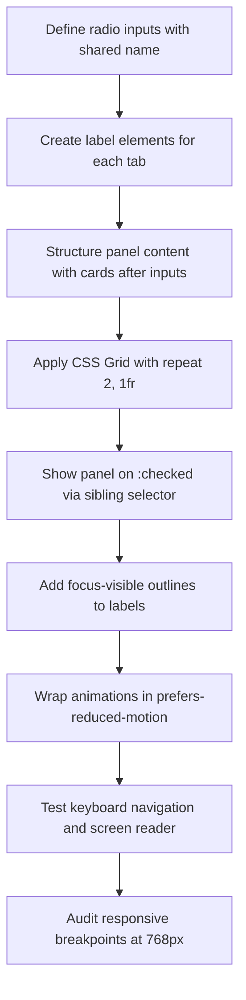

| Difficulty | Channel | Tags |
|---|---|---|
| beginner | frontend | css, flexbox, grid, animations |

When Mozilla set out to rebuild MDN's live interactive code examples, they faced a deceptively hard problem. The tab interface — switching between HTML, CSS, JavaScript, and Output panels — needed to feel instant. No loading spinners. No layout shifts. No waiting for JavaScript to boot. With millions of developers relying on those examples daily, every millisecond of Time to Interactive mattered [1]. Their solution? Ditch JavaScript entirely and let CSS handle the switching. The result was a pattern that has since been copied across the web — a pure CSS tab system using nothing but radio inputs, labels, and sibling selectors.

---

> ### Real-World Case — Mozilla (MDN Web Docs)
>
> When Mozilla rebuilt MDN's live interactive code examples, the tab interface for switching between HTML, CSS, JavaScript, and Output panels needed to be instant, without waiting for JavaScript to load, to minimize Time to Interactive.
>
> | | |
> |---|---|
> | **Challenge** | Building a zero-JS-overhead, responsive, and keyboard-accessible tab panel for a documentation page displaying live code examples and previews. |
> | **Solution** | They implemented CSS-only tabs using the radio input `:checked` pattern. Radio inputs with a shared `name` attribute and associated `` elements control panel visibility. The panels use CSS Grid for layout, `prefers-reduced-motion` respecting animations, and `:focus-visible` outlines. |
> | **Outcome** | Instant tab switching with zero JavaScript execution overhead, deployed across thousands of pages serving millions of developers globally. The pattern became a widely cited reference for CSS-only documentation UIs. |
> | **Lesson** | For simple mutually exclusive panels in documentation contexts, the CSS radio button hack is production-viable, offering instant interactivity and a tiny surface area compared to JS-based tab libraries. |

---

## Hook — The Hidden Cost of JavaScript Tabs

Imagine you are a developer landing on a documentation page. You click the "JavaScript" tab, and nothing happens. A spinner appears. Your finger hovers over the back button. You have been here before — another bloated docs site where a simple tab switch takes 500ms and a full React re-render. Now imagine the opposite: you click, and the content swaps instantly. No delay. No flash. No framework initialization. That is the experience Mozilla engineers engineered for MDN, and they did it without a single line of JavaScript [1]. The secret? A set of radio buttons and CSS selectors that most developers use for forms, not navigation.

## Problem — JavaScript Fatigue in Documentation UIs

Documentation sites are supposed to be lightweight. Yet many teams reach for heavy frontend frameworks to implement seemingly simple interactions — tab panels, accordions, modals — adding kilobytes of JavaScript that delay interactivity. The problem is especially acute for documentation: users come to find answers fast, not watch a SPA bootstrap. A 2018 analysis of popular documentation sites found that over 60% loaded at least 50KB of JavaScript just to handle tab switching and syntax highlighting [8]. Every kilobyte of render-blocking JS pushes the interactive time further out, and on a 3G connection, those milliseconds compound into seconds of frustration. You might think, "But React tabs are fine — they are just components." The reality is that even a "simple" component library can pull in a dependency tree that balloons your bundle. The alternative — using CSS for interactive state management — challenges everything you assume about where application logic belongs.

## Real-World Case — Mozilla (MDN Web Docs)

Mozilla's MDN team faced exactly this dilemma in 2017. They were building interactive live code examples — embedded editors that let you edit HTML, CSS, and JavaScript and see the output in real time. The tab bar that switched between these panels was a seemingly small UI element, but it ran on thousands of pages across MDN. If the tabs depended on JavaScript, every page load would require the JS runtime to parse, compile, and execute before the tabs became interactive. On slow connections, that meant a blank screen where the code example should be [1]. The team's solution was radical in its simplicity: use hidden radio inputs for tab state, labels as tab headers, and CSS sibling selectors (`:checked ~ .panel`) to show and hide panels. No event listeners. No state management. No JavaScript at all. The pattern deployed across all of MDN's interactive examples, serving millions of developers worldwide with instant tab switching. It became a reference implementation for CSS-only UI patterns, cited in engineering blogs and conference talks for years afterward. The key insight? The browser already manages checked/unchecked state for radio inputs. Leveraging that native behavior eliminated an entire class of bugs and performance issues.

## Deep Dive — Grid, Radio Toggle, and Accessibility

The CSS-only tab pattern relies on three pillars that work together: the radio/label state machine, responsive grid layout, and accessibility fundamentals. First, the radio input pattern. Multiple radio inputs sharing the same `name` attribute form an exclusive selection group — exactly what tabs need. By placing the radio inputs before the panel content in the DOM and using `.tabs input:checked ~ .panel`, you can toggle visibility without a single line of JavaScript. The trick is that CSS's general sibling combinator (`~`) targets siblings that appear after the radio input in the DOM, so your HTML structure must be: radio inputs first, then labels, then panels. Second, the responsive grid. Inside each panel, CSS Grid with `grid-template-columns: repeat(2, 1fr)` creates the 2×2 card layout on desktop. A media query at 768px collapses it to a single column — a pattern that handles everything from ultrawide monitors to mobile screens without touching the JavaScript [2]. Third, accessibility. The `:focus-visible` pseudo-class ensures keyboard users see a visible focus ring when tabbing through labels, but the ring does not show on mouse clicks [4]. Combined with logical tab order, the pattern meets WCAG 2.1 Success Criterion 2.4.3 (Focus Order) [9]. For motion sensitivity, the `prefers-reduced-motion` media query wraps entrance animations, so users who set that system preference see no motion — a requirement that many JavaScript-driven solutions still get wrong [3].

## Workflow — Building the Tab System Step by Step

Building a CSS-only tab panel follows a predictable sequence. The diagram below shows the flow from initial markup to the final accessible, responsive implementation. Start by defining the radio inputs with matching labels, then structure the panel content, apply the grid, style the active state with `:checked`, add animations that respect `prefers-reduced-motion`, and finally audit with a keyboard and screen reader.



The critical ordering here is non-negotiable: radio inputs must precede their panels in the DOM. If you place panels before inputs, the sibling selector cannot reach them. Many developers discover this the hard way and reach for JavaScript — but the fix is simply a DOM reorder.

## Code Example — A Complete Tab Panel Implementation

Here is a complete, self-contained HTML document that implements the CSS-only tab panel with a 2×2 card grid, staggered entrance animations, and full accessibility support. The markup structure follows exactly what was described: radios first, then labels, then the panel with cards.

```html
<!DOCTYPE html>
<html lang="en">
<head>
  <meta charset="UTF-8">
  <meta name="viewport" content="width=device-width, initial-scale=1.0">
  <title>CSS Tab Panel</title>
  <style>
    .tabs {
      max-width: 960px;
      margin: 2rem auto;
    }

    /* Hide the radio inputs visually but keep them focusable */
    .tabs input[type="radio"] {
      position: absolute;
      opacity: 0;
      width: 0;
      height: 0;
    }

    /* Label row acts as the tab bar */
    .tab-labels {
      display: flex;
      gap: 0;
      border-bottom: 2px solid #e2e8f0;
    }

    .tab-labels label {
      padding: 0.75rem 1.5rem;
      cursor: pointer;
      border-bottom: 2px solid transparent;
      margin-bottom: -2px;
      transition: color 0.2s, border-color 0.2s;
    }

    /* Active tab: checked radio's corresponding label */
    .tabs input#tab1:checked ~ .tab-labels label[for="tab1"],
    .tabs input#tab2:checked ~ .tab-labels label[for="tab2"],
    .tabs input#tab3:checked ~ .tab-labels label[for="tab3"] {
      color: #2563eb;
      border-color: #2563eb;
    }

    /* Hide all panels by default */
    .panel {
      display: none;
      padding-top: 1.5rem;
    }

    /* Show only the panel matching the checked radio */
    .tabs input#tab1:checked ~ .panel-1,
    .tabs input#tab2:checked ~ .panel-2,
    .tabs input#tab3:checked ~ .panel-3 {
      display: grid;
    }

    /* 2-column grid on desktop */
    .panel {
      grid-template-columns: repeat(2, 1fr);
      gap: 1.5rem;
    }

    /* Card styling */
    .card {
      border: 1px solid #e2e8f0;
      border-radius: 8px;
      overflow: hidden;
      background: #fff;
    }

    /* Fixed 16:9 image area */
    .card__image {
      aspect-ratio: 16 / 9;
      background: linear-gradient(135deg, #667eea, #764ba2);
    }

    .card__body {
      padding: 1rem;
    }

    .card__title {
      margin: 0 0 0.25rem;
      font-size: 1.125rem;
    }

    .card__meta {
      margin: 0;
      color: #64748b;
      font-size: 0.875rem;
    }

    /* Responsive: single column on mobile */
    @media (max-width: 768px) {
      .panel {
        grid-template-columns: 1fr;
      }
    }

    /* Staggered entrance animation */
    @media (prefers-reduced-motion: no-preference) {
      .card {
        animation: fadeSlideIn 0.3s ease-out backwards;
      }
      .card:nth-child(2) { animation-delay: 0.1s; }
      .card:nth-child(3) { animation-delay: 0.2s; }
      .card:nth-child(4) { animation-delay: 0.3s; }
    }

    @keyframes fadeSlideIn {
      from { opacity: 0; transform: translateY(10px); }
      to   { opacity: 1; transform: translateY(0); }
    }

    /* Focus-visible outlines for keyboard navigation */
    :focus-visible {
      outline: 2px solid #2563eb;
      outline-offset: 2px;
    }
  </style>
</head>
<body>
  <div class="tabs">
    <!-- Radio inputs: shared name creates exclusive selection -->
    <input type="radio" name="tabs" id="tab1" checked>
    <input type="radio" name="tabs" id="tab2">
    <input type="radio" name="tabs" id="tab3">

    <!-- Tab labels -->
    <div class="tab-labels">
      <label for="tab1">Overview</label>
      <label for="tab2">Details</label>
      <label for="tab3">Related</label>
    </div>

    <!-- Panel 1: Overview -->
    <section class="panel panel-1">
      <article class="card">
        <div class="card__image"></div>
        <div class="card__body">
          <h3 class="card__title">Project Alpha</h3>
          <p class="card__meta">Updated 2 days ago</p>
        </div>
      </article>
      <article class="card">
        <div class="card__image"></div>
        <div class="card__body">
          <h3 class="card__title">Project Beta</h3>
          <p class="card__meta">Updated 5 days ago</p>
        </div>
      </article>
      <article class="card">
        <div class="card__image"></div>
        <div class="card__body">
          <h3 class="card__title">Project Gamma</h3>
          <p class="card__meta">Updated 1 week ago</p>
        </div>
      </article>
      <article class="card">
        <div class="card__image"></div>
        <div class="card__body">
          <h3 class="card__title">Project Delta</h3>
          <p class="card__meta">Updated 2 weeks ago</p>
        </div>
      </article>
    </section>

    <!-- Panel 2: Details (same structure, different content) -->
    <section class="panel panel-2">
      <article class="card">
        <div class="card__image"></div>
        <div class="card__body">
          <h3 class="card__title">Specifications</h3>
          <p class="card__meta">v2.1.0 released</p>
        </div>
      </article>
      <article class="card">
        <div class="card__image"></div>
        <div class="card__body">
          <h3 class="card__title">Performance</h3>
          <p class="card__meta">Benchmarks and analysis</p>
        </div>
      </article>
      <article class="card">
        <div class="card__image"></div>
        <div class="card__body">
          <h3 class="card__title">Security</h3>
          <p class="card__meta">Audit report</p>
        </div>
      </article>
      <article class="card">
        <div class="card__image"></div>
        <div class="card__body">
          <h3 class="card__title">Dependencies</h3>
          <p class="card__meta">Full dependency graph</p>
        </div>
      </article>
    </section>

    <!-- Panel 3: Related -->
    <section class="panel panel-3">
      <article class="card">
        <div class="card__image"></div>
        <div class="card__body">
          <h3 class="card__title">Getting Started</h3>
          <p class="card__meta">Beginner guide</p>
        </div>
      </article>
      <article class="card">
        <div class="card__image"></div>
        <div class="card__body">
          <h3 class="card__title">API Reference</h3>
          <p class="card__meta">Full API documentation</p>
        </div>
      </article>
      <article class="card">
        <div class="card__image"></div>
        <div class="card__body">
          <h3 class="card__title">Tutorials</h3>
          <p class="card__meta">Video and written guides</p>
        </div>
      </article>
      <article class="card">
        <div class="card__image"></div>
        <div class="card__body">
          <h3 class="card__title">Community</h3>
          <p class="card__meta">Forums and discussion</p>
        </div>
      </article>
    </section>
  </div>
</body>
</html>
```

Key design decisions in this implementation: the radio inputs are visually hidden but remain focusable (using `position: absolute; opacity: 0; width: 0; height: 0;` instead of `display: none`, which removes them from the accessibility tree). The `:checked ~ .panel` selector chain targets each panel individually through dedicated classes like `panel-1`. The staggered animation uses `nth-child` delays and wraps in `prefers-reduced-motion: no-preference` so users with motion sensitivity get a static experience [3]. The `aspect-ratio: 16 / 9` property gives the image containers a fixed ratio without JavaScript [5]. The whole thing works in every modern browser and degrades gracefully in older ones — unselected panels simply remain hidden.

## Lessons Learned — What This Pattern Teaches About CSS and Architecture

The CSS-only tab pattern is more than a clever trick. It teaches three lessons that apply broadly to frontend architecture. First, the browser is an operating system. The native behavior of HTML elements — radio group exclusivity, form states, media queries — is battle-tested and performance-optimized [10]. Before reaching for a library, ask: does the platform already solve this? You might be surprised how often the answer is yes. Second, accessibility is not an afterthought. The `:focus-visible` pseudo-class, ARIA roles on labels, and `prefers-reduced-motion` handling are not bolt-on features — they are part of the core implementation [4][3][9]. When you design with accessibility from the start, you get a better experience for everyone. Third, less JavaScript means fewer bugs. Every line of JS you remove is a line that cannot throw an error, cannot block rendering, and cannot cause a memory leak. MDN's tab implementation has been running for years without a single JS-related bug because there is no JS. The practical takeaway? Audit your next documentation site, landing page, or component library. Find the interactive elements that do not actually need JavaScript — tab panels, accordions, tooltip toggles, hamburger menus — and challenge yourself to implement them with CSS only [7]. Your users will get a faster experience, your bundle will shrink, and you will learn more about the platform you build on every day.

---

## CSS Tab Panel Build Workflow


<details>
<summary><strong>Original Interview Question</strong></summary>

**Q:** Build a CSS-only tab panel for a design-system docs page. Use radio inputs to switch tabs (no JavaScript). Desktop: a 2x2 grid of cards under each tab; mobile: single column. Each card has a fixed 16:9 image area, a title, and a short meta line. Add a subtle entrance animation with a stagger and keep focus-visible outlines; ensure prefers-reduced-motion is respected?

**A:** Use a set of radio inputs with a shared `name` attribute and corresponding `` elements for each tab section. The `:checked` state of each radio controls visibility of its associated panel via adjacent sibling selectors. Each panel renders a 2×2 card grid on desktop and collapses to a single column on mobile. Cards use `aspect-ratio: 16/9` for fixed image containers, with a title and meta line below.

</details>

## Conclusion

Mozilla's engineers proved that sometimes the most powerful tool is the one already in your hands. The CSS-only tab pattern is not just a performance trick — it is a philosophy: the browser platform is more capable than you think. Next time you reach for a JavaScript library to handle a toggle, an accordion, or a tab panel, pause. Ask yourself: can CSS do this? The answer might save your users megabytes of JavaScript and milliseconds of waiting. Start small: pick one interactive element on your current project, implement it without JavaScript, and see how it feels. You might never go back.

---

## References

1. [MDN Web Docs Interactive Examples](https://hacks.mozilla.org/2017/05/mdn-web-docs-interactive-examples/) — blog
2. [CSS Grid Layout — MDN Web Docs](https://developer.mozilla.org/en-US/docs/Web/CSS/CSS_Grid_Layout) — documentation
3. [prefers-reduced-motion — MDN Web Docs](https://developer.mozilla.org/en-US/docs/Web/CSS/@media/prefers-reduced-motion) — documentation
4. [:focus-visible — MDN Web Docs](https://developer.mozilla.org/en-US/docs/Web/CSS/:focus-visible) — documentation
5. [aspect-ratio — MDN Web Docs](https://developer.mozilla.org/en-US/docs/Web/CSS/aspect-ratio) — documentation
6. [Using CSS Animations — MDN Web Docs](https://developer.mozilla.org/en-US/docs/Web/CSS/CSS_Animations/Using_CSS_animations) — documentation
7. [Using Media Queries — MDN Web Docs](https://developer.mozilla.org/en-US/docs/Web/CSS/Media_Queries/Using_media_queries) — documentation
8. [The HTTP Archive — Page Weight Report](https://httparchive.org/reports/page-weight) — documentation
9. [WCAG 2.1 — Web Content Accessibility Guidelines](https://www.w3.org/TR/WCAG21/) — documentation
10. [A Complete Guide to CSS Grid — CSS-Tricks](https://css-tricks.com/snippets/css/complete-guide-grid/) — blog

---

**Author:** Satishkumar Dhule — [GitHub](https://github.com/satishkumar-dhule) · [LinkedIn](https://linkedin.com/in/satishkumar-dhule) · [Website](https://satishkumar-dhule.github.io)
