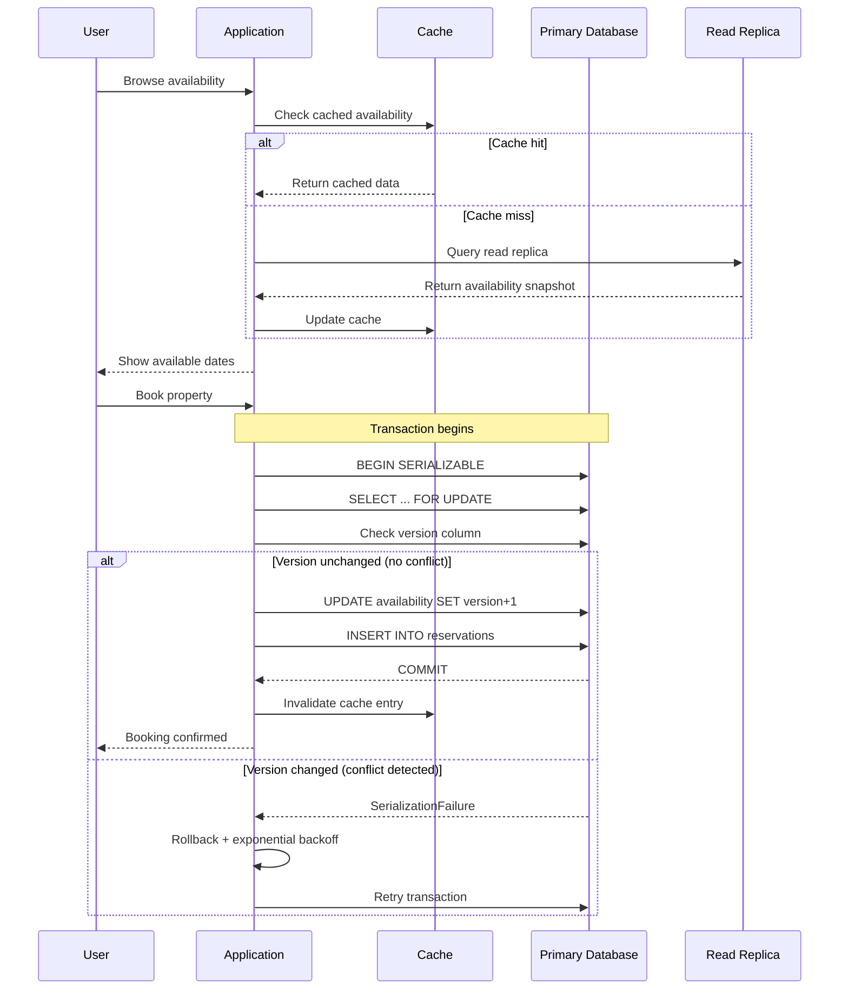

| Difficulty | Channel | Tags |
|---|---|---|
| intermediate | database | acid, isolation-levels, mvcc |

In November 2022, Ticketmaster faced what every engineer dreads: 14 million concurrent users generating 3.5 billion system requests to buy Taylor Swift tickets [1]. The queue buckled under 4x the previous peak load — 2-to-8-hour wait times, passcode validation failures, and carts vanishing at checkout. But here is what most post-mortems gloss over: behind the chaos, the most critical database operation — atomic seat assignment — worked flawlessly. Zero double-bookings occurred across 2 million tickets sold in a single day. This is the story of how database transactions handle impossible demand, and why your booking system needs the same rigor.

---

> ### Real-World Case — Ticketmaster
>
> In November 2022, 14 million concurrent users and bot networks generated 3.5 billion system requests (4x previous peak) during the Taylor Swift Eras Tour presale. The unprecedented demand triggered widespread system failures, Congressional hearings, and became the most famous booking-system incident in history.
>
> | | |
> |---|---|
> | **Challenge** | Preventing double-booking of specific seats while handling 14M+ concurrent users competing for 2.4M tickets, with sophisticated bot networks attempting to scalp inventory at 10x face value and a 15% error rate across interactions. |
> | **Solution** | Multi-layered concurrency control: Redis distributed locks (SET NX EX) for sub-millisecond auto-expiring seat holds during checkout, PostgreSQL UNIQUE INDEX constraints as the hard correctness backstop, version columns (fencing tokens) on confirm path to atomically prevent double-sales, a virtual waiting room via Redis sorted sets metering traffic into the booking service at controlled rates, and Verified Fan pre-registration to weed out bots before they reached inventory. |
> | **Outcome** | 2 million tickets sold in a single day (most ever for one artist) with zero reported double-bookings at the seat level. However, the queue and bot-detection layers buckled under 3.5B requests, causing 2-8 hour wait times and passcode validation errors that cost fans carted tickets. 15% of interactions experienced issues. |
> | **Lesson** | Multiple defensive layers are non-negotiable: Redis locks provide fast seat holds, but PostgreSQL unique constraints are the ultimate correctness guarantee. The queue layer must scale independently — it became the bottleneck even though the booking layer's concurrency control worked. Never cache seat availability; every layer must be load-tested at realistic geo-distributed scale with bot traffic accounted for. |

---

## Hook — The $3.5 Billion Question

There are two kinds of system failures. The ones caused by bugs, and the ones caused by success. Ticketmaster's November 2022 presale falls squarely in the latter category. When 14 million fans and an army of bot networks showed up simultaneously, the system ingested 3.5 billion requests — enough to make most engineering teams collectively sweat through their shirts [1]. The queue software failed. Bot detection failed. Passcode validation failed. But the one thing that absolutely could not fail — ensuring no two people ever reserved the same seat — held the line. How? The answer reveals something counterintuitive about distributed systems: sometimes the strongest guarantees come from the simplest places, and the best defense is not a better queue, but a better transaction.

## Problem — The Double-Booking Nightmare

Every booking system faces a fundamental tension. You want maximum availability — let everyone browse inventory freely without locks or delays. But you also need rock-solid guarantees — no two people ever reserve the same item. These goals pull in opposite directions, and the gap between them is where bugs breed.

The naive approach is straightforward: check availability, then book if free. Between those two operations, however, another transaction can sneak in and claim the same slot. This is the classic "read-modify-write" race condition — the root cause of virtually every double-booking bug ever shipped to production.

You might think database transactions solve this automatically. Many developers do. Here is the plot twist: the default isolation level in most databases — READ COMMITTED — does NOT prevent phantom reads, the exact anomaly that causes double-bookings [2]. Your database is likely letting you down and you probably never noticed. In practice, this means two concurrent bookings can both read "available," both proceed to book, and both commit — leaving you with one seat and two unhappy customers.

## Real-World Case — Ticketmaster's Eras Tour Debacle

Let us dig deeper into what actually happened at Ticketmaster, because the numbers are worth sitting with. The November 2022 Taylor Swift presale generated 3.5 billion system requests — a figure so large it strains credulity. That is 4x their previous peak load. Bot networks accounted for a significant portion of that traffic, probing every endpoint for weaknesses [1].

The cascade started at the queue layer. It collapsed under the weight, letting through far more traffic than intended. Then the bot detection software failed, unable to distinguish automated scripts from desperate Swifties. Passcode validation developed errors, and customers who had waited hours watched tickets evaporate from their carts at the final click. 15% of all interactions experienced errors. The incident was severe enough to trigger Congressional hearings and a PR crisis that dominated headlines for weeks.

Yet here is the remarkable, underreported truth: at the seat level, zero double-bookings occurred. Two million tickets sold — the most ever for a single artist — and every single one was uniquely assigned to one person. The queue failed. The bots won the first battle. But the transactional layer never blinked. The lesson is profound: invest in your foundational data guarantees, because everything else can fail and you can recover. Double-book a seat, and you cannot.

## Deep Dive — SERIALIZABLE Isolation and Optimistic Concurrency Control

This brings us to the technical core of the solution. The industry-standard pattern for preventing booking anomalies combines the SERIALIZABLE isolation level with optimistic concurrency control (OCC). Each piece solves a specific problem, and together they form a defense that can withstand 3.5 billion requests.

SERIALIZABLE is the strictest isolation level in the SQL standard. It guarantees that concurrent transactions produce the same result as if they executed one after another [2]. No dirty reads. No non-repeatable reads. No phantom reads. Applied to a booking system, this means two users booking the same seat cannot both succeed — one will be aborted.

Under the hood, PostgreSQL implements SERIALIZABLE using Serializable Snapshot Isolation (SSI), built on top of MVCC (Multi-Version Concurrency Control) [3]. MVCC maintains multiple versions of each row, allowing readers to see a consistent snapshot without blocking writers, and writers to proceed without blocking readers. When a booking transaction begins, it captures a snapshot — a point-in-time view of all committed data. It checks availability against that snapshot. If the seat appears free, it proceeds. At commit time, SSI checks for conflicts. If another transaction committed a change to overlapping data, one transaction is aborted and must retry [4].

This is the "optimistic" part of OCC. The system assumes conflicts are rare and lets transactions proceed without pessimistic locks. Only at commit time does it validate that the world did not change. This maximizes throughput under normal conditions. You can see the pattern in academic research on concurrency control — OCC consistently outperforms pessimistic locking when contention is below 20% [10].

However, there is a real debate about when to use which strategy. Here are the trade-offs:

| Strategy | Read Performance | Write Contention | Best For |
|----------|-----------------|------------------|----------|
| SERIALIZABLE (SSI) | Excellent | Low-conflict wins | Most booking workloads |
| SELECT FOR UPDATE | Moderate | High (locks rows) | Hot inventory items |
| Advisory Locks | Moderate | Application-managed | Custom partitioning |
| App-level OCC | Best | Worst (abort storms) | Low-contention domains |

The key insight: there is no universally correct answer. For a vacation rental with a few bookings per day, full SERIALIZABLE with OCC is ideal. For a Taylor Swift presale where millions fight over the same 50,000 seats, row-level SELECT FOR UPDATE on specific inventory ranges might be necessary to prevent abort storms.

## Workflow — A Booking Transaction, Step by Step

Here is how a properly designed booking transaction flows through the system. Every step has a purpose, and skipping any one creates a vulnerability.

**Step 1 — Cache Check**: The application first reads availability from a distributed cache (Redis or Memcached) for sub-millisecond response. This is a hint, not a guarantee — stale data is acceptable here because the final check happens in the database.

**Step 2 — Read Replica Fallback**: If the cache misses, the system queries a read replica for availability snapshots. Read replicas absorb the heavy browse traffic without loading the primary database [9].

**Step 3 — Transactional Booking**: When the user confirms, the application opens a SERIALIZABLE transaction against the primary database. It reads the availability row with a version column check — this is the optimistic lock.

**Step 4 — Row-Level Validation**: Inside the transaction, the system verifies the version number of the availability row matches what was read earlier. If the version changed, another transaction committed first — the current transaction aborts with a retryable error.

**Step 5 — Commit or Retry**: If validation passes, the transaction updates availability, increments the version, inserts the reservation, and commits. On SerializationFailure, the application retries with exponential backoff and jitter [6].

**Step 6 — Cache Invalidation**: After a successful booking, the cache entry for the affected date range is invalidated, ensuring subsequent reads get fresh data.

The sequence diagram below visualizes this flow, showing how each actor — User, Application, Cache, Primary DB, and Read Replica — interacts throughout the booking lifecycle.

## Code Example — Implementing Optimistic Booking in Python

Let us make this concrete with a Python implementation using PostgreSQL and psycopg2. This function handles the core booking logic with retries, and every line addresses a real failure mode:

```python
import psycopg2
from psycopg2.extras import RealDictCursor
import time
import random

def book_property(conn, property_id, guest_id, check_in, check_out, max_retries=3):
    """
    Book a property using SERIALIZABLE isolation with optimistic locking.
    Retries up to max_retries times on serialization failures.
    """
    for attempt in range(max_retries):
        try:
            with conn.cursor(cursor_factory=RealDictCursor) as cur:
                # Set the strictest isolation level — never rely on defaults
                cur.execute("SET TRANSACTION ISOLATION LEVEL SERIALIZABLE")

                # Read availability with row-level lock and version check
                cur.execute("""
                    SELECT id, available, version
                    FROM availability
                    WHERE property_id = %s
                      AND date >= %s
                      AND date < %s
                    FOR UPDATE
                """, (property_id, check_in, check_out))

                availabilities = cur.fetchall()
                if len(availabilities) == 0:
                    raise ValueError("No availability found for date range")

                # Atomic update — if rowcount doesn't match, conflict detected
                cur.execute("""
                    UPDATE availability
                    SET available = false,
                        version = version + 1,
                        booked_by = %s
                    WHERE property_id = %s
                      AND date >= %s
                      AND date < %s
                      AND available = true
                """, (guest_id, property_id, check_in, check_out))

                if cur.rowcount != len(availabilities):
                    raise Exception("Concurrent booking detected, retrying...")

                # Create the reservation record
                cur.execute("""
                    INSERT INTO reservations
                        (property_id, guest_id, check_in, check_out)
                    VALUES (%s, %s, %s, %s)
                """, (property_id, guest_id, check_in, check_out))

            conn.commit()
            return {"status": "success", "property_id": property_id}

        except psycopg2.errors.SerializationFailure:
            conn.rollback()
            if attempt == max_retries - 1:
                raise
            # Exponential backoff with random jitter prevents thundering herd
            wait = (2 ** attempt) + random.random()
            time.sleep(wait)
```

Three design decisions worth highlighting. First, `SET TRANSACTION ISOLATION LEVEL SERIALIZABLE` is set explicitly inside the transaction — never rely on defaults for critical paths [2]. Second, the `FOR UPDATE` clause creates a clear ordering of concurrent operations, preventing the lost update problem even under SSI. Third, exponential backoff with jitter — `(2^attempt) + random()` — prevents the thundering herd problem where all retrying clients hit the database simultaneously [6]. The random jitter breaks synchronization, distributing retries across a time window instead of clustering them at fixed intervals.

## Lessons Learned — Key Takeaways for Your Systems

You might think this only applies to companies the size of Ticketmaster. The truth is more uncomfortable: the same patterns apply whether you are selling 50,000 concert seats or managing a 10-unit vacation rental. The difference is that at scale, the edge cases become the main event.

**1. Isolation levels are not optional.** Default configuration is not production configuration. PostgreSQL defaults to READ COMMITTED, which permits phantom reads [2]. If your booking logic runs at that level, you have a double-booking bug waiting to happen. The change is one line of SQL, but the impact is the difference between a working system and a congressional hearing.

**2. Optimistic versus pessimistic is a business decision.** SERIALIZABLE with optimistic concurrency is ideal for low-to-medium contention. But for hot inventory — the Taylor Swift equivalent in your domain — SELECT FOR UPDATE or application-level partitioning is necessary to avoid abort storms where every transaction fails and retries simultaneously [10]. Monitor your serialization failure rate. If it exceeds 5%, switch strategies.

**3. Layered defenses win.** Ticketmaster's queue failed. The bot detection failed. But the transaction layer held. Take the same approach: cache for performance, use read replicas for scale, implement circuit breakers for hot properties [7], and design every layer as if the one above it will fail. Never trust a cache with correctness.

**4. Test the failure path.** Every developer tests the happy path. Few test what happens when 1,000 concurrent users fight over the same item. Use chaos engineering tools to simulate serialization failures and verify your retry logic handles them gracefully. Your first abort storm should not happen in production.

---

## Booking Transaction Flow with Optimistic Concurrency Control



<details>
<summary><strong>Original Interview Question</strong></summary>

**Q:** You're building a booking system for Airbnb where multiple users can reserve the same property simultaneously. How would you design the transaction handling to prevent double bookings while maintaining high availability?

**A:** Use SERIALIZABLE isolation with optimistic concurrency control. Implement row-level locks on property availability tables, use MVCC snapshot reads for checking availability, and apply application-level validation to ensure atomic booking operations.

</details>

## Conclusion

The Ticketmaster story teaches something deeper than any technical pattern. When the database is the last line of defense, every decision about isolation levels, locking strategies, and retry logic becomes a commitment to your users. The system can survive a broken queue, angry tweets, and even Congressional hearings — but it cannot survive a double-booking. Next time you reach for default transaction settings, remember: 14 million people were counting on Ticketmaster's database. Someone is counting on yours. Audit your isolation levels, test your retry logic, and never let the default configuration be your production configuration.

---

## References

1. [Ticketmaster press release — Taylor Swift Eras Tour on-sale explained](https://business.ticketmaster.com/press-release/taylor-swift-the-eras-tour-onsale-explained/) — article
2. [PostgreSQL documentation — Transaction Isolation](https://www.postgresql.org/docs/current/transaction-iso.html) — documentation
3. [Wikipedia — Multiversion Concurrency Control](https://en.wikipedia.org/wiki/Multiversion_concurrency_control) — paper
4. [Wikipedia — ACID database properties](https://en.wikipedia.org/wiki/ACID) — paper
5. [PostgreSQL documentation — SELECT FOR UPDATE](https://www.postgresql.org/docs/current/sql-select.html#SQL-FOR-UPDATE-SHARE) — documentation
6. [AWS Architecture Blog — Exponential Backoff and Jitter](https://aws.amazon.com/blogs/architecture/exponential-backoff-and-jitter/) — blog
7. [Martin Fowler — CircuitBreaker pattern](https://martinfowler.com/bliki/CircuitBreaker.html) — blog
8. [Martin Fowler — Optimistic Offline Lock pattern](https://martinfowler.com/eaaCatalog/optimisticOfflineLock.html) — blog
9. [AWS Documentation — Working with Read Replicas](https://docs.aws.amazon.com/AmazonRDS/latest/UserGuide/USER_ReadRepl.html) — documentation
10. [ArXiv — A Survey of Optimistic Concurrency Control Protocols](https://arxiv.org/abs/2004.02584) — paper

---

**Author:** Satishkumar Dhule — [GitHub](https://github.com/satishkumar-dhule) · [LinkedIn](https://linkedin.com/in/satishkumar-dhule) · [Website](https://satishkumar-dhule.github.io)
