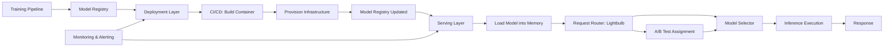

| Difficulty | Channel | Tags |
|---|---|---|
| beginner | devops | mlops, deployment |

Netflix's ML infrastructure was growing so fast that their model serving platform started buckling under the weight of personalization, payments, studio production, search, and ads — all competing for the same routing layer. Off-the-shelf solutions like AWS API Gateway weren't built for ML-specific needs like context-aware routing or A/B experimentation where a single user could be in 10+ tests simultaneously [1]. This is the story of how they evolved from Switchboard to Lightbulb, and what every developer building ML systems needs to understand about the difference between deployment and serving.

---

> ### Real-World Case — Netflix
>
> As Netflix's ML usage exploded across personalization, payments, studio production, search, and ads, their ML model serving infrastructure couldn't keep pace. Off-the-shelf solutions like AWS API Gateway and generic service mesh proxies weren't designed for ML-specific needs: context-aware routing, A/B experimentation where a single user could be in 10+ tests simultaneously, shadow testing, canary deployments, and sub-second rollback of broken model versions.
>
> | | |
> |---|---|
> | **Challenge** | Handle 1M+ requests per second across hundreds of model types/versions while enabling researchers to rapidly experiment and safely release new models. Client services like Homepage should not need to know which ranking model version they're talking to. Generic HTTP routing solutions (API Gateway, Envoy) lacked first-class support for experiment integration, model lifecycle stages (shadow, canary, rollback), and domain-specific routing context. |
> | **Solution** | Netflix built a centralized ML serving platform with a custom routing layer called Switchboard, creating a domain-independent API abstraction that cleanly separates serving concerns (runtime request routing, model selection, A/B traffic splitting, shadow mode, canary deployments) from deployment concerns (CI/CD, model training, infrastructure provisioning). They later evolved this into Lightbulb, splitting routing and model selection into separate components with JSON-based declarative configuration, after discovering Switchboard's centralized architecture introduced 10-20ms latency and became a single point of failure. |
> | **Outcome** | The centralized platform handles 1 million requests per second at peak, serving hundreds of model types across multiple business domains (personalization, payments, studio, ads). The evolution from Switchboard to Lightbulb demonstrated that separating request routing from model selection reduced operational complexity and improved resilience while maintaining the same throughput. The declarative JSON-based routing configuration proved more auditable and debuggable than the original JavaScript-based approach. |
> | **Lesson** | Model serving and model deployment require fundamentally different infrastructure. Off-the-shelf HTTP routing solutions are not sufficient for ML serving at scale — you need context-aware routing, native experiment integration, and model lifecycle management (shadow, canary, rollback). However, centralizing all serving logic into a single proxy layer also introduces latency and SPOF risks, which Netflix solved by splitting routing and model selection into separate components. The right architecture treats the serving layer as a first-class systems design problem, not just an API gateway configuration. |

---

## Hook — The Hidden War Inside Your ML Pipeline

You have trained a model. Accuracy looks great. You push it to production and... nothing breaks. But users are getting stale recommendations, the API is timing out under load, and rolling back to the previous version takes 20 minutes. Sound familiar? Many teams conflate model deployment with model serving — treating them as the same problem. They are not. Deployment is about getting the model into production. Serving is about keeping it alive, fast, and correct under fire. Netflix learned this lesson the hard way when their centralized model serving platform had to handle over 1 million requests per second across hundreds of model types [1]. The difference between deployment and serving is the difference between building a house and keeping the lights on during a hurricane.

## Problem — When Your Model Is Live But Not Really Alive

Here is the uncomfortable truth: most ML infrastructure conversations focus on training pipelines, feature stores, and CI/CD. But the serving layer — where the model actually interacts with users — gets relegated to a second thought. You might have the world's best recommendation model, but if it takes 800 milliseconds to respond, users have already left. The core challenge is that deployment and serving optimize for fundamentally different things. Deployment optimizes for reproducibility, audit trails, and infrastructure consistency. Serving optimizes for latency, throughput, memory efficiency, and graceful degradation. When you blur these boundaries, you end up with a Kubernetes cluster running inference workloads that were designed for batch jobs, or worse, a monolithic serving layer where one broken model version brings down every other model [2]. Understanding the separation is not academic — it determines whether your system survives production.

## Real-World Case — Netflix's Switchboard to Lightbulb Evolution

Netflix's ML serving platform originally used a system called Switchboard — built on a JavaScript-based routing configuration that handled everything from model selection to request routing to A/B experimentation. As Netflix's business domains grew (personalization, payments, studio production, search, ads), Switchboard became a bottleneck. A single buggy routing script could cascade across multiple model types. Adding new routing logic required understanding the entire system. The breaking point came when the platform had to support simultaneous A/B tests — a single user could belong to 10+ experiments at once, and each experiment required different routing rules [1]. Netflix's solution was to split the monolithic routing layer into two components: request routing (getting the request to the right model server) and model selection (which model version should handle this request). This became the Lightbulb architecture. The declarative JSON-based routing configuration proved more auditable and debuggable than the original JavaScript approach. The result? The centralized platform now handles 1 million requests per second at peak, spanning hundreds of model types across multiple business domains, with sub-second rollback of broken model versions [1]. The insight was counterintuitive: adding complexity to the architecture (by splitting routing into two layers) actually reduced operational complexity.

## Deep Dive — Deployment vs. Serving: The Real Trade-offs

| Aspect | Deployment | Serving |
|--------|------------|--------|
| Primary Concern | Infrastructure reproducibility | Inference latency & throughput |
| Key Tools | Kubernetes, Terraform, MLflow | TensorFlow Serving, TorchServe, BentoML |
| Failure Mode | Model not available | Model slow or incorrect |
| Scaling Strategy | Horizontal (add pods) | Vertical (GPU memory) + batch optimization |
| Rollback Strategy | Container image rollback | Traffic shifting between model versions |

🔥 **Hot Take**: If your team is using Kubernetes HPA (Horizontal Pod Autoscaler) as your primary serving scaling strategy, you are treating ML inference like a stateless web server. It is not. GPU memory allocation, model loading time, and batch optimization matter far more than pod count.

## Workflow — The Request Lifecycle From Training to Inference

You can visualize the separation between deployment and serving as a pipeline with distinct phases. The flow starts with model training and ends with a user receiving a prediction. The Mermaid diagram below shows how deployment and serving interact without overlapping. The key insight is the handoff point: the model registry. Deployment pushes artifacts into the registry. Serving pulls artifacts from the registry. They never touch each other's infrastructure directly. This decoupling is what allows Netflix to roll back a model version in under a second — because the serving layer already has the old version cached, it just needs to switch traffic [1].



⚠️ **Watch Out**: The most common mistake is making the serving layer depend on the deployment pipeline. If your model server needs to rebuild a container every time a new version is pushed, you have coupled them. Netflix's Lightbulb architecture avoids this by loading model versions into memory at runtime, not at container build time.

## Code Example — A Production-Ready Model Serving Pattern

Let us walk through a realistic serving setup using FastAPI with BentoML. This pattern handles model loading, request routing, and graceful degradation — all concerns that belong in the serving layer, not the deployment layer.

```python
import bentoml
import numpy as np
from fastapi import FastAPI, HTTPException
from pydantic import BaseModel
import prometheus_client
from typing import List, Optional
import time

# Prometheus metrics for serving observability
INFERENCE_LATENCY = prometheus_client.Histogram(
    'model_inference_latency_seconds', 
    'Time per inference request',
    ['model_name', 'model_version']
)
MODEL_ERRORS = prometheus_client.Counter(
    'model_inference_errors_total',
    'Total inference errors',
    ['model_name', 'error_type']
)

class InferenceRequest(BaseModel):
    features: List[float]
    request_id: Optional[str] = None

class ModelRouter:
    """
    Lightweight model selector — inspired by Netflix's approach of separating
    request routing from model selection.
    """
    def __init__(self):
        self.models = {}  # model_name -> loaded runner
        self.active_versions = {}  # model_name -> version string

    def load_model(self, model_name: str, version: str):
        runner = bentoml.sklearn.get(f"{model_name}:{version}").to_runner()
        runner.init_local()  # Load model into memory
        self.models[model_name] = runner
        self.active_versions[model_name] = version

    def predict(self, model_name: str, features: np.ndarray):
        if model_name not in self.models:
            MODEL_ERRORS.labels(
                model_name=model_name, 
                error_type="model_not_found"
            ).inc()
            raise HTTPException(status_code=404, detail="Model not loaded")
        
        start = time.time()
        try:
            result = self.models[model_name].run(features)
            latency = time.time() - start
            INFERENCE_LATENCY.labels(
                model_name=model_name,
                model_version=self.active_versions.get(model_name, "unknown")
            ).observe(latency)
            return result
        except Exception as e:
            MODEL_ERRORS.labels(
                model_name=model_name, 
                error_type="inference_failure"
            ).inc()
            raise HTTPException(status_code=500, detail=str(e))

router = ModelRouter()
app = FastAPI()

@app.post("/predict/{model_name}")
async def predict(model_name: str, request: InferenceRequest):
    features = np.array(request.features).reshape(1, -1)
    prediction = router.predict(model_name, features)
    return {"prediction": prediction.tolist(), "model": model_name}

@app.on_event("startup")
async def startup():
    # Models are loaded at startup from registry — not baked into container
    router.load_model("recommendation-v2", "production")
    router.load_model("fraud-detection", "canary")
```

**Explanation**: This pattern demonstrates three serving principles. First, models are loaded at runtime from a registry, not baked into the container image — this decouples deployment from serving. Second, Prometheus metrics track latency and errors per model name and version, enabling the observability Netflix depended on for sub-second rollback decisions. Third, the `ModelRouter` class separates the concerns of routing (which model endpoint was called) from execution (running inference). If a model version needs rollback, you simply load the previous version — no container rebuild, no redeployment. The deployment layer handled getting the artifact into the registry; the serving layer handles runtime decisions.

## Lessons Learned — What to Do Differently Tomorrow

Netflix's evolution from Switchboard to Lightbulb teaches several lessons that apply whether you are serving one model or one hundred. First, separate request routing from model selection. These are different concerns with different failure modes. A routing layer should be dumb but fast — it gets requests to the right model server. A model selection layer should be smart but focused — it decides which version handles this specific request. Second, make rollback a serving concern, not a deployment concern. If rolling back a model version requires rebuilding a container or re-running a deployment pipeline, your rollback window is measured in minutes, not seconds [1]. Third, invest in serving observability from day one. Latency histograms, error counters, and model version labels are not nice-to-haves — they are how you detect that a canary deployment is returning garbage predictions before it affects all users [6]. Fourth, batch inference is not a silver bullet. While batching improves GPU utilization, it increases latency for individual requests. Know your SLOs before choosing the strategy [7]. The bottom line: deployment gets your model to the starting line. Serving is the race. Build your architecture accordingly.

---

## Model Serving Architecture Flow


<details>
<summary><strong>Original Interview Question</strong></summary>

**Q:** Explain the key differences between model serving and model deployment in ML systems, including specific technologies, scaling considerations, and real-world implementation patterns?

**A:** Deployment encompasses CI/CD pipelines, infrastructure setup, and monitoring using tools like Kubernetes, MLflow, and SageMaker. Serving focuses on runtime inference APIs with frameworks like TensorFlow Serving, TorchServe, or BentoML, handling request routing, model versioning, and autoscaling. Key trade-offs include latency vs throughput, batch vs real-time inference, and cold start optimization.

</details>

## Conclusion

Deployment gets your model to the starting line. Serving is the race. Netflix's journey from a monolithic routing layer to a decoupled architecture proves that investing in the serving layer — with proper observability, runtime model loading, and separate routing concerns — is what separates hobby projects from production systems. Start by adding latency histograms to your model endpoints. Then separate your routing logic from your model selection. By next quarter, you will never think about deployment and serving the same way again.

---

## References

1. [Netflix Tech Blog: State of Routing in Model Serving](https://netflixtechblog.com/state-of-routing-in-model-serving-16e22fe18741) — blog
2. [Kubernetes Documentation: Concepts](https://kubernetes.io/docs/concepts/) — documentation
3. [MLflow Documentation](https://mlflow.org/docs/latest/index.html) — documentation
4. [TensorFlow Serving Guide](https://www.tensorflow.org/tfx/guide/serving) — documentation
5. [AWS SageMaker: Deploy Models for Inference](https://docs.aws.amazon.com/sagemaker/latest/dg/deploy-model.html) — documentation
6. [Prometheus Documentation: Metrics Types](https://prometheus.io/docs/concepts/metric_types/) — documentation
7. [gRPC Documentation: Performance Best Practices](https://grpc.io/docs/guides/performance/) — documentation
8. [FastAPI Documentation: Deployment](https://fastapi.tiangolo.com/deployment/) — documentation
9. [Docker Documentation: Get Started](https://docs.docker.com/get-started/) — documentation
10. [GitHub Actions Documentation: Workflow Syntax](https://docs.github.com/en/actions/using-workflows/workflow-syntax-for-github-actions) — documentation

---

**Author:** Satishkumar Dhule — [GitHub](https://github.com/satishkumar-dhule) · [LinkedIn](https://linkedin.com/in/satishkumar-dhule) · [Website](https://satishkumar-dhule.github.io)
