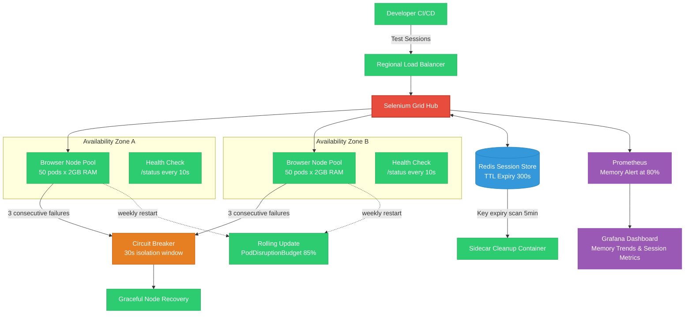

| Difficulty | Channel | Tags |
|---|---|---|
| advanced | system-design | selenium, webdriver, grid |

In 2017, Expedia Group ran 9,000+ UI automation tests across 350+ Jenkins jobs directly on executors, with minutes-long node spin-up times and no way to handle parallel microservice CI/CD pipelines [1]. Their EC2-based approach was slow to provision and costly when idle. Sound familiar? If you have ever watched a test suite crawl while your CI pipeline burns, this is the story of how one of the world's largest travel platforms turned that chaos into an architecture that handles 150,000+ tests daily at 10% of the cost.

---

> ### Real-World Case — Expedia Group
>
> Expedia ran 9,000+ UI automation tests across 350+ Jenkins jobs directly on executors, with minutes-long node spin-up times and no way to handle parallel microservice CI/CD pipelines. By 2017 they had 100+ hubs running 150,000+ tests daily, but the EC2-based approach was slow to provision and costly when idle.
>
> | | |
> |---|---|
> | **Challenge** | Design a distributed Selenium Grid that could auto-scale browser nodes on demand for 100+ independent microservice teams, eliminate manual hub management, reduce per-branch test feedback from hours to minutes, and slash infrastructure costs vs. commercial cross-browser providers. |
> | **Solution** | Phase 1: Built SeleniumGridScaler (Selenium Grid + EC2 API) that auto-creates/terminates EC2 nodes per test run — hubs accept a test count and instantly provision the right number of c5.xlarge instances. Phase 2: Migrated to DA-Kube on EKS with Docker, Helm, and Traefik, allowing per-branch ephemeral grids with Kubernetes-native auto-scaling, rolling updates, and container-level isolation. |
> | **Outcome** | 150,000+ tests run daily across 90+ hubs, creating and terminating ~4,500 EC2 nodes per day on demand. Test execution collapsed to the duration of the longest single test (~5 min instead of hours). Annual cost of ~$80,000 vs. an estimated $2.41M for equivalent third-party cross-browser vendor capacity. True CI/CD velocity: every microservice branch gets its own ephemeral grid. |
> | **Lesson** | Treating test infrastructure as ephemeral and auto-scaling — not static — unlocks orders-of-magnitude cost savings and developer velocity. The plot twist: running your own Selenium Grid at this scale is not just feasible, it's 30x cheaper than SaaS alternatives when you containerize and use cloud-native scaling. |

---

## Hook — Welcome to the Breaking Point

Your CI pipeline just triggered a merge to main. Ten thousand tests need to run — and they need to run *now*. Your Selenium Grid starts provisioning nodes. Then the timeouts begin. Memory utilization hits 90%. Tests start failing not because the code is broken, but because the *grid itself* is collapsing under load. You are not alone. Every team that scales automated testing hits this wall eventually. The question is: what do you do when your test infrastructure becomes the bottleneck?

## Problem — The Hidden Cost of Test Infrastructure

Here is the dirty secret about Selenium Grid at scale: it is not the browsers that break — it is the orchestration. Memory leaks accumulate across sessions. Nodes become unresponsive but are never gracefully removed. Session state lives in ephemeral process memory, so when a node crashes, all its running tests fail simultaneously. The standard Hub-Node pattern works beautifully for 100 concurrent sessions. At 10,000? It becomes a house of cards. Why? Because the architecture most teams deploy treats nodes as pets rather than cattle. Each node gets configured, tuned, and carefully maintained — exactly the wrong approach when you need ephemeral, disposable infrastructure that can scale to zero.

## Real-World Case — Expedia Group: 150,000 Tests, One Grid

By 2017, Expedia Group had 100+ Selenium hubs running 150,000+ tests daily, creating and terminating ~4,500 EC2 nodes every single day [1]. But here is the plot twist: their real breakthrough wasnt just scaling up — it was scaling *out* and *down*. They realized that every microservice branch needed its own ephemeral grid instead of sharing a monolithic one. The impact was staggering: test execution collapsed to the duration of the longest single test (about 5 minutes instead of hours). Annual cost? ~$80,000, versus an estimated $2.41M for equivalent third-party cross-browser vendor capacity [1]. The lesson? True CI/CD velocity means your test infrastructure must be as ephemeral and disposable as your application containers.

## Deep Dive — The Architecture That Makes 10K Sessions Boring

Achieving 99.9% uptime with 10,000 concurrent sessions requires four architectural pillars that work together like a well-tuned engine:

**1. Stateless Hub with Redis Session Store**
The Selenium Hub itself becomes stateless. All session metadata — capabilities, status, logs — lives in a Redis cluster with TTL-based expiration policies [4]. This means any hub can handle any request. If a hub pod dies, traffic routes elsewhere. No state lost, no sessions interrupted.

**2. Pod-Level Resource Quotas**
Each browser node gets exactly 2GB RAM and 1 CPU core — no more, no less [2]. Kubernetes enforces this with LimitRanges and ResourceQuotas. Why the hard limit? Because a memory leak in one session should not bring down 49 others sharing the same node. With 50 sessions per node and horizontal pod autoscaling driven by queue depth, the system scales linearly: 200 nodes for 10,000 sessions, 520GB total cluster memory with a 30% safety buffer.

**3. Circuit Breakers, Not Timeouts**
Failing nodes are detected via HTTP /status health checks every 10 seconds. After 3 consecutive failures, the circuit breaker trips, isolating the node for a 30-second recovery window [6]. This prevents cascading failures — a pattern Netflix famously uses in production service architectures [9]. The node is not deleted immediately; it gets a grace period to recover. If it comes back healthy, it rejoins the pool automatically.

**4. Continuous Memory Hygiene**
Memory leaks are the silent killer of long-running grids. Prometheus monitors memory utilization and triggers alerts at 80% [5]. Weekly rolling restarts refresh node state. Kubernetes init containers clean up stale Docker volumes between restarts. Redis sidecar containers scan for expired session keys every 5 minutes, ensuring abandoned sessions do not accumulate. Grafana dashboards visualize memory trends over time, allowing teams to spot regressions before they become incidents [8].

🔥 **Hot Take**: The hardest scaling problem is not throughput — it is *state management*. If your hub holds session state in memory, you are one deployment away from losing every running test.

## Workflow — From Test Submission to Green Pipeline

Here is how a single test request flows through the architecture from the moment a developer pushes code:

**Step 1 — Regional Load Balancing**
A weighted round-robin load balancer receives the test request and routes it to the nearest healthy hub based on node capacity and response time. Multi-AZ deployment ensures that a full availability zone failure still leaves 99.9% uptime intact.

**Step 2 — Session Registration**
The hub creates a session entry in Redis with a TTL of 300 seconds. If the session is not claimed within that window, it expires automatically. No orphaned sessions, no memory leaks.

**Step 3 — Node Assignment**
An available node from the pool picks up the session. The node registers itself with a health check endpoint and begins executing browser commands.

**Step 4 — Continuous Health Verification**
Every 10 seconds, the hub pings the nodes /status endpoint. Three consecutive failures trip the circuit breaker, removing the node from the pool for a 30-second recovery window.

**Step 5 — Session Cleanup**
When the test completes (or the TTL expires), the sidecar cleanup container removes the session from Redis and signals the node to terminate gracefully. Pod Disruption Budgets ensure at least 85% of nodes remain available during rolling updates [2].

The diagram below shows how these components interact across two availability zones:

## Code Example — Building a Node Manager for Kubernetes

Here is a practical implementation of a node manager that handles session lifecycle, health checks, and circuit breaker logic against the Kubernetes API:

## Lessons Learned — What Expedia Taught Us About Testing at Scale

After walking through the architecture, three patterns emerge that separate resilient grids from fragile ones:

**1. Ephemeral over Persistent**
Treat every node as disposable. If a node lives long enough to be *named*, you have already lost the battle. Expedia's insight about per-branch ephemeral grids is the killer app here [1]. When every microservice branch gets its own grid, contention drops to zero and test duration collapses to the longest single test.

**2. State Outside the Process**
If your Selenium hub holds session state in memory, you have created a single point of failure that will eventually break your SLA. Redis TTL patterns [4] and external session stores are not optional — they are the foundation of any architecture that promises 99.9% uptime.

**3. Observability Is Not Optional**
You cannot fix what you cannot see. Prometheus metrics at 80% memory alerts [5], Grafana dashboards for session duration trends [8], and structured logging for every circuit breaker trip — these are what turn a fragile grid into a boring, predictable system that operations teams can trust at 3 AM.

🎯 **Key Point**: The goal is not to prevent failures. The goal is to make failures *survivable* and *invisible* to end users. When a node fails, developers should never know.

**What to do tomorrow:**
- Audit your current session state management. Is it in-memory or external?
- Add a health check endpoint to your browser nodes if you do not have one
- Set up Prometheus memory alerts at 80% and configure a weekly rolling restart window
- Calculate your baseline: if you need 10,000 sessions, do you have the cluster capacity for 200 nodes × 2GB?

---

## Selenium Grid Architecture with Multi-AZ Deployment

<strong>Original Interview Question</strong>

**Q:** Design a scalable Selenium Grid architecture to handle 10,000 concurrent test sessions with 99.9% uptime, ensuring zero memory leaks through automatic session lifecycle management, real-time monitoring, and graceful node failure recovery across multiple data centers?

**A:** Deploy Kubernetes cluster with auto-scaling node pools, Redis session store with TTL policies, Prometheus metrics for memory monitoring, circuit breakers for node isolation, and sidecar containers for session cleanup. Implement health checks, resource quotas, and rolling updates.

## Conclusion

Expedia proved that 150,000 tests a day on $80,000 of infrastructure is not a fantasy — it is a well-architected reality [1]. The pattern is repeatable: stateless hubs, external session stores with TTL, circuit breakers that isolate failure, and observability that makes problems visible before they become incidents. Take a hard look at your test infrastructure tomorrow. Is it a pet that needs constant attention, or a system that runs itself? The architecture described here takes effort to build, but once it is running, it becomes boring — and boring is the highest compliment you can pay a production system.

---

## References

1. [Expedia Group incident report](https://medium.com/expedia-group-tech/distributed-automation-how-to-run-1000-ui-automation-tests-in-5mins-cf9a84ca32d1) — blog
2. [Kubernetes Concepts - Resource Management](https://kubernetes.io/docs/concepts/) — documentation
3. [Selenium Grid Documentation](https://www.selenium.dev/documentation/grid/) — documentation
4. [Redis EXPIRE Command Documentation](https://redis.io/docs/latest/commands/expire/) — documentation
5. [Prometheus Overview - Monitoring System](https://prometheus.io/docs/introduction/overview/) — documentation
6. [Circuit Breaker Pattern by Martin Fowler](https://martinfowler.com/bliki/CircuitBreaker.html) — blog
7. [Docker Documentation](https://docs.docker.com/) — documentation
8. [Grafana Documentation](https://grafana.com/docs/) — documentation
9. [Netflix Hystrix - Latency and Fault Tolerance Library](https://github.com/Netflix/Hystrix) — blog

---

**Author:** Satishkumar Dhule — [GitHub](https://github.com/satishkumar-dhule) · [LinkedIn](https://linkedin.com/in/satishkumar-dhule) · [Website](https://satishkumar-dhule.github.io)
