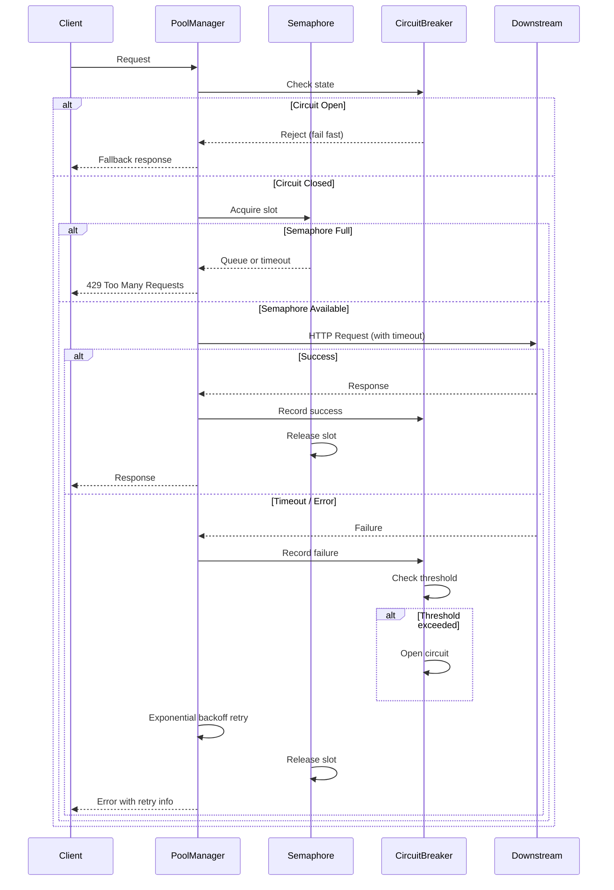

| Difficulty | Channel | Tags |
|---|---|---|
| advanced | backend | asyncio, aiohttp, concurrency |

In 2011, Netflix's API team was fighting a losing battle. Every time a single downstream service slowed down — user profiles, recommendations, you name it — the entire API collapsed like a house of cards. Tomcat thread pools would saturate in seconds, server resources would vanish, and millions of streaming customers would stare at loading spinners [1]. The root cause? Not a lack of servers, not bad code — but the absence of something deceptively simple: a connection pool that knew when to say no. This is the story of how Netflix built Hystrix, and how you can apply the same principles to your own async Python services.

---

> ### Real-World Case — Netflix
>
> By 2011, Netflix's API team was grappling with cascading failures across their growing microservice architecture. A single slow or failing downstream dependency (e.g., user profile service, recommendations engine) could block Tomcat thread pools, saturate all server resources in seconds, and take down the entire API — even when all other dependencies were healthy.
>
> | | |
> |---|---|
> | **Challenge** | With dozens of service dependencies, each with 99.99% uptime, math showed Netflix would still see 3,000,000 failures per billion requests and 2+ hours of downtime per month from cascading failures alone. A single latent dependency would exhaust thread pools across all servers, causing system-wide outages that could not be prevented by simple retries or timeouts. |
> | **Solution** | Netflix built Hystrix, a resilience library that wraps every external service call in a HystrixCommand with: (1) per-dependency thread pools and semaphores for bulkhead isolation, (2) configurable timeouts set just above the 99.5th percentile latency, (3) a circuit breaker that trips when failure rate exceeds 50% in a 10-second rolling window, (4) fallback logic for graceful degradation (e.g., cached data or empty responses), and (5) near real-time metrics for monitoring circuit health. |
> | **Outcome** | Hystrix now handles tens of billions of thread-isolated calls and hundreds of billions of semaphore-isolated calls daily at Netflix. It achieved dramatic improvements in uptime and resilience — turning what was a recurring production nightmare into a solved problem. The library was open-sourced in 2012 and became the industry-standard circuit breaker implementation, inspiring resilience4j, Spring Cloud Circuit Breaker, and similar patterns across the industry. |
> | **Lesson** | The counterintuitive insight: even when every individual dependency has excellent uptime (99.99%), the aggregate risk in a distributed system is catastrophic unless you engineer for failure. The solution isn't faster recovery — it's failing fast with circuit breakers and bulkheads so that one slow dependency can't exhaust shared resources. A circuit breaker that only counts hard failures (not latency degradation) is not protecting you. |

---

## Hook — The 3 AM Pager That Changed Everything

It starts the same way every time. Your pager goes off at 3 AM. A downstream API is responding slowly — maybe 2 seconds instead of 200ms. No big deal, right? Wrong. That slight delay cascades. Your connection pool fills up with pending requests. New requests queue up. Memory climbs. Threads block. Before you know it, your entire service is unresponsive. The ironic part? The failing service recovers in 30 seconds, but your service stays down for 30 minutes because you never built a mechanism to gracefully degrade. Sound familiar? You are not alone.

## Problem — The Hidden Danger of Unlimited Optimism

Most connection pools are built on an implicit assumption: the downstream service will respond. Fast. Every time. This assumption works beautifully — until it does not. The problem is that standard connection pools are infinite optimists. They keep handing out connections, keep retrying, keep hoping the remote service will come back. Meanwhile, your own service's resources are finite. Every connection consumes a file descriptor, a chunk of memory, and a slice of your event loop's attention. When the pool saturates, you face a grim choice: queue requests (increasing latency for everyone) or reject them (dropping requests that could have succeeded). The core challenge is implementing graceful degradation — detecting when downstream services are struggling and adjusting your behavior accordingly, without requiring human intervention at 3 AM.

## Real-World Case — Netflix and the Birth of Hystrix

By 2011, Netflix's architecture had grown from a monolithic DVD-rental site to a sprawling microservice ecosystem serving millions of streaming subscribers. The API team faced a recurring nightmare: a single slow dependency could cascade into a full-system outage [1]. Their solution became Hystrix, a latency and fault-tolerance library designed around one key insight — it is better to fail fast and degrade gracefully than to crash completely. Hystrix introduced thread-pool isolation (each dependency gets its own thread pool, so one cannot steal resources from another) and circuit breakers (when failure rates cross a threshold, the circuit "trips" and all subsequent requests fail immediately instead of waiting). Today, Hystrix handles tens of billions of thread-isolated calls and hundreds of billions of semaphore-isolated calls daily at Netflix [1]. The library was open-sourced in 2012 and became the industry standard, inspiring Resilience4j, Spring Cloud Circuit Breaker, and similar patterns across the industry. The same principles can be applied to async Python services using aiohttp — without needing a dedicated Java library.

## Deep Dive — The Four Pillars of Graceful Degradation

Building on Netflix's approach, four essential patterns form the foundation of a resilient connection pool.

**1. Semaphore-Based Limiting**
A semaphore acts as a bouncer at the door. It caps the number of concurrent connections to a fixed maximum — say 100. Once the limit is reached, new requests either queue or fail fast, rather than silently overloading your system. This is the async equivalent of Netflix's thread-pool isolation [2].

**2. Exponential Backoff**
When a request fails, retrying immediately is pointless — the downstream is still struggling. Exponential backoff doubles the wait time between retries: 1 second, 2 seconds, 4 seconds, 8 seconds. This prevents the "retry storm" that can make things worse [3]. According to AWS's best practices, adding jitter (randomness) to the delay prevents the "thundering herd" problem where all clients retry simultaneously [4].

**3. Circuit Breaker**
The circuit breaker monitors failure rates. After N consecutive failures within a time window, the circuit "opens" and requests fail immediately — no attempt made. After a cooldown period, it transitions to "half-open" and allows a probe request. If it succeeds, the circuit closes. If it fails, it stays open. This prevents wasted resources on a dead service [5].

**4. Health Checks & Connection Pruning**
Idle connections can become stale — TCP connections drop, SSL sessions expire, or intermediate proxies close them silently. Periodic health checks prune dead connections from the pool before a request tries to use them. This is especially critical in long-running services where a connection that worked at startup may be invalid hours later [6].

## Workflow — From Request to Resilient Response

Here is how a resilient connection pool processes a request, step by step:

1. **Request arrives** — The pool checks if a circuit breaker is open for the target service. If open, immediately rejects with a fallback response.
2. **Semaphore check** — If the circuit is closed, the request acquires a semaphore slot. If the pool is saturated, it either queues (with timeout) or fails fast.
3. **Connection acquisition** — The pool checks for a healthy idle connection in the pool, or opens a new one (up to the max limit).
4. **Request execution** — The HTTP request is sent with a strict timeout. If it succeeds, the response is returned and the connection is returned to the pool.
5. **Failure handling** — If the request times out or fails, the circuit breaker records the failure, the connection is discarded (not returned to pool), and an exponential backoff retry is scheduled.
6. **Circuit breaker evaluation** — After each failure, the circuit breaker checks if the threshold has been crossed. If so, it opens the circuit, protecting the pool from further waste.

The sequence diagram below visualizes this entire flow.

## Code Example — Building a Production-Grade Connection Pool Manager

Let's translate the theory into working Python code. This implementation combines semaphore limiting, circuit breaker logic, and exponential backoff into a single ConnectionPoolManager class.

The key design decisions:
- **Semaphore ensures** you never exceed max_connections, even under burst traffic.
- **Circuit breaker state** tracks failure count and timestamps. After 5 failures in 60 seconds, it trips open and rejects requests instantly.
- **Exponential backoff** with jitter prevents retry storms.
- **The async context manager** guarantees cleanup — even if an exception is raised, the semaphore is released.

One common mistake is forgetting that asyncio exceptions must propagate correctly through the stack. Always catch specific exceptions (asyncio.TimeoutError, aiohttp.ClientError) rather than bare except clauses. Another pitfall: SSL context. Always validate SSL unless you have a specific reason not to, and configure aiohttp.ClientSession with explicit timeout parameters.

## Lessons Learned — What to Do Differently Tomorrow

Here are the actionable takeaways you can apply immediately:

**1. Always set explicit timeouts.** Without them, a slow downstream becomes a memory leak. Use aiohttp.ClientTimeout with a reasonable total timeout (30 seconds is a good starting point).

**2. Implement circuit breakers early.** Many teams add them post-incident. By then, the damage is done. A simple failure counter with a time window is better than nothing.

**3. Use semaphores for resource isolation.** In async Python, semaphores are the equivalent of Netflix's thread-pool separation. They prevent one slow dependency from starving others [2].

**4. Add jitter to your backoff.** Exponential backoff without jitter causes thundering herds. Add random() * delay to spread retries across time [4].

**5. Monitor and tune.** Pool size, timeout values, and circuit breaker thresholds depend on your specific workload. Start conservative, monitor, and adjust. The Netflix team spent years tuning Hystrix parameters [1].

**6. Plan for shutdown.** Graceful shutdown is often overlooked. Implement proper connection cleanup in signal handlers so your service doesn't leak connections on restart [7].

The bottom line? Resilience is not about preventing failures — it is about surviving them gracefully. Every connection pool should know when to hold on, when to let go, and when to say "not right now."

---

## Connection Pool Request Flow with Circuit Breaker

<strong>Original Interview Question</strong>

**Q:** How would you implement a connection pool manager for aiohttp that handles graceful degradation under high load and connection timeouts?

**A:** Implement a connection pool manager for aiohttp using a semaphore to limit concurrent connections, exponential backoff for retrying failed requests, and circuit breaker pattern to gracefully degrade under high load and connection timeouts.

## Conclusion

Every developer knows that failures happen. The difference between a resilient system and a fragile one is not whether failures occur — it is whether the system can gracefully degrade when they do. Netflix learned this the hard way in 2011, and the patterns they pioneered with Hystrix are now accessible to every Python developer with aiohttp. Start small: add a semaphore to your connection pool, set explicit timeouts, and implement a simple circuit breaker. Your future self — the one who will not get paged at 3 AM — will thank you.

---

## References

1. [Netflix Hystrix Wiki — What problem does Hystrix solve?](https://github.com/Netflix/Hystrix/wiki#what-problem-does-hystrix-solve) — blog
2. [Python asyncio Semaphore documentation](https://docs.python.org/3/library/asyncio-sync.html#asyncio.Semaphore) — documentation
3. [AWS Exponential Backoff and Jitter](https://aws.amazon.com/blogs/architecture/exponential-backoff-and-jitter/) — blog
4. [Resilience4j Circuit Breaker documentation](https://resilience4j.readme.io/docs/circuitbreaker) — documentation
5. [Circuit Breaker Pattern — Wikipedia](https://en.wikipedia.org/wiki/Circuit_breaker_design_pattern) — article
6. [aiohttp Client Session documentation](https://docs.aiohttp.org/en/stable/client_advanced.html#connectors) — documentation
7. [Python asyncio Graceful Shutdown patterns](https://docs.python.org/3/library/asyncio-eventloop.html#asyncio.loop.shutdown_asyncgens) — documentation
8. [Google SRE Book — Handling Overload](https://sre.google/sre-book/handling-overload/) — article

---

**Author:** Satishkumar Dhule — [GitHub](https://github.com/satishkumar-dhule) · [LinkedIn](https://linkedin.com/in/satishkumar-dhule) · [Website](https://satishkumar-dhule.github.io)
