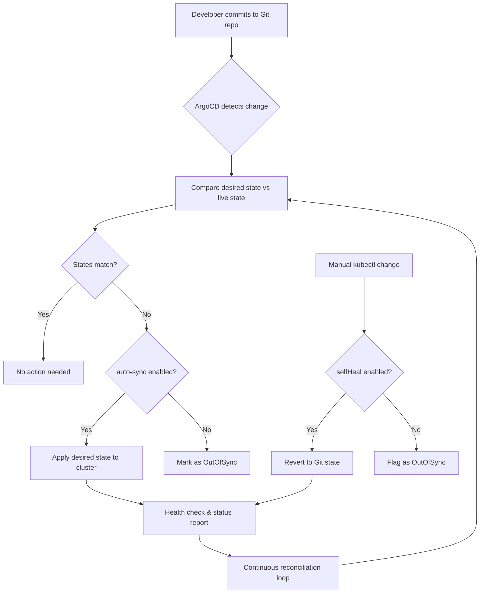

| Difficulty | Channel | Tags |
|---|---|---|
| beginner | devops | argocd, flux, declarative |

Imagine walking into work one morning and discovering your platform team manages 10,400 delivery pipelines, 6,000+ services, and nearly 50,000 environments. That was Adobe's reality before they rebuilt their entire deployment strategy around GitOps and ArgoCD [1]. If you have ever felt the sting of configuration drift or the dread of a manual kubectl command that nobody remembers running, you are about to discover why Adobe bet their infrastructure on a declarative approach—and why your team should too.

---

> ### Real-World Case — Adobe
>
> Adobe modernized its entire software delivery by replacing Moonbeam, a legacy internal container platform (CaaS), with Flex—a GitOps-based delivery platform built on Kubernetes and the Argo Project ecosystem. The migration touched 10,400 pipelines across hundreds of engineering teams, serving 3,000+ developers.
>
> | | |
> |---|---|
> | **Challenge** | Adobe's legacy Moonbeam platform had become increasingly difficult to scale, secure, and operate reliably at enterprise scale. Deployment workflows were fragile, queue-based, and prone to configuration drift. Teams lacked real-time visibility, fast rollback paths, and end-to-end auditability. The platform also accumulated thousands of stale, abandoned, and duplicated services over time with no lifecycle-management or cleanup mechanisms. |
> | **Solution** | Adobe built Flex, a governed GitOps delivery platform using Argo CD for continuous reconciliation and Git-based delivery, Argo Workflows for CI/CD pipeline orchestration, Argo Events for event-driven automation, and Argo Rollouts for progressive delivery. They established Git as the single source of truth, adopted declarative infrastructure definitions, used automated reconciliation to continuously align running environments with Git state, and built a Node.js/React migration interface backed by Argo Workflows to orchestrate the migration of 10,400 pipelines. |
> | **Outcome** | 10,400 pipelines migrated or decommissioned; 6,000+ services across nearly 50,000 environments managed, including ~19,000 production environments for 3,300+ production services; hundreds of teams transitioned to GitOps; 3,000+ developers now operate on the platform; ~80% of stale services removed, generating substantial infrastructure cost savings; significant reduction in deployment queue times; improved security posture across all migrated services. |
> | **Lesson** | Large-scale GitOps adoption is not just about deploying with modern tooling—it requires building the workflow experience and governance model around it. Invest in end-to-end automation from day one (not scripts), lead with concrete value over mandates, and treat platform migrations as opportunities to clean up technical debt. The relationship between platform and customer teams matters as much as the architecture. |

---

## Hook — The Deploy That Broke Everything

It starts innocently enough. Someone on the team runs a quick `kubectl scale deployment` to handle a traffic spike. It works. Ten minutes later, someone else runs `kubectl rollout undo` because a different service looks unstable. Nobody remembers who did what. By end of day, production is in an unrecoverable state, and the Git repo—supposedly the source of truth—tells a completely different story than the cluster. Sound familiar? This is configuration drift, and it is the silent killer of reliability at scale [7]. Adobe knew this pain intimately. Their legacy platform, Moonbeam, had grown so complex that teams were effectively operating in the dark. Services were orphaned, pipelines were duplicated, and nobody had a clear picture of what was actually running in production [1].

## Problem — The Configuration Drift Epidemic

When your deployment process relies on imperative commands—kubectl apply, helm upgrade --install, or raw curl calls to the API server—every action is a snowflake. Each command modifies cluster state directly, bypassing version control entirely. Many developers discover this the hard way: they merge a PR, wait for the pipeline, and realize the cluster already has a conflicting resource that someone applied manually six weeks ago. The root cause is fundamental. Imperative workflows treat infrastructure as a series of ephemeral actions. There is no single source of truth, no audit trail, and no automatic reconciliation when something drifts. At Adobe's scale—3,000+ developers, 6,000+ services—this chaos was untenable [1]. They needed a system where the cluster always reflects what is in Git, not what someone typed into a terminal at 2 AM.

## Real-World Case — Adobe's Flex Platform

Adobe's internal platform team faced a monumental task: replace Moonbeam, a legacy container-as-a-service platform that had organically grown into a tangled web of 10,400 pipelines [1]. The solution was Flex—a GitOps-based delivery platform built on Kubernetes and the Argo Project ecosystem (ArgoCD, Argo Workflows, Argo Rollouts) [9]. The migration touched every corner of Adobe's engineering organization. The results were staggering: approximately 80% of stale services were removed, generating massive infrastructure cost savings. Deployment queue times dropped significantly. Security posture improved across all migrated services. Today, Flex manages 6,000+ services across nearly 50,000 environments, including roughly 19,000 production environments for 3,300+ production services [1]. The key takeaway? GitOps did not just make deployments safer—it fundamentally changed how Adobe engineers think about infrastructure.

## Deep Dive — Declarative vs. Imperative: The Real Trade-Off

Here is the plot twist most developers miss: the difference between declarative and imperative is not about syntax—it is about state ownership. In the imperative world, you own every action. You tell the cluster exactly what to do, step by step. If something goes wrong between steps, that is your problem. In the declarative world, you own the intent. You describe what you want, and the system figures out the rest. Kubernetes itself embraces declarative configuration through its control loop architecture [2][8]. ArgoCD takes this philosophy to its logical conclusion by extending the control loop to Git. It continuously compares the desired state in your Git repository against the live state in the cluster. When they diverge—whether from a manual change or a Git commit—ArgoCD reconciles them automatically [3]. This is fundamentally different from tools like Ansible or Terraform, which are declarative in syntax but typically run on demand rather than continuously. ArgoCD never stops comparing. It is always running its reconciliation loop, always checking for drift [4]. The trade-off is that you surrender the ability to make emergency hotfixes via kubectl. Many teams find this uncomfortable at first. Some push back. But as Adobe discovered, that discomfort is the entire point—it forces discipline and creates accountability [1].

## Workflow — The GitOps Reconciliation Loop

Understanding ArgoCD means understanding the reconciliation loop. Here is how it works in practice:

1. A developer commits YAML manifests or a Helm chart to a Git repository
2. ArgoCD's Application CRD watches that repository for changes
3. A background controller continuously compares the desired state (Git) against the live state (cluster) [3]
4. If auto-sync is enabled, ArgoCD applies any differences automatically
5. Self-healing mode detects manual changes to the cluster and reverts them back to the Git-defined state [4]
6. Sync status and health checks are reported back through the ArgoCD UI and API

The diagram below illustrates this continuous reconciliation loop—the beating heart of any GitOps deployment.

## Code Example — Configuring Your First ArgoCD Application

The most direct way to understand ArgoCD is to configure an Application CRD [10]. This YAML defines everything ArgoCD needs to manage your deployment: where the manifests live, which cluster to target, and how to handle sync behavior.

```yaml
apiVersion: argoproj.io/v1alpha1
kind: Application
metadata:
  name: production-payment-service
  namespace: argocd
spec:
  project: default
  source:
    repoURL: https://github.com/your-org/payment-service.git
    targetRevision: main
    path: k8s/overlays/production
  destination:
    server: https://kubernetes.default.svc
    namespace: payments
  syncPolicy:
    automated:
      prune: true       # Remove resources that no longer exist in Git
      selfHeal: true    # Revert manual changes back to Git state
      allowEmpty: false # Prevent sync that would produce zero resources
    syncOptions:
      - Validate=true
      - CreateNamespace=true
      - ApplyOutOfSyncOnly=true
    retry:
      limit: 5
      backoff:
        duration: 5s
        factor: 2
        maxDuration: 3m
```

The critical fields are `syncPolicy.automated.prune` (cleans up resources removed from Git automatically), `selfHeal` (the killer feature that catches manual kubectl changes), and `retry` with exponential backoff (so transient failures do not leave your cluster in a bad state). The `targetRevision: main` pattern means every merge to main triggers reconciliation—there is no separate deploy step.

## Lessons Learned — What Adobe's Journey Teaches Us

Adobe's migration to Flex and GitOps offers several lessons that apply at any scale:

**Start small, migrate methodically.** Adobe did not flip a switch. They migrated services incrementally, learning and adapting as they went [1].

**Remove stale infrastructure ruthlessly.** Approximately 80% of Adobe's services on Moonbeam were stale. Cleaning those up first saved enormous migration effort and infrastructure costs [1].

**Accept the discomfort of immutability.** The inability to make emergency kubectl edits feels restrictive at first. That restriction is the feature, not a bug. Git becomes your audit trail, your rollback mechanism, and your single source of truth.

**Auto-sync without self-heal is incomplete.** Auto-sync catches Git commits. Self-heal catches manual drift. You need both for a truly declarative setup [4].

**Monitor the controller, not just the apps.** If ArgoCD itself goes down, reconciliation stops. Monitor the ArgoCD components as carefully as you monitor the applications they manage [5].

**GitOps does not replace CI/CD—it completes it.** Your CI pipeline still builds and tests artifacts. GitOps handles the delivery and reconciliation. They work together, not in competition [6].

---

## GitOps Reconciliation Loop with ArgoCD



<details>
<summary><strong>Original Interview Question</strong></summary>

**Q:** You're setting up GitOps for a microservices deployment. How would you configure ArgoCD to automatically sync changes from your Git repository to Kubernetes, and what's the difference between declarative and imperative approaches in this context?

**A:** I'd configure ArgoCD by setting up a Git repository containing Kubernetes manifests or Helm charts, creating an Application CRD that points to the Git repository, enabling auto-sync with a health check interval of 3 minutes, and implementing self-healing to automatically revert any manual changes. The declarative approach involves defining the desired state in Git through YAML manifests, Helm charts, or Kustomize configurations, where ArgoCD continuously reconciles the actual state with the desired state. In contrast, the imperative approach uses kubectl commands to make direct changes to the cluster, bypassing the Git repository as the single source of truth.

</details>

## Conclusion

Adobe proved that GitOps is not just a buzzword — it is a survival strategy at scale. By moving from imperative commands to declarative Git-driven reconciliation, they eliminated 80% of stale infrastructure, slashed deployment queue times, and gave 3,000+ developers a platform they can trust. The takeaway for your team? Start with one service. Define the Application CRD. Enable auto-sync and self-heal. And next time someone reaches for kubectl in production, ask them: would you rather fix the cluster, or fix the Git repo that controls it? That choice is the difference between surviving at scale and thriving at it.

---

## References

1. [Adobe Flex Platform Case Study — CNCF](https://www.cncf.io/case-studies/adobe) — article
2. [Kubernetes Declarative Management](https://kubernetes.io/docs/tasks/manage-kubernetes-objects/declarative-config/) — documentation
3. [ArgoCD Documentation — Sync Phases and Waves](https://argo-cd.readthedocs.io/en/stable/user-guide/sync-waves/) — documentation
4. [ArgoCD Documentation — Automated Sync Policy](https://argo-cd.readthedocs.io/en/stable/user-guide/auto_sync/) — documentation
5. [ArgoCD Project Configuration — Declarative Setup](https://argo-cd.readthedocs.io/en/stable/operator-manual/declarative-setup/) — documentation
6. [GitOps Principles — OpenGitOps](https://opengitops.dev/) — documentation
7. [Wikipedia — Configuration Drift](https://en.wikipedia.org/wiki/Configuration_drift) — article
8. [Kubernetes Controllers — Control Loop Pattern](https://kubernetes.io/docs/concepts/architecture/controller/) — documentation
9. [Adobe Engineering Blog — Flex Platform](https://blog.developer.adobe.com/) — blog
10. [ArgoCD Declarative Setup — Application CRD Reference](https://argo-cd.readthedocs.io/en/stable/operator-manual/declarative-setup/#applications) — documentation

---

**Author:** Satishkumar Dhule — [GitHub](https://github.com/satishkumar-dhule) · [LinkedIn](https://linkedin.com/in/satishkumar-dhule) · [Website](https://satishkumar-dhule.github.io)
