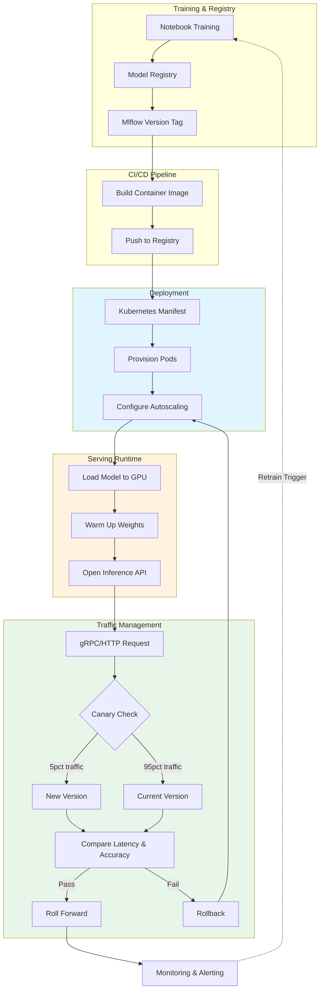

| Difficulty | Channel | Tags |
|---|---|---|
| beginner | devops | mlops, deployment |

In 2021, Uber's ML platform was hitting a wall. Every ETA, every price surge, every fraud check, every food delivery ranking — all of it depended on a sprawling mess of per-framework model containers, each with its own code paths, Docker images, and runbooks. The platform was processing over 30 million predictions per second, but the infrastructure was barely holding together [1]. This is the story of how Uber discovered the hard way that deploying a model and serving it are two completely different problems — and why your team needs to understand the difference before you hit your own wall.

---

> ### Real-World Case — Uber
>
> Uber's Michelangelo ML platform powered 100% of the company's ML workloads—ETAs, pricing, fraud, food delivery ranking—but hit a scaling wall at tens of millions of predictions per second. Their custom serving engines required separate containers for each model framework (TensorFlow, PyTorch, XGBoost), creating an operational nightmare of multiple code paths, Docker images, and runbooks.
>
> | | |
> |---|---|
> | **Challenge** | Uber needed to decouple model deployment (CI/CD pipelines, Kubernetes orchestration, training) from model serving (real-time inference, request routing, autoscaling) while unifying a fragmented serving stack. With 5,000+ models in production and strict <10ms P95 latency requirements, they could not scale their per-framework serving containers any further. |
> | **Solution** | Uber rebuilt Michelangelo 2.0 around NVIDIA Triton Inference Server, providing a single serving runtime across all model frameworks (TensorFlow, PyTorch, XGBoost, TensorRT). They deployed Triton on Kubernetes with custom autoscaling based on inference-specific signals (RPS, P95 latency, GPU queue depth) rather than CPU metrics. A reactive scheduling policy allocates idle serving GPU capacity to training jobs during off-peak hours and reclaims it when inference demand rises—all managed through Kubernetes custom controllers. |
> | **Outcome** | 30 million peak predictions per second across ~1,000 serving nodes with under 10ms P95 latency. The platform now handles 20,000 model training jobs monthly with 5,300 models in production. The single Triton runtime eliminated per-framework operational overhead. Custom GPU-aware autoscaling and reactive scheduling dramatically improved GPU utilization and reduced costs compared to the prior per-framework container approach. |
> | **Lesson** | Kubernetes HPA scaling on CPU is the wrong signal for GPU inference workloads—you must scale on inference-specific metrics like request latency and GPU queue depth. A single unified serving runtime (Triton) eliminates the operational complexity of per-framework serving containers. The deployment pipeline (training, CI/CD) and serving infrastructure (inference, routing) are distinct concerns that benefit from different orchestration strategies, but can share GPU capacity through intelligent scheduling. |

---

## Hook — The 3am Pager That Changed Everything

Picture this: you have just shipped a new fraud detection model. The CI pipeline passed, the Docker image built cleanly, and Kubernetes rolled it out without a hitch. Congratulations — you deployed it. But five minutes later, pager duty lights up. Latency is spiking to 2 seconds per request. The model is "deployed" but useless. What went wrong? You confused deployment with serving. Deployment got the model into the cluster. Serving is what actually makes it respond to a request — and that is a radically different problem with its own failure modes. Uber's engineering team discovered this distinction the hard way when their platform grew from a few hundred models to over 5,300 in production, and their per-framework serving approach started collapsing under its own complexity [1].

## Problem — The Great Deploy-Serve Confusion

Ask ten ML engineers what "putting a model into production" means, and you will get ten different answers. Some will talk about Kubernetes manifests and CI/CD pipelines. Others will describe REST endpoints and request batching. Both are right — but they are describing different parts of the same journey, and confusing the two is where production meltdowns begin. The problem is seductively simple: deployment is about getting your model artifact into an environment where it can run. Serving is about keeping it running under unpredictable load, routing traffic between versions, and returning predictions within milliseconds. Think of deployment as building the highway. Serving is managing the traffic on it. Build a highway with no on-ramp or off-ramp logic? Traffic jams. Build traffic management without a highway? Nobody arrives. You need both, and the tools and trade-offs for each are entirely different.

## Real-World Case — Uber's Michelangelo Breaking Point

Uber's Michelangelo ML platform was, by any measure, a success. It powered 100 percent of the company's ML workloads — ETAs, surge pricing, fraud detection, Uber Eats ranking, you name it. At its peak, the platform handled 30 million predictions per second across roughly 1,000 serving nodes with under 10 milliseconds P95 latency [1]. But scaling came at a cost. Their early architecture required separate containers for each model framework: one code path for TensorFlow models, another for PyTorch, another for XGBoost. Each path had its own Docker image, its own configuration, its own runbook for debugging. This created what engineers called an "operational nightmare." Every new framework meant duplicating the entire serving stack — load balancing, health checks, autoscaling rules, GPU memory management. The team realized they needed a unified serving runtime. They consolidated onto NVIDIA Triton Inference Server, a single runtime that could handle models from any framework. The impact was transformative: a single deployment pipeline, unified monitoring, and dramatically improved GPU utilization. Custom GPU-aware autoscaling and reactive scheduling replaced the old per-framework approach, reducing costs while handling 30 million QPS [1]. Today, Michelangelo runs 20,000 model training jobs monthly with 5,300 models in production — all on a unified serving layer.

## Deep Dive — Deployment vs. Serving: Two Jobs, One Production System

| Aspect | Deployment | Serving |
|--------|-----------|--------|
| Primary goal | Model availability in production | Fast, reliable inference |
| Key tools | Kubernetes, Terraform, MLflow, CI/CD | TorchServe, TF Serving, gRPC, Envoy |
| Scaling trigger | Node count, cluster resources | Request QPS, GPU memory pressure |
| Failure mode | Model not running at all | Model responding too slowly |
| Rollback strategy | Swap manifests, revert Helm chart | Traffic shift to previous model version |
| Cold start concern | Spinning up pod infrastructure | Loading model weights into GPU memory |
| Monitoring | Pod status, cluster health | Latency percentiles, error rates, throughput |

## Workflow — The Model Lifecycle: From Notebook to Production Inference

Building on this distinction, here is how the two workflows fit together in practice. The typical journey of a model from your laptop to production follows these stages, each of which touches both deployment and serving concerns:

**Stage 1 — Training & Registration (Deployment concern):** A data scientist trains a model and logs it to a model registry like MLflow [4]. The registry tags the artifact with a version number and stores metadata about training data, hyperparameters, and performance metrics.

**Stage 2 — CI/CD Pipeline (Deployment concern):** The registry triggers a CI/CD pipeline. This pipeline builds a container image that includes the model artifact, the serving framework (e.g., TorchServe [3] or BentoML [5]), and the necessary dependencies. The image is pushed to a container registry.

**Stage 3 — Infrastructure Provisioning (Deployment concern):** A Kubernetes Deployment manifest or Terraform template spins up the serving pods. This step specifies resource requests (CPU, memory, GPU), replica counts, and autoscaling rules based on CPU utilization or custom metrics like inference queue depth [6].

**Stage 4 — Model Loading (Serving concern):** Each pod starts, and the serving runtime loads the model artifact from disk or a remote store into accelerator memory. This is where cold starts happen — loading a multi-gigabyte model into GPU memory can take 10-30 seconds.

**Stage 5 — Request Handling (Serving concern):** The inference API is now live. Requests arrive via gRPC or HTTP, the runtime handles batching (collecting multiple requests into a single inference call), and returns predictions. Latency tracking happens here.

**Stage 6 — Traffic Management (Serving concern):** When deploying a new model version, traffic is shifted gradually — 1 percent, 5 percent, 25 percent, 100 percent — while comparing latency and accuracy metrics against the previous version. This is canary deployment, and it lives at the intersection of deployment (pushing the new version) and serving (routing traffic).

The Mermaid diagram below visualizes this lifecycle:

## Code Example — Building a Deployment-Aware Serving Layer

The best way to internalize these concepts is to build a minimal serving system that respects both concerns. The following Python example uses asyncio and a simple registry pattern to show how deployment (model versioning, registry, rollback) and serving (model loading into memory, inference, latency tracking) interact in a real system.

## Lessons Learned — What Uber's Journey Teaches Every ML Team

Uber's consolidation onto a unified serving runtime was not just a technical migration — it was a philosophical shift in how the team thought about ML production. Here are the concrete lessons their experience surfaces for every team building ML systems:

**1. Decouple serving from deployment early.** If your model deployment pipeline is intertwined with your inference runtime (same Docker image, same config, same scaling rules), you will hit the same wall Uber did. Separate the concerns: deployment manages the lifecycle of the artifact; serving manages the lifecycle of the request [1].

**2. Cold start is a serving problem, not a deployment problem.** Many teams optimize their Kubernetes startup times to under a second, then wonder why new model versions take 20 seconds to respond. The cold start is in the model loading, not the container bootstrap. Pre-warm your models on pod startup, not on first request.

**3. Choose a unified serving runtime before you have 20 model frameworks.** Uber ran separate code paths for each framework and paid the complexity tax. Tools like BentoML, TorchServe, TF Serving, and Triton can handle multiple frameworks from one runtime. Adopt one before the operational debt accumulates [3][5].

**4. Monitor the right metrics for each concern.** Deployment health is pod status, rollout progress, and cluster resources. Serving health is latency percentiles (p50, p95, p99), request throughput, error rates, and model staleness. A green deployment dashboard with red serving metrics means your models are running but useless.

**5. Design for A/B testing at the serving layer.** Canary deployments require traffic splitting, which is a serving concern. If your deployment pipeline cannot shift 5 percent of traffic to a new model version without redeploying everything, you will struggle to safely validate changes.

**6. GPU utilization is a serving optimization.** Uber's custom GPU-aware autoscaling did not change how they deployed models — it changed how they scheduled inference work across GPU memory. Deployment provisions the GPUs; serving decides how to fill their compute cycles efficiently.

---

## ML Model Lifecycle: From Training to Production Serving

<strong>Original Interview Question</strong>

**Q:** Explain the key differences between model serving and model deployment in ML systems, including specific technologies, scaling considerations, and real-world implementation patterns?

**A:** Deployment encompasses CI/CD pipelines, infrastructure setup, and monitoring using tools like Kubernetes, MLflow, and SageMaker. Serving focuses on runtime inference APIs with frameworks like TensorFlow Serving, TorchServe, or BentoML, handling request routing, model versioning, and autoscaling. Key trade-offs include latency vs throughput, batch vs real-time inference, and cold start optimization.

## Conclusion

The next time your team ships a model to production, ask two separate questions: "Is it deployed?" and "Can it serve?" The first checks Kubernetes. The second checks latency percentiles. Uber learned this distinction at 30 million predictions per second. Your team can learn it before hitting that wall — by treating deployment and serving as the distinct engineering disciplines they are, with different tools, different failure modes, and different metrics of success. Start by auditing your own pipeline: where does deployment end and serving begin? If you cannot draw that line clearly, you have found your first technical debt to address.

---

## References

1. [Uber Standardized ML Scale](https://thenewstack.io/uber-standardized-ml-scale/) — article
2. [Kubernetes Deployments](https://kubernetes.io/docs/concepts/workloads/controllers/deployment/) — documentation
3. [TorchServe — PyTorch Model Serving](https://pytorch.org/serve/) — documentation
4. [MLflow Documentation](https://mlflow.org/docs/latest/) — documentation
5. [BentoML Documentation](https://docs.bentoml.com/en/latest/) — documentation
6. [TensorFlow Serving Guide](https://www.tensorflow.org/tfx/guide/serving) — documentation
7. [gRPC Documentation](https://grpc.io/docs/) — documentation
8. [FastAPI Documentation](https://fastapi.tiangolo.com/) — documentation

---

**Author:** Satishkumar Dhule — [GitHub](https://github.com/satishkumar-dhule) · [LinkedIn](https://linkedin.com/in/satishkumar-dhule) · [Website](https://satishkumar-dhule.github.io)
