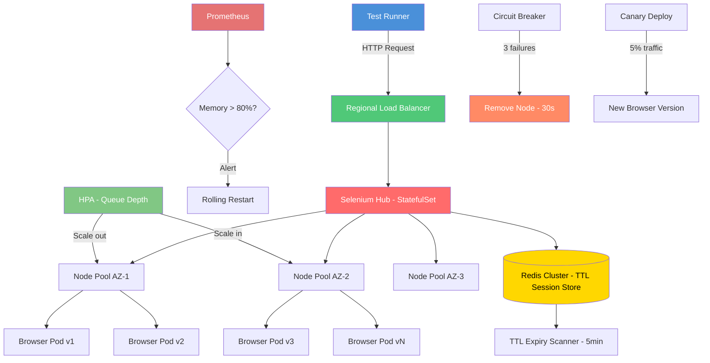

| Difficulty | Channel | Tags |
|---|---|---|
| advanced | system-design | selenium, webdriver, grid |

What if your test infrastructure could vanish when idle and materialize hundreds of browser instances within seconds for a major launch? That is exactly what Blibli.com, Indonesia's leading e-commerce platform, needed when preparing for the iPhone 16 launch across hundreds of physical stores [1]. Their static Selenoid setup on GCP VMs was burning cash during off-peak hours and failing to scale when it mattered most. The tension between cost and capacity is the single biggest challenge in test infrastructure — and the solution changes everything you know about Selenium Grid architecture.

---

> ### Real-World Case — Blibli.com
>
> Blibli, Indonesia's leading e-commerce platform (part of PT Global Digital Niaga, publicly listed), ran thousands of automated UI tests daily using a static Selenoid setup on GCP VMs. Their infrastructure was provisioned for peak capacity 24/7 — VMs ran idle and burned money during low-traffic hours but couldn't scale up fast enough for major events like the iPhone 16 launch across hundreds of physical stores.
>
> | | |
> |---|---|
> | **Challenge** | Static VM-based Selenoid infrastructure with fixed capacity could not handle burst loads during product launches (hundreds of concurrent browser tests needed instantly), yet wasted resources during off-peak hours. Manual scaling was impractical — spinning up VMs took too long to react to sudden demand spikes. |
> | **Solution** | Migrated from Selenoid to Selenium Grid 4 on Google Kubernetes Engine (GKE) with KEDA (Kubernetes Event-Driven Autoscaling). KEDA monitors Selenium Grid's GraphQL endpoint for session queue depth — when tests queue up, it spawns browser pods instantly; when idle, it scales to zero. Used separate ScaledObjects per browser capability (Chrome, Firefox, Edge) with cooldown periods to avoid thrashing. |
> | **Outcome** | Able to spawn hundreds of browser pods within seconds during peak events (e.g., iPhone 16 launch load testing across all Indonesian store branches). Dramatic cost reduction from scaling to zero during non-peak hours — eliminated paying for idle VMs. Infrastructure now matches actual demand in real-time rather than static over-provisioning. |
> | **Lesson** | Event-driven scaling (scale-to-zero for test infrastructure) is counterintuitive but massively cost-effective. Traditional thinking says 'test nodes must always be ready,' but KEDA's sub-second pod startup on GKE made on-demand scaling viable. The plot twist: scaling test infrastructure to zero during idle periods actually improved reliability — fresh browser pods per session eliminated the memory leak/cruft accumulation problem that plagued their always-on Selenoid VMs. |

---

## Hook — The Infrastructure That Couldn't Keep Up

Imagine your CTO walks into the room and says: "We need to load-test the checkout flow for the iPhone 16 launch. Every store. Every variant. In production." Your heart sinks because you know your static VM fleet of 50 Selenium nodes — provisioned two years ago with a finger-in-the-air capacity estimate — cannot handle it. You either over-provision and watch the finance team weep, or under-provision and watch your release pipeline collapse. This is the static infrastructure trap, and it is costing teams millions in either idle hardware or lost revenue. The industry has been treating browser nodes like pets when they should be cattle — ephemeral, disposable, and born on demand.

## Problem — The Static Provisioning Nightmare

Most teams provision Selenium Grid infrastructure for peak capacity. They calculate: "We run 10,000 sessions daily, each session needs 2GB RAM and 1 CPU, so we need 200 nodes with 400GB memory total." Then they add a 30% buffer and arrive at 520GB of cluster memory [2]. The problem? This capacity sits idle for 16 hours a day. During quiet periods, you might need only 20 nodes. During a launch event, you might need 400. Static provisioning forces a painful trade-off: bleed money on idle VMs or risk test queue backlogs that block deployments. The hidden cost is worse than the obvious one — teams start avoiding expensive tests, decreasing coverage, and shipping bugs that could have been caught. The math is brutal: a cluster running 24/7 at 20% utilization means 80% of your infrastructure budget is wasted compute. Multiply that by twelve months and the number becomes board-room attention worthy.

## Real-World Case — Blibli.com's Elastic Scaling Transformation

Blibli.com, Indonesia's leading e-commerce platform and part of PT Global Digital Niaga (publicly listed), ran thousands of automated UI tests daily using a static Selenoid setup on GCP VMs [1]. Their infrastructure was provisioned for peak capacity that ran 24/7 — VMs sat idle and burned money during low-traffic hours but could not scale up fast enough for major events like the iPhone 16 launch across hundreds of physical stores. The turning point came when they adopted KEDA (Kubernetes Event-Driven Autoscaling) to drive their Selenium Grid on Google Kubernetes Engine. Instead of static VMs, they deployed browser pods that scaled to zero during idle hours and spawned hundreds within seconds when demand spiked. The results were dramatic: infrastructure costs dropped significantly by eliminating idle VM spend, and they gained the ability to handle launch-day loads that would have previously required months of capacity planning. Their infrastructure now matches actual demand in real-time — a transformation from capital-expense thinking to operating-expense efficiency.

## Deep Dive — Anatomy of an Elastic Selenium Grid

Building a Selenium Grid that handles 10,000 concurrent sessions with 99.9% uptime requires rethinking every layer. At the foundation sits a Kubernetes cluster with multi-AZ node pools — you need at least three availability zones to survive a regional failure [3]. The hub-node pattern remains central, but each component becomes cloud-native: the hub runs as a Kubernetes StatefulSet with persistent identity, while browser nodes are deployed as ephemeral pods with resource quotas. Session management is the critical path. Instead of in-memory session tracking that leaks on node failure, you need a Redis cluster with TTL-based expiration policies [4]. Every session gets a time-to-live that auto-cleans if the test crashes or the node dies. A background scanner runs every five minutes to purge expired keys, preventing the session table from becoming a graveyard of orphaned connections. Memory leaks are the silent killer of Selenium clusters. Each browser process grows over time — JavaScript heaps accumulate, DOM references leak, and what started as a 200MB Chrome process balloons to 1.2GB after a few hundred tests. The defense is three-pronged: weekly rolling restarts to reset the baseline, Prometheus alerts at 80% memory utilization, and JVM garbage collection tuning for the hub itself [5]. The circuit breaker pattern isolates the damage when a node goes rogue. Borrowed from Hystrix, the circuit breaker monitors node health through a /status endpoint polled every 10 seconds. Three consecutive failures trip the breaker, removing the node from the pool for a 30-second recovery window. This prevents cascading failures where one slow node drags down the entire grid [6].

## Workflow — From Test Request to Browser Session

The flow of a test session through an elastic grid follows a precise choreography. Each step is designed to handle failure gracefully while maintaining throughput. The diagram below traces a session from initiation through cleanup.

## Code Example — Session Lifecycle Manager with Health-Aware Scheduling

The following Python implementation shows how a production-grade session manager orchestrates browser nodes with automatic cleanup, memory monitoring, and circuit breaker integration. This is the core logic that Blibli.com and similar teams embed in their grid infrastructure.

## Lessons Learned — Battle Scars from Running Grid at Scale

After watching teams run Selenium Grid at scale across multiple data centers, several patterns emerge as non-negotiable. First, always use Pod Disruption Budgets to guarantee at least 85% capacity during rolling updates — without this, a cluster upgrade can take down your entire test pipeline [7]. Second, never trust in-memory session state. Redis TTL-based session stores are not optional; they are the difference between a self-healing grid and a pager-blowing catastrophe at 3 AM. Third, canary deployments for new browser versions save weeks of debugging. Roll out a single node with the new Chrome version, route 5% of traffic to it, and monitor for regressions before updating the fleet. Teams that skip this step inevitably discover a breaking Selenium API change when their entire regression suite is red before a release. The most common mistake? Treating session cleanup as an afterthought. Init containers that scrape stale Docker volumes, background workers that purge orphaned Redis keys, and sidecar containers that force-kill hung browser processes are not nice-to-haves. They are essential infrastructure. Without them, your grid degrades over hours, not days.

---

## Elastic Selenium Grid Architecture — Session Flow and Autoscaling

<strong>Original Interview Question</strong>

**Q:** Design a scalable Selenium Grid architecture to handle 10,000 concurrent test sessions with 99.9% uptime, ensuring zero memory leaks through automatic session lifecycle management, real-time monitoring, and graceful node failure recovery across multiple data centers?

**A:** Deploy Kubernetes cluster with auto-scaling node pools, Redis session store with TTL policies, Prometheus metrics for memory monitoring, circuit breakers for node isolation, and sidecar containers for session cleanup. Implement health checks, resource quotas, and rolling updates.

## Conclusion

The era of static test infrastructure is over. Blibli.com proved that Selenium Grid can scale to zero and back in seconds, matching infrastructure cost to actual demand rather than peak paranoia. The path is clear: Kubernetes for orchestration, Redis for session state, Prometheus for visibility, and circuit breakers for resilience. Start with one change — add TTL to your session store — and work toward the full architecture incrementally. Your test suite (and your finance team) will thank you.

---

## References

1. [Scaling Selenium Grid on GCP Using KEDA — Blibli.com Tech Blog](https://medium.com/bliblidotcom-techblog/scaling-selenium-grid-on-gcp-using-keda-which-saves-us-on-the-cost-too-b479c00c5526) — blog
2. [Kubernetes Architecture Concepts](https://kubernetes.io/docs/concepts/architecture/) — documentation
3. [Prometheus Monitoring Overview](https://prometheus.io/docs/introduction/overview/) — documentation
4. [Redis About — In-Memory Data Store](https://redis.io/docs/about/) — documentation
5. [Selenium Grid Documentation](https://www.selenium.dev/documentation/grid/) — documentation
6. [Circuit Breaker Pattern — Martin Fowler](https://martinfowler.com/bliki/CircuitBreaker.html) — blog
7. [Pod Disruption Budgets — Kubernetes](https://kubernetes.io/docs/concepts/workloads/pods/disruptions/) — documentation
8. [Grafana Documentation](https://grafana.com/docs/grafana/latest/) — documentation
9. [Docker Overview](https://docs.docker.com/get-started/overview/) — documentation

---

**Author:** Satishkumar Dhule — [GitHub](https://github.com/satishkumar-dhule) · [LinkedIn](https://linkedin.com/in/satishkumar-dhule) · [Website](https://satishkumar-dhule.github.io)
