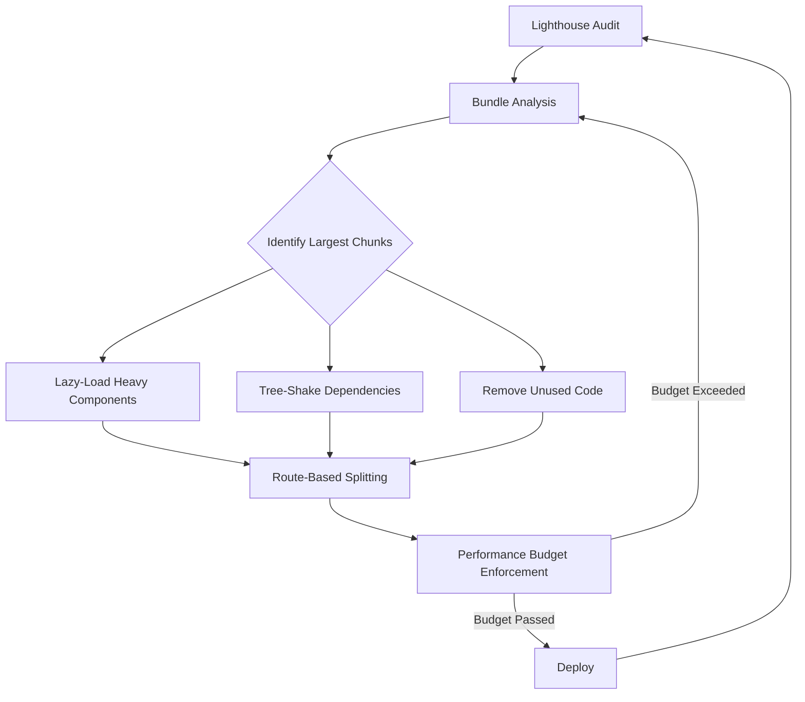

| Difficulty | Channel | Tags |
|---|---|---|
| intermediate | frontend | lighthouse, bundle, lazy-loading |

Tinder's engineering team built a React/Redux PWA in just three months. The result? A monolith JS bundle that turned budget Android phones into paperweights. Users on Galaxy S7s and Moto G4s stared at blank screens while 2.1MB of JavaScript parsed on 3G connections. Sound familiar? By the time they finished optimizing, Tinder had cut their main bundle by 39%, slashed time-to-interactive, and discovered that web users actually swiped more than native app users [1]. Here is how they did it — and how your React app can follow the same playbook.

---

> ### Real-World Case — Tinder
>
> Tinder built a React/Redux PWA called Tinder Online in 3 months to reach new markets with a lightweight web experience. Their monolithic JS bundles were delaying time-to-interactive on the mobile devices most users relied on (Galaxy S7, Moto G4, iPhones), frustrating engagement and making the app feel sluggish on 3G/4G connections.
>
> | | |
> |---|---|
> | **Challenge** | Large, monolithic JS bundles (166KB main chunk before splitting) that contained code unnecessary for initial boot. The bundles loaded everything upfront—chat, messaging, captchas, Facebook SDK—even before users logged in. This delayed interactivity and first paint, especially on mid-range mobile hardware over cellular networks. |
> | **Solution** | Implemented route-based code splitting with React Router + React Loadable, cutting main bundle from 166KB to 101KB. Used Webpack Bundle Analyzer to identify polyfill bloat (trimmed with babel-preset-env), replaced localForage with direct IndexedDB, extracted async common chunks, and removed critical CSS from bundles. Enforced hard performance budgets (~155KB main+vendor, ~55KB lazy chunks, ~20KB CSS). Added link rel=preload for critical chunks (shaved 1s off load time, cut first paint from 1000ms to 500ms). Used Workbox to precache route bundles via Service Worker and Webpack's ModuleConcatenationPlugin for scope hoisting (+8% parsing improvement). Upgraded to React 16, reducing vendor chunk by ~7%. |
> | **Outcome** | Main bundle reduced 39% (166KB → 101KB). DCL improved from 5.46s to 4.69s. Preload cut load time by 1s and first paint from 1000ms to 500ms. Scope hoisting improved parsing time 8%. The PWA delivered the full Tinder experience in ~2.8MB (10% of the data cost of the native app). Users swiped and messaged more on web than native apps, with longer session times. Performance budgets prevented regression on every commit. |
> | **Lesson** | Route-level code splitting is the single highest-impact optimization for React performance. But the real unlock is coupling it with hard performance budgets—without them, bundle size creeps back. Bundle analysis reveals surprising wins (a swap from localForage to IndexedDB, removing unused polyfills). Service Worker precaching makes code splitting viable on slow networks by ensuring lazy chunks load instantly on repeat visits. |

---

## Hook — The 2.1MB Elephant in the Room

You just got the Lighthouse report. Score: 65. Time to Interactive: 4.2 seconds. Bundle size: 2.1MB. Your CEO wants 90+. Your users are bouncing. Every millisecond of load time costs conversions — Amazon calculated that a 100ms delay costs them 1% in revenue, and Google found that 53% of mobile users abandon sites that take longer than three seconds to load. The pressure is on, and the obvious fixes (compress images, enable gzip) barely move the needle. The real problem lurks deeper: your JavaScript bundle has become a bloated monolith.

## Problem — The Hidden Cost of Easy Imports

Modern React apps suffer from a paradox. Importing libraries is effortless — `npm install` followed by `import` — but every import is a promise to the browser that it must download, parse, and execute that code before the page becomes interactive. A single heavy component (think charting libraries like D3, data tables like AG Grid, or rich text editors) can add hundreds of kilobytes to the critical path. Many developers do not realize that `import { Button } from 'antd'` can pull in the entire Ant Design library even if you only use one component, depending on how tree shaking is configured. This is where the death-by-a-thousand-imports begins, and it is why bundle analysis should be step zero, not an afterthought.

## Real-World Case — Tinder

In 2017, Tinder shipped a React/Redux Progressive Web App called Tinder Online to reach markets where native app installs were cost-prohibitive. The engineering team had three months to build it. What emerged worked — but barely. Their monolithic JS bundles were delaying time-to-interactive on the exact devices their new users depended on: Galaxy S7s, Moto G4s, and iPhones on 3G and 4G connections. The experience felt sluggish, and engagement suffered. The team went to war on bundle size. They implemented code splitting with React.lazy(), applied scope hoisting for faster parsing, introduced performance budgets enforced at the commit level, and preloaded critical assets. The results were dramatic: main bundle dropped from 166KB to 101KB (a 39% reduction). DOM Content Loaded improved from 5.46s to 4.69s. Preload cut overall load time by 1 second and first paint from 1000ms to 500ms. Scope hoisting improved parsing time by 8%. The full PWA clocked in at ~2.8MB — just 10% of the data cost of the native app. The kicker: users swiped and messaged more on the web version than the native apps, with longer session times [1].

## Deep Dive — Code Splitting Is Not Magic, It Is Architecture

Here is where many developers get tripped up: code splitting is not a configuration toggle. It is a fundamental architectural decision that affects how you structure components, routes, and state management. There are two primary strategies you need in your toolbox. Route-based splitting is the lowest-hanging fruit — every route gets its own chunk so users only download what they need for the current page. Component-based splitting targets heavy components that are not immediately visible — think modals, complex dashboards, or chart widgets that live below the fold. The tricky part? Over-splitting can actually hurt performance. Every chunk means an extra HTTP request, and on HTTP/1.1 connections, that overhead adds up fast. HTTP/2 mitigates this with multiplexing, but the principle stands: split enough to eliminate dead code from the critical path, but not so aggressively that you create a waterfall of tiny requests. This is where webpack-bundle-analyzer becomes your best friend — it reveals exactly which modules are inflating your chunks so you can make data-driven decisions instead of guessing.

## Workflow — The Six-Step Performance Rescue Plan

The optimization workflow follows a repeatable cycle that Tinder and countless other teams have codified into their pipelines. The diagram below maps the journey from audit to enforcement. Start with a Lighthouse audit to establish your baseline. Then crack open webpack-bundle-analyzer and identify the top five largest modules — these are your targets. For each heavy dependency, ask three questions: Can it be lazy-loaded? Can it be replaced with a lighter alternative? Is it even used? Remove unused imports, switch to tree-shakeable ES module builds where available, and apply dynamic imports for every non-critical component. Route-split your app at every router boundary. Finally, lock in your gains with a performance budget in webpack that fails the build if the bundle exceeds your threshold. This prevents the inevitable regression when a well-meaning teammate imports a 200KB library for a single utility function.



## Code Example — From Monolith to Splits

Here is the practical transformation. Before optimization, your App component likely looks like this — every route eagerly loaded:

```typescript
// Before: monolithic import — every route loaded at once
import Dashboard from './pages/Dashboard';
import Analytics from './pages/Analytics';
import Settings from './pages/Settings';
import HeavyChart from './components/HeavyChart';

function App() {
  return (
    <BrowserRouter>
      <Routes>
        <Route path="/dashboard" element={<Dashboard />} />
        <Route path="/analytics" element={<Analytics />} />
        <Route path="/settings" element={<Settings />} />
      </Routes>
    </BrowserRouter>
  );
}
```

After optimization, the same app uses React.lazy() to defer loading until each route is visited:

```typescript
// After — lazy imports defer loading per route
import { lazy, Suspense } from 'react';

// Each of these becomes a separate chunk
const Dashboard = lazy(() => import('./pages/Dashboard'));
const Analytics = lazy(() => import('./pages/Analytics'));
const Settings = lazy(() => import('./pages/Settings'));

// Heavy chart loaded only when the component mounts
const HeavyChart = lazy(() => import('./components/HeavyChart'));

function AppFallback() {
  return <div className="p-8 text-center">Loading…</div>;
}

function App() {
  return (
    <BrowserRouter>
      <Suspense fallback={<AppFallback />}>
        <Routes>
          <Route path="/dashboard" element={<Dashboard />} />
          <Route path="/analytics" element={<Analytics />} />
          <Route path="/settings" element={<Settings />} />
        </Routes>
      </Suspense>
    </BrowserRouter>
  );
}
```

⚠️ **Watch Out**: Always wrap lazy components in an error boundary. If a chunk fails to load (network blip, broken deployment), the entire route crashes without one.

## Lessons Learned — Ship Less Code, Win More Users

Tinder's case proves a counterintuitive truth: a web app that loads faster and costs less data can outperform a native app on engagement, even with fewer device-level APIs. The web version of Tinder delivered 90% data savings over native and still produced longer session times. The takeaway for your team is threefold. First, set performance budgets before you write the first line of a feature — enforce them in CI so no PR ships code that blows the limit. Second, make bundle analysis a regular habit, not a one-time fire drill. Third, embrace the laziness: every import should justify its place in the critical path. If a component is not visible in the first viewport, it should be lazy. If a library is only used on one route, it should be split. Your users on 3G, on last-year's phone, or in a coffee shop with spotty WiFi will thank you. And your Lighthouse score will finally cross that 90 threshold.

**One sentence to share with your team tomorrow:** *The fastest code is the code the browser never has to download.*

---

## Performance Optimization Workflow


<details>
<summary><strong>Original Interview Question</strong></summary>

**Q:** You're tasked with improving a React app's Lighthouse performance score from 65 to 90+. The bundle size is 2.1MB and Time to Interactive is 4.2s. What specific steps would you take to optimize the bundle and implement lazy loading?

**A:** Implement code splitting with React.lazy() and Suspense, analyze bundle composition with webpack-bundle-analyzer to identify largest chunks, remove unused dependencies and optimize imports, add dynamic imports for heavy components and third-party libraries, implement route-based splitting for better initial load times, and utilize tree shaking with proper ES module configuration.

</details>

## Conclusion

Tinder proved that a web app with aggressive code splitting and a relentless focus on bundle size can not only compete with native — it can win on engagement. The same principles apply whether you are optimizing a landing page or a full-featured SaaS dashboard. Start with a Lighthouse audit, analyze your bundle, split ruthlessly, and lock in your gains with performance budgets. The fastest code is the code the browser never has to download. Your users, your Lighthouse score, and your CEO will all thank you.

---

## References

1. [Tinder PWA Performance Case Study](https://calendar.perfplanet.com/2017/a-tinder-progressive-web-app-performance-case-study/) — blog
2. [Code Splitting — MDN Web Docs](https://developer.mozilla.org/en-US/docs/Glossary/Code_splitting) — documentation
3. [Code Splitting — Webpack Documentation](https://webpack.js.org/guides/code-splitting/) — documentation
4. [React.lazy and Suspense — React Documentation](https://react.dev/reference/react/lazy) — documentation
5. [Lighthouse Performance Audits — Chrome Developers](https://developer.chrome.com/docs/lighthouse/performance/) — documentation
6. [webpack-bundle-analyzer — GitHub](https://github.com/webpack-contrib/webpack-bundle-analyzer) — documentation
7. [Tree Shaking — Webpack Documentation](https://webpack.js.org/guides/tree-shaking/) — documentation
8. [Service Worker API — MDN Web Docs](https://developer.mozilla.org/en-US/docs/Web/API/Service_Worker_API) — documentation

---

**Author:** Satishkumar Dhule — [GitHub](https://github.com/satishkumar-dhule) · [LinkedIn](https://linkedin.com/in/satishkumar-dhule) · [Website](https://satishkumar-dhule.github.io)
