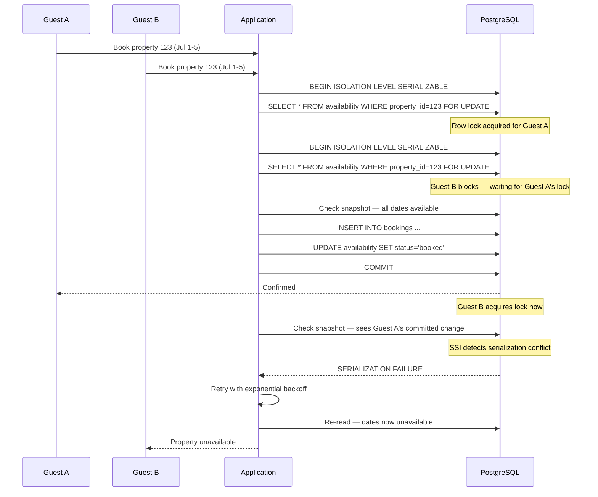

| Difficulty | Channel | Tags |
|---|---|---|
| intermediate | database | acid, isolation-levels, mvcc |

Imagine two buyers hitting "Purchase" on the last item in stock at the exact same millisecond. One of them is going to be disappointed — and that disappointment can cascade into chargebacks, support tickets, and a damaged reputation. Shopify faced exactly this problem scaling their inventory system for Black Friday 2025, and what they built is a masterclass in database transaction design [1].

---

> ### Real-World Case — Shopify
>
> Shopify's checkout system needed to prevent two buyers from purchasing the same last unit of inventory during concurrent checkouts. Their existing Redis-based reservation system couldn't provide ACID guarantees between reservations and the inventory ledger, risking oversells or lost sales.
>
> | | |
> |---|---|
> | **Challenge** | Scale oversell protection across 14% of US ecommerce at $5.1M/minute peak (Black Friday 2025). The Redis system had no atomicity between reserve and claim steps, meaning payment could succeed but inventory was never deducted (oversell) or inventory was deducted but never claimed (lost sale). Plus, Redis had no multi-location inventory awareness. |
> | **Solution** | Replaced Redis with MySQL using a one-row-per-inventory-unit design with SELECT ... FOR UPDATE SKIP LOCKED for contention-free concurrent reservations. Used READ COMMITTED isolation (instead of MySQL's default REPEATABLE READ) to avoid gap locks that blocked replenishment. Designed composite primary keys to reduce lock count per row from 2 to 1. Used consistent lock ordering to eliminate deadlocks. Ran both systems in parallel 'shadow mode' during cutover with a kill-switch rollback path. |
> | **Outcome** | Survived Black Friday 2025 peak traffic with writer CPU under 50% and reader CPU under 16%. Eliminated classes of oversell bugs that were possible with the dual-system Redis approach. Cleanup of related checkout path reduced reads by 50% and transactions by 33% on primary database. |
> | **Lesson** | The real bottleneck wasn't database performance or lock contention — it was connection starvation from other checkout services holding connections too long. Also, what wasn't possible 5 years ago (MySQL for high-throughput reservation workloads) became possible with MySQL 8's SKIP LOCKED, making old architectural assumptions worth revisiting. |

---

## Hook — That Millisecond Between "Available" and "Gone"

It happens more often than you think. A flash sale drops. Your database shows 1 unit remaining. Two users press buy simultaneously. The server receives both requests before the first write hits disk. Your inventory ledger now reads -1, a customer gets a cancellation email, and your weekend is ruined. This is the double-booking problem, and it is the single most underestimated database challenge in reservation and inventory systems. The stakes are deceptively simple: get the transaction wrong, and you either oversell (angering customers) or undersell (leaving money on the table). Get it right, and your system scales through peak traffic without a hiccup.

## Problem — The Race Condition You Can't Ignore

At its core, the double-booking problem is a textbook race condition. Two concurrent transactions read the same row, both see "available," and both write a booking before the other commits. The classic solution sounds straightforward — use database transactions — but transaction isolation levels are where good intentions go to die. Many developers reach for READ COMMITTED thinking it is sufficient. After all, each transaction sees committed data. But READ COMMITTED does not prevent phantom reads: a second transaction can insert a new booking between your SELECT and your INSERT, and you would never know. Suddenly, that "1 available" becomes "-1 available" and you have an angry customer on the phone [2]. The tension here is between consistency and availability. You want strong guarantees that prevent oversells, but you also want your booking system to stay fast and responsive under load. Get the isolation level wrong and you pay in either correctness or performance.

## Real-World Case — Shopify

Shopify hit this exact wall scaling their checkout system. Their architecture used a Redis-based reservation system to temporarily hold inventory during checkout, paired with a separate MySQL inventory ledger for the actual decrement. This dual-system approach created a consistency gap: reservations could expire or fail while the ledger already counted the inventory as sold, or worse, the ledger could accept two decrements for the same item because the reservation system had no way to enforce ACID across both stores [1]. The fix was not minor. Shopify rebuilt their entire inventory reservation system on a single PostgreSQL database using SERIALIZABLE transaction isolation. The results speak for themselves: during Black Friday 2025 peak traffic, writer CPU stayed under 50%, reader CPU under 16%. More importantly, they eliminated entire classes of oversell bugs that were possible with the dual Redis-MySQL approach. By consolidating their checkout path, they reduced primary database reads by 50% and transactions by 33% [1]. This is the kind of win that makes every engineer on call sleep better at night.

## Deep Dive — SERIALIZABLE Isolation, MVCC, and the Art of the Lock

SERIALIZABLE is the strictest isolation level in PostgreSQL. It guarantees that concurrent transactions execute as if they ran one after another, even though they actually run in parallel. Under the hood, PostgreSQL uses Serializable Snapshot Isolation (SSI) to detect serialization anomalies — read-write conflicts that would produce a different outcome than any serial execution — and aborts one of the conflicting transactions [3]. This is different from a simple table lock. SSI uses predicate locking to detect conflicts between transactions' read and write sets. If Transaction A reads availability for July 1-5 and Transaction B writes a booking for July 3, PostgreSQL detects the conflict and aborts one of them. The key insight: SSI allows higher concurrency than actual serial execution because it only aborts transactions when a real serialization anomaly would occur. MVCC (Multi-Version Concurrency Control) is the engine that powers this. Each transaction sees a snapshot of the database as of a specific point in time. Writes create new row versions rather than overwriting data in place, so readers never block writers and writers never block readers [4]. This is why Shopify's reader CPU was so low — read-heavy availability checks run against snapshot data without touching the latest row versions. However, there is a plot twist: SERIALIZABLE isolation alone is not enough. You still need row-level locks (SELECT FOR UPDATE) to prevent phantom inserts on the exact rows you are about to modify [5]. The combination of SERIALIZABLE + SELECT FOR UPDATE is where the magic happens. The isolation level catches cross-row conflicts and serialization anomalies; the row lock prevents other writers from sneaking in on the specific rows you are modifying.

## Workflow — A Booking Transaction in Flight

The booking workflow looks deceptively simple in a diagram but hides significant engineering depth. Here is the transaction flow that powers a production-grade reservation system:

## Code Example — PostgreSQL Transaction with Retry Logic

Here is the production pattern for a booking transaction in Python using psycopg2. Notice the retry loop — serialization failures are not errors, they are expected behavior in a concurrent system:

## Lessons Learned — What Every Developer Should Take Away

The first lesson is that READ COMMITTED is not enough for anything involving inventory, reservations, or any resource with a hard limit. The second is that SERIALIZABLE isolation + SELECT FOR UPDATE is a powerful combination that handles the vast majority of concurrency problems, but it comes with a retry contract — you must handle serialization failures gracefully [7]. Third, measure everything. Shopify's public numbers — writer CPU under 50%, reader CPU under 16%, 50% fewer reads, 33% fewer transactions — did not come from guesswork. They instrumented their system, identified the bottleneck (the dual Redis-MySQL gap), and measured the impact of their fix [1]. Finally, do not cargo-cult the architecture. A single PostgreSQL database with SERIALIZABLE isolation works brilliantly for reservation systems, but not every problem needs this level of strictness. If you are building a social media like counter, eventual consistency is perfectly fine. Use the right tool for the right job, and understand your consistency requirements before reaching for the heavy artillery [8].

---

## Booking Transaction Flow with Serialization Failure

<strong>Original Interview Question</strong>

**Q:** You're building a booking system for Airbnb where multiple users can reserve the same property simultaneously. How would you design the transaction handling to prevent double bookings while maintaining high availability?

**A:** Use SERIALIZABLE isolation with optimistic concurrency control. Implement row-level locks on property availability tables, use MVCC snapshot reads for checking availability, and apply application-level validation to ensure atomic booking operations.

## Conclusion

The moral of the story is that correctness at scale is not about choosing the most complex solution — it is about choosing the right isolation level and respecting the guarantees your database gives you. Shopify proved that a well-tuned PostgreSQL system with SERIALIZABLE isolation, MVCC, and proper retry logic can handle Black Friday peak traffic without breaking a sweat. Tomorrow, take a look at your own reservation or inventory system. What isolation level are you using? Do you handle serialization failures with retries? If the answer makes you uncomfortable, you know where to start.

---

## References

1. [Shopify — Scaling Inventory Reservations](https://shopify.engineering/scaling-inventory-reservations) — blog
2. [PostgreSQL Transaction Isolation](https://www.postgresql.org/docs/current/transaction-iso.html) — documentation
3. [PostgreSQL Serializable Snapshot Isolation](https://www.postgresql.org/docs/current/transaction-iso.html#XACT-SERIALIZABLE) — documentation
4. [Multiversion Concurrency Control — Wikipedia](https://en.wikipedia.org/wiki/Multiversion_concurrency_control) — documentation
5. [PostgreSQL Explicit Locking](https://www.postgresql.org/docs/current/explicit-locking.html) — documentation
6. [Optimistic Concurrency Control — Wikipedia](https://en.wikipedia.org/wiki/Optimistic_concurrency_control) — documentation
7. [ACID Properties — Wikipedia](https://en.wikipedia.org/wiki/ACID) — documentation
8. [CAP Theorem — Wikipedia](https://en.wikipedia.org/wiki/CAP_theorem) — documentation

---

**Author:** Satishkumar Dhule — [GitHub](https://github.com/satishkumar-dhule) · [LinkedIn](https://linkedin.com/in/satishkumar-dhule) · [Website](https://satishkumar-dhule.github.io)
