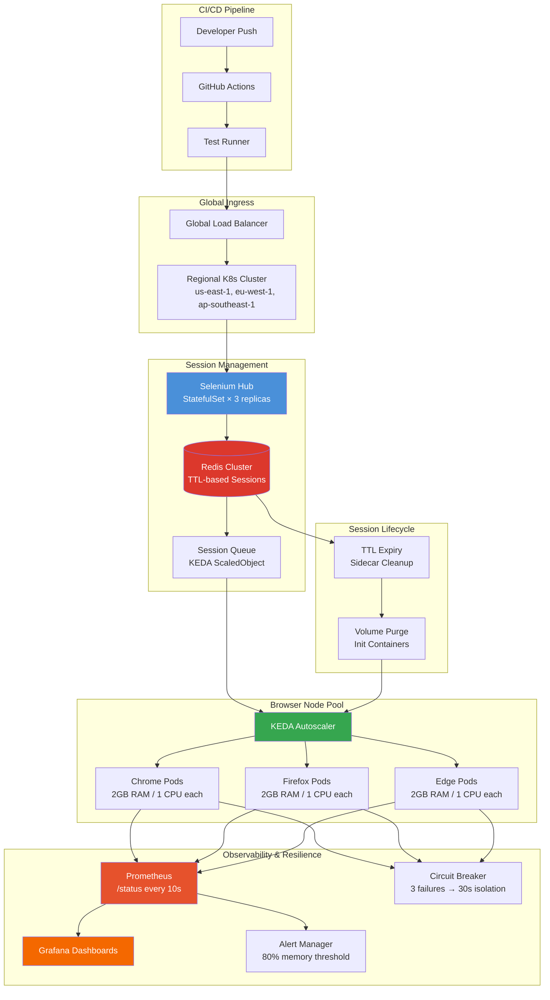

| Difficulty | Channel | Tags |
|---|---|---|
| advanced | system-design | selenium, webdriver, grid |

It was the kind of problem every growing engineering team dreads. Blibli.com, one of Indonesia's largest e-commerce platforms, had a Selenium Grid running on static GCP Compute Engine VMs that worked fine — until it didn't. As their engineering team grew and release cadence accelerated, their infrastructure started fighting back: VMs sat idle (and costing money) during off-peak hours, yet couldn't scale fast enough during peak testing windows. Scaling meant manually provisioning servers. Browser version upgrades meant touching every VM individually. The pain was real, quantified, and entirely avoidable [1].

---

> ### Real-World Case — Blibli.com (PT Global Digital Niaga)
>
> Blibli.com, one of Indonesia's largest e-commerce platforms, relied on Selenoid (Docker-based Selenium) running on static GCP Compute Engine VMs for their test automation. As their engineering team grew and release cadence accelerated, they hit a wall: VMs sat idle (and costing money) during off-peak hours, but couldn't scale fast enough during peak testing windows. Scaling required manual VM provisioning and browser version upgrades meant touching every server individually.
>
> | | |
> |---|---|
> | **Challenge** | Static VM-based Selenium Grid couldn't handle burst test loads efficiently. Pre-provisioned VMs cost ~$371/month each (N2 standard, 32GB RAM, 8 vCPUs) regardless of usage, yet during peak hours tests queued due to insufficient capacity. Manual VM management created operational toil — browser upgrades, configuration changes, and capacity planning were all slow, manual processes. |
> | **Solution** | Migrated to Selenium Grid on Google Kubernetes Engine (GKE) with KEDA event-driven autoscaling. KEDA monitors the Selenium Grid GraphQL endpoint for session queue depth and automatically scales browser pods from 0 to hundreds based on real-time demand. Used Kubernetes preStop lifecycle hooks for graceful node draining (curl the local node's /se/grid/node/drain endpoint, then wait for active tests to finish before pod termination). Implemented separate node pools for hub vs browser nodes, with node-selector pinning browser pods to auto-scaled node pools. |
> | **Outcome** | 40-50% cost reduction per node compared to static VMs (GKE autoscaling vs always-on Compute Engine). Scale-to-zero when idle eliminates wasted spend. Burst scaling to hundreds of browser instances during peak loads without manual intervention. Browser version upgrades became a single config change instead of per-server manual updates. Maintenance overhead dropped dramatically — no more VM provisioning or OS patching for test nodes. |
> | **Lesson** | CPU/memory-based HPA doesn't work for Selenium Grid because browser pods consume variable resources — KEDA's event-driven approach (watching the actual session queue via GraphQL) is essential. Even more counterintuitive: scaling TO ZERO saves more money than you expect, because test infrastructure is inherently bursty (heavy during releases, quiet otherwise). The preStop drain pattern is critical — without it, Kubernetes randomly kills pods mid-test during scale-down, causing cascading failures across your test suite. |

---

## Hook — The Infrastructure Pain That Creeps Up on Every Team

You know the feeling. Your test suite started small — a few dozen browser tests running happily on a single machine. Then the team grew. The test count grew. The release cadence accelerated. Suddenly, that single Selenium node is struggling, so you add another VM. Then another. Before you know it, you are managing a fleet of servers like a full-time system administrator, not an engineer. This is exactly where Blibli.com found themselves [1]. Their Selenoid (Docker-based Selenium) setup on static Compute Engine VMs had become a bottleneck disguised as infrastructure. The real question: how do you design a system that handles 10,000 concurrent test sessions, maintains 99.9% uptime, and — most importantly — doesn't require a team of SREs just to keep the lights on?

## Problem — Why Traditional Selenium Grid Breaks at Scale

Here is the fundamental tension: Selenium nodes are stateful, ephemeral, and resource-hungry all at once. Each browser instance consumes significant CPU and memory. A single misbehaving test can leak memory across sessions. And test demand is inherently spiky — quiet at 3 AM, chaotic before a release. Traditional approaches fail in predictable ways. Static VM pools either over-provision (wasting money) or under-provision (blocking developers). Manual session cleanup leads to zombie containers consuming memory until the node crashes. Health checks are an afterthought, so a single hung browser can silently degrade the entire grid. The result: flaky tests, frustrated developers, and a infrastructure bill that keeps climbing. The question is not whether you will hit these problems — it is when.

## Real-World Case — Blibli.com's Journey to 50% Cost Reduction

Blibli.com's engineering team ran their test automation on Selenoid deployed across static GCP Compute Engine VMs. The setup worked, but the cracks were showing. Scaling required manual VM provisioning — an operational tax on every growth spurt. Browser version upgrades meant SSH-ing into every server individually. And the worst part? VMs ran 24/7 whether tests were executing or not, burning money during idle hours [1]. The turning point came when they migrated to GKE (Google Kubernetes Engine) with KEDA (Kubernetes Event-Driven Autoscaling). The results tell the story: a 40-50% cost reduction per node compared to static VMs. Scale-to-zero eliminated idle spend entirely. During peak loads, the cluster bursts to hundreds of browser instances without human intervention. Browser version upgrades became a single configuration change instead of a weekend-long operations project. Maintenance overhead dropped to nearly zero — no more VM provisioning, no more OS patching for test nodes. But here is the crucial distinction: KEDA did not just scale based on CPU metrics. It scaled based on the actual Selenium session queue depth, meaning new browser nodes spun up precisely when tests were waiting in line. This event-driven approach is the difference between reactive autoscaling and predictive autoscaling.

## Deep Dive — The Architecture Behind 10,000 Concurrent Sessions

To understand what makes this architecture work, you need to look at four interconnected layers: session management, resource allocation, observability, and resilience. Session management starts with Redis. Every test session gets a TTL (time-to-live) entry in a Redis cluster. When the TTL expires — say a test hangs or the client disconnects — the session is automatically cleaned up. No zombie sessions, no memory leaks. Redis runs in clustered mode across three or more replicas, ensuring no single point of failure [2][3]. Resource allocation follows the principle of predictable overcommitment. Each browser pod gets resource limits: 2 GB RAM and 1 CPU core. With 50 sessions per node, that is 40 MB per session — tight but workable with proper isolation. The horizontal pod autoscaler (HPA) monitors the session queue depth in Redis and scales the node pool up or down accordingly. When the queue is empty, the cluster scales to zero. Peak throughput demands 200 nodes minimum (10,000 ÷ 50), requiring about 520 GB of cluster memory (400 GB baseline plus a 30% safety buffer). Observability is the backbone. Prometheus scrapes every node's /status endpoint every 10 seconds [4]. Grafana dashboards visualize memory trends, session durations, and queue depths in real time [5]. Alerts fire when any node's memory usage crosses 80%, triggering preventative remediation before the node becomes unhealthy. Resilience uses circuit breakers and pod disruption budgets. A Hystrix-style circuit breaker pattern wraps each node — after three consecutive health check failures, the node is isolated for a 30-second recovery window [6][7]. Pod Disruption Budgets guarantee at least 85% of nodes remain available during rolling updates or node failures. This prevents cascading failures where a single bad node takes down the grid.

## Workflow — The Session Lifecycle from Request to Cleanup

The complete journey of a test session reveals how each component collaborates. A developer triggers a test suite from CI/CD. The request hits a global load balancer, which routes it to the nearest regional Kubernetes cluster. The Selenium Hub (deployed as a StatefulSet for stable DNS naming) receives the request and creates a session entry in the Redis cluster with a configurable TTL — typically 30 minutes. The session queue increments, triggering KEDA to scale up a new browser pod if needed. The pod registers itself with the Hub, executes the test, and reports the session as complete. On completion — or TTL expiry — the sidecar container runs cleanup routines: terminating the browser process, removing Docker volumes, and decrementing the session counter. Prometheus scrapes the updated metrics, and Grafana reflects the change in real-time dashboards. The key insight: every step has a fallback. If Redis is unreachable, the Hub uses an in-memory store. If a node fails its health check, the circuit breaker isolates it. If a pod exceeds its memory limit, Kubernetes OOM-kills just that pod, not the entire node.

## Code Example — Implementing a Production-Grade Node Health Check

The health check service is where your resilience strategy lives or dies. Here is a Python implementation that combines circuit breaker logic with Prometheus metrics — the same pattern used by teams running Selenium Grid at scale. This service runs as a sidecar container alongside each Selenium node, not as a centralized checker. Distributed health checks eliminate the single-point-of-failure problem and allow each node to self-report its status.

## Lessons Learned — What Every Team Should Do Differently Tomorrow

Five patterns emerge from Blibli.com's transformation and the broader industry experience: First, scale on queue depth, not CPU. CPU-based autoscaling is always too slow for bursty test workloads. Use KEDA or a custom metric based on your session queue [1]. Second, treat every session as ephemeral. Redis TTLs, sidecar cleanup containers, and init containers for volume cleanup should be non-negotiable parts of your deployment [3]. Third, budget memory with a safety margin. The 400 GB + 30% calculation is not arbitrary — it accounts for JVM overhead, browser memory fragmentation, and monitoring agents. Fourth, test your circuit breakers. Simulate node failures in staging and verify that the grid degrades gracefully instead of collapsing. Netflix's Chaos Engineering principles apply directly here — the grid should survive losing 15% of its nodes without noticeable impact [6]. Finally, invest in observability before you need it. Prometheus + Grafana dashboards pay for themselves the first time a memory leak starts trending upward at 2 AM on a Friday.

---

## Selenium Grid Architecture on Kubernetes

<strong>Original Interview Question</strong>

**Q:** Design a scalable Selenium Grid architecture to handle 10,000 concurrent test sessions with 99.9% uptime, ensuring zero memory leaks through automatic session lifecycle management, real-time monitoring, and graceful node failure recovery across multiple data centers?

**A:** Deploy Kubernetes cluster with auto-scaling node pools, Redis session store with TTL policies, Prometheus metrics for memory monitoring, circuit breakers for node isolation, and sidecar containers for session cleanup. Implement health checks, resource quotas, and rolling updates.

## Conclusion

Blibli.com's 50% cost reduction did not come from a single magic bullet. It came from systematically replacing fragile infrastructure with resilient patterns: Redis-backed session TTLs replaced manual cleanup; KEDA's event-driven scaling replaced over-provisioned VM pools; circuit breakers replaced optimistic failure handling; and Prometheus observability replaced guesswork. The takeaway for your team is simple: Selenium Grid is not a deployment problem — it is a distributed systems problem. Treat it like one. Start with your session lifecycle (Redis TTLs and sidecar cleanup), add event-driven scaling (KEDA on queue depth), instrument everything (Prometheus + Grafana), and wrap it all in circuit breakers. The first time your grid survives a node failure without anyone noticing, you will know it was worth it.

---

## References

1. [Blibli.com (PT Global Digital Niaga) — Scaling Selenium Grid on GCP Using KEDA](https://medium.com/bliblidotcom-techblog/scaling-selenium-grid-on-gcp-using-keda-which-saves-us-on-the-cost-too-b479c00c5526) — blog
2. [Kubernetes HorizontalPodAutoscaler Documentation](https://kubernetes.io/docs/tasks/run-application/horizontal-pod-autoscale/) — documentation
3. [Redis Keyspace Notifications and TTL](https://redis.io/topics/ttl) — documentation
4. [Prometheus Overview — Monitoring System & Time Series Database](https://prometheus.io/docs/introduction/overview/) — documentation
5. [Grafana Documentation — Observability and Data Visualization](https://grafana.com/docs/grafana/latest/) — documentation
6. [Circuit Breaker Pattern — Martin Fowler's Bliki](https://martinfowler.com/bliki/CircuitBreaker.html) — blog
7. [SeleniumHQ/docker-selenium — Docker images for Selenium Grid](https://github.com/SeleniumHQ/docker-selenium) — blog
8. [GKE Cluster Autoscaler Documentation](https://cloud.google.com/kubernetes-engine/docs/concepts/cluster-autoscaler) — documentation
9. [Wikipedia — Selenium (Software)](https://en.wikipedia.org/wiki/Selenium_(software)) — documentation

---

**Author:** Satishkumar Dhule — [GitHub](https://github.com/satishkumar-dhule) · [LinkedIn](https://linkedin.com/in/satishkumar-dhule) · [Website](https://satishkumar-dhule.github.io)
