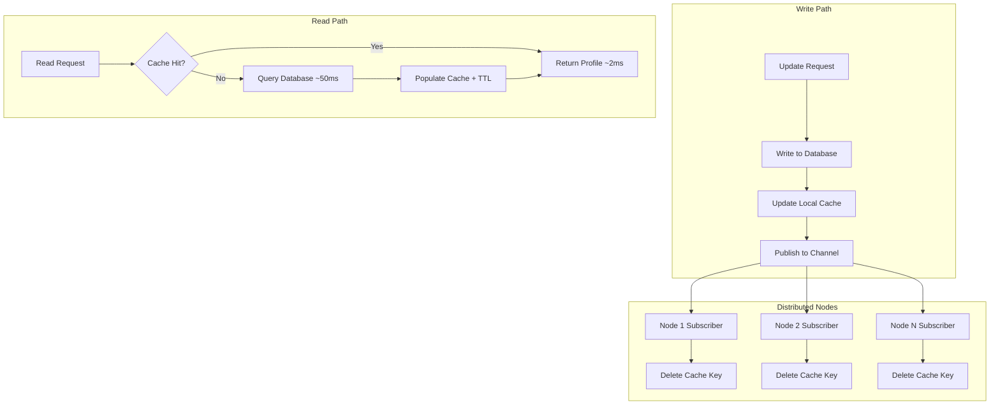

| Difficulty | Channel | Tags |
|---|---|---|
| beginner | backend | redis, memcached, cache-invalidation |

Cache invalidation is famously one of the two hard things in computer science — but when LinkedIn's Espresso datastore was serving 4.8 million profile reads per second, their caching layer was making things worse, not better [1]. After removing Memcached entirely during their Oracle migration, they rebuilt from scratch and achieved a 99% cache hit rate. Here is what they learned.

---

> ### Real-World Case — LinkedIn
>
> LinkedIn's member profile datastore (Espresso) was hitting scalability limits, serving over 4.8M profile reads/sec with traffic doubling yearly. Their existing Memcached caching layer caused performance degradation during node expansion, replacement, and cache warmup — maintenance was so painful they'd removed it entirely during their 2014 Oracle-to-Espresso migration.
>
> | | |
> |---|---|
> | **Challenge** | How to scale a profile datastore that's 99% reads / <1% writes when simply adding more storage nodes was no longer feasible without a major reengineering effort. The cache had to be fully independent from the source of truth — no fallback allowed on cache failure — while preventing data divergence between cached profiles and the database. |
> | **Solution** | Introduced Couchbase as a distributed cache tier with a hybrid strategy: local off-heap cache (OHC) for hot keys + Couchbase for remaining reads. For cache invalidation on profile updates, they used a write-through pattern via Kafka change-data-capture streams with System Change Number (SCN) logical timestamps to order all cache writes and prevent stale data from overwriting fresh data. They cached the entire profile dataset (~24KB P95) in every datacenter with finite TTL and periodic full bootstrapping. |
> | **Outcome** | 99% cache hit rate, 60.73% reduction in P99 latency for multi-get profile reads, 63.66% reduction in P99.9 latency. Reduced Espresso storage nodes by 90%. Overall cost to serve profile requests dropped 10% annually. |
> | **Lesson** | Memcached's simplicity becomes a liability at scale — lack of persistence, replication, and dynamic scalability made node replacements and cache warmup so painful that LinkedIn abandoned caching entirely for years. Couchbase's built-in replication, persistence, and CAS-based concurrency control made the cache viable as an independent upscaling tier. The SCN-based logical timestamp ordering elegantly solves the stale-write problem that plagues naive write-through caches in distributed systems. |

---

## Hook — The Day Their Cache Became the Problem

Imagine arriving at work to find that your caching layer — the system designed to save you — is actually causing performance degradation during routine maintenance. Every node expansion meant cache warmup delays. Every replacement triggered latency spikes. LinkedIn's engineering team faced this exact nightmare with their member profile datastore, Espresso, which was serving over 4.8 million profile reads per second with traffic doubling every year [1]. Their Memcached layer was so painful to manage that they made a drastic decision: they removed it entirely during their 2014 Oracle-to-Espresso migration. No caching at all. It was better than a cache that broke every time you touched it.

## Problem — Why Cache Invalidation Haunts Every Developer

Phil Karlton famously said there are only two hard things in computer science: cache invalidation and naming things. It is not a joke — it is a battle scar from production. When a user updates their profile, you have three choices: serve stale data, block the request until the cache updates, or risk inconsistent reads across distributed nodes. Each choice has consequences. Stale data erodes user trust. Blocking destroys your latency guarantees. Inconsistency leads to bugs that are nearly impossible to reproduce. The stakes are real: a cached profile read might take 2 milliseconds, while a database query could take 50 milliseconds or more. At LinkedIn's scale, every percentage point of cache miss means thousands of extra database queries per second. This is why cache invalidation strategy is not an academic exercise — it determines whether your database survives traffic spikes [4].

## Real-World Case — LinkedIn's Caching Comeback

LinkedIn's Espresso datastore handles over 4.8 million profile reads per second, and that number was growing rapidly. They originally relied on Memcached, but every node expansion or replacement caused performance degradation during cache warmup. The maintenance pain was so severe they removed the entire caching layer during their migration from Oracle to Espresso. Without caching, they had to scale Espresso storage aggressively — using 10x more nodes than they needed. The solution came through a carefully designed caching strategy. The results were dramatic: a 99% cache hit rate, 60.73% reduction in P99 latency for multi-get profile reads, and a 63.66% reduction in P99.9 latency. They reduced Espresso storage nodes by 90% and cut overall serving costs by 10% annually [1]. The lesson is clear: caching is not optional at scale, but a poorly chosen caching strategy is worse than no cache at all.

## Deep Dive — Redis vs Memcached: Choosing Your Weapon

When you reach for a production caching solution, two names dominate: Redis and Memcached. Most developers know the surface differences, but the real trade-offs only appear under load. Redis supports pub/sub messaging, enabling automatic distributed cache invalidation: when one node updates a profile, it publishes an invalidation event that all subscribers consume [2]. This eliminates the polling overhead that plagued LinkedIn's Memcached setup. Memcached, on the other hand, is simpler and faster for pure key-value lookups with lower memory overhead and straightforward horizontal scaling [3]. However, it lacks built-in invalidation coordination — you would need short TTLs or a custom message bus to keep caches consistent across nodes. Here is the counterintuitive insight: Redis's extra features (persistence, streams, sorted sets) make it more than a cache, but that flexibility comes with higher memory overhead per key. Memcached shines when you need raw throughput and memory efficiency for simple workloads. The right answer depends on whether you need a cache or a data platform [5][6].

## Workflow — The Write-Through + TTL Pattern

The most battle-tested approach combines write-through caching with TTL-based expiration. When a user updates their profile, you write the new data to both the database and the cache, then publish an invalidation event. All nodes receive the event and delete their stale cache entries. On reads, you follow the cache-aside pattern: check the cache first, fall back to the database on a miss, and populate the cache with a TTL for next time. The TTL (5–30 minutes) is your safety net — even if an invalidation message is lost, the cache entry self-destructs.

The Mermaid diagram below illustrates the complete flow — from the write path through distributed invalidation and back to the read path.



The pattern is especially effective for profile services where data changes infrequently but is read constantly — exactly the workload LinkedIn optimized.

## Code Example — Production Cache in Python with Redis

Here is a production-inspired implementation using Python and Redis. The `ProfileCache` class implements write-through caching with distributed invalidation via pub/sub. The TTL acts as a safety net so even if a subscriber misses an invalidation message, stale data is eventually evicted.

```python
import redis
import json
from typing import Optional

class ProfileCache:
    """Write-through cache with TTL and pub/sub invalidation."""

    def __init__(self, redis_client: redis.Redis, ttl: int = 900):
        self.cache = redis_client
        self.ttl = ttl  # 15-minute fallback TTL

    def get_profile(self, user_id: str) -> Optional[dict]:
        """Cache-aside: check cache first, DB on miss."""
        cached = self.cache.get(f"profile:{user_id}")
        if cached:
            return json.loads(cached)
        profile = self._load_from_db(user_id)
        if profile:
            self.cache.setex(
                f"profile:{user_id}", self.ttl,
                json.dumps(profile)
            )
        return profile

    def update_profile(self, user_id: str, data: dict) -> dict:
        """Write-through: DB + cache, then broadcast invalidation."""
        profile = self._save_to_db(user_id, data)
        # Write fresh data to local cache
        self.cache.setex(
            f"profile:{user_id}", self.ttl,
            json.dumps(profile)
        )
        # Notify all nodes to invalidate via pub/sub
        self.cache.publish("profile:updates", json.dumps({
            "user_id": user_id,
            "action": "invalidate"
        }))
        return profile

    def _load_from_db(self, user_id: str) -> Optional[dict]:
        return None

    def _save_to_db(self, user_id: str, data: dict) -> dict:
        return {"user_id": user_id, **data}
```

The key design decision: the TTL makes the system eventually consistent, but the write-through + pub/sub combination makes it strongly consistent in practice. Redis pub/sub guarantees at-most-once delivery, so the TTL is your fallback if a subscriber misses a message [2]. For systems with stricter consistency requirements, Redis Streams provide persistent message delivery with consumer groups.

## Lessons Learned — What LinkedIn's Journey Teaches Us

LinkedIn's story offers several actionable takeaways. First, measure everything: cache hit rates and P99 latency revealed the true cost of their cache warmup problem [1]. Second, choose the right tool for the job: Redis pub/sub solved distributed invalidation where Memcached fell short, but Memcached is still the right choice for many simpler workloads [3]. Third, always have a fallback: TTL-based expiration catches invalidation failures. Fourth, caching is not set-and-forget — as traffic grows, your strategy must evolve. What worked at 1 million reads per second may break at 10 million. Start simple, measure relentlessly, and upgrade your caching architecture before your users feel the pain.

---

## Cache Invalidation Workflow

```mermaid
flowchart TD
    subgraph Write Path
        A[Update Request] --> B[Write to Database]
        B --> C[Update Local Cache]
        C --> D[Publish to Channel]
    end
    subgraph Distributed Nodes
        D --> E[Node 1 Subscriber]
        D --> F[Node 2 Subscriber]
        D --> G[Node N Subscriber]
        E --> H[Delete Cache Key]
        F --> I[Delete Cache Key]
        G --> J[Delete Cache Key]
    end
    subgraph Read Path
        K[Read Request] --> L{Cache Hit?}
        L -->|Yes| M[Return Profile ~2ms]
        L -->|No| N[Query Database ~50ms]
        N --> O[Populate Cache + TTL]
        O --> M
    end
```



<details>
<summary><strong>Original Interview Question</strong></summary>

**Q:** You're building a user profile service that caches frequently accessed profiles. How would you implement cache invalidation when a user updates their profile, and what trade-offs would you consider between Redis and Memcached?

**A:** Implement write-through caching with TTL-based expiration. On profile update, invalidate the cache by deleting the key and writing new data to both the database and cache. Redis offers pub/sub for automatic distributed invalidation, while Memcached requires manual coordination across nodes.

</details>

## Conclusion

Cache invalidation is not just a theoretical puzzle — it is the difference between a system that survives 4.8 million requests per second and one that crumbles under its own weight. LinkedIn's journey from removing caching entirely to achieving a 99% hit rate proves that the right strategy transforms your infrastructure. Tomorrow, take a look at your own caching layer. Measure your hit rate. Check your TTLs. Ask yourself: is your cache helping, or hurting? Because at scale, the wrong caching strategy is worse than no cache at all.

---

## References

1. [LinkedIn incident report](https://www.linkedin.com/blog/engineering/data-management/upscaling-profile-datastore-while-reducing-costs) — article
2. [Redis Pub/Sub Documentation](https://redis.io/docs/latest/develop/interact/pubsub/) — documentation
3. [Memcached Wiki](https://github.com/memcached/memcached/wiki) — documentation
4. [Cache (computing) — Wikipedia](https://en.wikipedia.org/wiki/Cache_(computing)) — documentation
5. [Redis — Wikipedia](https://en.wikipedia.org/wiki/Redis) — documentation
6. [Memcached — Wikipedia](https://en.wikipedia.org/wiki/Memcached) — documentation
7. [AWS ElastiCache Best Practices](https://docs.aws.amazon.com/AmazonElastiCache/latest/dg/ElastiCache.BestPractices.html) — documentation
8. [Cache stampede — Wikipedia](https://en.wikipedia.org/wiki/Cache_stampede) — documentation

---

**Author:** Satishkumar Dhule — [GitHub](https://github.com/satishkumar-dhule) · [LinkedIn](https://linkedin.com/in/satishkumar-dhule) · [Website](https://satishkumar-dhule.github.io)
