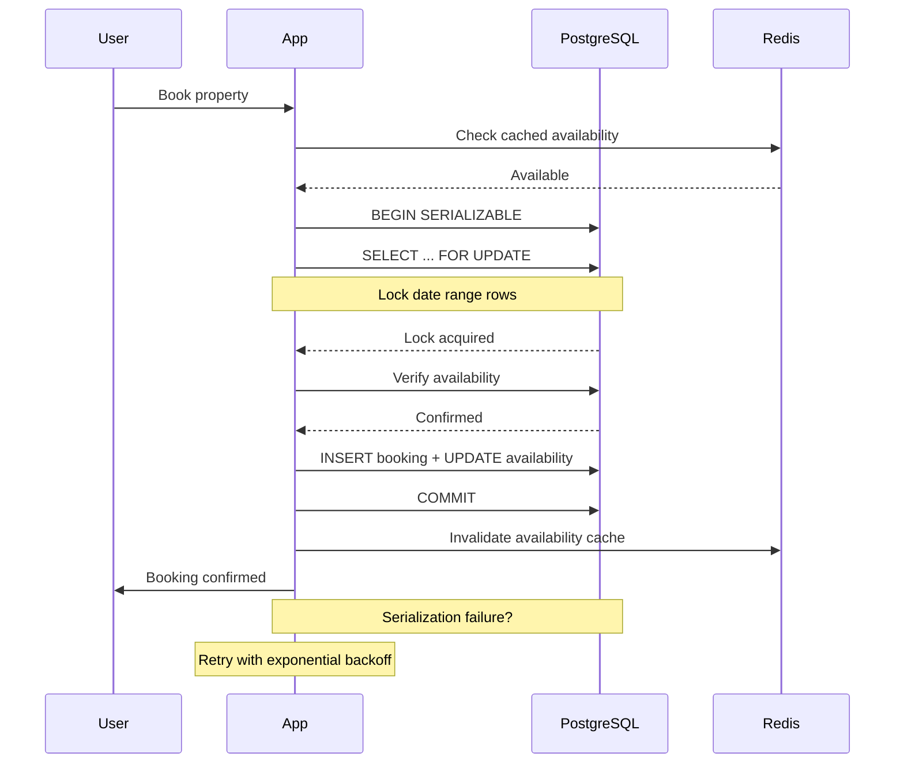

| Difficulty | Channel | Tags |
|---|---|---|
| intermediate | database | acid, isolation-levels, mvcc |

In November 2022, 14 million Taylor Swift fans simultaneously tried to book Eras Tour tickets on Ticketmaster, generating 3.5 billion system requests — four times the platform's previous peak [1]. The site crashed repeatedly. Tickets vanished from carts mid-transaction. The general sale was cancelled entirely. For developers building booking systems, this was a masterclass in what happens when concurrent transactions collide without proper isolation.

---

> ### Real-World Case — Ticketmaster
>
> In November 2022, Ticketmaster's platform catastrophically failed during the Taylor Swift Eras Tour presale. 14 million concurrent users generated 3.5 billion system requests (4x their previous peak), causing the site to crash repeatedly. Tickets vanished from users' shopping carts, the queue system froze, and the general sale was cancelled entirely.
>
> | | |
> |---|---|
> | **Challenge** | How to maintain strong consistency and prevent overselling when millions of users concurrently attempt to book a limited inventory of 2.4 million tickets. The system needed atomic inventory reservation, proper lock management on seat selection, and protection against race conditions where multiple users see the same seat as available and all attempt to purchase it simultaneously. |
> | **Solution** | Ticketmaster's legacy architecture lacked proper concurrency control. Their cart reservation system failed to acquire proper locks on seats during the selection window — tickets added to carts weren't atomically reserved, so multiple users could see the same seats as 'available' and attempt checkout simultaneously. The interactive seat map (ISM) contributed to cascading failures: when a user's cart expired or checkout failed, they returned to the seat map and grabbed other seats, creating a 'thundering herd' problem that amplified contention on remaining inventory. The system had no circuit breakers, no meaningful capacity throttling, and relied on a monolithic bottleneck (the ISM) that couldn't scale horizontally. |
> | **Outcome** | Only 2.4 million tickets were successfully sold out of 14 million trying users. The fiasco triggered a U.S. Senate Judiciary Committee hearing, a Department of Justice antitrust investigation, and a class-action lawsuit. Ticketmaster's market capitalization took significant reputational damage — 'Ticketmaster' became synonymous with system failure. Taylor Swift herself stated she was 'devastated' and that it was 'excruciating' to watch the failure happen. |
> | **Lesson** | Concurrency control and inventory locking are not optimizations — they are correctness requirements. A system handling limited inventory must atomically reserve items at the moment they enter a cart, not at checkout. Any gap between 'seat selected' and 'seat locked' is a window for double-booking. And legacy architecture debt doesn't surface until it's too late — at Taylor Swift scale, there are no second chances. |

---

## Hook — 12 Million Lost Tickets

It was supposed to be a routine presale. Instead, it became one of the most infamous system failures of the decade. When Ticketmaster opened the gates for Taylor Swift's Eras Tour in November 2022, 14 million verified users flooded the platform simultaneously, generating 3.5 billion requests — a staggering 4x spike over their previous peak [1]. The result was catastrophic: pages timed out, users were ejected from the queue at random, and worst of all, tickets simply evaporated from shopping carts mid-transaction. Only 2.4 million tickets were sold. Twelve million people walked away with nothing. If you have ever built a booking system — for hotels, flights, event tickets, or anything involving scarce, concurrently-demanded resources — this failure should stop you cold. Because the root cause was not a server shortage or a CDN misconfiguration. It was database concurrency.

## Problem — The Silent Race Condition

The core challenge in any booking system is deceptively simple: two users see the same available slot at the same time, and both hit Book Now. Without proper transaction isolation, the database silently accepts both writes, and you have a double booking. This is the classic lost update problem — transaction A reads a row, transaction B reads the same row, both see available inventory, both write conflicting changes, and neither knows the other existed. The stakes could not be higher. A double booking on Airbnb means two families showing up to the same cabin. A double booking on Ticketmaster means selling the same seat twice. A double booking on an airline means bumping a paying passenger. Many developers reach for a simple mutex or a distributed lock and call it done. Here is the thing, though — locks alone are not enough. You need to understand how isolation levels, MVCC snapshots, and row-level locking work together. Because when the hammer falls — when 14 million users arrive at once — the wrong choice can collapse an entire platform.

## Real-World Case — Ticketmaster's Eras Tour Collapse

Ticketmaster's platform had handled high-demand events before. Their previous peak was roughly 3.5 million concurrent users — and the team had stress-tested for up to 4x that capacity [1]. Nobody anticipated 14 million. The system used a virtual waiting room — a queue pattern common for high-demand events — to throttle incoming traffic. But the bottleneck was not the queue itself. It was the database layer handling ticket inventory and cart reservations. When users added tickets to their carts, the system needed to temporarily reserve that inventory while the user completed checkout. These reservations were implemented as database transactions. The problem? Under the default READ COMMITTED isolation level, concurrent transactions could read stale snapshots of inventory. Tickets appeared available, multiple users reserved the same seats, and the database could not detect or resolve the write conflicts. The result was phantom inventory that did not actually exist, shopping carts that randomly emptied, and a user experience that felt like the system was actively hostile. The aftermath was brutal: a U.S. Senate Judiciary Committee hearing, a Department of Justice antitrust investigation, a class-action lawsuit, and incalculable reputational damage. Taylor Swift herself called the situation 'excruciating' to watch.

## Deep Dive — SERIALIZABLE, MVCC, and Row-Level Locks

To prevent this kind of collapse, you need three database concepts working in concert. **First: isolation levels.** PostgreSQL's SERIALIZABLE isolation level is the gold standard for concurrent booking operations [2]. It guarantees that concurrent transactions appear to execute one after another, as if serialized. But it comes with a critical trade-off: serialization failures. Under SERIALIZABLE, PostgreSQL detects conflicts between overlapping transactions and aborts one of them, returning error code 40001. Many developers see this as a bug. It is actually the feature — the database is telling you, 'I cannot safely commit this transaction, try again.' Your application must handle this with retry logic. **Second: MVCC (Multiversion Concurrency Control).** PostgreSQL implements MVCC to allow concurrent reads and writes without blocking [4]. Each transaction sees a snapshot of the database as of the moment the transaction began. This is great for performance — a read never blocks a write, and vice versa. But it is dangerous for booking systems, because your snapshot can show availability that another transaction has already locked. You cannot rely on snapshot reads alone for inventory checks. **Third: row-level locking with SELECT FOR UPDATE.** This is where you take explicit control [3]. When you execute SELECT FOR UPDATE on specific rows — say, the date range for a property — PostgreSQL locks those rows so no other transaction can modify them until you commit or roll back. Combined with SERIALIZABLE isolation, this gives you a powerful guarantee: either the booking succeeds atomically, or the transaction aborts with a serialization error that you can retry. The key insight is that SERIALIZABLE alone detects conflicts after the fact (optimistic), while SELECT FOR UPDATE prevents them proactively (pessimistic). Using both together creates a defense-in-depth strategy.

## Workflow — The Atomic Booking Flow

Here is the complete booking flow that prevents double bookings under high concurrency. The sequence diagram below illustrates the full lifecycle of a booking request, from the user clicking Book Now to receiving confirmation.

## Code Example — Implementing SERIALIZABLE Booking in PostgreSQL

The following implementation shows how to handle concurrent bookings in production. The pattern combines SERIALIZABLE isolation, SELECT FOR UPDATE for row-level locking, exponential backoff retry logic, and cache invalidation.

## Lessons Learned — What to Do Differently Tomorrow

Three takeaways from the Ticketmaster disaster that apply to any concurrent booking system. **First: default isolation levels are not safe for inventory operations.** PostgreSQL defaults to READ COMMITTED, which allows non-repeatable reads and phantom rows. You must explicitly elevate to SERIALIZABLE for booking transactions, even though it means handling serialization failures [5]. **Second: implement retry logic with exponential backoff.** SERIALIZABLE transactions will fail under contention — that is by design. The solution is not to weaken isolation, but to retry with backoff. A simple pattern: three retries, doubling delay each time (100ms, 200ms, 400ms) with jitter [6]. **Third: cache availability, not inventory.** You can safely cache what dates are generally available (a binary yes/no per date range) with a short TTL. But never cache the actual inventory count or rely on cached values for transactional decisions. Always verify against the source of truth within the serialized transaction [7]. The last lesson is perhaps the most important: test at the edge. Ticketmaster tested for 4x their previous peak. The actual demand was over 4x higher than that. When your platform handles money and scarce resources, design for the spike you cannot imagine.

---

## Booking Transaction Flow

<strong>Original Interview Question</strong>

**Q:** You're building a booking system for Airbnb where multiple users can reserve the same property simultaneously. How would you design the transaction handling to prevent double bookings while maintaining high availability?

**A:** Use SERIALIZABLE isolation with optimistic concurrency control. Implement row-level locks on property availability tables, use MVCC snapshot reads for checking availability, and apply application-level validation to ensure atomic booking operations.

## Conclusion

The Ticketmaster meltdown was not a hardware failure or a capacity planning mistake. It was a database transaction design failure — one that could have been prevented with the right isolation strategy. SERIALIZABLE isolation, row-level locking with SELECT FOR UPDATE, MVCC awareness, and robust retry logic form a four-layer defense against the double-booking problem. Next time you design a booking system, start there. And when someone asks why you are not using the default isolation level, you have a story to tell — the night 14 million fans taught the industry what happens when you skip the database fundamentals.

---

## References

1. [Taylor Swift–Ticketmaster controversy](https://en.wikipedia.org/wiki/Taylor_Swift%E2%80%93Ticketmaster_controversy) — article
2. [PostgreSQL Documentation — Transaction Isolation](https://www.postgresql.org/docs/current/transaction-iso.html) — documentation
3. [PostgreSQL Documentation — Explicit Locking](https://www.postgresql.org/docs/current/explicit-locking.html) — documentation
4. [PostgreSQL Documentation — MVCC](https://www.postgresql.org/docs/current/mvcc.html) — documentation
5. [Isolation (database systems)](https://en.wikipedia.org/wiki/Isolation_(database_systems)) — article
6. [Optimistic concurrency control](https://en.wikipedia.org/wiki/Optimistic_concurrency_control) — article
7. [Multiversion concurrency control](https://en.wikipedia.org/wiki/Multiversion_concurrency_control) — article
8. [CAP Theorem](https://en.wikipedia.org/wiki/CAP_theorem) — article

---

**Author:** Satishkumar Dhule — [GitHub](https://github.com/satishkumar-dhule) · [LinkedIn](https://linkedin.com/in/satishkumar-dhule) · [Website](https://satishkumar-dhule.github.io)
