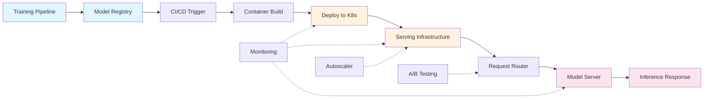
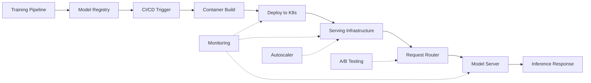

| Difficulty | Channel | Tags |
|---|---|---|
| beginner | devops | mlops, deployment |

Pinterest's ML serving system was silently dying — not from code bugs or model accuracy, but from network payload bloat. Every new model added more features to the pipe between root and leaf servers until the system started choking on its own data. Here is what happened, and what it teaches us about the often-confused worlds of model deployment versus model serving.

---

> ### Real-World Case — Pinterest
>
> Pinterest's ML serving system used a root-leaf architecture where the 'root' handled feature processing and distributed scoring requests to 'leaf' GPU partitions running model inference. As ML adoption exploded across Ads, Search, Recommendations, and Notifications, the network payload between root and leaf grew to include every possible feature, creating a severe bottleneck.
>
> | | |
> |---|---|
> | **Challenge** | The ML serving network was saturated — the root was sending ALL available features to EVERY leaf partition regardless of which features each model actually needed. Engineers initially tried fixing this with compute optimizations (compression, batching tweaks), but the real problem was architectural: the serving layer lacked awareness of per-model feature requirements, causing unnecessary data transfer, latency spikes, and GPU underutilization. |
> | **Solution** | Pinterest built 'Feature Trimmer' — a system that established the model signature as the source of truth for required features. The trimmer creates a version-aware feature allowlist per model, so the root only sends features each leaf partition actually needs. This is synced with model rollouts, ensuring serving matches deployment exactly. The key insight was separating the deployment concern (what features exist) from the serving concern (what features to send per request). |
> | **Outcome** | 25-30% p99 latency reduction for Related Pins models. The Ads team downsized the root cluster by 27%. 45% and 65% drops in egress network throughput for Search and Notification clusters. $4M+ in annual infrastructure cost savings from rightsizing. 5% additional GPU capacity unlocked through improved batching logic. 0.17% marginal revenue increase from fewer server timeouts. |
> | **Lesson** | Your serving bottleneck is probably not where you think it is. Pinterest assumed they had a compute problem (need more GPUs) but it was actually a network/feature payload problem. The tight coupling between feature computation (deployment concern) and request routing (serving concern) was the root cause — once they decoupled them with the Feature Trimmer, both latency and infrastructure costs improved dramatically. |

---

## Hook — The Silent Bottleneck

Imagine deploying a state-of-the-art recommendation model only to discover your real bottleneck is not GPU compute or model accuracy — it is the sheer weight of the data moving between servers. This was exactly the nightmare Pinterest's ML infrastructure team faced. Their root-leaf architecture, where a 'root' server processes features and distributes scoring requests to 'leaf' GPU partitions, was designed for efficiency. But as ML adoption exploded across Ads, Search, Recommendations, and Notifications, something unexpected happened: the network payload between root and leaf grew to include every possible feature for every model [1]. The result was a severe bottleneck that degraded latency, wasted GPU cycles, and burned millions in infrastructure costs.

## Problem — Deployment vs. Serving: The Two Halves of Production ML

If you ask most engineers what it means to 'put a model in production', you will get a dozen different answers. Some think about Kubernetes clusters and CI/CD pipelines. Others think about REST APIs and inference endpoints. Here is the uncomfortable truth: both are right, and confusing them is how infrastructure debt quietly accumulates.

Model deployment is the *process* of getting your model into a production environment. It includes CI/CD pipelines [2], infrastructure provisioning with tools like Terraform [3], container orchestration with Kubernetes, experiment tracking with MLflow, and monitoring dashboards. Think of it as the backstage crew — invisible when it works, catastrophic when it breaks.

Model serving, on the other hand, is the *runtime* — what actually happens when a request arrives. It covers inference APIs via FastAPI or gRPC, model loading and memory management in TorchServe or TensorFlow Serving, request batching, autoscaling, and response optimization. This is the front-stage performance that users actually feel.

Many teams think nailing deployment is enough. They set up beautiful CI/CD pipelines and call it done. Then they wonder why their 99th percentile latency is through the roof. Pinterest's story is a perfect illustration of what happens when you focus on deployment and neglect the serving architecture's hidden costs.

## Real-World Case — Pinterest's Feature Trimmer

Pinterest's ML ecosystem had grown into a sprawling network of models across Ads, Search, Recommendations, and Notifications. Their architecture used a root-leaf pattern: a 'root' service handled feature engineering and distributed scoring requests to 'leaf' GPU partitions running the actual model inference. It sounded clean on paper.

But here was the catch: every time a new use case was added, the root service had to pass *every possible feature* to the leaves — even features irrelevant to a specific model. The network payload ballooned. GPU memory was wasted loading unused features. Batch sizes shrank as servers timed out waiting for oversized requests.

When the team finally measured the damage, the numbers were sobering — and then transformative. By implementing a 'Feature Trimmer' that stripped irrelevant features before transmission, they achieved a 25-30% reduction in p99 latency for Related Pins models. The Ads team downsized their root cluster by 27%. Search and Notification clusters saw 45% and 65% drops in egress network throughput respectively. The bottom line? Over $4 million in annual infrastructure savings, 5% additional GPU capacity unlocked from better batching logic, and a 0.17% marginal revenue increase from fewer server timeouts [1].

This is the kind of impact you only discover when you look beyond deployment pipelines and into the runtime serving architecture itself.

## Deep Dive — The Deployment vs. Serving Stack

Pinterest's bottleneck reveals a crucial insight: deployment and serving live at different layers of the stack, with different trade-offs and failure modes.

**Deployment concerns**:
- Infrastructure provisioning (Kubernetes clusters, node pools, GPU instances)
- CI/CD orchestration (GitHub Actions, Jenkins, ArgoCD)
- Environment parity (staging vs. production configs)
- Model registry and versioning (MLflow, DVC, SageMaker Model Registry)
- Monitoring and alerting (Prometheus, Grafana, Datadog)

**Serving concerns**:
- Inference API design (REST, gRPC, GraphQL)
- Model loading strategies (lazy loading, warm startup, model multiplexing)
- Request batching (dynamic batching, adaptive batching)
- Autoscaling policies (CPU-based, request-based, latency-based)
- Cold start mitigation (pre-warmed workers, model snapshotting)

You might think these are just 'ops details.' But the trade-offs are deeply technical. Take latency versus throughput: serving a single request at lightning speed means dedicating GPU memory to one model at a time, which kills throughput. Batching requests maximizes GPU utilization but adds queuing latency. Real-time inference demands sub-100ms responses, while batch inference can tolerate seconds [4]. The wrong choice here cascades into your deployment costs directly.

Horizontal scaling — adding more pod replicas — is great for stateless HTTP services but gets tricky with GPU-bound model serving, where each replica may need its own GPU memory allocation. Vertical scaling — beefing up individual nodes with more GPU memory or faster CPUs — hits physical limits fast [5]. Pinterest's solution was neither; it was a smarter serving architecture that reduced the data payload, effectively improving both without adding hardware.

## Workflow — The Model Lifecycle from Training to Inference

The workflow connecting deployment and serving looks like this:



**Step 1: Training & Registration** — Models are trained and logged to a registry (MLflow, SageMaker, or custom). The registry stores metadata, metrics, and artifacts [6].

**Step 2: CI/CD Pipeline** — A new model version triggers the pipeline. Tests run, a Docker image is built, and the image is pushed to a container registry [7].

**Step 3: Deployment** — Kubernetes applies the updated manifest. If you are using canary deployments or blue/green strategies, traffic is gradually shifted.

**Step 4: Serving** — The model server loads the model into memory. The request router (NGINX, Envoy) directs traffic based on version headers or weights [8].

**Step 5: Monitoring** — Metrics flow back. Latency spikes, error rates, and GPU utilization inform autoscaling decisions and rollback triggers.

Pinterest's insight was that Step 4 — the serving layer — was the bottleneck, and fixing it required looking at *what* was being sent, not just *how* it was being routed.

## Code Example — A Feature Trimmed Serving Middleware

Here is a simplified implementation inspired by Pinterest's approach. This FastAPI middleware intercepts inference requests and strips irrelevant features before they reach the model server — reducing payload size and improving latency.

```python
from fastapi import FastAPI, Request
from pydantic import BaseModel
from typing import Dict, List
import time

app = FastAPI()

# Mapping of model_id to the features they actually need
MODEL_FEATURE_MAP: Dict[str, List[str]] = {
    "related_pins_v2": ["pin_embedding", "board_topics", "user_interests"],
    "search_ranking_v3": ["query_embedding", "pin_text", "click_history"],
    "ad_click_v1": ["ad_embedding", "user_demographics", "device_type"],
}

class InferenceRequest(BaseModel):
    model_id: str
    features: Dict[str, object]

@app.post("/predict")
async def predict(request: InferenceRequest):
    start = time.perf_counter()
    
    # Get the allowed features for this model
    allowed_features = MODEL_FEATURE_MAP.get(request.model_id, [])
    
    # Strip irrelevant features before they touch the GPU
    trimmed_features = {
        k: v for k, v in request.features.items()
        if k in allowed_features
    }
    
    # Measure the savings
    original_size = len(str(request.features))
    trimmed_size = len(str(trimmed_features))
    savings = (1 - trimmed_size / original_size) * 100
    
    # Forward to the actual model server
    prediction = await route_to_model_server(
        model_id=request.model_id,
        features=trimmed_features
    )
    
    elapsed = time.perf_counter() - start
    print(f"Payload reduced by {savings:.1f}% | "
          f"Inference took {elapsed*1000:.1f}ms")
    
    return {"prediction": prediction, "latency_ms": round(elapsed * 1000, 1)}

async def route_to_model_server(model_id: str, features: Dict):
    # In production, this calls TorchServe, TF Serving, etc.
    return {"result": "simulated", "features_used": list(features.keys())}
```

**How it works:** The middleware acts as an intelligent gatekeeper. Each model has a declared set of required features (`MODEL_FEATURE_MAP`). When a request arrives, the middleware filters out every feature not on the allow-list before the payload ever reaches the GPU-bound model server. This is exactly the pattern Pinterest used — their 'Feature Trimmer' sits at the root service and prunes the feature set per-model before sending to leaf servers [1].

The key insight: this is not about compression or serialization formats. It is about **semantic pruning** — knowing what each model actually needs and refusing to carry dead weight. The savings compound at scale: a 60% payload reduction on every request means 60% less network I/O, 60% less deserialization work, and more room for productive batching.

## Lessons Learned — What Pinterest Taught Us About ML Infrastructure

Pinterest's story is not about a novel algorithm or a breakthrough in model architecture. It is about something far more mundane and far more impactful: paying attention to what moves between your servers.

Here are the lessons that transfer to any ML team:

**1. Serving is not deployment.** Beautiful CI/CD pipelines will not fix a bloated network payload. You need to think about serving as a first-class engineering discipline with its own metrics, bottlenecks, and optimization strategies.

**2. Measure before you scale.** Pinterest didn't start by throwing more GPUs at the problem. They measured network throughput, identified the root cause, and fixed it surgically. The $4M savings came from *removing* work, not adding capacity.

**3. Feature engineering is not free at inference time.** Every feature you compute during training feels necessary. Every feature you carry through to inference has a cost — in latency, memory, and throughput. Be deliberate about what you send to production.

**4. Latency and throughput are a coupled system.** Improving one through batching or pruning can unlock capacity in the other. Pinterest's 5% GPU capacity gain came purely from better batching after reducing payload size — no new hardware needed.

**5. The 0.17% revenue lift matters.** Sometimes small percentage improvements in infrastructure efficiency translate directly to revenue through reduced timeouts and higher availability. These are the gains that compound.

If you are building ML infrastructure, your first instinct might be to reach for more GPUs, bigger clusters, or the latest serving framework. Pinterest's example suggests something more powerful: sometimes the best optimization is not adding — it is subtracting.

---

## ML Model Lifecycle from Training to Production Inference



<details>
<summary><strong>Original Interview Question</strong></summary>

**Q:** Explain the key differences between model serving and model deployment in ML systems, including specific technologies, scaling considerations, and real-world implementation patterns?

**A:** Deployment encompasses CI/CD pipelines, infrastructure setup, and monitoring using tools like Kubernetes, MLflow, and SageMaker. Serving focuses on runtime inference APIs with frameworks like TensorFlow Serving, TorchServe, or BentoML, handling request routing, model versioning, and autoscaling. Key trade-offs include latency vs throughput, batch vs real-time inference, and cold start optimization.

</details>

## Conclusion

The next time your ML team debates whether to buy more GPUs or scale up clusters, ask a different question first: What data are you sending between your servers that nobody needs? Pinterest's $4M lesson is that the most expensive infrastructure problem is the one you never measure. Start measuring your serving payload today — your latency, your budget, and your users will thank you.

---

## References

1. [Pinterest Engineering — Optimizing ML Workload Network Efficiency: Feature Trimmer](https://medium.com/pinterest-engineering/optimizing-ml-workload-network-efficiency-part-i-feature-trimmer-ae20beb08d69) — blog
2. [Kubernetes Production Best Practices](https://kubernetes.io/docs/setup/production-environment/) — documentation
3. [Terraform Documentation — Infrastructure as Code](https://developer.hashicorp.com/terraform/docs) — documentation
4. [TorchServe Documentation — Model Serving on PyTorch](https://pytorch.org/serve/) — documentation
5. [Kubernetes — Configuring Autoscaling for ML Workloads](https://kubernetes.io/docs/concepts/architecture/) — documentation
6. [MLflow Documentation — Machine Learning Lifecycle](https://mlflow.org/docs/latest/index.html) — documentation
7. [GitHub Actions Documentation — CI/CD Pipelines](https://docs.github.com/en/actions) — documentation
8. [Envoy Proxy — Architecture Overview](https://www.envoyproxy.io/docs/envoy/latest/) — documentation
9. [FastAPI Documentation — High Performance Python APIs](https://fastapi.tiangolo.com/) — documentation

---

**Author:** Satishkumar Dhule — [GitHub](https://github.com/satishkumar-dhule) · [LinkedIn](https://linkedin.com/in/satishkumar-dhule) · [Website](https://satishkumar-dhule.github.io)
