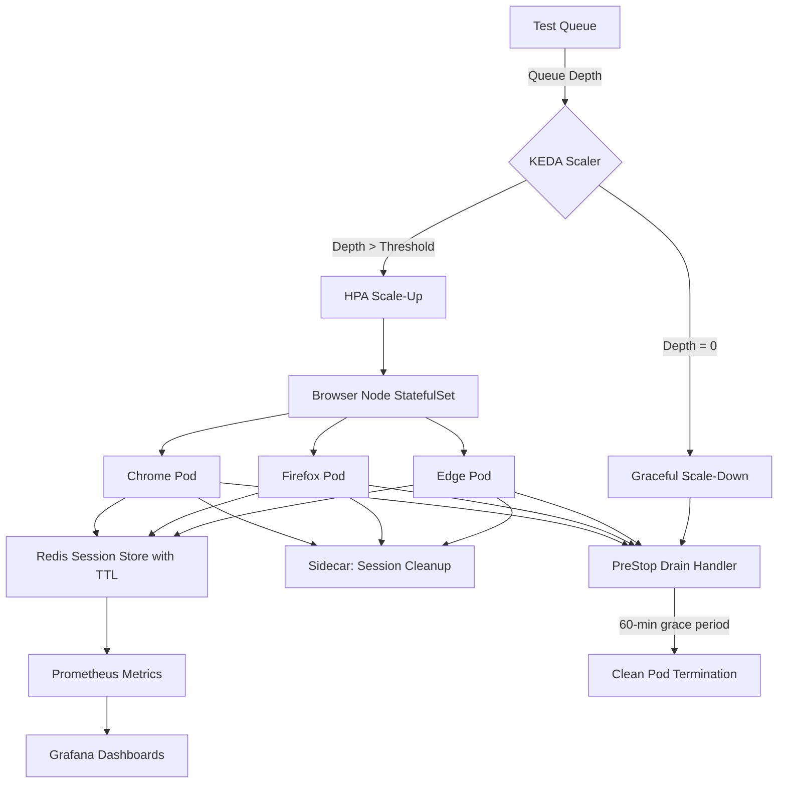

| Difficulty | Channel | Tags |
|---|---|---|
| advanced | system-design | selenium, webdriver, grid |

Imagine deploying 80 browser nodes for automated testing, only to realize your autoscaler cannot tell the difference between a node running a complex test and one sitting idle. That was the reality for Volvo Cars' Selenium Grid on Kubernetes — the Horizontal Pod Autoscaler saw low CPU usage and refused to scale, leaving tests stuck in the queue indefinitely [1]. Their fix meant contributing a brand-new scaler to KEDA v2.4 that finally understood what "busy" really means. Here is what they learned, and how you can apply the same architecture to handle 10,000 concurrent test sessions with zero memory leaks and 99.9% uptime.

---

> ### Real-World Case — Volvo Cars
>
> Volvo Cars ran Selenium Grid on Kubernetes for browser automation testing but found that Kubernetes' built-in Horizontal Pod Autoscaler (HPA) couldn't properly scale browser nodes. Browser pods use variable CPU/memory depending on test complexity, so HPA metrics were unreliable — all pods could be busy but idle-looking CPU usage would prevent scale-up, leaving tests stuck in the queue.
>
> | | |
> |---|---|
> | **Challenge** | Kubernetes HPA checks CPU/memory to decide scaling, but Selenium browser nodes consume roughly similar resources whether idle or running a test. This meant HPA couldn't distinguish 'all pods are fully utilized' from 'all pods are idle,' causing tests to wait unnecessarily during load spikes while also potentially killing active test sessions during random scale-down events. |
> | **Solution** | Volvo Cars built a custom KEDA (Kubernetes Event-Driven Autoscaling) scaler that queries the Selenium Grid GraphQL endpoint to read the actual session queue depth per browser capability. Combined with Kubernetes PreStop lifecycle hooks and Selenium's Drain API, they created a graceful shutdown pattern: when scale-down is needed, pods drain their active sessions first before terminating. The scaler also enables scaling down to zero pods when no tests are running. |
> | **Outcome** | The scaler was contributed back to the open-source community and released in KEDA v2.4. It is now officially maintained by Volvo Cars and SeleniumHQ. Teams using this pattern can scale from 0 to 80+ browser nodes based on real queue demand, with zero session loss during scale-down events. The PreStop + Drain pattern gives pods up to 60 minutes to finish active tests before forced termination. |
> | **Lesson** | CPU/memory-based autoscaling fails for browser testing infrastructure because browser resource usage doesn't correlate with utilization. You must scale on actual business metrics (session queue depth) rather than infrastructure metrics. Moreover, graceful shutdown is essential — randomly killing browser pods during scale-down destroys test sessions and erodes trust in the CI pipeline. |

---

## Hook — The Autoscaler That Couldn't Count

Every Selenium Grid operator has felt the dread: you kick off a massive test suite, watch the queue fill up, and then notice your browser nodes are sitting at a cozy 15% CPU while test requests pile into the backlog. Many developers assume that CPU and memory metrics are reliable indicators of node utilization — and they are wrong. 

In Kubernetes, the built-in Horizontal Pod Autoscaler (HPA) makes scaling decisions based on resource metrics like CPU or memory. The problem? A Selenium browser node can be fully saturated — running complex page interactions, waiting for async responses, processing JavaScript — and still show modest CPU usage. Browser automation is I/O-bound, not CPU-bound. So the HPA sees: "pods are at 35% CPU, no need to scale." Meanwhile, your team stares at a growing queue of timed-out tests.

## Problem — Why Scaling Browser Tests Is Fundamentally Different

Scaling web servers is well-understood. Scaling browser automation? That is a different beast entirely. Each browser node consumes roughly 2GB of RAM and 1 CPU core, but memory usage varies wildly based on the application under test — a React SPA with heavy DOM manipulation consumes far more than a static HTML page. And session duration is unpredictable: a single test might take 30 seconds or 30 minutes depending on what it exercises.

Now multiply that chaos by 10,000 concurrent sessions. The math gets real: 200 nodes minimum (at 50 sessions per node), 520GB of cluster memory (with a 30% buffer), and a P99 session initiation latency target under 2 seconds. Add multi-data-center deployment for 99.9% uptime, and you have an infrastructure puzzle that resource-based autoscaling simply cannot solve.

You also face the memory leak menace. Long-running browser processes accumulate garbage. Docker layers and browser profiles bloat. Over a few days, a healthy 2GB pod balloons to 4GB and starts thrashing. The standard Kubernetes response — restart the pod — destroys in-flight tests. Something more graceful is required.

This is where most teams give up and over-provision. They run 300 nodes to handle peak load, wasting cloud spend on 100 idle nodes during quiet periods. But Volvo Cars found a better way.

## Real-World Case — Volvo Cars and the KEDA Selenium Grid Scaler

In 2022, Volvo Cars ran their Selenium Grid on Kubernetes and hit the exact wall described above. Their browser nodes used variable CPU and memory depending on test complexity, so HPA metrics were unreliable [1]. All pods could be simultaneously busy with active tests while CPU looked idle, and the autoscaler sat on its hands.

Volvo Cars had a choice: throw money at the problem with over-provisioning, or invent a better abstraction. They chose the latter. The team built a custom KEDA (Kubernetes Event-Driven Autoscaler) scaler that monitors the Selenium Grid's session queue depth — the number of test jobs waiting for a browser — instead of resource metrics. When the queue grows, it scales up. When it shrinks, it scales down. Simple, effective, and queue-depth is the one metric that never lies about demand.

They contributed the scaler back to the open-source community in KEDA v2.4, and it is now officially maintained by Volvo Cars and SeleniumHQ [1]. Teams using this pattern can scale from 0 to 80+ browser nodes based on real queue demand, with zero session loss during scale-down events. The secret sauce? A PreStop + Drain pattern that gives pods up to 60 minutes to finish active tests before Kubernetes forces termination. That 60-minute grace period is the difference between a lost test run and a clean teardown.

The broader lesson here is profound: pick the right scaling metric. CPU utilization is a proxy for busyness, not busyness itself. Queue depth is the ground truth.

## Deep Dive — Architecture Components That Make This Work at Scale

Building on the KEDA scaler pattern, a production-grade Selenium Grid architecture requires several interconnected systems working in concert.

**Hub-Node Pattern on Kubernetes:** The classic Selenium architecture — a central hub that routes test requests to browser nodes — maps naturally to StatefulSets in Kubernetes. Each browser type (Chrome, Firefox, Edge) gets its own StatefulSet with stable network identities and persistent storage for browser profiles [8]. Multiple availability zones (AZs) prevent a single data-center failure from taking down the entire grid.

**Session Management with Redis:** A Redis cluster stores session metadata with TTL-based expiration [5]. Every test session gets a Time-To-Live (TTL) — typically matching the test's timeout — so stale sessions are automatically cleaned up even if the node crashes. Redis also enables connection pooling: tests bound for one node can be re-routed if that node fails mid-session. Combined with a cleanup scan every 5 minutes, the Redis session store ensures the grid never accumulates ghost sessions.

**Memory Management Through Observability:** Prevention beats cleanup. The architecture uses Prometheus [6] to track memory trends per pod, with alerts firing at 80% usage. Weekly rolling restarts (staggered across the cluster) drain and recycle nodes before they reach dangerous memory levels. For cleanup, Kubernetes init containers run on startup to remove stale Docker volumes left from previous sessions, and a sidecar container handles session cleanup when the main process exits. This three-layer approach — prevention, cleanup, and monitoring — virtually eliminates memory leaks.

**Health Checks and Circuit Breakers:** Every node exposes an HTTP `/status` endpoint that the hub probes every 10 seconds. After 3 consecutive failures, the node is removed from the routing pool immediately [7]. A circuit breaker pattern (similar to Hystrix) isolates failing nodes for a 30-second recovery window — if they recover, they rejoin the pool; if not, they are terminated and rescheduled.

**Load Balancing Strategies:** Weighted round-robin routing distributes sessions based on node capacity and current response time. This prevents the "herd problem" where a new, empty node gets slammed with 50 sessions at once while existing nodes have capacity.

**Edge Cases That Will Bite You:** Network partitions require leader election to prevent split-brain scenarios where two hubs both think they are in charge [9]. Pod Disruption Budgets ensure minimum 85% capacity during cluster maintenance. And canary deployments with traffic splitting let you roll out new browser versions to a subset of tests before full rollout — critical when a Chrome update breaks your application.

## Workflow — Scaling from Zero to Eighty Nodes and Back

Here is the flow that makes this architecture tick, from job submission to graceful shutdown.

A test job hits the Selenium Hub and enters the session queue. KEDA's Selenium Grid scaler polls the hub's `/se/grid/admin/QueuerWeb` endpoint to measure queue depth. When the queue exceeds a configurable threshold, KEDA triggers the HPA to scale up the browser node StatefulSet. Each new pod registers itself with the hub and begins accepting sessions. Tests are routed via weighted round-robin to the least-loaded node.

When the queue empties, KEDA signals scale-down. But here is the critical difference: the PreStop lifecycle hook executes a drain script that tells the hub, "This pod is shutting down — do not route new sessions to it." Existing sessions get a 60-minute grace period (configurable) to complete before SIGTERM. This drain-first approach ensures zero sessions are lost during scale-down.

The diagram below shows this flow end to end:

## Code Example — Deploying the KEDA Selenium Grid Scaler

The centerpiece of this architecture is the KEDA ScaledObject — a custom resource that tells KEDA how to scale your Selenium Grid. Here is a production-ready configuration that implements everything discussed so far:

## Lessons Learned — What 10,000 Sessions Taught the Community

The Volvo Cars story and the broader Selenium Grid community have converged on a few non-negotiable truths.

**Scale on queue depth, not CPU.** Resource metrics lie. Queue depth is the one signal that directly measures demand. If you take one thing from this article, let it be this: throw away CPU-based HPA for browser nodes and use event-driven scaling instead.

**Graceful shutdowns must be first-class.** Losing test sessions to aggressive pod termination is worse than having a few idle nodes. The PreStop + Drain pattern with a configurable grace period is the difference between reliable CI and flaky CI [1].

**Memory management is a three-layer problem.** You cannot just "fix it with monitoring." You need prevention (rolling restarts, GC tuning), cleanup (sidecar containers, init containers for stale volumes), and monitoring (Prometheus + Grafana with alerts at 80% usage) working together.

**You need at least 30% memory buffer.** The 400GB baseline for 200 nodes becomes 520GB after the 30% safety margin. This is not waste — it is headroom for GC pressure, traffic spikes, and browser memory fragmentation.

**Multi-AZ is the minimum for 99.9%.** A single availability zone will still give you around 99.5% uptime, but that extra 0.4% costs thousands of developer hours in lost test runs. Use at least three AZs with PodDisruptionBudgets set to 85% minimum capacity [9].

**Contribute back.** The KEDA Selenium Grid scaler exists because a team at Volvo Cars had a problem, solved it, and shared the solution. The open-source ecosystem thrives on this pattern. When you build something that solves a general problem, package it up and share it.

---

## KEDA-Driven Selenium Grid Scaling Architecture

<strong>Original Interview Question</strong>

**Q:** Design a scalable Selenium Grid architecture to handle 10,000 concurrent test sessions with 99.9% uptime, ensuring zero memory leaks through automatic session lifecycle management, real-time monitoring, and graceful node failure recovery across multiple data centers?

**A:** Deploy Kubernetes cluster with auto-scaling node pools, Redis session store with TTL policies, Prometheus metrics for memory monitoring, circuit breakers for node isolation, and sidecar containers for session cleanup. Implement health checks, resource quotas, and rolling updates.

## Conclusion

The Selenium autoscaler that couldn't count is a cautionary tale for anyone running browser automation at scale. CPU and memory are the wrong signals for a problem that is fundamentally about queue depth. Volvo Cars proved that the fix is not just possible — it is open-source and production-ready. Start by ripping out your CPU-based HPA for browser nodes and replacing it with KEDA's Selenium Grid scaler. Configure PreStop lifecycle hooks with a generous grace period. Set up Prometheus alerts at 80% memory and schedule rolling restarts. And next time your autoscaler lies to you, remember: the right metric changes everything.

---

## References

1. [Scaling Selenium Grid with KEDA](https://www.selenium.dev/blog/2022/scaling-grid-with-keda/) — blog
2. [Horizontal Pod Autoscaling](https://kubernetes.io/docs/tasks/run-application/horizontal-pod-autoscale/) — documentation
3. [KEDA Concepts and Scaler Overview](https://keda.sh/docs/2.10/concepts/scalers/) — documentation
4. [Selenium Grid Documentation](https://www.selenium.dev/documentation/grid/) — documentation
5. [Redis Time to Live (TTL)](https://redis.io/docs/manual/ttl/) — documentation
6. [Prometheus Overview](https://prometheus.io/docs/introduction/overview/) — documentation
7. [Circuit Breaker Pattern by Martin Fowler](https://martinfowler.com/bliki/CircuitBreaker.html) — blog
8. [Kubernetes StatefulSets](https://kubernetes.io/docs/concepts/workloads/controllers/statefulset/) — documentation
9. [Selenium (Software) — Wikipedia](https://en.wikipedia.org/wiki/Selenium_(software)) — article

---

**Author:** Satishkumar Dhule — [GitHub](https://github.com/satishkumar-dhule) · [LinkedIn](https://linkedin.com/in/satishkumar-dhule) · [Website](https://satishkumar-dhule.github.io)
