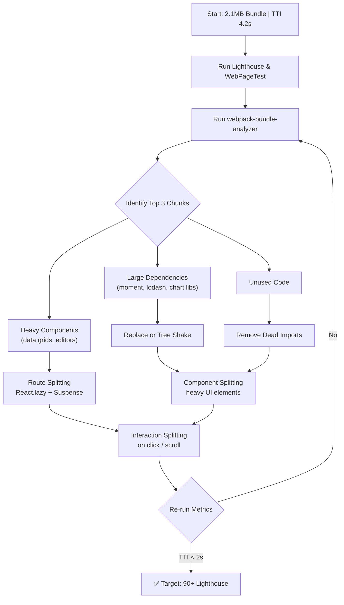

| Difficulty | Channel | Tags |
|---|---|---|
| intermediate | frontend | lighthouse, bundle, lazy-loading |

Wix powers hundreds of millions of websites using React with server-side rendering. As sites grew richer, a silent crisis was brewing: Time-to-Interactive kept climbing, especially on mobile. Fewer than 40% of Wix sites achieved a 'good' INP score — Google's Core Web Vitals responsiveness metric — putting them among the worst-performing platforms [1]. The engineering team found themselves staring at the same problem you might be facing right now: a 2.1MB JavaScript bundle, a 4.2-second Time-to-Interactive, and a Lighthouse score stubbornly stuck at 65.

---

> ### Real-World Case — Wix
>
> Wix powers hundreds of millions of websites using React with SSR. As sites grew richer, hydration became a critical bottleneck — Time-to-Interactive kept climbing, especially on mobile. Less than 40% of Wix sites achieved a 'good' INP score (Google's Core Web Vitals responsiveness metric), putting them at the bottom among competitors.
>
> | | |
> |---|---|
> | **Challenge** | React SSR gives fast paint but forces an 'all-at-once' hydration model — every component on the page must be hydrated before any of it becomes interactive. On content-heavy pages, users paid the full JavaScript tax for components they never scrolled to or interacted with. |
> | **Solution** | They used React 18's Suspense API in an unconventional way: wrapped each component in a Suspense boundary with a Promise that only resolves when an Intersection Observer detects the component is near the viewport. Below-the-fold components cost zero JavaScript and zero CPU until the user scrolls to them. This turned hydration from an all-at-once process into an on-demand one — without refactoring any React component or changing how developers build apps. |
> | **Outcome** | 20% reduction in JavaScript payloads, ~40% improvement in INP (Interaction to Next Paint) across hundreds of millions of real user sessions. Achieved without giving up SSR, without component rewrites, and without changing developer workflows. |
> | **Lesson** | The biggest performance wins sometimes come from using existing tools in smarter ways, not adopting new frameworks. Suspense was originally designed for lazy loading, but creative use of its promise-driven API can solve the hydration tax that has plagued SSR React apps for years. |

---

## Hook — The Score That Haunts Your Sleep

You have seen the Lighthouse report. 65 out of 100. A borderline D. Red text everywhere. You added lazy loading. You compressed images. You deferred third-party scripts. And the needle barely moved. Here is the uncomfortable truth: most performance optimization advice treats symptoms, not root causes. You trim a kilobyte here, defer a script there, and the score crawls up by two points. Meanwhile, your Time-to-Interactive is still over four seconds on mobile, and every 100-millisecond delay is silently tanking your conversion rates. Wix faced this same exact wall. Their response — selective hydration with Suspense — cut JavaScript payloads by 20% and improved INP by 40% across hundreds of millions of real user sessions [1]. They did it without rewriting components or changing developer workflows. This is the playbook they followed.

## Problem — JavaScript Is Not Free (And Never Was)

A 2.1MB bundle does not cost 2.1MB of bandwidth. It costs 2.1MB to download, parse, compile, and execute. Those are four distinct taxes, and every byte pays all four. On a mid-range Android phone, parsing 2MB of JavaScript can take 5 to 8 seconds — longer than the entire network download [2]. Images paint as they load. CSS applies as it parses. But JavaScript blocks the main thread. Until the JS finishes executing, your app cannot respond to a single click, tap, or scroll. This is the React hydration problem in a nutshell: the server sends fully rendered HTML, then React downloads, parses, and executes the entire component tree to attach event handlers — even the components hidden below the fold. You are paying the full JavaScript tax on parts of the page the user has not even seen yet. Most teams attack bundle size by removing unused npm packages. That is table stakes. The real gains come from architectural changes: code splitting, selective hydration, and component-level lazy loading. But few teams know where to start because the metrics lie to you. Lighthouse scores can look decent while real-user INP is terrible. The score is a signal, not the goal.

## Real-World Case — How Wix Moved 40% Faster Without a Rewrite

Wix powers over 200 million websites. Their React + SSR stack served complete HTML on the server, but hydration required downloading and executing the full JavaScript bundle for every page — even lightweight sites. The result was punishing INP scores on mobile, especially for content-heavy sites with interactive embeds. Wix's engineering team realized traditional optimization — smaller bundles, faster networks — had diminishing returns. The breakthrough came from changing WHEN hydration happens, not how much JavaScript ships. They implemented selective hydration using React's Suspense: the server sends the full HTML, but the browser only hydrates components as they become visible or interactive [1]. The results were staggering: 20% reduction in initial JavaScript payloads, roughly 40% improvement in INP across hundreds of millions of real user sessions, and zero changes to how developers wrote components. The key insight was that not all components need to be interactive immediately. A contact form at the bottom of a long article can wait. A chart that requires a user click can defer its entire bundle. Wix proved that architectural optimization — not just trimming bytes — is where the exponential gains live.

## Deep Dive — Code Splitting Is a Spectrum, Not a Switch

Code splitting is not one technique. It is a sliding scale from coarse to granular, and choosing the wrong granularity costs you. Route-based splitting is the coarsest and most common: every page becomes its own chunk. It is easy to implement, works with any router, and gives the biggest bang for the least effort. Component-based splitting is finer: heavy components like charts, calendar pickers, and rich text editors are isolated into their own chunks and only loaded when rendered. Interaction-based splitting takes it further: a component does not load until the user clicks, hovers, or scrolls to it. Most teams stop at route splitting and call it done. That is where they leave 70% of the potential savings on the table. Tree shaking with ES modules is the prerequisite. If your build pipeline is not configured properly — CommonJS imports, side-effect flags missing, barrel exports everywhere — your code splitting will split air. A properly tree-shaken bundle removes dead code at the module level, not just the file level [8]. webpack-bundle-analyzer is your MRI machine [6]. Run it before and after every optimization. You will find libraries like moment.js pulling in all locale data when you only need English, or lodash imported wholesale when you use three utility functions. Replace moment with date-fns or dayjs. Replace lodash with native Array and Object methods. Each replacement drops 100-500KB from your bundle.

## Workflow — The Performance Optimization Pipeline

The optimization pipeline follows a repeatable cycle: Measure → Analyze → Split → Validate. Here is how it works in practice, visualized in the diagram below. Start with Lighthouse and WebPageTest to establish baseline scores. Run webpack-bundle-analyzer to understand what is in your bundle and which chunks are largest. Identify the top three heaviest dependencies and replace or tree-shake them. Implement route-based splitting with React.lazy() and Suspense for every page or route. Then add component-level splitting for heavy UI elements (charts, data grids, editors). Finally, add interaction-based splitting — components that only load on user action. After each step, re-run Lighthouse and compare real-user metrics through RUM data. The diagram shows this as a pipeline where each optimization feeds into smaller, more targeted chunks until the TTI target is met.

The optimization pipeline:

## Code Example — Lazy Loading Done Right

Here is what production-grade lazy loading looks like. The example combines route-based splitting, component-based splitting with fallback states, and interaction-triggered loading — all wrapped in error boundaries.

Route-based splitting loads entire pages as separate chunks. The webpackChunkName comment tells the bundler to name the chunk for easier debugging. Each route gets its own Suspense boundary so one route loading does not block the entire navigation.

Component-level splitting isolates heavy UI elements into their own chunks. The HeavyFeatureToggle component demonstrates interaction-based loading: the chart bundle does not even start downloading until the user clicks the button. This is the most aggressive form of lazy loading and works beautifully for features the majority of users never interact with.

The ErrorBoundary catches failures during dynamic import — network outages, broken chunks, expired cache — and renders a graceful fallback instead of a white screen.

## Lessons Learned — What to Do Monday Morning

The Wix story reveals three truths that apply to every React codebase. First, architecture beats trimming. Shaving 10KB from a 2MB bundle is a rounding error. Rethinking WHEN code loads — through selective hydration and interaction-based splitting — delivers 10x the impact [1]. Second, measure real users, not just Lighthouse. Lighthouse is a synthetic lab test. Your real bottleneck is INP and TTI on actual mobile devices with slow CPUs and throttled networks. Use the Web Vitals library or a RUM tool to capture what real users experience [7]. Third, start at the top of the bundle analysis. Run webpack-bundle-analyzer today. The largest item in your report is where you should focus first — not the easiest fix, the biggest impact [6]. Many developers spend weeks micro-optimizing images and fonts while ignoring the 800KB charting library that loads on every page. Do not be that developer.

Your next move should be: (1) Run webpack-bundle-analyzer and screenshot the treemap. (2) Identify the three largest dependencies and research lighter alternatives. (3) Wrap your routes in React.lazy() and add Suspense boundaries. (4) For any component heavier than 50KB, convert it to a dynamic import. (5) Set up a Lighthouse CI gate that fails builds if the score drops below your target [5].

---

## Performance Optimization Pipeline

<strong>Original Interview Question</strong>

**Q:** You're tasked with improving a React app's Lighthouse performance score from 65 to 90+. The bundle size is 2.1MB and Time to Interactive is 4.2s. What specific steps would you take to optimize the bundle and implement lazy loading?

**A:** Implement code splitting with React.lazy() and Suspense, analyze bundle composition with webpack-bundle-analyzer to identify largest chunks, remove unused dependencies and optimize imports, add dynamic imports for heavy components and third-party libraries, implement route-based splitting for better initial load times, and utilize tree shaking with proper ES module configuration.

## Conclusion

A 65 is not a failure. It is a wake-up call. Wix proved that the path from 65 to 90+ does not require rewriting your app from scratch — it requires rethinking WHEN your code loads, not just how much of it ships. Selective hydration, route-based code splitting, and interaction-triggered lazy loading are proven strategies that work at every scale. Run your bundle analyzer today. Find your biggest chunk. Split it. Defer it. And watch your Time-to-Interactive drop. The only wrong move is staying at 65.

---

## References

1. [40% Faster Interaction: How Wix Solved React's Hydration Problem](https://www.wix.engineering/post/40-faster-interaction-how-wix-solved-react-s-hydration-problem-with-selective-hydration-and-suspen) — blog
2. [Lazy loading - MDN Web Docs](https://developer.mozilla.org/en-US/docs/Web/Performance/Lazy_loading) — documentation
3. [React.lazy - React Documentation](https://react.dev/reference/react/lazy) — documentation
4. [Code Splitting - webpack Documentation](https://webpack.js.org/guides/code-splitting/) — documentation
5. [Lighthouse Performance Scoring - Chrome Developers](https://developer.chrome.com/docs/lighthouse/performance/performance-scoring/) — documentation
6. [webpack-bundle-analyzer](https://github.com/webpack-contrib/webpack-bundle-analyzer) — documentation
7. [Web Vitals - web.dev](https://web.dev/articles/vitals) — blog
8. [Tree shaking - MDN Web Docs Glossary](https://developer.mozilla.org/en-US/docs/Glossary/Tree_shaking) — documentation
9. [Interaction to Next Paint (INP) - web.dev](https://web.dev/articles/inp) — blog

---

**Author:** Satishkumar Dhule — [GitHub](https://github.com/satishkumar-dhule) · [LinkedIn](https://linkedin.com/in/satishkumar-dhule) · [Website](https://satishkumar-dhule.github.io)
