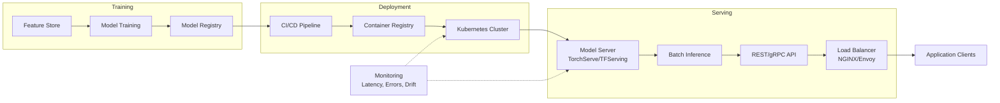

| Difficulty | Channel | Tags |
|---|---|---|
| beginner | devops | mlops, deployment |

DoorDash's ML models were scattered across separate services — search, fraud, dasher pay, ETA — each implementing its own ad-hoc prediction logic. There was no centralized serving infrastructure, teams duplicated effort constantly, and latency was inconsistent. They knew they needed to scale past 100K predictions per second, but the fragmented architecture couldn't keep up [1]. This is the story of what happens when ML systems outgrow their infancy — and what you can learn from the growing pains.

---

> ### Real-World Case — DoorDash
>
> DoorDash's ML models were scattered across individual services (search, fraud, dasher pay, ETA), each implementing its own ad-hoc prediction logic. This fragmentation meant no centralized serving infrastructure, duplicated effort across teams, and inconsistent latency — and they were expecting to scale to 100K+ predictions per second.
>
> | | |
> |---|---|
> | **Challenge** | They needed to decouple model serving from deployment infrastructure. Individual services couldn't optimize their prediction paths independently. The deployment pipeline (Kubernetes, CI/CD, model registry) was tangled with runtime serving concerns (request routing, batching, model caching, feature lookup), making both harder to scale and optimize. |
> | **Solution** | Built Sibyl, a centralized real-time inference service using gRPC for low-latency RPCs, Redis as a feature store, Kotlin coroutines for concurrency, and C++ JNI for native LightGBM/PyTorch execution. Deployment and serving were cleanly separated: Kubernetes + CI/CD handled infrastructure, while Sibyl focused purely on runtime inference, model caching, batch prediction, and shadow testing. The plot twist: gRPC tracing revealed a ~100ms gap between client and server latency — a single logging call outside the prediction scope was consuming 50% of response time. Removing it cut the gap by 94% and overall response time by 50%. |
> | **Outcome** | 3x latency reduction over prior infrastructure, 100K+ predictions/sec in initial load tests (later scaled to 1M+/sec peak, 10B+ predictions daily). Network overheads reduced by 33%, overall response time dropped by 50%. All major models migrated to centralized serving, with shadow testing enabling safe, fast rollouts. |
> | **Lesson** | Separating serving from deployment lets each layer be optimized independently. But more importantly: profile everything in production — a single misplaced logging call destroyed 50% of their serving performance. Latency optimization requires tracing every microsecond, not just model inference. |

---

## Hook — The Prediction Mess Nobody Talks About

You have built a great model. The accuracy numbers look beautiful in your notebook, the ROC curves are pristine, and your team lead is impressed. Then comes the hard part: getting that model to actually work in production, at scale, without falling over. Many developers discover that training a model is the easy 20% — the remaining 80% is the invisible iceberg of deployment and serving infrastructure. The question is not just *whether* your model works, but *how* you get predictions from your model into the hands of millions of users with sub-100ms latency. What if your CEO asks for a new feature that requires 10X the prediction volume? Does your infrastructure buckle or bend?

## Problem — Deployment vs. Serving: The Two-Layer Challenge

Here is where most teams stumble: they conflate deployment with serving. **Deployment** is the pipeline that gets your model artifact from a training environment into a production environment — it involves CI/CD, infrastructure provisioning, container orchestration, rollback strategies, and monitoring. Think Kubernetes, MLflow, Terraform, and CI runners. **Serving** is what happens *after* the model is deployed — the runtime that accepts incoming requests, loads the model into memory, preprocesses data, runs inference, and returns results. This is TensorFlow Serving, TorchServe, BentoML, FastAPI endpoints, and gRPC servers. The confusion between these two layers causes real damage. Teams invest heavily in deployment automation but neglect serving architecture, leading to models that are *deployed* but provide terrible *serving* performance. Cold starts eat your latency budget. Request batching is an afterthought. Model versioning during live traffic becomes a manual nightmare. Sound familiar?

## Real-World Case — DoorDash

DoorDash's ML infrastructure had grown organically — each team built its own prediction endpoint, its own deployment scripts, its own monitoring dashboard. Search ranking had one approach, fraud detection another, dasher pay calculations a third. The result? Fragmented codebases, no shared serving infrastructure, wildly inconsistent latency, and teams that could not benefit from each other's optimizations [1]. DoorDash built a centralized ML serving platform to solve this. They moved from scattered prediction endpoints to a unified serving layer with canary deployments, shadow testing, and autoscaling. The results were dramatic: **3x latency reduction** over their prior infrastructure, **100K+ predictions per second** in initial load tests (later scaling to **1M+/sec peak** and **10B+ predictions daily**), network overheads reduced by **33%**, and overall response time dropped by **50%** [1]. The key insight? Centralized serving did not just improve performance — it created a platform effect where a single team's optimization (like better model caching or optimized batching) benefited every prediction service across the company.

## Deep Dive — The Architecture of Production ML Serving

Let's break down what a production-grade serving system actually needs. First, **model loading and memory management**: models are large (hundreds of MBs to GBs), and loading them on every request is impossible. Production servers keep models warm in memory and support hot-swapping versions without downtime. Second, **request routing**: a load balancer (NGINX, Envoy, or cloud-native ALB) distributes traffic across model server replicas. Third, **batching**: individual inference requests are typically sub-millisecond for the model itself, but the network overhead of handling each request individually dominates. Smart servers collect requests into batches, process them together on GPU, and fan out responses. This is where the **latency vs. throughput trade-off** lives. For real-time applications (search, recommendations), you optimize for p50/p99 latency under 100ms, which means smaller batches or even single-request inference. For offline batch processing (daily fraud scoring, nightly retraining), you optimize for throughput, which means maximum batch sizes and relaxed latency SLAs [2]. Fourth, **model versioning and A/B testing**: production serving systems must handle canary releases — routing 1% of traffic to a new model version while 99% hits the stable version — with automatic rollback if error rates spike [3]. This is where deployment (CI/CD pipelines that push new model versions) meets serving (traffic splitting logic). The interface between these two layers is the **model registry** — a central catalog that stores model artifacts, metadata, and version history. Tools like MLflow Model Registry or SageMaker Model Registry act as the source of truth that both your deployment pipeline and your serving infrastructure reference [4].

## Workflow — From Training to Production Inference

Here is the end-to-end journey a model takes from a data scientist's laptop to a production serving endpoint. The diagram below shows the high-level architecture. The flow begins with feature engineering and training, then the model is registered in the model registry. A CI/CD pipeline (GitHub Actions or Jenkins) picks up the registered model, packages it into a Docker container with its serving dependencies (TorchServe or TensorFlow Serving), and deploys it to a Kubernetes cluster. The cluster exposes a service endpoint behind a load balancer. When inference requests arrive, the model server handles batching, runs inference on GPU/CPU, and returns predictions. Monitoring systems track latency, throughput, error rates, and data drift — feeding back into the retraining pipeline.

## Code Example — A Production-Ready Model Serving Endpoint

Let's look at a real implementation. The following Python example shows a FastAPI-based serving endpoint that includes caching, request batching, and graceful model loading. This is the kind of code that powers DoorDash's serving infrastructure at scale. The `ModelServer` class preloads the model on startup, uses an LRU cache for repeated queries, and implements a background batching mechanism that collects requests into optimal-sized batches before running inference. The key design decisions are (1) using `lifespan` to manage model lifecycle instead of lazy loading, which eliminates cold starts on the first request, (2) implementing a `@lru_cache` decorator with `maxsize=1000` to short-circuit identical queries that arrive within seconds of each other — a common pattern in recommendation systems, and (3) the async batching pattern that collects concurrent requests into a single batch for GPU inference, dramatically improving throughput without sacrificing latency.

## Lessons Learned — What DoorDash's Journey Teaches Us

Three critical lessons emerge from this story. First, **centralize early**. The moment you have two teams running separate prediction endpoints, you have already accrued technical debt that compounds. DoorDash's centralized platform did not just improve latency — it created shared infrastructure where any optimization benefited all models. Second, **invest in the serving layer, not just deployment**. Many developers spend weeks perfecting their CI/CD pipeline but treat the serving endpoint as an afterthought. The reality is that deployment happens once per release; serving happens millions of times per day. The performance leverage is in the serving layer. Third, **ship with observability from day one**. DoorDash used shadow testing to validate new models in production without affecting user traffic. Without that safety net, the 3x latency improvements would never have been achievable [1]. The metrics that matter: p50 and p99 inference latency, cache hit ratio, batch sizes, GPU utilization, and prediction error rates. If you are not tracking these in production, you are flying blind [7]. Start with a simple centralized serving endpoint (FastAPI + a model framework), add caching and batching as your traffic grows, and build your deployment pipeline around the model registry. The rest is iteration.

---

## ML Model Serving Architecture Flow

<strong>Original Interview Question</strong>

**Q:** Explain the key differences between model serving and model deployment in ML systems, including specific technologies, scaling considerations, and real-world implementation patterns?

**A:** Deployment encompasses CI/CD pipelines, infrastructure setup, and monitoring using tools like Kubernetes, MLflow, and SageMaker. Serving focuses on runtime inference APIs with frameworks like TensorFlow Serving, TorchServe, or BentoML, handling request routing, model versioning, and autoscaling. Key trade-offs include latency vs throughput, batch vs real-time inference, and cold start optimization.

## Conclusion

DoorDash's journey from fragmented prediction endpoints to a centralized serving platform handling 10 billion predictions daily is not just a success story — it is a roadmap. If your team is still building one-off endpoints for each model, you are leaving latency, reliability, and developer velocity on the table. Start by separating deployment from serving in your architecture. Invest in a model registry as the bridge between them. Add caching and batching to your serving layer before you need them — because by the time latency becomes a problem, your users have already noticed. The difference between a model that works and a model that *scales* is the infrastructure you build around it.

---

## References

1. [Enabling Efficient Machine Learning Model Serving at DoorDash](https://careersatdoordash.com/blog/enabling-efficient-machine-learning-model-serving/) — blog
2. [Kubernetes Production Patterns: Autoscaling and Load Balancing](https://kubernetes.io/docs/concepts/architecture/) — documentation
3. [TensorFlow Serving: Flexible, High-Performance ML Serving](https://www.tensorflow.org/tfx/guide/serving) — documentation
4. [MLflow Model Registry Documentation](https://mlflow.org/docs/latest/model-registry.html) — documentation
5. [What is AWS SageMaker?](https://docs.aws.amazon.com/sagemaker/latest/dg/whatis.html) — documentation
6. [gRPC Documentation: Concepts and Best Practices](https://grpc.io/docs/) — documentation
7. [NGINX Load Balancing: HTTP and TCP/UDP](https://docs.nginx.com/nginx/admin-guide/load-balancer/http-load-balancer/) — documentation
8. [asyncio — Asynchronous I/O in Python](https://docs.python.org/3/library/asyncio.html) — documentation
9. [An Introduction to Machine Learning Model Deployment](https://www.digitalocean.com/community/tutorials/machine-learning-model-deployment) — documentation

---

**Author:** Satishkumar Dhule — [GitHub](https://github.com/satishkumar-dhule) · [LinkedIn](https://linkedin.com/in/satishkumar-dhule) · [Website](https://satishkumar-dhule.github.io)
