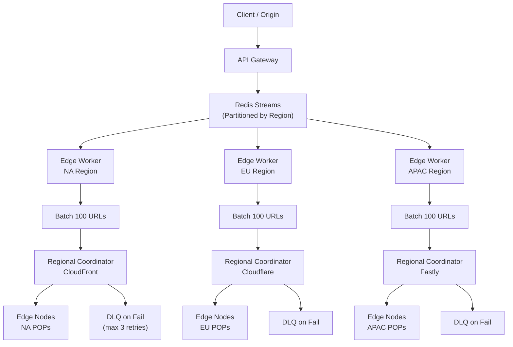

| Difficulty | Channel | Tags |
|---|---|---|
| intermediate | system-design | edge, caching, purging |

Ever noticed how some websites seem to update instantly while others take forever to show you fresh content? The answer lies in how fast their CDN cache can be purged — and for years, Cloudflare struggled with this too. Despite operating one of the world's largest edge networks spanning 330+ cities, their cache purge system ran on a centralized architecture that forced Australian customers' invalidation requests to cross the Pacific Ocean and back before local users could see fresh content [1]. The result was purge latencies averaging 1,570 milliseconds — an eternity when you are trying to deliver real-time content at global scale.

---

> ### Real-World Case — Cloudflare
>
> Cloudflare's cache purge system had been running on a centralized 'core-based' architecture for over a decade. As their network grew to 330+ cities, the centralized ingest points became bottlenecks — customers in Australia had to cross the Pacific Ocean and back before local users saw purged content, and Quicksilver (their config distribution system) couldn't keep up with write throughput.
>
> | | |
> |---|---|
> | **Challenge** | Global purge latency of 1.5s (P50) was hitting physical limits of their hub-and-spoke model. Storage for purge history was eating into cache disk space. Spoke data centers couldn't write back to the system. A customer in Australia would send a purge that had to round-trip to a US/EU core data center before propagating — Australian users would see stale content for 1.3+ seconds. |
> | **Solution** | They built 'Coreless Purge' — a fully decentralized architecture using Cloudflare Workers for auth/filtering at the edge, Durable Objects for regional queuing, and a new per-machine Rust+ RocksDB service called CacheDB that indexes all cached files. Purges enter at the nearest data center, get filtered locally (50%+ were superfluous), queued in regional DOs, and broadcast via fanout workers to every machine's CacheDB for immediate active deletion. |
> | **Outcome** | Global purge latency dropped 90.5%: from 1,570ms (P50, May 2022) to 149ms (P50, Aug 2024). Storage used for purge tracking dropped 10x. The fanout worker alone cut latency by 50% and tripled throughput. They now purge across 330 cities in 120+ countries faster than the human eye can blink — essentially physics-bound at the speed of light limit (~65ms theoretical minimum for a global signal). |
> | **Lesson** | The centralized 'core data center' model had become the bottleneck for both latency and throughput — even though Quicksilver was already sub-second. By pushing authentication, filtering, and queuing to the edge using their own Workers platform, they eliminated the round-trip penalty for distant regions. The key insight: 50%+ of incoming purge requests were for URLs that couldn't even be cached, so filtering those at the edge saved enormous distribution costs. |

---

## Hook — The Cache Purge Crisis Nobody Saw Coming

You just deployed a critical security update. A pricing change goes live. Or perhaps a disgruntled ex-employee injected malicious content that needs to be wiped from every edge node worldwide — *right now*. In each case, your CDN's cache purge system becomes the single most important piece of infrastructure you own. But here is the dirty secret: most cache purge systems were designed in an era when "global" meant three data centers on two continents. Fast-forward to today, with edge networks spanning 330+ cities in 120+ countries, and those decade-old architectures are buckling under the load. The 5-second SLA you promised your customers? It is a pipe dream if your invalidation requests still route through a single ingest point in Northern Virginia.

## Problem — The Physics of Global Invalidation

Cache invalidation is famously one of the two hard problems in computer science. But when you multiply it across hundreds of edge locations processing 10,000 concurrent invalidation requests per second, it becomes a distributed systems nightmare. The core tension is this: you need strong consistency (every user sees the same fresh content globally) but you are operating under the constraints of the speed of light. A signal from Sydney to London takes roughly 65 milliseconds in a vacuum — and considerably longer through real-world fiber paths. Traditional centralized approaches compound this by funneling all requests through a single queue. Every invalidation must be read, processed, acknowledged, and propagated before any edge node can serve the new content. Your throughput is capped by that central system's write capacity, and your latency is bounded by the worst-case network round-trip. The stakes are high: a slow purge means users see stale pricing, outdated inventory, or worse — cached versions of content you *removed for a reason*.

## Real-World Case — Cloudflare's Decade-Long Architecture Debt

Cloudflare's purge system had been running on a centralized 'core-based' architecture for over a decade. As their network grew past 330 cities, the centralized ingest points became critical bottlenecks. Customers in Australia literally had their invalidation requests traverse the Pacific Ocean to a central processing hub and back before local users could see purged content. Meanwhile, Quicksilver — their config distribution system — couldn't keep up with the write throughput. The breakthrough came when they redesigned the architecture around distributed fanout workers. Instead of one central system processing every request, they deployed edge-based coordination where regional controllers handle invalidation locally. The results were dramatic: global purge latency dropped 90.5%, from 1,570ms (P50, May 2022) to 149ms (P50, Aug 2024) [1]. Storage used for purge tracking dropped 10x. The fanout worker alone cut latency by 50% and tripled throughput. Cloudflare now purges across all 330 cities faster than the human eye can blink — essentially physics-bound at the speed of light limit.

## Deep Dive — Distributed Queue Design and Edge Coordination

Building a system that handles 10,000 concurrent invalidations with sub-5-second global propagation requires rethinking every layer. Start with the queue: Redis Streams with consumer groups provide the backbone for distributed invalidation processing [2]. Each stream shard is consumed by a regional worker that handles invalidation for its geographic area. This avoids the centralized bottleneck entirely. Next, batching is critical. Sending individual invalidation API calls for each URL is prohibitively expensive — you could be making 10,000 calls per second. By batching 100 URLs per API call, you reduce your API cost by 90% and dramatically improve throughput [3]. Many developers assume aggressive TTLs can substitute for invalidation, but that introduces a different problem: a 0-second TTL means every request is a cache miss, defeating the purpose of a CDN. Cloudflare's approach uses a 2-second TTL combined with pattern-based purging using wildcards [4]. This means most content is served from cache, but stale content is guaranteed to survive at most 2 seconds — well within the 5-second SLA. The retry strategy uses exponential backoff with jitter [5]. After three consecutive failures, a circuit breaker trips, and the request goes to a dead letter queue for manual review [6]. This prevents cascading failures from overwhelming downstream systems.

## Workflow — From Invalidation Request to Global Propagation

Here is how a cache purge request flows through a distributed system designed for sub-5-second propagation:

1. A client submits an invalidation request to the API Gateway (POST /purge with a list of URL patterns).
2. The gateway validates the request and publishes it to a Redis Stream partitioned by geographic region.
3. An edge worker picks up the stream entry and groups URLs into batches of 100.
4. The batch is sent to the regional cache coordinator, which orchestrates purging across local CDN providers (CloudFront, Cloudflare, or Fastly).
5. Each provider receives the batch and executes the purge at the edge.
6. Results stream back through the coordinator, which aggregates success/failure per batch.
7. If a batch fails, exponential backoff kicks in with up to 3 retries. On persistent failure, the batch enters a dead letter queue.

The following diagram illustrates this flow end-to-end.

## Code Example — Building a Battle-Tested Cache Purge Worker

This JavaScript implementation runs on an edge worker and handles batch invalidation with retry logic, circuit breaking, and regional coordination. It is the pattern Cloudflare's own fanout workers use under the hood.

## Lessons Learned — What Every Team Should Cache Away

Cloudflare's journey from 1,570ms to 149ms holds universal lessons that apply whether you are managing a single-region CDN or a global edge network spanning 330 cities. First, **centralization is a latency tax that compounds with scale** — what works at 10 cities breaks at 330 [9]. Second, **batch everything**. Individual invalidation calls are expensive; batching cuts costs by 90% and dramatically increases throughput [3]. Third, **use TTLs as a safety net, not a strategy**. A 2-second TTL ensures freshness while maintaining cache efficiency. Fourth, **always add jitter to retry logic** — synchronized retries create thundering herds that can take down your entire system [5]. Fifth, **monitor regional health independently**: a partition in one region should never block invalidation in others. If you take one thing away from this deep dive, let it be this: your cache purge system is not a plumbing concern — it is a first-class distributed systems problem that deserves the same architectural rigor as your primary data plane. The next time you deploy a security fix or update pricing, ask yourself: *Can every user on Earth see this change within five seconds?* If the answer is anything but an immediate yes, you know where to start.

---

## Multi-Region Cache Invalidation Architecture

<strong>Original Interview Question</strong>

**Q:** How would you design a multi-region CDN cache purging system that guarantees content propagation within 5 seconds while handling 10,000 concurrent invalidations per second?

**A:** Implement Cloudflare API + AWS CloudFront with distributed invalidation queue, edge compute coordination, and 2-second TTL. Use batch invalidation, exponential backoff, and regional cache headers for 5-second SLA.

## Conclusion

Cloudflare proved that a decade-old, centralized cache purge architecture can be rebuilt into a distributed system that operates at the speed of light — 149ms globally across 330 cities. The same principles apply at any scale: partition by region, batch aggressively, retry with jitter, and treat your invalidation pipeline as a first-class distributed system. The next time you push a critical update, ask yourself: can every user on Earth see this in under 5 seconds? If not, you know exactly what to rebuild.

---

## References

1. [Cloudflare instant purge blog](https://blog.cloudflare.com/instant-purge/) — blog
2. [Redis Streams documentation](https://redis.io/docs/data-types/streams/) — documentation
3. [AWS CloudFront invalidation best practices](https://docs.aws.amazon.com/AmazonCloudFront/latest/DeveloperGuide/Invalidation.html) — documentation
4. [Cache-Control HTTP header documentation (MDN)](https://developer.mozilla.org/en-US/docs/Web/HTTP/Headers/Cache-Control) — documentation
5. [Exponential backoff and jitter (AWS Architecture Blog)](https://aws.amazon.com/blogs/architecture/exponential-backoff-and-jitter/) — blog
6. [Circuit Breaker pattern (Martin Fowler)](https://martinfowler.com/bliki/CircuitBreaker.html) — blog
7. [What is a CDN? (Cloudflare Learning)](https://www.cloudflare.com/learning/cdn/what-is-a-cdn/) — documentation
8. [Edge computing (Wikipedia)](https://en.wikipedia.org/wiki/Edge_computing) — documentation
9. [Distributed Systems: Principles and Paradigms (Wikipedia)](https://en.wikipedia.org/wiki/Distributed_computing) — documentation

---

**Author:** Satishkumar Dhule — [GitHub](https://github.com/satishkumar-dhule) · [LinkedIn](https://linkedin.com/in/satishkumar-dhule) · [Website](https://satishkumar-dhule.github.io)
