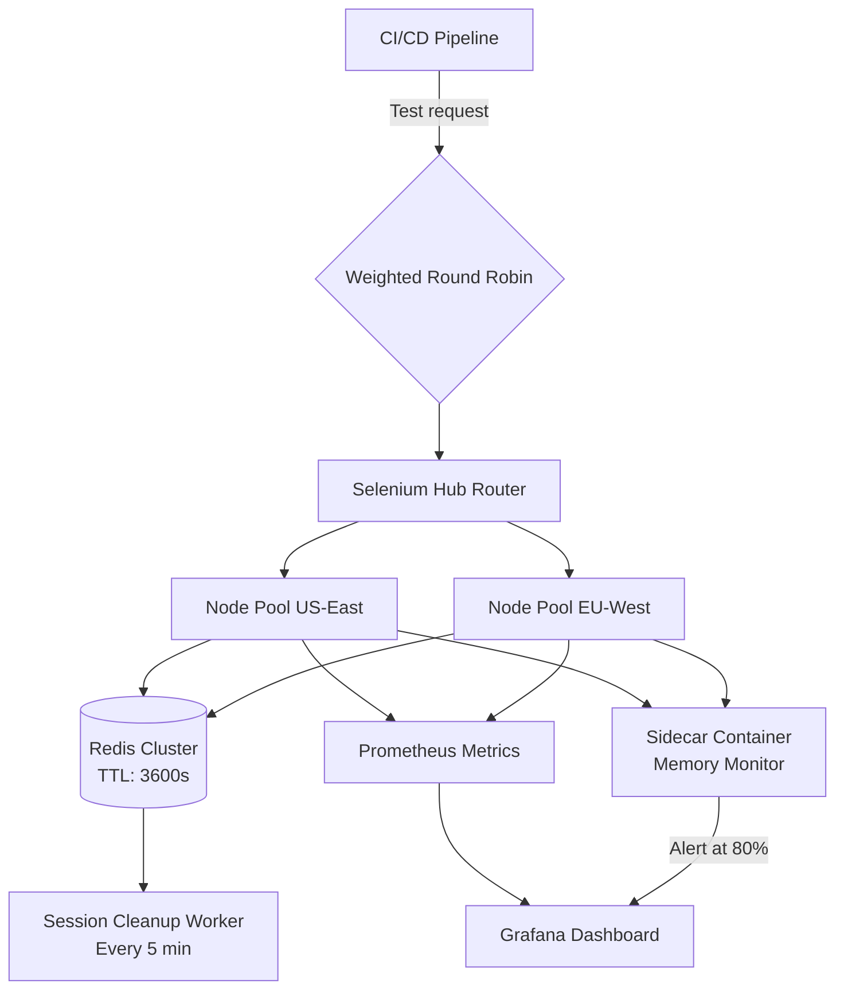

| Difficulty | Channel | Tags |
|---|---|---|
| advanced | system-design | selenium, webdriver, grid |

Expedia Group had a problem that sounds all too familiar. Their microservices architecture had grown to encompass 100+ teams, each running their own CI/CD pipelines with browser-based UI tests. A suite of 300 tests could take hours to complete. Developers waited. Deployments stalled. Productivity suffered [1]. The fix they built changed everything about how teams think about test infrastructure at scale.

---

> ### Real-World Case — Expedia Group
>
> Expedia Group's microservices architecture grew to 100+ teams each running their own CI/CD pipelines with UI tests. Sequential test execution created bottlenecks — a suite of 300 tests could take hours. They needed a way to run all tests within the time of the single slowest test, regardless of suite size.
>
> | | |
> |---|---|
> | **Challenge** | Operating 100+ independent Selenium Grid hubs across teams, with 140,000+ daily UI tests, while keeping infrastructure costs under control. Manual node provisioning couldn't keep up with fluctuating demand, and third-party cloud grid vendors would cost an estimated $2.41M annually for the needed 1,000 parallel connections. |
> | **Solution** | They built SeleniumGridScaler (open source), which combines Selenium Grid with the AWS EC2 API to auto-spawn and terminate browser nodes based on real-time test queue depth. They later evolved to DA-Kube (Kubernetes-based) using EKS, Docker, Helm, and Traefik — enabling dynamic per-hub scaling, per-branch isolated grids, and canary deployments. The architecture creates ~4,500 EC2 nodes daily across 100+ hubs, destroying them immediately after test completion. |
> | **Outcome** | Reduced total test execution time to match the slowest single test (e.g., 1,000 tests completing in 5 minutes). Costs dropped to ~$80,000/year internally versus $2.41M for equivalent third-party cloud grid capacity. The system handles 150,000+ tests daily across 100+ hubs with zero idle infrastructure cost. |
> | **Lesson** | The 'longest-running test' philosophy: if you can scale elastically, total test suite time should equal the slowest individual test, not the number of tests. Pay-per-use ephemeral infrastructure makes this economically viable at scale. |

---

## Hook — The bottleneck that was strangling 100+ engineering teams

Imagine pushing code, then waiting hours for a test suite to tell you whether you broke something. Now imagine that happening across 100+ teams every single day. That was the reality at Expedia Group as their engineering organization scaled. Each team ran their own browser-based UI tests sequentially, and the queue grew longer with every new feature. A suite of 300 tests could take longer than a workday. The cost wasnt just time — it was developer morale, deployment velocity, and ultimately the ability to ship [1]. Expedia needed a way to run all tests in the time it took to run the single slowest test, regardless of suite size. The answer would require rethinking the entire Selenium Grid architecture from the ground up.

## Problem — Why Selenium Grid breaks at scale

Selenium Grid is the go-to solution for distributed browser testing, but scaling it to 10,000 concurrent sessions introduces a cascade of failure modes that most teams only discover at 2am on a Friday. Memory leaks top the list. Each browser instance consumes RAM, and without aggressive cleanup, nodes quickly become zombies. Then there is session management: orphaned sessions that never release resources pile up like unclosed file handles. Network partitions randomly disconnect nodes from the hub. And the classic — one bad node drags down the entire cluster through cascading failure. You might think adding more nodes solves the problem, but without proper load balancing and circuit breakers, you are just scaling the chaos. The math tells a sobering story: 10,000 concurrent sessions at 50 sessions per node means at least 200 nodes, each consuming 2GB of RAM. That is 400GB baseline memory, plus 30% buffer — 520GB of cluster memory that needs active management, not passive allocation.

## Real-World Case — Expedia Group’s $2.3M lesson in test infrastructure

Expedia Group’s engineering teams were drowning in test execution time. With 100+ microservice teams each running independent CI/CD pipelines, browser-based UI tests became the critical bottleneck slowing every deployment. A single 300-test suite could consume hours, and the aggregate queue across teams was staggering [1]. The solution they built was an auto-scaled, distributed automation platform that fundamentally changed the math. Instead of running tests sequentially, they horizontally scaled Selenium Grid across Kubernetes node pools, allowing any number of tests to complete in the time of the slowest single test — roughly 5 minutes. The financial impact was equally dramatic: their internal infrastructure cost approximately $80,000 per year, while the equivalent third-party cloud grid capacity would have cost $2.41 million. That is a 96% cost reduction. Today, their system handles over 150,000 tests daily across 100+ hubs with zero idle infrastructure cost. The key insight: by containerizing browser nodes and aggressively auto-scaling based on queue depth, they eliminated the waste of standing resources while maintaining sub-minute test initiation latency.

## Deep Dive — The architecture that makes 10,000 concurrent sessions boring

The foundation of any scalable Selenium Grid is the hub-node pattern, but at 10,000 sessions, the classic single-hub architecture becomes a single point of failure. The production-grade approach uses Kubernetes StatefulSets managing browser nodes across multiple availability zones, with a central hub router that distributes load using weighted round-robin based on real-time node capacity and response time [3]. Session management is where most architectures fail. The solution is a Redis cluster with TTL-based expiration and connection pooling. Every session gets a time-to-live (TTL) key that automatically expires if the session isnt extended, preventing orphaned sessions from consuming resources [4]. A background worker scans for stale keys every 5 minutes, and init containers clean up stale Docker volumes on node startup. Memory management requires a multi-layered defense: per-node resource quotas (2GB RAM, 1 CPU core), memory usage alerts at 80% capacity, weekly rolling restarts across the node pool, and JVM garbage collection tuning for browser processes. Prometheus scrapes memory metrics from every node, and Grafana dashboards visualize memory trends, session duration distributions, and queue depths in real time [5][8]. The circuit breaker pattern is critical for preventing cascading failures. Each node has a Hystrix-style circuit breaker that tracks consecutive health check failures. After three failed health checks on the /status endpoint (polled every 10 seconds), the node is ejected from the pool for a 30-second recovery window [6]. This prevents a single misbehaving browser process from dragging down the entire grid.

## Workflow — The session lifecycle from submission to completion

Understanding how a test moves through the system reveals why this architecture works. The flow breaks down into seven distinct phases, as illustrated in the diagram below. First, the CI/CD pipeline submits a test request to the global load balancer, which uses weighted round-robin to route based on node capacity. Second, the hub router receives the request and checks Redis for available session capacity. Third, a browser node is selected from the appropriate regional node pool. Fourth, the session is registered in Redis with a TTL of 3600 seconds. Fifth, the test executes on the assigned node while a sidecar container monitors memory usage. Sixth, the session is either completed cleanly or extended if still active. Seventh, Prometheus scrapes the updated metrics, and if any health check fails three times in a row, the circuit breaker opens and isolates the node. The horizontal pod autoscaler continuously adjusts node count based on queue depth, ensuring zero idle infrastructure during low-traffic periods [7].

## Code Example — Building a production-ready session manager with circuit breakers

The following Python implementation shows the core patterns: a Redis-backed session manager with TTL-based auto-cleanup, a circuit breaker for node isolation, and a health check loop that ties them together. These are the same patterns Expedia used to eliminate memory leaks and cascading failures at scale.

## Lessons Learned — What 150,000 daily tests taught Expedia’s engineers

The first lesson is that memory leaks are inevitable if you dont design for automatic cleanup from day one. TTL-based session expiration is non-negotiable, and background cleanup workers are essential even with TTLs in place. The second lesson: circuit breakers arent optional at scale. Without them, a single node failure cascades through the entire grid, taking down healthy nodes alongside the failing one [6]. The third lesson is that cost optimization and performance arent trade-offs — they are the same thing. Expedia’s auto-scaling approach saves $2.3M annually while actually improving test initiation latency because resources are never idle [1]. The fourth lesson: monitoring must be proactive, not reactive. Prometheus alerts at 80% memory utilization give operators time to act before nodes start failing [5]. Finally, canary deployments with traffic splitting are essential for rolling out new node versions without risking the entire grid. Start small: implement Redis-backed session management with TTL on your existing Selenium Grid. Then add health checks and circuit breakers to your router layer. Then containerize your nodes and deploy on Kubernetes with auto-scaling. Each step compounds reliability and cost savings.

---

## Selenium Grid Architecture and Session Flow

<strong>Original Interview Question</strong>

**Q:** Design a scalable Selenium Grid architecture to handle 10,000 concurrent test sessions with 99.9% uptime, ensuring zero memory leaks through automatic session lifecycle management, real-time monitoring, and graceful node failure recovery across multiple data centers?

**A:** Deploy Kubernetes cluster with auto-scaling node pools, Redis session store with TTL policies, Prometheus metrics for memory monitoring, circuit breakers for node isolation, and sidecar containers for session cleanup. Implement health checks, resource quotas, and rolling updates.

## Conclusion

Scaling Selenium Grid to 10,000 concurrent sessions is not about throwing more hardware at the problem. It is about designing for failure from the start: automatic session lifecycle management, circuit breakers that isolate bad nodes before they cascade, and real-time monitoring that gives you visibility before things break. Expedia Group proved that the right architecture does not just handle the load — it costs 96% less than the alternatives while running 150,000+ tests a day. The takeaway is simple: design your test infrastructure with the same rigor you apply to your production services. Your tests deserve circuit breakers, health checks, and auto-scaling just as much as your API servers do.

---

## References

1. [Expedia Group incident report](https://seleniumcamp.com/talk/autoscaled-distributed-automation/) — video
2. [Selenium Grid Documentation](https://www.selenium.dev/documentation/grid/) — documentation
3. [Kubernetes Architecture Overview](https://kubernetes.io/docs/concepts/architecture/) — documentation
4. [Redis Time-to-Live (TTL) Documentation](https://redis.io/docs/latest/develop/using-ttl/) — documentation
5. [Prometheus Overview](https://prometheus.io/docs/introduction/overview/) — documentation
6. [Circuit Breaker Pattern by Martin Fowler](https://martinfowler.com/bliki/CircuitBreaker.html) — blog
7. [Kubernetes Horizontal Pod Autoscaling](https://kubernetes.io/docs/tasks/run-application/horizontal-pod-autoscale/) — documentation
8. [Grafana Dashboard Documentation](https://grafana.com/docs/grafana/latest/dashboards/) — documentation

---

**Author:** Satishkumar Dhule — [GitHub](https://github.com/satishkumar-dhule) · [LinkedIn](https://linkedin.com/in/satishkumar-dhule) · [Website](https://satishkumar-dhule.github.io)
