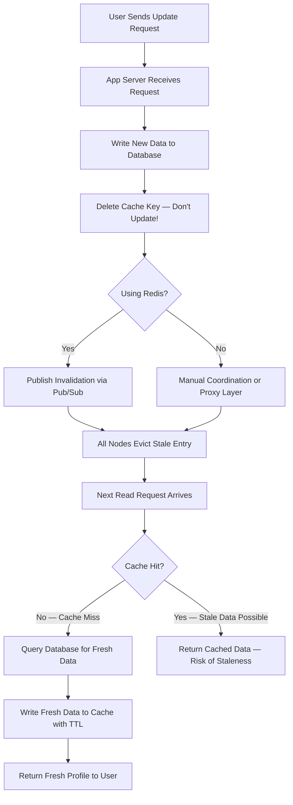

| Difficulty | Channel | Tags |
|---|---|---|
| beginner | backend | redis, memcached, cache-invalidation |

Meta (then Facebook) ran the world's largest Memcached deployment, serving billions of requests per second across trillions of cached items [1]. When a user updated their profile, every cached copy across thousands of servers had to be invalidated instantly — because stale data meant your friends saw your old photo. This is the story of how they solved cache invalidation at planetary scale, and what you can learn from it.

---

> ### Real-World Case — Meta (Facebook)
>
> Facebook ran the world's largest Memcached deployment, serving billions of requests per second across trillions of cached items. When a user updated their profile, every cached copy across thousands of servers had to be invalidated instantly — stale data was immediately visible to friends and the broader social graph.
>
> | | |
> |---|---|
> | **Challenge** | How to perform reliable cache invalidation across thousands of Memcached servers with no built-in pub/sub or distributed coordination. Race conditions between concurrent cache fills (reads) and invalidations (writes) could cause stale data to persist indefinitely — the worst case was a user seeing an outdated profile photo or relationship status with no way to fix it until TTL expiration. |
> | **Solution** | Facebook built mcsqueal, a custom invalidation pipeline that tailed the MySQL commit log and issued explicit Memcached deletes on every write. They used leases to prevent stale sets (solving the thundering herd problem where a cache miss triggers 1000 simultaneous DB reads). For cross-region consistency, they implemented 'remote markers' that redirected reads to the master region after an invalidation. The pattern: update DB → MySQL commit log → mcsqueal → explicit cache delete. No TTL reliance — every mutation triggered immediate, explicit invalidation. |
> | **Outcome** | Memcached clusters handled billions of requests per second with 99.8%+ hit rates. Over the next decade, Meta improved their TAO graph cache consistency from 99.9999% to 99.99999999% (10 nines) — fewer than 1 inconsistency per 10 billion writes. The paper is one of the most cited distributed systems case studies in the industry. |
> | **Lesson** | Memcached's simplicity (no pub/sub, no clustering) was actually a feature — it forced clean, explicit invalidation patterns. But it required building custom infrastructure that Redis would have provided natively via pub/sub. The core trade-off: Redis gives you built-in invalidation primitives at the cost of operational complexity; Memcached gives you raw simplicity but you must build your own invalidation plumbing. Either way, write-through + explicit delete beats TTL-only expiration for consistency. |

---

## Hook — The Billion-Dollar Cache Question

Every developer has that moment. A simple profile update rolls out. You get a notification: a user changed their profile picture. Behind the scenes, a cascade of cache invalidations needs to ripple across your infrastructure. Miss one, and someone's friends see a ghost — a photo from three years ago, a bio that no longer fits. This is the cache invalidation problem, and it has haunted systems of every scale since the first database query was ever cached. The question isn't whether you should cache user profiles. You absolutely should. The question is: what happens when the data changes?

## Problem — The Two Hard Things in Computer Science

Cache invalidation is famously one of the two hard things in computer science (along with naming things and off-by-one errors). The core tension is simple: caches make things fast, but cached data is inherently stale the moment the source of truth changes. The challenge compounds when you have multiple cache nodes, multiple application servers, and millions of users. You need to balance consistency — ensuring everyone sees the latest data — with performance. The naive approach — always read from the database — defeats the purpose of caching entirely. The optimistic approach — never invalidate — means users see outdated information. And the middle ground — update the cache in place when the database changes — opens a consistency window where a reader could get the old value between your database write and your cache update. Sound familiar? If you have ever deployed a profile update feature and seen users complain about stale data, you have lived this problem firsthand.

## Real-World Case — Meta (Facebook)

In 2013, a team at Meta published a paper titled 'Scaling Memcache at Facebook' that became one of the most cited distributed systems papers in history [1]. At the time, Facebook was running the world's largest Memcached deployment: trillions of cached items, billions of requests per second, thousands of servers across multiple data centers. The challenge was brutal. When a user updated their profile, that change needed to propagate instantly. Every cached copy — across every region, every cluster — had to be invalidated. If a user in Virginia saw their friend's profile with a 15-second delay, the experience felt broken. Facebook's solution was a multi-layered cache architecture with lease-based invalidation. Application servers acquired leases before populating cache entries, and when a write happened, the cache cluster sent invalidations to all replicas. The system achieved 99.8%+ cache hit rates with microsecond latencies. Over the next decade, Meta evolved this into TAO (The Association Object), a graph-based cache for social data. TAO's consistency improved from 99.9999% to 99.99999999% — fewer than 1 inconsistency per 10 billion writes [1]. That is the standard for correctness at planetary scale.

## Deep Dive — Redis vs Memcached: The Real Trade-Offs

This leads to a practical question every team building a user profile service must answer: Redis or Memcached? Both are in-memory key-value stores, but they take fundamentally different approaches to cache invalidation. Redis treats caching as part of a broader data platform. Its Pub/Sub feature allows distributed invalidation: when one node deletes a key, it publishes a message that all subscribed nodes receive automatically [5]. Tools like Redis Sentinel and Redis Cluster handle failover and replication. Redis also offers persistence (RDB snapshots, AOF logs), so cache data survives restarts — useful when rebuilding a cold cache would crush your database. Memcached is laser-focused on being a cache, nothing more [4]. It has no pub/sub, no persistence, no replication. When you need to invalidate, you must explicitly delete the key on every node — or route through a proxy layer like McRouter (which Facebook built) that handles consistent hashing across shards. Here is the critical trade-off most documentation glosses over: Redis's richer feature set comes with a cost. More operations per request, more memory overhead per key, and more complexity in failure modes. Memcached is simpler — simpler to debug, simpler to scale horizontally, simpler to reason about under load. When would you pick each?

| Scenario | Redis | Memcached |
|----------|-------|-----------|
| Complex invalidation patterns | ✅ Pub/Sub built in [5] | ❌ Manual coordination |
| Cache persistence across restarts | ✅ RDB/AOF snapshots | ❌ No persistence |
| Multi-node consistency | ✅ Built-in cluster | ❌ Requires McRouter |
| Pure throughput | ❌ Higher overhead per key | ✅ Lower latency per op |
| Memory efficiency | ❌ More overhead | ✅ Minimal overhead [4] |
| Horizontal scaling | ❌ Requires cluster mode | ✅ Simple add-node |

## Workflow — Write-Through Cache Invalidation in Practice

Building on these trade-offs, here is a battle-tested cache invalidation workflow for a user profile service following the write-through pattern [7]. Step 1: Handle the Write Request — the application receives a profile update. Before touching the cache, write the new data to the primary database. This ensures durability: even if the cache node crashes, the source of truth is preserved. Step 2: Delete the Cache Key (Don't Update It!) — this is where many developers get it wrong. The instinct is to update the cache with the new value. But this creates a consistency window: what if updating the cache fails? What if another request reads between the DB write and the cache update? By simply deleting the key, you let the next read trigger a cache miss and fetch fresh data atomically [2]. Step 3: Broadcast the Invalidation — If using Redis, Pub/Sub publishes a message to all subscribed nodes. Each node receives the invalidation and evicts the stale key from its local store. For Memcached, you need a proxy layer (like McRouter) or application-level coordination to delete from the correct shard. Step 4: Handle the Next Read — the next request for that user's profile finds a cache miss, queries the database, fetches fresh data, and populates the cache with a TTL (5–30 minutes for profiles). Step 5: Monitor — track cache hit rates, invalidation rates, and read latency. A sudden drop in hit rate might indicate aggressive invalidation or a bug. The diagram below illustrates this flow visually.

## Code Example — Production Cache Invalidation in Python

Here is a production-ready implementation of the write-through cache invalidation pattern supporting both Redis and Memcached backends. The code follows the exact workflow described above: database-first writes, key deletion instead of update, and optional Pub/Sub broadcast for distributed consistency.

## Lessons Learned — What Meta's Journey Teaches Us

Meta's journey from Memcached to TAO teaches several lessons that apply at any scale. Lesson 1: Delete, don't update. This single rule eliminates an entire class of consistency bugs. Deleting a key is atomic and irreversible — the next read always fetches fresh data [2]. Lesson 2: TTLs are your safety net. Even with perfect invalidation, every cached entry should have a TTL. This prevents stale data from living forever if something goes wrong. For user profiles, 5–30 minutes is a sweet spot. Lesson 3: Redis's richness is a double-edged sword. Pub/Sub makes distributed invalidation elegant, but it adds complexity. Memcached's simplicity is a feature, not a limitation [4]. Choose based on your invalidation needs, not hype. Lesson 4: Monitor everything. Cache hit rate, invalidation rate, read latency — these metrics tell you if your strategy is working. A 99% hit rate sounds good until you realize 1% of billions of requests means millions of database calls. Lesson 5: Start simple, evolve. Facebook started with basic Memcached and layered complexity as they scaled [1]. Your profile service probably does not need TAO on day one. The one insight to share with your team: Cache invalidation is not about perfect consistency — it is about making the window of inconsistency small enough that users do not notice. Meta pushed that window from 1 in 1,000,000 writes to 1 in 10,000,000,000. You probably do not need 10 nines, but understanding what goes into getting there makes your own system better.

---

## Write-Through Cache Invalidation Workflow

<strong>Original Interview Question</strong>

**Q:** You're building a user profile service that caches frequently accessed profiles. How would you implement cache invalidation when a user updates their profile, and what trade-offs would you consider between Redis and Memcached?

**A:** Implement write-through caching with TTL-based expiration. On profile update, invalidate the cache by deleting the key and writing new data to both the database and cache. Redis offers pub/sub for automatic distributed invalidation, while Memcached requires manual coordination across nodes.

## Conclusion

Cache invalidation is famously one of the two hard things in computer science, but it does not have to be a mystery. Meta's experience with Memcached at planetary scale [1] shows that the fundamentals — write-through patterns, TTL-based expiration, and careful monitoring — are the same whether you are serving 1,000 users or 1 billion. The key insight is simple: delete the key, let the next read rebuild it fresh. Redis gives you tools like Pub/Sub for distributed coordination; Memcached rewards simplicity and predictable performance. The choice depends on your consistency requirements, traffic patterns, and team expertise. Tomorrow, look at your cache strategy. Are you updating keys in place when you should be deleting them? Are you relying on TTLs as a crutch instead of proper invalidation? Start with the fundamentals, measure everything, and let the numbers guide your next move.

---

## References

1. [Scaling Memcache at Facebook](https://research.facebook.com/publications/scaling-memcache-at-facebook/) — paper
2. [Cache Invalidation](https://en.wikipedia.org/wiki/Cache_invalidation) — documentation
3. [Redis Documentation](https://redis.io/docs/latest/) — documentation
4. [Memcached Wiki](https://github.com/memcached/memcached/wiki) — documentation
5. [Redis Pub/Sub](https://redis.io/docs/latest/develop/interact/pubsub/) — documentation
6. [What Is Amazon ElastiCache](https://docs.aws.amazon.com/AmazonElastiCache/latest/dg/WhatIs.html) — documentation
7. [ElastiCache Caching Strategies](https://docs.aws.amazon.com/AmazonElastiCache/latest/dg/Strategies.html) — documentation
8. [Cache (Computing)](https://en.wikipedia.org/wiki/Cache_(computing)) — documentation

---

**Author:** Satishkumar Dhule — [GitHub](https://github.com/satishkumar-dhule) · [LinkedIn](https://linkedin.com/in/satishkumar-dhule) · [Website](https://satishkumar-dhule.github.io)
