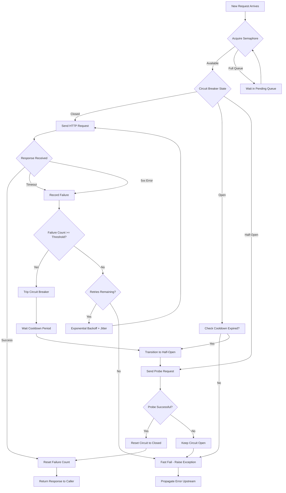

| Difficulty | Channel | Tags |
|---|---|---|
| advanced | backend | asyncio, aiohttp, concurrency |

When Duolingo migrated their Python microservices from synchronous to asynchronous I/O, they discovered a hard truth about connection management at scale — a 40% throughput gain meant nothing if cascade failures could wipe it out in seconds [1]. Here is what they built to keep their connection pools alive under fire.

---

> ### Real-World Case — Duolingo
>
> Duolingo needed to migrate their Python microservices from synchronous to asynchronous I/O to improve throughput and reduce AWS costs. They had hundreds of microservices making HTTP calls to each other with complex auth, retry, circuit breaker, and observability requirements.
>
> | | |
> |---|---|
> | **Challenge** | Every microservice-to-microservice call needed authentication, default retry behavior, Prometheus metrics recording, circuit breaker state management, and CloudWatch logging — all while handling connection pool exhaustion and ensuring graceful degradation under load. The sync implementation using `requests` couldn't efficiently handle high concurrency. |
> | **Solution** | Duolingo migrated to async Python with `aiohttp`, building a microservice client that implemented circuit breaker state machines with auth, retry, and observability. They used async context managers for connection lifecycle management, ContextVars for scoped state, and a core-library pattern to share I/O-agnostic logic between sync and async clients. The circuit breaker tracked failures per downstream service and short-circuited requests when error rates spiked, preventing cascade failures. |
> | **Outcome** | The async service handled ~10,000 requests per instance vs ~7,000 for sync (+40% throughput), translating to ~30% AWS EC2 cost savings per migrated service. The circuit breaker and retry state machine prevented cascading failures when downstream services degraded, and the connection pool reused TCP connections across requests, reducing latency. |
> | **Lesson** | Building async versions of sync libraries is as hard as supporting a new programming language — but worth it for I/O-bound services. The circuit breaker and retry logic must be a first-class concern in the HTTP client, not an afterthought. Sans-I/O architectures added too much complexity for their use case; simpler duplicated code was more maintainable. |

---

## Hook — The 3am Cascade That Changes Everything

It starts innocently enough. A downstream service slows down — maybe a database gets a sudden spike, maybe a deployment pushed a bug into the auth layer. Your service, making hundreds of HTTP calls per second to that downstream, starts holding connections open longer. Those connections don't close, they pile up. Your connection pool saturates. New requests queue. Latency climbs from 50ms to 5 seconds. And then — your service's health check endpoint, which itself calls downstream dependencies, starts timing out. The orchestrator marks you unhealthy. Instances get killed. Traffic shifts to remaining instances, which immediately saturate too. An entire fleet goes down because of a single slow dependency.

This is the cascade failure pattern, and it has taken down services at Netflix [2], Amazon [3], and — yes — even language-learning green owls [1].

You might think your connection pool is just a performance optimization, a way to avoid TCP handshake overhead. But in a microservice architecture, your connection pool is your first line of defense against system-wide failure. Getting it wrong means your entire service inherits the worst behavior of every dependency it touches.

## Problem — The Vanilla Connection Pool Is a Liability

The default aiohttp `ClientSession` gives you a connection pool that handles 100 concurrent connections with keepalive and connection reuse [4]. That sounds great — until you look at what happens when things go wrong.

A default session has no mechanism to say "no" to a request. It has no circuit breaker. It has no concept of graceful degradation. When every downstream service is healthy, this is fine. But here is the thing about distributed systems: *something is always degraded*. If you have 50 microservices and each has a 99.9% uptime, the probability that all 50 are up simultaneously is just 95% [5]. That means your system experiences a partial outage roughly 18 days per year.

Many developers discover this the hard way. They tune connection timeouts and pool sizes in isolation, not realizing these are deeply coupled. A 30-second timeout combined with a pool of 100 connections means a single slow dependency can block **3,000 request-seconds** of capacity before timing out. During that window, every other request to that pool waits or fails.

Moreover, connection pools need active management. Connections become stale. SSL certificates expire in the middle of a session. DNS records change. Without health checking, your pool silently accumulates dead connections, reducing effective capacity while returning mysterious `ConnectionError` exceptions.

The standard approach — tune timeouts, bump up limits, hope for the best — works until it catastrophically does not.

## Real-World Case — Duolingo's Async Migration

Duolingo's engineering team faced exactly this problem at scale. They had hundreds of Python microservices making HTTP calls to each other, each with complex auth, retry, circuit breaker, and observability requirements [1].

The migration from sync to async Python was driven by numbers everyone understands: cost savings. An async service instance handled roughly 10,000 requests versus 7,000 for its sync equivalent — a 40% throughput improvement. That translated to approximately 30% in AWS EC2 cost savings per migrated service [1]. But the real win wasn't raw throughput; it was how the async architecture handled failure.

Duolingo's microservice client needed to encode a complex state machine: authenticate requests with multiple auth providers, apply default retry behavior, record Prometheus metrics, update circuit breaker state, and log results to AWS CloudWatch — all while making HTTP calls to external services [1].

The critical insight from Duolingo's experience is that modern connection management demands a programmable state machine, not just a configuration object. Their sans I/O approach decoupled the *decision logic* (retry? circuit open? need auth?) from the actual I/O operations, making the system testable and observable.

Here is what this means for you: if your connection pool manager is just an aiohttp `TCPConnector` with a limit parameter, you are running the same risk Duolingo ran. The difference is they had the engineering resources to build what they needed. You need a pattern you can implement today.

## Deep Dive — Anatomy of a Resilient Connection Pool

Building on Duolingo's state machine approach, a production-grade connection pool manager requires four interconnected components:

**1. Semaphore-Based Concurrency Limiting**

At its core, the pool needs a hard cap on concurrent in-flight requests. Python's `asyncio.Semaphore` is the right tool here — it blocks callers at the *acquisition* point rather than failing them, which means excess requests queue naturally instead of overwhelming the system [6]. This is fundamentally different from `TCPConnector(limit=...)` which only limits connections, not total concurrent work. A semaphore guards both network I/O and local processing, preventing cascading backpressure from reaching the event loop.

**2. Circuit Breaker with Three States**

The circuit breaker pattern prevents your system from repeatedly hammering a failing dependency [7]. The three states matter:

| State | Behavior | Transition Trigger |
|-------|----------|--------------------|
| **Closed** | Requests pass through normally | Initial state |
| **Open** | Requests fail immediately | Failures exceed threshold |
| **Half-Open** | Limited test requests allowed | Cooldown period elapsed |

A half-open state is critical. Without it, a service that recovers during the cooldown period stays blocked until the full window expires. With half-open, the system probes the dependency with a single request — if it succeeds, full traffic resumes immediately.

**3. Exponential Backoff with Jitter**

Retrying failed requests immediately is the fastest way to turn a transient error into a self-inflicted DDoS. Exponential backoff — doubling the wait time between each retry — spreads out retry traffic [8]. Adding jitter (randomizing the delay within a window) prevents the thundering herd problem where all instances retry simultaneously. The formula: `delay = base * (2 ^ attempt) + random(0, jitter)`.

**4. Connection Health Verification**

Connections in the pool can become invalid without being detected — a server closes its side, a network middlebox drops the mapping, an SSL certificate rotates. Proactive health checks, using aiohttp's `TCPConnector(enable_cleanup_closed=True)` [4] and periodic connection verification, prevent using stale connections that waste time on failures.

These four components work together. The semaphore prevents overload. The circuit breaker detects systemic failures. Backoff handles transient issues gracefully. Health checks prevent silent degradation.

## Workflow — How a Request Flows Through the Pool

Here is what happens step-by-step when a request enters a properly managed connection pool. The diagram below traces every decision point:



The flow starts with semaphore acquisition — this is your admission control. If the circuit breaker is open and the cooldown hasn't expired, the request fails fast (milliseconds) rather than waiting for a timeout (30 seconds). The half-open state lets the system self-heal. And exponential backoff with jitter prevents synchronized retry storms.

This workflow transforms the pool from a passive connection cache into an active resilience layer.

## Code Example — Building a Production-Grade Connection Pool Manager

Here is a complete implementation that incorporates everything discussed so far — semaphore limiting, circuit breaker with half-open state, exponential backoff with jitter, and proper startup/shutdown lifecycle:

```python
import asyncio
import aiohttp
import random
import time
from enum import Enum
from typing import Optional

class CircuitState(Enum):
    CLOSED = "closed"
    OPEN = "open"
    HALF_OPEN = "half_open"

class ConnectionPoolManager:
    def __init__(
        self,
        max_connections: int = 100,
        circuit_breaker_threshold: int = 5,
        cooldown_period: float = 60.0,
        max_retries: int = 3,
        base_delay: float = 0.1,
    ):
        self._max_connections = max_connections
        self._semaphore = asyncio.Semaphore(max_connections)
        self._circuit_state = CircuitState.CLOSED
        self._failure_count = 0
        self._last_failure_time = 0.0
        self._circuit_breaker_threshold = circuit_breaker_threshold
        self._cooldown_period = cooldown_period
        self._max_retries = max_retries
        self._base_delay = base_delay
        self._session: Optional[aiohttp.ClientSession] = None

    async def start(self):
        connector = aiohttp.TCPConnector(
            limit=self._max_connections,
            limit_per_host=20,
            ttl_dns_cache=300,
            enable_cleanup_closed=True,
        )
        timeout = aiohttp.ClientTimeout(
            total=30, connect=5, sock_read=10
        )
        self._session = aiohttp.ClientSession(
            connector=connector, timeout=timeout
        )

    async def stop(self):
        if self._session and not self._session.closed:
            await self._session.close()

    async def make_request(self, url: str, method: str = "GET", **kwargs):
        # Fast-fail if circuit is open and cooldown hasn't elapsed
        if self._circuit_state == CircuitState.OPEN:
            elapsed = time.monotonic() - self._last_failure_time
            if elapsed >= self._cooldown_period:
                self._circuit_state = CircuitState.HALF_OPEN
            else:
                raise aiohttp.ClientError(
                    f"Circuit breaker open, {self._cooldown_period - elapsed:.1f}s remaining"
                )

        async with self._semaphore:
            for attempt in range(self._max_retries):
                try:
                    async with self._session.request(
                        method, url, **kwargs
                    ) as response:
                        if response.status >= 500:
                            self._record_failure()
                            if attempt < self._max_retries - 1:
                                await self._backoff(attempt)
                                continue
                            response.raise_for_status()
                        self._record_success()
                        return await response.read()
                except (asyncio.TimeoutError, aiohttp.ClientError) as e:
                    self._record_failure()
                    if attempt < self._max_retries - 1:
                        await self._backoff(attempt)
                        continue
                    raise

        raise aiohttp.ClientError("All retry attempts exhausted")

    async def _backoff(self, attempt: int):
        delay = self._base_delay * (2 ** attempt) + random.uniform(0, 0.05)
        await asyncio.sleep(delay)

    def _record_success(self):
        self._failure_count = 0
        if self._circuit_state == CircuitState.HALF_OPEN:
            self._circuit_state = CircuitState.CLOSED

    def _record_failure(self):
        self._failure_count += 1
        self._last_failure_time = time.monotonic()
        if self._failure_count >= self._circuit_breaker_threshold:
            self._circuit_state = CircuitState.OPEN

    @property
    def is_available(self) -> bool:
        return self._circuit_state != CircuitState.OPEN

    @property
    def failure_rate(self) -> float:
        return self._failure_count / max(self._circuit_breaker_threshold, 1)
```

**Key design decisions:**

- **Start/stop lifecycle**: The `start()` and `stop()` methods explicitly manage the aiohttp session. This avoids the anti-pattern of creating sessions per request — one session lives for the application's lifetime, reusing the TCP connection pool [9].
- **Circuit breaker on both client and server errors**: The manager trips on both timeouts and 5xx responses. Server errors during retries won't exhaust the pool because the circuit opens proactively.
- **Backoff with jitter**: The `_backoff` method implements `base * 2^attempt + random(0, 50ms)`. The jitter prevents all instances from retrying in lockstep.
- **Half-open self-healing**: The circuit automatically transitions to half-open after the cooldown period, and a single success restores full operation. No manual intervention needed.
- **Semaphore guards the entire request lifecycle**: Unlike `TCPConnector.limit` which only controls connection count, the semaphore also limits local processing and response handling, preventing backpressure from overwhelming the event loop.

One common mistake is forgetting to call `stop()` on shutdown, which leaks connections and triggers `ResourceWarning`. Register the `stop()` method with your application's shutdown hooks — for example, `asyncio.EventLoop.add_callback()` or a framework-specific cleanup handler.

## Lessons Learned — What to Do Differently Tomorrow

Connection pool management is not a set-and-forget configuration. It is a runtime behavior that demands observability, programmability, and defensive design.

**Three things to implement this week:**

1. **Add circuit breaker metrics to your monitoring.** Track the circuit state (closed/open/half-open) and failure rate as Prometheus metrics or structured logs. If you cannot see the circuit state in your dashboard, you are flying blind. 

2. **Test your degradation behavior.** Write an integration test that introduces latency in a downstream dependency and verify that your service degrades gracefully — requests to healthy dependencies should still succeed. A common trap: teams test load but never test *partial* failure [10].

3. **Size your pool using Little's Law.** The formula is `Concurrency = Latency × Throughput`. If your target throughput is 1,000 req/s and average latency is 200ms, you need at least 200 concurrent connections. Anything above that wastes memory; anything below that guarantees queueing [6].

**Two pitfalls to avoid:**

- **Never create a `ClientSession` per request.** This bypasses connection reuse entirely, triggering a TCP handshake and TLS negotiation for every call — adding 50-200ms of overhead per request [9]. A shared session per application is the baseline.
- **Do not rely solely on `TCPConnector.limit` for backpressure.** It only limits connections, not the work done *on* those connections. A single slow response can still block the event loop. Always pair it with an `asyncio.Semaphore` that covers the full request lifecycle.

Duolingo proved that async Python at scale is not just viable — it is cost-effective, delivering 40% more throughput per instance [1]. But raw throughput is only half the story. The other half is resilience: ensuring that when a dependency fails, your service survives.

---

## Connection Pool Request Lifecycle


<details>
<summary><strong>Original Interview Question</strong></summary>

**Q:** How would you implement a connection pool manager for aiohttp that handles graceful degradation under high load and connection timeouts?

**A:** Implement a connection pool manager for aiohttp using a semaphore to limit concurrent connections, exponential backoff for retrying failed requests, and circuit breaker pattern to gracefully degrade under high load and connection timeouts.

</details>

## Conclusion

Your connection pool is not a configuration knob — it is a runtime contract between your service and every downstream dependency. Treat it with the same respect you give your database schema or your API contract. Semaphore-limit it. Circuit-break it. Backoff-retry it. And above all, measure it. Because the next time a downstream service starts breathing hard, your connection pool will either be the reason you survive or the reason you do not.

---

## References

1. [How We Started Our Async Python Migration — Duolingo Blog](https://blog.duolingo.com/async-python-migration/) — blog
2. [The Netflix Tech Blog — Keeping Netflix Reliable](https://netflixtechblog.com/keeping-netflix-reliable-using-prioritized-load-shedding-6cc827b45b94) — blog
3. [AWS re:Invent — Using Circuit Breakers to Build Resilient Applications](https://aws.amazon.com/blogs/architecture/using-circuit-breakers-to-build-resilient-applicions/) — blog
4. [aiohttp Client Reference — TCPConnector](https://docs.aiohttp.org/en/stable/client_reference.html) — documentation
5. [Distributed Systems — Fallacies of Distributed Computing](https://en.wikipedia.org/wiki/Fallacies_of_distributed_computing) — documentation
6. [asyncio Synchronization Primitives — Semaphore](https://docs.python.org/3/library/asyncio-sync.html) — documentation
7. [Circuit Breaker Design Pattern — Wikipedia](https://en.wikipedia.org/wiki/Circuit_breaker_design_pattern) — documentation
8. [Exponential Backoff and Jitter — AWS Architecture Blog](https://aws.amazon.com/blogs/architecture/exponential-backoff-and-jitter/) — blog
9. [The aiohttp Request Lifecycle](https://docs.aiohttp.org/en/stable/http_request_lifecycle.html) — documentation
10. [Little's Law — Wikipedia](https://en.wikipedia.org/wiki/Little%27s_law) — documentation

---

**Author:** Satishkumar Dhule — [GitHub](https://github.com/satishkumar-dhule) · [LinkedIn](https://linkedin.com/in/satishkumar-dhule) · [Website](https://satishkumar-dhule.github.io)
