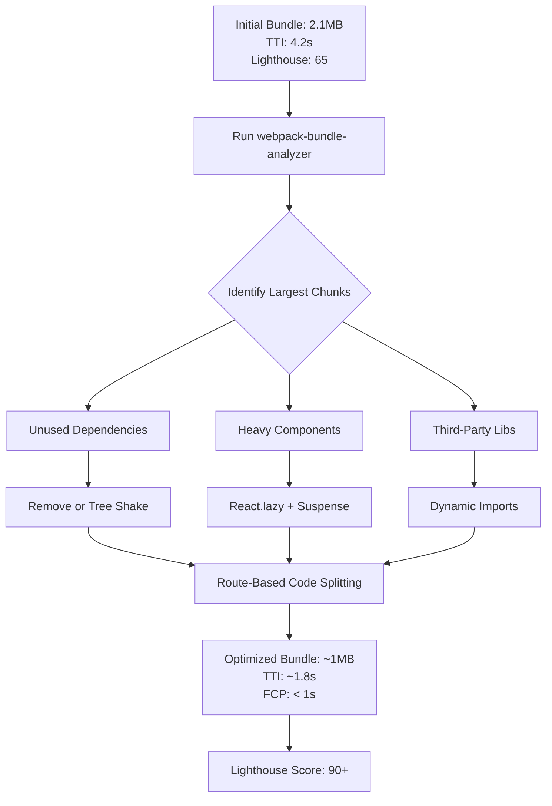

| Difficulty | Channel | Tags |
|---|---|---|
| intermediate | frontend | lighthouse, bundle, lazy-loading |

Tinder's engineering team discovered an uncomfortable truth when they launched their PWA to reach users in data-scarce markets: the very code delivering their app was the bottleneck keeping users from experiencing it [1]. The initial 166KB monolithic JavaScript bundle—modest by today's standards—proved devastatingly slow on the 2G and 3G networks typical of emerging markets. This tension between feature-rich code and fast-loading experiences is the central challenge of modern React performance optimization.

---

> ### Real-World Case — Tinder
>
> Tinder built a Progressive Web App (Tinder Online) to reach users in data-scarce markets, aiming to deliver the core swiping experience with minimal data cost. The MVP was built in 3 months using React and Redux, but initial monolithic JavaScript bundles caused slow Time to Interactive on mobile devices, threatening adoption in precisely the markets they were targeting.
>
> | | |
> |---|---|
> | **Challenge** | Tinder's main JavaScript bundle was 166KB (just the main chunk) and the full experience was too slow on median mobile hardware like the Moto G4 and Galaxy S7 over 4G. Every kilobyte mattered for users on 2.8MB data-investment plans. They needed to dramatically reduce initial bundle size and Time to Interactive without sacrificing the core swiping experience. |
> | **Solution** | Implemented route-based code splitting using React Router and React Loadable, splitting non-critical JavaScript into separate bundles loaded only when needed. They used Webpack Bundle Analyzer to identify optimization opportunities (removing unused polyfills, replacing localForage with direct IndexedDB, removing critical CSS from bundles, applying Lodash Module Replacement Plugin). They adopted strict performance budgets (~155KB main+vendor, ~55KB async chunks). They also used Workbox with Service Workers to precache route-level bundles, added link rel=preload for critical bundles, and upgraded to React 16 + Webpack 3 with scope hoisting. |
> | **Outcome** | Main bundle reduced from 166KB to 101KB (39% reduction). DCL (DOM Content Loaded) improved from 5.46s to 4.69s. Link rel=preload cut load time by 1s and first paint from 1000ms to ~500ms. React 16 upgrade reduced vendor chunk by ~6.7%. Scope hoisting improved vendor bundle parse time by 8%. Overall, the PWA delivered the core experience at just 10% of the data cost of the native app (2.8MB vs ~28MB). Users swiped and messaged more on web than native, and session times were longer on web. |
> | **Lesson** | Route-based code splitting is the highest-impact optimization for React apps—split at route boundaries first, measure with bundle analyzers, enforce performance budgets to prevent regression, and combine with Service Worker caching and preload for maximum effect. Also: upgrading your framework (React 16) and bundler (Webpack 3) can yield significant free performance wins through better tree-shaking and scope hoisting. |

---

## Hook — The Performance Budget Wake-Up Call

You ship a feature. Users complain the app feels sluggish. You run Lighthouse—65 out of 100. Your bundle is 2.1MB. Time to Interactive is 4.2 seconds. Sound familiar?

Many developers assume a growing bundle is just a fact of life. More features mean more code, right? But here is the uncomfortable truth: every kilobyte shipped without deliberate optimization is a compromise your users pay for in loading time. On mobile devices, where network speeds and hardware constraints compound the problem, the cost multiplies.

The stakes are higher than you might think. A one-second delay in page load can reduce conversions by 7%. For a company like Tinder, where the core interaction—swiping—needs to feel instant, even 500ms of jank can drive users away. The gap between a 65 and a 90+ Lighthouse score is where the real engineering work happens.

## Problem — The Hidden Cost of Monolithic Bundles

React applications tend to bloat naturally. The component model encourages modularity, but without explicit boundaries, everything ends up in a single JavaScript bundle. Every imported library, every heavy charting component, every icon set—it all ships upfront, whether the user needs it or not.

The result is predictable: long initial load times, poor Time to Interactive, and frustrated users who bounce before they ever see your UI. The problem is especially acute for applications targeting mobile users on slow networks, PWAs competing with native app performance expectations, teams adding features without a performance budget, and apps using heavy third-party visualization or data libraries.

You might think 2.1MB is acceptable. After all, internet speeds keep improving. However, median global mobile download speeds hover around 30 Mbps, and 2G and 3G networks still account for significant traffic in developing markets. Every kilobyte counts—and most teams have no idea what is actually in their bundles.

## Real-World Case — Tinder's PWA Wake-Up Call

In 2017, Tinder built a Progressive Web App called Tinder Online to reach users in data-scarce markets around the world [1]. The goal was ambitious: deliver the core swiping experience at a fraction of the data cost of the native app. The MVP was built in three months using React and Redux.

But when they tested the initial build on real devices in target markets, the numbers were sobering. The monolithic JavaScript bundle caused slow Time to Interactive on mobile devices—exactly the audience they were trying to capture.

What followed was a methodical optimization effort that produced remarkable results:

- Main bundle reduced from 166KB to 101KB—a 39% reduction
- DOM Content Loaded improved from 5.46s to 4.69s
- Link rel=preload cut load time by 1 second
- First paint dropped from 1000ms to ~500ms
- React 16 upgrade reduced vendor chunk by ~6.7%
- Scope hoisting improved vendor bundle parse time by 8%

Perhaps most telling: the PWA delivered the core experience at just 10% of the data cost of the native app (2.8MB vs ~28MB). Users did not just tolerate it—they swiped and messaged more on web than native, with longer session times. Performance optimization was not a nice-to-have. It was the difference between the PWA succeeding or failing in the markets it was built for.

## Deep Dive — The Optimization Toolkit

Tinder's success did not come from a single magic bullet. It came from layering multiple optimization techniques, each contributing incremental gains. Building on their approach, here is how you can apply the same toolkit:

**Bundle Analysis.** Before you optimize, you need to measure. webpack-bundle-analyzer generates interactive treemaps of your bundle composition, showing exactly which packages consume the most space [3]. This prevents the common mistake of optimizing the wrong thing. Many teams spend hours micro-optimizing React components when a single unused library is consuming 200KB.

**Code Splitting Strategies.** There are two primary approaches: route-based and component-based. Route-based splitting loads chunks per page—ideal for applications with distinct page boundaries. Component-based splitting defers heavy components like charts, data grids, or rich text editors until they appear in the viewport [4]. Consequently, the initial load ships only what is immediately visible.

**Tree Shaking.** Webpack's tree shaking eliminates dead code—exports your application never uses [5]. However, it only works with ES module syntax (import/export). CommonJS modules (require/module.exports) cannot be tree-shaken. This is a critical configuration detail many teams overlook, and it is why migrating to ES module libraries can produce significant savings.

**Dynamic Imports.** The dynamic import() syntax enables on-demand loading [8]. Combined with React.lazy(), it becomes a powerful tool for deferring non-critical code. The webpackChunkName comment gives your chunks meaningful names for debugging—a small practice that pays dividends when investigating production issues.

Each technique on its own provides modest gains. Combined, they transform the user experience. The key insight: start with measurement, then layer optimizations incrementally.

## Workflow — The Performance Optimization Pipeline

Optimizing a React application for Lighthouse scores of 90+ follows a repeatable pipeline. The diagram below shows the step-by-step workflow from initial analysis to the final optimized build:

Start with webpack-bundle-analyzer to identify your largest chunks. Then categorize them into three buckets: unused dependencies (remove or tree-shake), heavy components (lazy-load with React.lazy), and third-party libraries (convert to dynamic imports). Route-based splitting is the final structural change that ties everything together, ensuring each page loads only its own code.

This pipeline is not a one-time effort. Performance budgets should be integrated into your CI/CD pipeline so any regression is caught before it reaches production. Tools like Lighthouse CI can enforce thresholds automatically [6].

## Code Example — Implementing Lazy Loading with React.lazy and Suspense

The most impactful code change you can make is switching from static imports to dynamic, lazy-loaded imports using React.lazy() and Suspense. Here is a production-ready implementation:

**Route-based splitting** loads each page chunk only when navigated to. **Component-based splitting** defers heavy UI elements like charts until they are needed. **Error boundaries** handle chunk load failures gracefully—if a user loses connectivity, the app shows a fallback instead of crashing. **Nested Suspense** boundaries allow fine-grained loading states: the outer boundary shows a full-page spinner, while inner boundaries show skeleton placeholders for specific sections.

The webpackChunkName comment is not optional—it gives chunks descriptive names that make debugging production bundles significantly easier. Without it, you get numeric chunk IDs like 1.chunk.js instead of analytics.chunk.js.

## Lessons Learned — What Tinder's Journey Teaches Us

After walking through Tinder's optimization journey and the technical toolkit behind it, several key lessons emerge:

**1. Measure before you optimize.** Without bundle analysis, you are guessing. Tinder's first step was understanding what was in their bundles. Run webpack-bundle-analyzer before writing a single line of optimization code [3].

**2. Layer your techniques.** No single optimization will take you from 65 to 90+. It takes bundle analysis, code splitting, tree shaking, image optimization, and a caching strategy working together [7].

**3. Performance is a feature.** Tinder's PWA users engaged more than native app users. When you remove friction, users respond. Session times were longer on web, and messaging rates were higher [1].

**4. Set a performance budget.** Define the maximum bundle size and TTI your app can tolerate. Enforce it in CI. Tinder's 166KB to 101KB journey demonstrates that deliberate constraints drive creative solutions.

**5. Start with route-based splitting.** It provides the biggest initial gain with the least refactoring. Component-based splitting can follow for specific heavy components.

Your React app can be fast. It just takes a systematic approach and the willingness to challenge assumptions about what good enough means.

---

## Bundle Optimization Pipeline

<strong>Original Interview Question</strong>

**Q:** You're tasked with improving a React app's Lighthouse performance score from 65 to 90+. The bundle size is 2.1MB and Time to Interactive is 4.2s. What specific steps would you take to optimize the bundle and implement lazy loading?

**A:** Implement code splitting with React.lazy() and Suspense, analyze bundle composition with webpack-bundle-analyzer to identify largest chunks, remove unused dependencies and optimize imports, add dynamic imports for heavy components and third-party libraries, implement route-based splitting for better initial load times, and utilize tree shaking with proper ES module configuration.

## Conclusion

Tinder's story proves that React performance optimization is not about choosing between features and speed. A 39% bundle reduction, a halved first paint time, and users who engaged more on web than native—these are the results of a systematic approach. Start tomorrow: run your bundle analyzer, identify your three largest chunks, and lazy-load them. The rest of the playbook follows naturally.

---

## References

1. [Tinder incident report](https://calendar.perfplanet.com/2017/a-tinder-progressive-web-app-performance-case-study) — article
2. [React.lazy documentation](https://react.dev/reference/react/lazy) — documentation
3. [webpack-bundle-analyzer](https://github.com/webpack-contrib/webpack-bundle-analyzer) — documentation
4. [React code splitting guide](https://react.dev/reference/react/lazy#suspense-for-code-splitting) — documentation
5. [Webpack tree shaking guide](https://webpack.js.org/guides/tree-shaking/) — documentation
6. [Lighthouse performance scoring](https://web.dev/articles/lighthouse-performance) — documentation
7. [Service Worker API](https://developer.mozilla.org/en-US/docs/Web/API/Service_Worker_API) — documentation
8. [Webpack lazy loading](https://webpack.js.org/guides/lazy-loading/) — documentation

---

**Author:** Satishkumar Dhule — [GitHub](https://github.com/satishkumar-dhule) · [LinkedIn](https://linkedin.com/in/satishkumar-dhule) · [Website](https://satishkumar-dhule.github.io)
