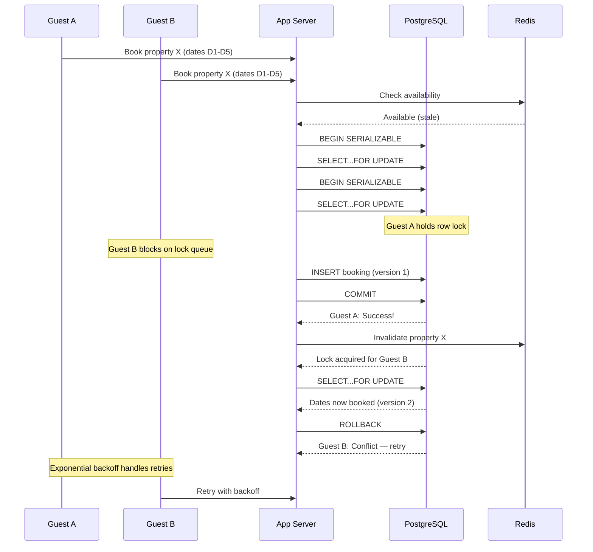

| Difficulty | Channel | Tags |
|---|---|---|
| intermediate | database | acid, isolation-levels, mvcc |

When a customer clicks 'Pay' on a site running on Stripe's infrastructure, a terrifying race condition begins. The network times out. The client retries. Without safeguards, the customer gets charged twice — or the payment is lost entirely. Stripe processes over $1 trillion in annual payment volume, and this scenario plays out constantly [1]. The same fundamental challenge haunts every booking system, every seat reservation, every ticket sale: how do you guarantee exactly-once semantics when the universe conspires to give you two?

---

> ### Real-World Case — Stripe
>
> Stripe processes over $1 trillion in annual payment volume. When a customer clicks 'Pay' on an e-commerce site and the network times out, the client retries — without idempotency, the customer gets charged twice. If they don't retry, a legitimate payment is lost. At Stripe's scale, ambiguous failures happen constantly.
>
> | | |
> |---|---|
> | **Challenge** | Preventing double charges in a distributed payment system where network failures, timeouts, and retry storms cause the same payment request to reach the server multiple times — often concurrently within microseconds before any transaction has committed. |
> | **Solution** | Stripe built an idempotency system using a unique `Idempotency-Key` header on every mutating API call. On the backend, they use SERIALIZABLE transaction isolation for the idempotency key upsert — ensuring that only one concurrent request with the same key creates the row while others get a 409 conflict. They segment operations into atomic phases with recovery points, allowing crashed servers to resume from the last committed phase without reprocessing. |
> | **Outcome** | Reliable exactly-once semantics across billions of API requests. Stripe's SDKs automatically retry with the original idempotency key using exponential backoff — even 1000 retries of the same request produce exactly one charge. The system handles the worst-case race condition (two requests arriving within the same event loop tick) through database-level atomic inserts rather than application-level check-then-act. |
> | **Lesson** | SERIALIZABLE isolation + idempotency keys are the foundation. The critical insight: two concurrent retries can both pass an application-level check before either commits. The only fix is pushing the conflict detection into the database layer with an atomic upsert, not a check-then-write pattern. This maps directly to booking systems — the exact same pattern prevents double bookings. |

---

## Hook — The Retry That Shouldn't Have Worked

Here is the nightmare scenario that keeps infrastructure engineers up at night. A customer clicks 'Book Now' on a property they found on Airbnb. The request hits your server. Your application checks availability, finds the dates free, inserts the booking — then the network blips. The client gets a timeout. The customer, frustrated, clicks again. Now two identical booking requests are racing through your system. If your database transactions are not designed for this, congratulations: you just double-booked a beachfront villa in Malibu, and two families are about to show up with their luggage on the same day. At Stripe's scale, this happens millions of times a day across billions of API requests [1]. Their solution? Idempotency keys — a cryptographic handshake between client and server that guarantees exactly one charge no matter how many times you retry.

## Problem — The Race to the Bottom of Your Database

You might think a simple database transaction is enough. Open a connection, check availability, insert the booking, commit. Done. Many developers discover the hard way that transaction isolation defaults in most databases are READ COMMITTED, which means your two concurrent requests can both see 'available' at the same time, both insert a booking, and both commit successfully. Double booking achieved in milliseconds. The root cause is a classic check-then-act race condition. By the time your first transaction commits and locks the row, the second transaction has already read the stale snapshot. Standard ACID guarantees alone do not protect against this [2]. You need isolation levels that serialize concurrent access, and you need optimistic locking to detect conflicts after the fact when serialization is too expensive.

## Real-World Case — Stripe's Idempotency Revelation

Stripe's engineering team published one of the most influential engineering blog posts on exactly this topic [1]. Their insight was deceptively simple: every API request carries a unique idempotency key generated by the client. When a network timeout triggers a retry, the retry carries the same key. The server detects the duplicate key and returns the original response instead of processing a second charge. Here is the plot twist though: this does not work without database-level atomicity. Stripe found that the worst-case race condition occurs when two requests with the same idempotency key arrive within the same event loop tick on different server instances. Application-level check-then-act would fail. The solution was a database-level atomic insert — the first request to insert the key wins, and the second request's insert is rejected by a unique constraint. This single pattern handles the entire problem space. The impact? Reliable exactly-once semantics across billions of API requests, even when 1,000 retries arrive for the same charge.

## Deep Dive — SERIALIZABLE, MVCC, and the Art of the Lock

PostgreSQL's SERIALIZABLE isolation level is the nuclear option for preventing anomalies like double bookings. Unlike REPEATABLE READ, which prevents non-repeatable reads but still allows phantom rows, SERIALIZABLE guarantees that concurrent transactions produce the same result as if they ran one after another [3][6]. Under the hood, PostgreSQL implements this through Serializable Snapshot Isolation (SSI), which tracks read-write conflicts between concurrent transactions and aborts one when a serialization anomaly is detected [8]. This is different from a simple row-level lock. A SELECT FOR UPDATE on an availability row prevents other transactions from modifying that row, but two transactions can still both read 'available' before either one locks it [7]. The correct pattern combines SERIALIZABLE isolation with SELECT FOR UPDATE on the specific date range, plus application-level retry logic with exponential backoff when serialization failures occur. Pessimistic locking (SELECT FOR UPDATE) handles the race at database level. Optimistic concurrency control adds a version column that detects stale updates at write time [5]. Neither is sufficient alone — you need both.

## Workflow — The Booking Sequence That Never Breaks

The diagram below shows exactly what happens when two guests try to book the same property simultaneously. Guest A arrives first and acquires a row-level lock on the availability records for those dates. Guest B's request arrives and immediately blocks on the same lock. Guest A's transaction completes — the booking is inserted, the version column is incremented, and the cache is invalidated. Guest B's lock resolves, but now the version check fails because Guest A already modified the row. Guest B's transaction rolls back cleanly and enters the retry loop with exponential backoff. The critical insight: Guest B does not fail with a booking that looks successful. The transaction either commits with exactly one booking, or it aborts safely and the client retries. There is no third state where both succeed or both silently fail.

## Code Example — Building the Booking Transaction in Python

Here is a production-ready booking implementation using psycopg2 and PostgreSQL that handles concurrent requests correctly. Every piece matters: the isolation level, the row lock, the version check, and the retry logic.

## Lessons Learned — What Resilient Transactions Teach Us About Systems Design

The first lesson is that application-level check-then-act is fundamentally broken at scale. You cannot check availability in one query and insert a booking in another, because the gap between those two operations is an eternity for a concurrent request. The second lesson: retry without idempotency is a liability, not a safety net. Stripe's idempotency key pattern is not just for payments — every mutating API in your system should accept an idempotency key [1]. The third lesson: pessimistic and optimistic locking are complementary, not competing strategies. SELECT FOR UPDATE prevents conflicting writes, but only optimistic version checking can detect when your snapshot was already stale before you acquired the lock [5]. The most common mistake teams make is choosing one isolation level or one locking strategy and declaring victory. The truth is messier and more interesting: you need SERIALIZABLE isolation, row-level locks, version-based optimistic concurrency control, idempotency keys on every mutation, exponential backoff with jitter on every retry, and cache invalidation that fires after the commit, not before.

---

## Concurrent Booking Flow with Optimistic Concurrency Control

<strong>Original Interview Question</strong>

**Q:** You're building a booking system for Airbnb where multiple users can reserve the same property simultaneously. How would you design the transaction handling to prevent double bookings while maintaining high availability?

**A:** Use SERIALIZABLE isolation with optimistic concurrency control. Implement row-level locks on property availability tables, use MVCC snapshot reads for checking availability, and apply application-level validation to ensure atomic booking operations.

## Conclusion

The moral of the story: database transactions are not magic, but they are remarkably powerful when you understand their limits. SERIALIZABLE isolation detects conflicts you cannot see. Row-level locks serialize writes you cannot sequence. Optimistic version checks catch races you cannot predict. Idempotency keys make retries safe. And exponential backoff with jitter makes recovery graceful. Tomorrow, audit one critical path in your system — a payment flow, a booking engine, a ticket sale — and ask yourself: what happens when two requests arrive in the same millisecond? If you cannot answer that question with confidence, the fix is in your hands now.

---

## References

1. [Stripe: Designing an idempotency API](https://stripe.com/blog/idempotency) — article
2. [Wikipedia: ACID](https://en.wikipedia.org/wiki/ACID) — documentation
3. [Wikipedia: Isolation (database systems)](https://en.wikipedia.org/wiki/Isolation_(database_systems)) — documentation
4. [Wikipedia: Multiversion concurrency control](https://en.wikipedia.org/wiki/Multiversion_concurrency_control) — documentation
5. [Wikipedia: Optimistic concurrency control](https://en.wikipedia.org/wiki/Optimistic_concurrency_control) — documentation
6. [PostgreSQL Documentation: Transaction Isolation](https://www.postgresql.org/docs/current/transaction-iso.html) — documentation
7. [PostgreSQL Documentation: Explicit Locking](https://www.postgresql.org/docs/current/explicit-locking.html) — documentation
8. [Serializable Isolation for Snapshot Databases](https://arxiv.org/abs/1208.4173) — paper

---

**Author:** Satishkumar Dhule — [GitHub](https://github.com/satishkumar-dhule) · [LinkedIn](https://linkedin.com/in/satishkumar-dhule) · [Website](https://satishkumar-dhule.github.io)
