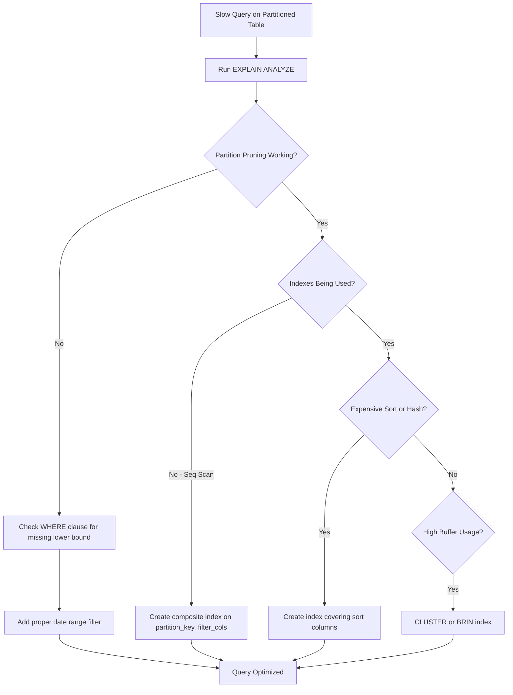

| Difficulty | Channel | Tags |
|---|---|---|
| intermediate | database | explain, query-plan, partitioning |

It was the kind of problem that starts as a background hum and crescendos into a crisis. CoinGecko's API — a backbone for the crypto ecosystem — was slowing down. p99 response times were pushing past 4 seconds. Replica lag was spiking. IOPS was hitting its ceiling. The culprit? A single PostgreSQL table holding 8+ years of hourly cryptocurrency price data, now over 1TB. They did what any sensible team would do: they partitioned the table. And it helped — mostly. But one query got worse. This is the story of why partitioning is not a magic wand, and what you need to check before you declare victory [1].

---

> ### Real-World Case — CoinGecko
>
> CoinGecko had a 1TB+ PostgreSQL table storing 8+ years of hourly cryptocurrency price data. Queries were regularly taking over 30 seconds, IOPS was constantly breaching limits, replica lag was spiking, and their API Apdex score was deteriorating. They hit a wall where vertically scaling IOPS was no longer sustainable.
>
> | | |
> |---|---|
> | **Challenge** | Adding indexes was impossible because the query used a JSONB column with dynamically-named currency keys. With 8+ years of data and 1TB+ in a single table, every query had to scan the entire dataset even when only the last few months were needed. The table was outgrowing PostgreSQL's ability to serve it efficiently regardless of hardware scaling. |
> | **Solution** | They implemented monthly range partitioning on the timestamp column so queries would only scan relevant month partitions. They migrated 1.2TB of data with zero downtime using foreign data wrappers to read from a prewarmed auxiliary database and write into the new partitioned table on production. They also prewarmed partition caches using pg_prewarm to avoid cold-cache performance shock on cutover. |
> | **Outcome** | 86% reduction in p99 API response time (from 4.13s to 578ms), 20% reduction in IOPS across all replicas, 6-8x faster queries, and elimination of replica lag. However, one query got WORSE after partitioning — it lacked a lower bound on the date range filter, causing PostgreSQL to scan all partitions instead of pruning. Modifying that query to include a proper date lower bound resolved the regression. |
> | **Lesson** | Partitioning is not a silver bullet — it only helps if queries are written to match the partition key. A query without proper date bounds can perform WORSE on a partitioned table than on the unpartitioned original because PostgreSQL must scan every partition's indexes. Always verify partition pruning is actually working in the EXPLAIN plan. Also, creating future empty partitions can cause `created_at > ?` queries to scan irrelevant partitions. |

---

## Hook — The Slow-Motion Database Crisis

Every engineering team has a table that scares them. You know the one — it is the largest table in the database, queries against it keep getting slower, and every attempt to optimize feels like squeezing water from a stone. For CoinGecko, that table held 1TB+ of hourly cryptocurrency price data spanning 8+ years. Queries were regularly breaching 30 seconds. IOPS limits were being hit daily. Replica lag was so bad that read replicas could not keep up, creating stale data problems throughout the system. The API Apdex score — the measure of user satisfaction with response times — was in freefall. The team was stuck in a reactive cycle: add more IOPS, buy time, watch it degrade again. Vertical scaling was a treadmill, and the treadmill was speeding up.

## Problem — When 100M Rows Refuse to Cooperate

You have partitioned your table. You have read the PostgreSQL docs. You have spread your data across monthly or daily partitions. And yet, that query with a date range filter is still crawling. Sound familiar? Many developers assume partitioning is a performance silver bullet. The reality is more nuanced. Partitioning helps the database skip irrelevant data — but only if the planner actually prunes partitions. And even when it does, you are still dealing with a partition that might contain millions of rows. Without the right indexes, without the right query structure, and without understanding what the EXPLAIN plan is actually telling you, partitioning can become an expensive illusion [2]. The database still scans partitions sequentially. It still sorts in memory. It still misses indexes. The difference is that now you also have the overhead of the partition routing itself.

## Real-World Case — CoinGecko's 1TB Wake-Up Call

CoinGecko's engineering team documented their journey in detail [1]. After hitting the IOPS wall, they partitioned their massive price history table by date ranges. The results were impressive: p99 API response time dropped from 4.13 seconds to 578 milliseconds — an 86% improvement. IOPS across all replicas dropped by 20%. Queries were 6-8x faster overall. Replica lag was eliminated entirely. But here is where the story takes an unexpected turn. One specific query actually got *worse* after partitioning. The root cause? That query did not include a lower bound on the date range filter. Without it, PostgreSQL could not prune partitions effectively — it scanned every single partition instead of the relevant subset. The fix was simple: modify the query to include a proper date lower bound. This single change resolved the regression entirely. The lesson is profound: partitioning only helps if your queries are written to cooperate with it.

## Deep Dive — Reading the EXPLAIN Plan Like a Detective

When you stare at a slow query on a partitioned table, the EXPLAIN plan is your crime scene. Every line tells a story. The question is whether you know how to read it. Start by checking for partition pruning. In the EXPLAIN output, look for the 'Subplans Removed' field — if it is zero or very low, your query is forcing PostgreSQL to visit partitions it does not need. The most common cause is a missing or improperly formatted date filter [3]. Next, look for sequential scans on individual partitions. A sequential scan on a partition with millions of rows is a red flag that your indexes are not being used. This typically happens when the WHERE clause filters on columns that are not indexed, or when the query pattern does not match the index structure. Pay close attention to 'Filter' lines in the plan — they reveal what the database is applying as a post-scan filter versus during an index scan. If you see a Filter on a column that *could* have been part of an index condition, your index design needs work [4]. Finally, watch for expensive Sort and Aggregate operations. PostgreSQL may choose a Hash Aggregate or a Sort+GroupAggregate depending on the data distribution. If you see a Sort on a column that is not indexed, creating a composite index that covers both the filter and the sort columns can eliminate the sort entirely. This is where composite indexes on (date, filtered_column, sort_column) become powerful.

## Workflow — The 5-Step Partitioned Query Diagnostic

The following diagnostic workflow has saved countless hours debugging partitioned query performance. Start with the raw EXPLAIN output and work through each layer methodically.

**Step 1: Verify partition pruning** — Check the 'Subplans Removed' field in your EXPLAIN output. If the database is visiting more partitions than necessary, your WHERE clause is the problem. Ensure date range filters use inclusive bounds on the partition key.

**Step 2: Check index utilization** — Look for Sequential Scans inside any individual partition. If you see them, check whether your indexes match the query's WHERE clause columns. A common mistake is indexing only the partition key and forgetting the filter columns.

**Step 3: Identify expensive operations** — Scan for Sort, HashAggregate, and Materialize nodes. These are often the most expensive parts of the plan. If a sort is happening on disk ("External Sort"), that is a performance emergency.

**Step 4: Assess composite index coverage** — For queries filtering on (date, status), the ideal index is on (date, status) in that order. This allows the database to prune partitions by date *and* efficiently filter within each partition by status [5].

**Step 5: Evaluate data clustering** — If your data is physically scattered on disk, even indexed reads suffer from random I/O. The CLUSTER command rewrites the table in index order, which can dramatically improve locality for range scans [6].

## Code Example — From Slow Query to Optimized Production Query

Let us walk through a concrete example that mirrors CoinGecko's scenario: time-series data with a date-based partition scheme.

```sql
-- Step 1: Diagnose with EXPLAIN (ANALYZE, BUFFERS)
-- Look for: Subplans Removed, Seq Scan on partitions, Sort methods
EXPLAIN (ANALYZE, BUFFERS) 
SELECT * FROM hourly_prices 
WHERE priced_at BETWEEN '2024-01-01' AND '2024-01-31'
  AND coin_id = 'bitcoin'
ORDER BY priced_at DESC;

-- Step 2: If partition pruning is not happening, check the query.
-- A missing lower bound like this will scan ALL partitions:
-- SELECT * FROM hourly_prices WHERE priced_at <= '2024-01-31';

-- Step 3: Add a composite index that covers both filter columns
-- The CONCURRENTLY keyword avoids locking the table for writes
CREATE INDEX CONCURRENTLY idx_hourly_prices_date_coin 
ON hourly_prices (priced_at, coin_id);

-- Step 4: For range-scan-heavy workloads, cluster the data
-- This physically reorders rows to match the index
CLUSTER hourly_prices USING idx_hourly_prices_date_coin;

-- Step 5: Re-run the query and compare buffer hit ratios
EXPLAIN (ANALYZE, BUFFERS) 
SELECT * FROM hourly_prices 
WHERE priced_at BETWEEN '2024-01-01' AND '2024-01-31'
  AND coin_id = 'bitcoin'
ORDER BY priced_at DESC;
```

The first EXPLAIN run reveals whether the database is pruning partitions and using index scans. After creating the composite index and clustering, the second run should show significantly fewer buffers read and a lower total execution time. The CLUSTER command is particularly valuable for time-series data because queries typically access recent time ranges — physically grouping recent rows together maximizes cache efficiency [7]. One caveat: CLUSTER is a one-time operation and subsequent inserts will not maintain that order. For write-heavy tables, consider BRIN indexes instead, which work well on naturally ordered data like timestamps [8].

## Lessons Learned — The Hidden Rules of Partitioning

CoinGecko's experience reveals several truths that apply to any team working with large PostgreSQL tables. First, partitioning is an optimization for the *planner*, not for storage. It helps PostgreSQL skip data at the planning stage, but it does not replace the need for well-designed indexes within each partition. Second, always verify partition pruning with real queries — your application might be generating SQL that unintentionally prevents pruning. Third, composite indexes on (partition_key, filter_column) are your best friend for partitioned tables. They enable both partition pruning and efficient row filtering in a single index scan. Fourth, consider your query patterns holistically. If most of your queries lack a lower bound on the date range, a different partitioning strategy (or no partitioning at all) might be more effective. Finally, never assume the fix is done after adding partitions. Measure. Then measure again. The difference between a well-tuned partitioned query and a poorly-tuned one is often a single line in the WHERE clause.

---

## Partitioned Query Diagnostic Flow



<details>
<summary><strong>Original Interview Question</strong></summary>

**Q:** You have a PostgreSQL table with 100M rows partitioned by date. A query filtering on a specific date range is still slow. What would you check in the EXPLAIN plan and how would you optimize it?

**A:** Check partition pruning effectiveness, index utilization patterns, and expensive sort operations. Create composite indexes on (date, filtered_columns) and evaluate clustering strategies for optimal data access.

</details>

## Conclusion

The next time you add partitioning to a table, do not stop there. Run the EXPLAIN plan. Check that partitions are being pruned. Verify that indexes are actually used inside each partition. Look for hidden sorts and sequential scans. And remember CoinGecko's lesson: one query without a lower bound on the date filter can undo all your partitioning gains. Partitioning is a tool in your performance toolbox — not a replacement for understanding how your queries actually execute. Your API latency depends on it.

---

## References

1. [CoinGecko incident report](https://dev.to/coingecko/scaling-postgresql-performance-with-table-partitioning-136o) — article
2. [PostgreSQL Table Partitioning Documentation](https://www.postgresql.org/docs/current/ddl-partitioning.html) — documentation
3. [PostgreSQL Using EXPLAIN Documentation](https://www.postgresql.org/docs/current/using-explain.html) — documentation
4. [PostgreSQL Indexes Documentation](https://www.postgresql.org/docs/current/indexes.html) — documentation
5. [Database Partitioning on Wikipedia](https://en.wikipedia.org/wiki/Partition_(database)) — documentation
6. [PostgreSQL CLUSTER Command Documentation](https://www.postgresql.org/docs/current/sql-cluster.html) — documentation
7. [PostgreSQL CREATE INDEX CONCURRENTLY Documentation](https://www.postgresql.org/docs/current/sql-createindex.html) — documentation
8. [PostgreSQL BRIN Index Introduction](https://www.postgresql.org/docs/current/brin-intro.html) — documentation

---

**Author:** Satishkumar Dhule — [GitHub](https://github.com/satishkumar-dhule) · [LinkedIn](https://linkedin.com/in/satishkumar-dhule) · [Website](https://satishkumar-dhule.github.io)
