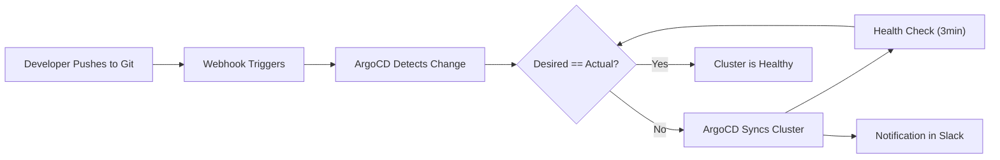

| Difficulty | Channel | Tags |
|---|---|---|
| beginner | devops | argocd, flux, declarative |

Imagine managing 350+ Kubernetes clusters, 3,000+ microservices, and 50,000+ namespaces — with 6,000 developers deploying multiple times a day. That was Intuit's reality in 2018. And it was breaking. Their teams were drowning in configuration drift, manual kubectl commands, and a support bottleneck that nobody knew how to fix [1]. The solution? A radical shift from imperative firefighting to declarative GitOps — and the tool that made it possible was ArgoCD.

---

> ### Real-World Case — Intuit
>
> Intuit (TurboTax, QuickBooks, Mint) began their Kubernetes journey in 2018 and rapidly scaled to 350+ clusters with 3,000+ production microservices across 50,000+ namespaces. Their 6,000+ developers needed to deploy frequently, but the imperative approach of kubectl commands and manual processes led to configuration drift, inconsistent deployments, and massive support bottlenecks.
>
> | | |
> |---|---|
> | **Challenge** | Configuration drift between clusters, no single source of truth for deployments, developers waiting in Slack for troubleshooting help, expert DevOps engineers drowning in repetitive diagnostic work, and reconciliation times that ballooned as application counts grew. |
> | **Solution** | Adopted declarative GitOps with ArgoCD: Git became the single source of truth for all Kubernetes manifests. They configured automated sync with self-healing to revert any manual kubectl changes, implemented controller sharding to scale reconciliation, and reduced app reconciliation from minutes to seconds. Later integrated AI-powered troubleshooting via Slack, replacing an unsuccessful ArgoCD UI extension. |
> | **Outcome** | Eliminated configuration drift across 350+ clusters, reduced Mean Time To Recovery from hours to minutes with automated diagnostics (e.g., detecting Spring config server URL mismatches between environments), scaled from hundreds to thousands of applications without proportional operational overhead, and achieved dramatically higher developer adoption by meeting them in Slack rather than a new UI. |
> | **Lesson** | The declarative GitOps model (desired state in Git, ArgoCD reconciles automatically) fundamentally outperforms imperative kubectl commands at scale. The plot twist: Intuit built an AI GitOps assistant as an ArgoCD UI extension first — it failed because experts went straight to logs and novices never opened ArgoCD. Rebuilding it as a Slack bot (where developers already debug) drove dramatically higher engagement. Also, they learned that scaling ArgoCD beyond a few hundred apps requires controller sharding, webhook-triggered reconciliation, and careful tuning of the default 3-minute polling interval to avoid Kubernetes API overload. |

---

## Hook — The Deploy That Broke Everything (And Nobody Noticed Until Too Late)

You have been there. It is 3 AM. You push what you thought was a harmless config change, and suddenly half your staging environment is pointing at the wrong database. You scramble for `kubectl rollout undo`, praying the previous state is still recoverable. Now scale that feeling by 3,000 microservices. Intuit was living this nightmare daily. Their engineering teams were moving fast — maybe too fast. With thousands of developers issuing imperative commands directly to clusters, the gap between what should be running and what was actually running became a chasm [1]. Something had to change.

## Problem — The Silent Erosion of Configuration Drift

At its core, the problem is simple: imperative workflows give you speed but take away consistency. Every time a developer runs `kubectl apply` or `kubectl patch`, they bypass the single source of truth. The cluster state drifts from the repository state. One team patches a deployment scaling parameter directly. Another hotfixes a configmap in production. Before long, nobody can tell you exactly what is running where. Configuration drift is not just a hygiene issue — it is a safety issue. It makes rollbacks dangerous, auditing impossible, and debugging a nightmare. You might think, "But my team is disciplined — this would not happen to us." Intuit thought so too.

## Real-World Case — Intuit's Kubernetes Awakening

When Intuit began their Kubernetes journey in 2018, they embraced the scale that containers promised — and they got it, maybe too well. By the time they realized they had a problem, they were managing 350+ clusters, 3,000+ production microservices, and over 50,000 namespaces [1]. Their 6,000+ developers were deploying imperatively, and the result was predictable: configuration drift across every environment, inconsistent deployments that broke downstream services, and a support team that became the bottleneck for every release. The Mean Time To Recovery stretched from minutes to hours because diagnosing a broken deploy meant spelunking through direct cluster mutations with no audit trail. However, Intuit's turnaround became the gold standard for GitOps adoption. By adopting ArgoCD and a fully declarative model, they eliminated configuration drift entirely. Automated diagnostics caught mismatches — like a Spring Config Server URL pointing to staging instead of production — before they caused incidents. MTTR dropped from hours to minutes. And here is the plot twist: Intuit's highest-leverage move was not a better dashboard or a stricter policy. It was meeting developers where they already lived — Slack. By integrating GitOps workflows into chat, they achieved dramatically higher adoption than any new UI could have driven [1].

## Deep Dive — Declarative vs Imperative: Why Your Git Repo Should Be The Law

Every developer has used the imperative approach. `kubectl run`, `kubectl expose`, `kubectl scale` — they are the first commands you learn. They feel fast. They feel direct. And they are dangerous at scale. The declarative approach flips the model entirely. Instead of telling Kubernetes "scale this deployment to 5 replicas," you define a YAML file that says "this deployment should always have 5 replicas" and let the system figure out the rest. ArgoCD takes this further. It is not just a deployment tool — it is a reconciliation loop. It continuously compares the desired state in your Git repository against the live cluster state. When they diverge — whether from a manual change or a drifted config — it self-heals. The difference is profound [2][3].

## Workflow — From Git Push to Production Sync

Building on the declarative model, here is how a GitOps workflow actually flows through ArgoCD. The diagram below traces a developer's commit through the pipeline — from repository push to cluster reconciliation. Each step enforces a guarantee: the cluster always matches Git, and Git always reflects team consensus.

## Code Example — Your First ArgoCD Application CRD

The heart of any ArgoCD setup is the Application Custom Resource Definition (CRD). This YAML tells ArgoCD what to watch, where to sync, and how to behave when the cluster state drifts.

## Lessons Learned — What Intuit's Journey Teaches Every Team

Intuit's transformation offers insights that apply whether you have 3 clusters or 300. First, adoption strategy matters more than tooling. Intuit's decision to integrate GitOps with Slack — rather than forcing yet another dashboard — was the single highest-impact decision they made [1]. Second, self-healing is not optional. Without `selfHeal: true`, ArgoCD is just a fancy UI for kubectl. With it, the cluster becomes self-governing. Third, start with a single critical service, not all 3,000. Pick one deployment that causes the most late-night pages, migrate it to a declarative GitOps workflow, and measure the difference in recovery time. The numbers will sell themselves. Finally, treat your Git repository as immutable infrastructure. Every merge should feel like signing a contract with your production environment. When you do that, configuration drift becomes a solved problem — not a daily firefight.

---

## GitOps Reconciliation Loop with ArgoCD

<strong>Original Interview Question</strong>

**Q:** You're setting up GitOps for a microservices deployment. How would you configure ArgoCD to automatically sync changes from your Git repository to Kubernetes, and what's the difference between declarative and imperative approaches in this context?

**A:** I'd configure ArgoCD by setting up a Git repository containing Kubernetes manifests or Helm charts, creating an Application CRD that points to the Git repository, enabling auto-sync with a health check interval of 3 minutes, and implementing self-healing to automatically revert any manual changes. The declarative approach involves defining the desired state in Git through YAML manifests, Helm charts, or Kustomize configurations, where ArgoCD continuously reconciles the actual state with the desired state. In contrast, the imperative approach uses kubectl commands to make direct changes to the cluster, bypassing the Git repository as the single source of truth.

## Conclusion

Intuit's story proves that GitOps is not just about tooling — it is about changing how your team thinks about deployments. The shift from imperative to declarative is the difference between fighting fires and preventing them. Start small. Pick one service. Write one Application CRD. Let ArgoCD prove itself. By this time next quarter, you will wonder how you ever lived without a self-healing cluster.

---

## References

1. [Intuit incident report](https://www.polarpoint.io/blog/2026/03/24/ai-driven-gitops-with-mcp-and-argo-cd/) — blog
2. [ArgoCD Documentation — Declarative GitOps](https://argo-cd.readthedocs.io/en/stable/) — documentation
3. [Kubernetes — Declarative Management](https://kubernetes.io/docs/tasks/manage-kubernetes-objects/declarative-config/) — documentation
4. [GitOps Principles — OpenGitOps](https://opengitops.dev/) — documentation
5. [Kubernetes Self-Healing Deployments](https://kubernetes.io/docs/concepts/workloads/controllers/deployment/) — documentation
6. [Kustomize — Declarative Configuration Customization](https://kubectl.docs.kubernetes.io/) — documentation
7. [Helm — The Package Manager for Kubernetes](https://helm.sh/docs/) — documentation
8. [DigitalOcean — An Introduction to GitOps](https://www.digitalocean.com/community/tutorials/an-introduction-to-gitops) — blog

---

**Author:** Satishkumar Dhule — [GitHub](https://github.com/satishkumar-dhule) · [LinkedIn](https://linkedin.com/in/satishkumar-dhule) · [Website](https://satishkumar-dhule.github.io)
