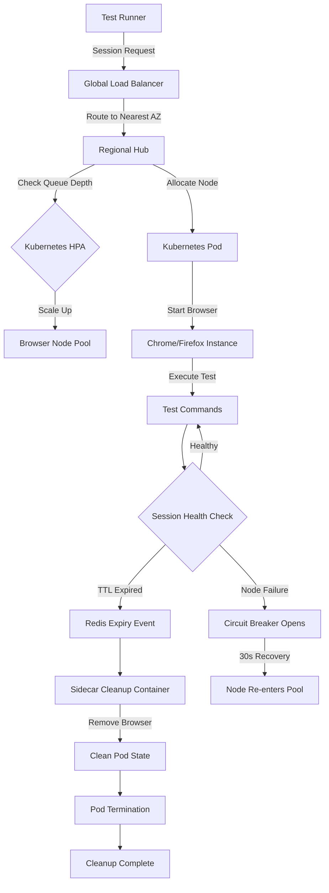

| Difficulty | Channel | Tags |
|---|---|---|
| advanced | system-design | selenium, webdriver, grid |

Walmart Labs was stuck. Their engineering teams moved fast, but their testing pipeline moved at a crawl. With no test management tool that could handle their scale, releases shipped just twice per month — a painful bottleneck for a company powering one of the world's largest retail platforms [1]. Sound familiar? If you have ever watched a CI pipeline queue grow while engineers twiddle their thumbs, you know the pain. This is the story of how Walmart broke through that ceiling — and what it takes to build a Selenium Grid that can handle 10,000 concurrent sessions without breaking a sweat.

---

> ### Real-World Case — Walmart
>
> Walmart Labs was stuck with manual testing, releasing updates only twice per month on a three-week dev cycle. With no test management tool that worked at their scale, they couldn't keep up with the browser/OS fragmentation their customers used.
>
> | | |
> |---|---|
> | **Challenge** | Manual testing couldn't scale across the 700+ browser/OS combinations Walmart's customers used. Teams were siloed with their own tools, and no existing test management platform could handle Walmart's massive testing requirements. |
> | **Solution** | Walmart built Test Armada, an open-source quality automation platform supporting web, native, and backend testing. They standardized on Selenium with Appium, Espresso, and XCUITest, and used Sauce Labs cloud for massive browser/OS coverage without managing infrastructure. A Center of Excellence (DXT team) drove standardization across 40+ global projects. |
> | **Outcome** | 50,000+ automated tests per day, 14+ million tests over 7 years across 700+ browser/OS combinations. Deploy cycles accelerated from twice per month to daily. Saved 750,000+ man-hours that would have been spent on manual testing within the first year. Individual teams grew from 200 to 500+ test cases per build. |
> | **Lesson** | Standardizing testing frameworks across an organization creates compounding returns—teams build on shared infrastructure rather than reinventing the wheel. Open-source tools like Selenium combined with cloud testing infrastructure can scale massively without proportional infrastructure cost or management overhead. |

---

## Hook — The Day Testing Became the Bottleneck

You have been there. The code is written, reviewed, and merged. But the tests? They are still running. Hours later. You refresh Jenkins, Slack pings with failures, and you realize the root cause was a flaky test that timed out waiting for a button that never rendered. Now multiply that by 50,000 automated tests per day across 700+ browser and OS combinations [1]. That was Walmart's reality before they overhauled their test infrastructure. For most teams, scaling Selenium Grid means adding a few more nodes to a Docker Compose file. But when your test suite runs 14+ million tests over seven years and saves 750,000+ man-hours in the first year alone, you quickly discover that "just add more nodes" is a recipe for disaster [1]. The real challenge is not just scale — it is reliability at scale. And that requires an entirely different architecture.

## Problem — Why Your Selenium Grid Is Falling Over

Let's be honest: most Selenium Grid setups are held together by duct tape and good intentions. You spin up a hub, connect a few nodes, and call it a day. But here is the uncomfortable truth — that setup will fail the moment you push past a few hundred concurrent sessions. Why? Three reasons. First, **memory leaks**: each browser instance chews through RAM, and without aggressive cleanup, nodes become memory bombs waiting to detonate. Second, **node failures are inevitable**: containers crash, browsers freeze, and network partitions happen. Your architecture must assume failure — not hope it does not occur. Third, **session orchestration at scale is a distributed systems problem**: you are not just running tests; you are managing 10,000 concurrent stateful sessions across multiple data centers, each with its own resource constraints, latency profiles, and failure domains. Many developers think the solution is simply throwing hardware at the problem. In reality, the bottleneck is almost never CPU or network — it is architectural design. A single regional hub creates a single point of failure. Unbounded session creation without TTL policies turns your cluster into a zombie graveyard. And without circuit breakers? One slow node drags down your entire grid.

## Real-World Case — Walmart

Walmart Labs hit this wall hard. With a three-week dev cycle and updates shipping only twice per month, their manual testing treadmill was unsustainable. The browser fragmentation their customers used was staggering — 700+ combinations of browsers, operating systems, and versions [1]. Every release was a gamble: did they cover enough configurations? Did they miss a regression on an obscure browser version that a significant chunk of customers still used? The turning point came when they realized that no off-the-shelf test management tool could handle their volume. So they built their own solution around open-source technologies, embracing Selenium Grid at massive scale. The results were transformative: deployments accelerated from twice per month to daily. Individual teams grew from 200 to 500+ test cases per build. And over seven years, they ran 14+ million tests across every browser configuration imaginable [1]. But here is the plot twist that most teams miss: Walmart's success was not about the test framework. It was about the infrastructure plumbing. They invested in session lifecycle management, resource isolation, and monitoring before they scaled. That distinction separates a grid that works from a grid that burns.

## Deep Dive — The Architecture Behind 10,000 Concurrent Sessions

Building a Selenium Grid at this scale means thinking like a cloud provider, not a test engineer. Let's break down the critical layers. **Hub-Node Pattern Reimagined**: The classic Selenium Grid has a single hub routing requests to nodes. At 10,000 sessions, that hub becomes a bottleneck and a single point of failure. The solution? Deploy Kubernetes StatefulSets managing browser nodes across multiple availability zones, with the hub abstracted into a distributed routing layer [2]. Each zone operates semi-independently, and a global load balancer routes sessions to the nearest healthy zone. **Session Management Architecture**: Every session gets a TTL (time-to-live) in a Redis cluster. If a session does not report progress within its TTL window, Redis automatically expires it, and the Kubernetes sidecar container triggers cleanup of orphaned browser processes [3]. This pattern prevents the silent accumulation of zombie sessions that plague naive implementations. **Resource Quotas That Actually Work**: Each pod gets 2GB RAM and 1 CPU core. With 200 nodes for 10,000 sessions (at 50 sessions per node), baseline memory is 400GB. Add a 30% safety buffer, and you need a 520GB cluster minimum. Horizontal pod autoscaling based on queue depth, not CPU utilization — a critical distinction. Queue depth tells you about pending demand; CPU tells you about current processing. Autoscaling on CPU means you are always behind the curve [4]. **Memory Management Strategy**: No garbage collector can save you from unbounded browser instances. The prevention strategy has three pillars: weekly rolling restarts to flush accumulated state, memory usage alerts at 80% capacity, and Redis key expiration scans every five minutes to reclaim leaked sessions [3]. Kubernetes init containers clean up stale Docker volumes before new pods start. This belt-and-suspenders approach ensures one leaking session cannot cascade into a cluster-wide outage. **Circuit Breakers and Health Checks**: A failed node should never take down your grid. Implement weighted round-robin load balancing based on node capacity and response time. Each node exposes an HTTP `/status` endpoint checked every 10 seconds. After three consecutive failures, the circuit breaker trips and the node enters a 30-second recovery window before being allowed back into rotation [5]. This prevents the thundering herd problem where a recovering node gets immediately flooded with new sessions and collapses again. **Canary Deployments for Zero-Day Failures**: Browser updates are notorious for introducing regressions. Push new node versions through canary deployments with traffic splitting. Only 5% of sessions hit the canary nodes initially. If error rates spike, the deployment rolls back automatically before it ever affects production traffic [6].

## Workflow — From Session Request to Test Completion

Here is what happens when a test requests a browser session in this architecture. The flow encompasses everything from load balancing through resource allocation to cleanup — and it is a masterclass in distributed systems design. The Mermaid diagram below traces the complete lifecycle:

flowchart TD
    A[Test Runner] -->|Session Request| B[Global Load Balancer]
    B -->|Route to Nearest AZ| C[Regional Hub]
    C -->|Check Queue Depth| D{Kubernetes HPA}
    D -->|Scale Up| E[Browser Node Pool]
    C -->|Allocate Node| F[Kubernetes Pod]
    F -->|Start Browser| G[Chrome/Firefox Instance]
    G -->|Execute Test| H[Test Commands]
    H --> I{Session Health Check}
    I -->|Healthy| H
    I -->|TTL Expired| J[Redis Expiry Event]
    J --> K[Sidecar Cleanup Container]
    K -->|Remove Browser| L[Clean Pod State]
    I -->|Node Failure| M[Circuit Breaker Opens]
    M -->|30s Recovery| N[Node Re-enters Pool]
    L --> O[Pod Termination]
    O --> P[Cleanup Complete]

The flow starts with the global load balancer routing to the nearest healthy availability zone. The regional hub checks queue depth and triggers horizontal pod autoscaling if demand exceeds current capacity [4]. Once a pod is allocated, the browser instance starts with strict resource limits. Throughout execution, health checks run every 10 seconds through the `/status` endpoint. If a session exceeds its TTL without progress, Redis fires an expiry event that triggers the sidecar cleanup container. If a node fails three consecutive health checks, the circuit breaker isolates it for 30 seconds [5]. Only after the pod fully terminates and cleans up its volumes is the slot available for a new session.

## Code Example — Configuring a Production-Grade Selenium Grid Node

The difference between a toy grid and a production grid often comes down to configuration. Here is a Kubernetes deployment for a Selenium node with proper resource limits, health checks, and cleanup logic baked in.

```python
from kubernetes import client, config

def create_selenium_node_deployment():
    resources = client.V1ResourceRequirements(
        limits={"memory": "2Gi", "cpu": "1"},
        requests={"memory": "1.5Gi", "cpu": "800m"}
    )
    
    probe = client.V1Probe(
        http_get=client.V1HTTPGetAction(
            path="/status",
            port=4444
        ),
        initial_delay_seconds=10,
        period_seconds=10,
        failure_threshold=3
    )
    
    sidecar = client.V1Container(
        name="session-cleanup",
        image="selenium/session-cleanup:latest",
        env=[
            client.V1EnvVar(
                name="REDIS_TTL_SCAN_INTERVAL",
                value="300"
            )
        ]
    )
    
    node_container = client.V1Container(
        name="selenium-node",
        image="selenium/node-chrome:latest",
        resources=resources,
        readiness_probe=probe,
        liveness_probe=probe,
        env=[
            client.V1EnvVar(
                name="SE_SESSION_TIMEOUT",
                value="300"
            ),
            client.V1EnvVar(
                name="SE_NODE_MAX_SESSIONS",
                value="50"
            )
        ]
    )
    
    deployment = client.V1Deployment(
        metadata=client.V1ObjectMeta(name="selenium-node-pool"),
        spec=client.V1DeploymentSpec(
            replicas=200,
            template=client.V1PodTemplateSpec(
                spec=client.V1PodSpec(
                    containers=[node_container, sidecar]
                )
            )
        )
    )
    return deployment
```

This configuration addresses three of the most common failure modes. First, resource limits prevent any single node from consuming more than 2GB of RAM — which means one leaking session cannot crash its neighbors. Second, the dual probe system (readiness and liveness) ensures that a slow node is removed from the load balancing pool before it times out sessions. Third, the sidecar container runs independently from the browser process, so even if Chrome crashes, the cleanup logic still executes. The `SE_NODE_MAX_SESSIONS` environment variable caps each node at 50 sessions, distributing load evenly across the cluster. And the 5-minute TTL scan interval ensures that session leaks are caught within minutes, not hours.

## Lessons Learned — What 14 Million Tests Taught Us

If there is one takeaway from Walmart's journey and the architectural patterns above, it is this: **scaling test infrastructure is a distributed systems problem, not a testing problem**. The most sophisticated test suite in the world is worthless if the grid running it collapses under load. Here are the battle-tested lessons: **Assume every node will fail.** Build circuit breakers, health checks, and automatic recovery into your architecture from day one. Do not add them after the outage — you will not have time. **Memory is your enemy.** Browser instances leak memory. It is not a question of if, but when. Design for cleanup: TTL-based session expiry, periodic scans, and sidecar containers that operate independently from the browser process. **Autoscale on queue depth, not CPU.** CPU utilization is a lagging indicator. Queue depth tells you how many sessions are waiting — and that is what drives autoscaling decisions. **Use canary deployments for browser versions.** A new Chrome release can break your tests in unpredictable ways. Roll out new node versions gradually with traffic splitting so you catch regressions before they affect everyone. **Monitor trends, not just alerts.** A Grafana dashboard showing session duration trends and memory consumption patterns over time will catch problems before any alert threshold triggers. Prometheus metrics combined with historical dashboards give you predictive insight, not just reactive alarms [7, 8]. The tl;dr? Your Selenium Grid is a distributed system. Treat it like one.

---

## Selenium Grid Session Lifecycle



<details>
<summary><strong>Original Interview Question</strong></summary>

**Q:** Design a scalable Selenium Grid architecture to handle 10,000 concurrent test sessions with 99.9% uptime, ensuring zero memory leaks through automatic session lifecycle management, real-time monitoring, and graceful node failure recovery across multiple data centers?

**A:** Deploy Kubernetes cluster with auto-scaling node pools, Redis session store with TTL policies, Prometheus metrics for memory monitoring, circuit breakers for node isolation, and sidecar containers for session cleanup. Implement health checks, resource quotas, and rolling updates.

</details>

## Conclusion

Walmart's transformation from twice-monthly releases to daily deployments did not come from a better test framework — it came from treating test infrastructure as a first-class distributed system. The patterns you have seen here — circuit breakers, TTL-based session management, queue-depth autoscaling, and sidecar cleanup containers — are not Selenium-specific. They apply to any stateful workload operating at scale. The next time your CI pipeline queues up and everyone reaches for the "add more nodes" button, pause. Ask yourself: will more nodes solve the problem, or will they just prolong the death by a thousand cuts? Build the plumbing right, and the scale takes care of itself.

---

## References

1. [Walmart embraces test automation and open source to increase coverage and deploy more often](https://saucelabs.com/resources/case-studies/walmart-embraces-test-automation-and-open-source-to-increase-coverage-and-deploy-more-often) — article
2. [Kubernetes StatefulSets documentation](https://kubernetes.io/docs/concepts/workloads/controllers/statefulset/) — documentation
3. [Redis Keyspace Notifications and TTL documentation](https://redis.io/docs/latest/develop/use/keyspace-notifications/) — documentation
4. [Horizontal Pod Autoscaling — Kubernetes documentation](https://kubernetes.io/docs/tasks/run-application/horizontal-pod-autoscale/) — documentation
5. [Circuit Breaker pattern — Martin Fowler](https://martinfowler.com/bliki/CircuitBreaker.html) — blog
6. [Canary Deployments — Kubernetes documentation](https://kubernetes.io/docs/concepts/workloads/controllers/deployment/#canary-deployment) — documentation
7. [Prometheus overview — monitoring system and time series database](https://prometheus.io/docs/introduction/overview/) — documentation
8. [Grafana documentation — dashboards and observability](https://grafana.com/docs/grafana/latest/) — documentation
9. [Selenium Grid documentation — architecture and setup](https://www.selenium.dev/documentation/grid/) — documentation

---

**Author:** Satishkumar Dhule — [GitHub](https://github.com/satishkumar-dhule) · [LinkedIn](https://linkedin.com/in/satishkumar-dhule) · [Website](https://satishkumar-dhule.github.io)
