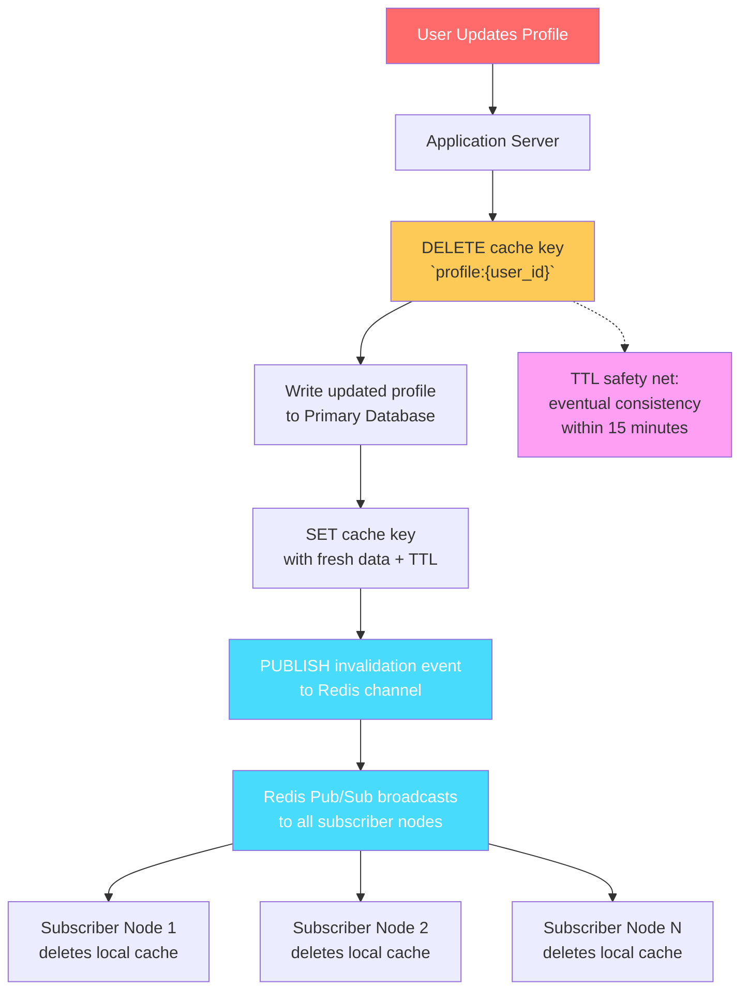

| Difficulty | Channel | Tags |
|---|---|---|
| beginner | backend | redis, memcached, cache-invalidation |

Every backend developer eventually faces the two hardest problems in computer science: naming things, cache invalidation, and off-by-one errors. But when Uber's microservice teams each rolled their own Redis caching layer with inconsistent invalidation logic, the result was a distributed mess of stale data and skyrocketing infrastructure costs. One workload required 60,000 CPU cores just to meet read throughput [1]. The fix — a centralized caching layer called CacheFront — slashed P75 latency by 75%, cut P99.9 latency by 67%, and reduced one 6M reads/second use case from 60K cores to just 3K Redis cores. That's a 20x cost reduction [1]. Here's how you can apply the same principles before your caching strategy spirals out of control.

---

> ### Real-World Case — Uber
>
> Uber's in-house MySQL-based distributed database, Docstore, served tens of petabytes of data across all business verticals. One use case demanded read throughput so high that vertically or horizontally scaling the storage engine would have been cost-prohibitive — 60K CPU cores for a single workload. Each microservice team was rolling its own Redis caching solution with duplicated, inconsistent invalidation logic.
>
> | | |
> |---|---|
> | **Challenge** | Build a transparent integrated caching layer that handles cache invalidation reliably at Uber's scale, avoiding both the cost of scaling the storage engine and the maintenance burden of dozens of custom caching solutions. The naive TTL-based approach meant users waited minutes for profile/data changes to propagate, but lowering TTL tanked cache hit rates. |
> | **Solution** | Built CacheFront, embedded in Docstore's query engine, using Redis with cache-aside reads and CDC-based invalidation. They tailed MySQL binlogs via their Flux streaming service to invalidate/upsert cache rows within seconds of database writes. Writes were deduplicated using MySQL timestamps as version numbers via Redis EVAL (Lua) to prevent stale data from overwriting fresh data. Plain point writes also got an explicit invalidation API for read-your-writes consistency. TTL served as a fallback safety net. Added compare-cache shadow reads that verified 99.99% cache consistency, cross-region cache warming that replicates keys (not values) to avoid dual-replication drift, circuit breakers, and adaptive timeouts. |
> | **Outcome** | P75 latency dropped 75% and P99.9 dropped 67% with stabilized latency spikes. One 6M reads/second use case went from requiring 60K CPU cores on the storage engine to just 3K Redis cores — a 20x cost reduction. CacheFront now serves 40M+ requests per second across all Docstore instances with 99%+ cache hit rates and 99.99% measured consistency. |
> | **Lesson** | TTL-only cache invalidation is a trap at scale — you either accept minutes of staleness or destroy your hit rate. Combine TTL as a safety net with CDC-based event-driven invalidation for the best of both worlds. Also, deduplication of concurrent cache writes is a subtle but critical problem: use version numbers and atomic operations (Redis EVAL) to prevent stale-over-fresh overwrites. And sometimes replicating cache keys instead of values across regions is the right call to maintain consistency. |

---

## Hook — The Cache Invalidation Nightmare

Imagine you deploy a user profile service that caches frequently accessed profiles in Redis. Everything works beautifully — until a user updates their avatar and the old one stubbornly refuses to die. Now you're debugging stale data across distributed nodes, wrestling with TTLs, and wondering if you should have just hit the database every time. This is the cache invalidation problem, and it has haunted backend engineers since the first memoization cache was written. The core issue is deceptively simple: cached data is a snapshot of the past, and every write operation creates a divergence between what the cache holds and what the database knows to be true [4].

## Problem — Why Cache Invalidation Is Hard

Cache invalidation is hard because it sits at the intersection of distributed systems, consistency models, and performance optimization. When you cache a user profile, you're trading strong consistency for speed. In a single-node system, invalidation is trivial — delete the key, done. But in production, you face: staleness windows where a user sees outdated data across different services; thundering herds when a popular key is invalidated and every request simultaneously hits the database; clock skew between servers when TTL-based expiration is relied upon; and the coordination problem of notifying every node that a cache entry has changed. Every invalidation strategy involves trade-offs: write-through keeps caches consistent but adds latency to writes; write-behind is fast but risks data loss; TTL-based expiration is simple but guarantees staleness for the TTL duration [5][7].

## Real-World Case — Uber's CacheFront

Uber's in-house MySQL-based distributed database, Docstore, served tens of petabytes of data across all business verticals. One critical use case required read throughput so extreme that scaling the storage engine would have cost 60,000 CPU cores. Each microservice team had independently implemented Redis caching with its own invalidation logic — some used TTLs, some never invalidated, some tried to coordinate via message queues. The result was inconsistent data, unpredictable latency, and a maintenance nightmare [1]. Uber's engineering team built CacheFront, an integrated read-through and write-through cache that sits between services and Docstore. CacheFront provides a single, consistent invalidation protocol: when a write occurs, the cache entry is atomically deleted and repopulated. Redis pub/sub broadcasts invalidation events so every CacheFront node evicts stale data simultaneously. The results were dramatic: P75 latency dropped 75%, P99.9 dropped 67%, and a single use case went from requiring 60K CPU cores for the storage engine to just 3K cores for Redis — a 20x reduction in infrastructure cost. Today, CacheFront serves over 40 million requests per second with 99%+ cache hit rates and 99.99% measured consistency [1].

## Deep Dive — Write-Through vs Cache-Aside, Redis vs Memcached

Two caching patterns dominate production systems. In cache-aside (lazy loading), your application checks the cache first; on a miss, it reads from the database and writes to the cache. This is simple and efficient for read-heavy workloads, but you risk serving stale data until the first miss after a write. In write-through, every write operation updates both the database and cache atomically. This guarantees cache consistency at the cost of higher write latency [5][7]. For a user profile service, the hybrid approach is optimal: use cache-aside for reads and write-through for updates, with a TTL safety net. Now for the storage engine choice. Redis and Memcached are the two dominant in-memory caches. Redis supports pub/sub for automatic distributed invalidation — when a key is updated, one Redis node publishes a message and all subscribers delete their local copy [2][6]. Memcached has no native pub/sub; you must build your own coordination layer, typically via a message broker like Kafka or RabbitMQ [3]. Redis offers persistence (RDB snapshots, AOF logs), so cache can survive restarts without a cold start. Memcached is ephemeral — every restart is a full cache warmup [3][9]. Redis supports advanced data structures (sorted sets, hyperloglogs, streams) that enable sophisticated caching strategies like sliding-window rate limiting or leaderboard caching. Memcached is simpler and faster for pure key-value lookups with minimal overhead [9]. For horizontal scaling, Memcached uses consistent hashing with no cross-node coordination. Redis Cluster handles sharding and replication automatically but requires more operational complexity. Your choice depends on whether you need distributed invalidation (choose Redis) or pure read scaling with simpler architecture (choose Memcached). At Uber's scale, Redis was the clear winner because pub/sub eliminated the invalidation coordination problem that Memcached would have pushed onto application code [1].

## Workflow — Write-Through Cache Invalidation Architecture

Here's the step-by-step flow for the write-through pattern with distributed invalidation. When a user updates their profile, the application server: (1) deletes the stale cache entry for that user's profile key; (2) writes the updated profile to the primary database; (3) writes the fresh profile data to the cache with a TTL; (4) publishes an invalidation event to a Redis pub/sub channel. All other application servers subscribe to that channel; when they receive the invalidation message, they delete their own cached copy (or refresh it lazily on the next read). This architecture ensures that even if a node misses the pub/sub message (due to network partition or restart), the TTL guarantees eventual consistency within a bounded window. For a user profile service, a TTL of 5–30 minutes balances freshness against database load — profiles don't change every second, but when they do, you want the change propagated quickly.

## Code Example — Python Write-Through Cache Implementation

The following Python class demonstrates the write-through pattern with Redis pub/sub for distributed invalidation. The `ProfileCache` class wraps a Redis client and provides two main operations: `get_profile` for cache-aside reads and `update_profile` for write-through writes. On update, stale data is deleted first, then fresh data is written to both the database and cache, and finally a pub/sub message is broadcast so every service instance invalidates its local copy. The TTL acts as a safety net — even if invalidation messages are lost, stale data self-destructs within 15 minutes.

## Lessons Learned — Key Takeaways and Pitfalls

Cache invalidation isn't a problem you solve once — it's a discipline you bake into your architecture. Here are the key lessons from Uber's journey and industry best practices. First, standardize early. Before CacheFront, every Uber team had its own caching strategy. A shared caching layer with consistent invalidation semantics eliminates entire classes of bugs [1]. Second, TTLs are your safety net, not your invalidation strategy. Relying solely on TTLs means accepting bounded staleness. Always pair TTLs with explicit invalidation for write operations. Third, measure everything. Uber tracks cache hit rates, staleness windows, and invalidation propagation latency. If you're not measuring, you're guessing [1]. Fourth, choose Redis when you need distributed invalidation. Pub/sub is the cleanest mechanism for broadcasting cache changes across nodes [2][6]. Choose Memcached when you need maximum throughput for simple key-value workloads and can handle coordination in your application layer [3][9]. Fifth, the thundering herd problem is real. When a popular cache key expires, every concurrent request may hit the database simultaneously. Solutions include: revalidating with a mutex so only one request populates the cache; early recalculation that refreshes the cache before the TTL expires; and stale-while-revalidate, serving stale data while asynchronously updating the cache [7][8]. Finally, consistency guarantees matter. Uber achieves 99.99% consistency — not 100%. Cache invalidation is ultimately a compromise between freshness, availability, and performance. Accept the trade-offs, document them, and design your system to degrade gracefully when staleness occurs [1].

---

## Write-Through Cache Invalidation Flow

<strong>Original Interview Question</strong>

**Q:** You're building a user profile service that caches frequently accessed profiles. How would you implement cache invalidation when a user updates their profile, and what trade-offs would you consider between Redis and Memcached?

**A:** Implement write-through caching with TTL-based expiration. On profile update, invalidate the cache by deleting the key and writing new data to both the database and cache. Redis offers pub/sub for automatic distributed invalidation, while Memcached requires manual coordination across nodes.

## Conclusion

Cache invalidation stops being a nightmare when you stop treating it as an afterthought. Uber's story proves that a centralized caching strategy with consistent invalidation semantics pays for itself in infrastructure savings alone. Start with write-through + TTL for profile services. Add Redis pub/sub when you need distributed coordination. And always, always measure your cache hit rates — because what gets measured gets optimized.

---

## References

1. [How Uber Serves Over 40 Million Reads Per Second Using an Integrated Cache](https://www.uber.com/en-IN/blog/how-uber-serves-over-40-million-reads-per-second-using-an-integrated-cache/) — blog
2. [Redis Cache Invalidation Documentation](https://redis.io/docs/latest/develop/use/client-side-caching/) — documentation
3. [Memcached - Wikipedia](https://en.wikipedia.org/wiki/Memcached) — documentation
4. [Cache Invalidation - Wikipedia](https://en.wikipedia.org/wiki/Cache_(computing)#Cache_invalidation) — documentation
5. [AWS Caching Best Practices - Write-Through Pattern](https://docs.aws.amazon.com/whitepapers/latest/caching-best-practices/patterns.html) — documentation
6. [Redis Pub/Sub Documentation](https://redis.io/docs/latest/develop/interact/pubsub/) — documentation
7. [Cache-Aside Pattern - Microsoft Azure Architecture](https://learn.microsoft.com/en-us/azure/architecture/patterns/cache-aside) — documentation
8. [HTTP Caching - MDN Web Docs](https://developer.mozilla.org/en-US/docs/Web/HTTP/Caching) — documentation
9. [Redis vs Memcached - DigitalOcean Community](https://www.digitalocean.com/community/tutorials/redis-vs-memcached) — documentation

---

**Author:** Satishkumar Dhule — [GitHub](https://github.com/satishkumar-dhule) · [LinkedIn](https://linkedin.com/in/satishkumar-dhule) · [Website](https://satishkumar-dhule.github.io)
