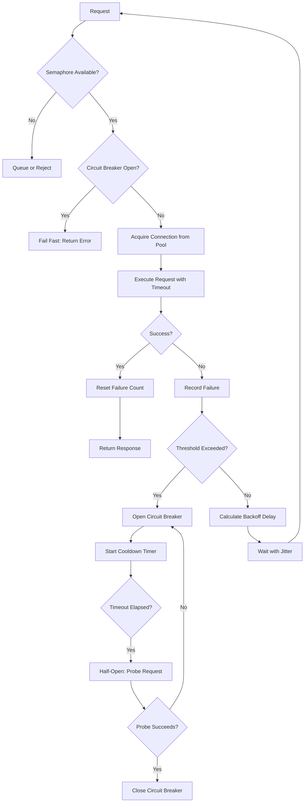

| Difficulty | Channel | Tags |
|---|---|---|
| advanced | backend | asyncio, aiohttp, concurrency |

You have built a microservice that needs to talk to 100 other services. Everything works in staging. Then production hits, a single downstream service slows to a crawl, and your entire API layer collapses. Netflix faced this exact nightmare across their service-oriented architecture, where connection pool mismanagement repeatedly caused cascading production failures [1]. What they learned about connection pooling, circuit breakers, and graceful degradation became the blueprint for resilient distributed systems worldwide.

---

> ### Real-World Case — Netflix
>
> Netflix's API interacted with 100+ backend microservices in a service-oriented architecture. A single slow or misconfigured service would saturate shared Tomcat connection and thread pools, causing cascading failures that took down the entire API layer. These 'minor mistakes' in pool configs, timeouts, and queue sizes repeatedly caused major production incidents.
>
> | | |
> |---|---|
> | **Challenge** | Preventing a single slow or failing backend dependency from exhausting shared connection pool and thread pool resources, which would cascade through the entire system and cause a full outage. Latency was more dangerous than hard failures because it held connections open and starved the pool. |
> | **Solution** | Netflix built Hystrix, a fault tolerance library that applied bulkhead (isolation) and circuit breaker patterns to every dependency call. It used thread-pool isolation and semaphore-based limiting (exactly the semaphore approach in the connection pool manager) to restrict concurrent connections per dependency. Configurable timeouts per command prevented connection hold-time from bloating pools. Circuit breakers tracked error rates across a rolling window and tripped open when failures exceeded 50% in 10 seconds, failing fast instead of waiting for timeouts. Fallback methods provided graceful degradation when circuits were open or pools saturated, returning cached/stale data instead of errors. |
> | **Outcome** | Hystrix now processes tens of billions of thread-isolated and hundreds of billions of semaphore-isolated calls per day at Netflix. Each Netflix API server handles ~350 thread-isolated and ~5000 semaphore-isolated commands per second on 4-core EC2 instances with minimal overhead (0ms at median, 3ms at 90th, 9ms at 99th percentile). Production incidents from cascading pool exhaustion were eliminated, and Hystrix became the reference implementation of the circuit breaker and bulkhead patterns adopted industry-wide. |
> | **Lesson** | Thread-pool/semaphore isolation is the critical defense: a single slow dependency should never exhaust resources for the entire application. Combined with circuit breakers that fail fast rather than waiting on timeouts, and fallback handlers that degrade gracefully, these patterns prevent cascading failures. The overhead of isolation (3-9ms at high percentiles) is far smaller than the cost of system-wide collapse. |

---

## Hook — The hidden cost of a single slow connection

One slow API client. That is all it takes. A single backend service taking 30 seconds instead of 30 milliseconds to respond, and before you know it, every thread in your pool is blocked, every connection slot occupied, and fresh requests pile up in a queue that grows without bound. Your monitoring dashboard turns red, customers see endless loading spinners, and the CEO wants answers. This is not a hypothetical scenario — it is a pattern that has brought down some of the largest production systems on the planet. The scary part? Most developers configure their connection pools once and never think about them again, assuming the defaults will somehow save them.

## Problem — Why connection pools fail under pressure

At first glance, a connection pool looks simple: grab a connection, make your request, return it to the pool. But in a distributed system, that pool becomes a pressure point where small mistakes amplify into full-blown disasters. When a downstream service slows down, connections are held longer than expected. The pool saturates. New requests queue. If the queue has no limit, memory balloons. If the queue has a limit, requests get dropped. Either way, the failure cascades upstream. The root cause is almost never the slow service itself — it is the lack of backpressure and isolation. Without a circuit breaker, requests keep pounding the dying service, making recovery harder. Without a semaphore or bulkhead partition, one slow path starves every other path. Without exponential backoff, retries arrive in synchronized waves that overwhelm whatever capacity remains [2]. These are not theoretical edge cases. They are the predictable consequences of neglecting pool governance.

## Real-World Case — Netflix and the birth of Hystrix

In the early 2010s, Netflix's API layer interacted with over 100 backend microservices in their service-oriented architecture [1]. A single slow or misconfigured service would saturate shared Tomcat connection and thread pools, causing cascading failures that took down the entire API layer. These "minor mistakes" in pool configurations, timeout settings, and queue sizes repeatedly caused major production incidents. The engineering team realized that traditional load balancing was not enough — they needed fault isolation at the client level. Their response was Hystrix, a latency and fault tolerance library that implemented two critical patterns: the circuit breaker and the bulkhead. The results were dramatic. Hystrix now processes tens of billions of thread-isolated and hundreds of billions of semaphore-isolated calls per day. Each Netflix API server handles roughly 350 thread-isolated and 5000 semaphore-isolated commands per second on a 4-core EC2 instance, with negligible overhead: 0ms at median, 3ms at the 90th percentile, and 9ms at the 99th percentile [1]. Production incidents from cascading pool exhaustion were eliminated. Hystrix became the reference implementation for these patterns, later inspiring resilience libraries across every language and platform. The lesson is clear: connection pool management is not an infrastructure concern — it is an application architecture concern.

## Deep Dive — Circuit breakers, bulkheads, and exponential backoff

Three patterns form the foundation of resilient connection management, and understanding each one is critical to designing systems that degrade gracefully rather than collapse catastrophically. **The circuit breaker** monitors failure rates and opens the circuit when failures exceed a threshold, allowing the system to fail fast instead of waiting for timeouts [3]. Once open, requests are rejected immediately for a cooldown period, giving the downstream service time to recover. When the cooldown elapses, the circuit transitions to a half-open state, allowing a probe request to test the waters. If it succeeds, the circuit closes; if it fails, it opens again. This prevents the thundering-herd problem where retries arrive in lockstep after a timeout. **The bulkhead pattern** (named after the compartments on a ship) isolates resources so that failure in one path cannot consume all available connections [4]. If your service calls a search API and a recommendations API, they should not share the same connection pool. A fault in the search service should not block recommendations. This is often implemented with separate thread pools or semaphores per dependency. **Exponential backoff** is the retry strategy where wait times increase geometrically after each failure (e.g., 1s, 2s, 4s, 8s) rather than using a fixed interval [5]. Combined with jitter (randomization), it prevents retry storms from synchronizing. Without jitter, retries from thousands of clients arrive simultaneously, creating a self-inflicted DDoS attack on the recovering service. These three patterns work together: the bulkhead limits blast radius, the circuit breaker decides when to fail fast, and exponential backoff controls the rhythm of recovery. You cannot implement one in isolation and expect resilience.

## Workflow — The path of a request through a resilient pool

A request entering a properly designed connection pool manager follows a decision tree with clear failure modes at every branch. The diagram below illustrates this flow. When a request arrives, the semaphore check acts as a gatekeeper — if the maximum concurrent connections are already in use, the request is queued or rejected immediately rather than allowed to pile up behind a slow connection. Next, the circuit breaker checks whether the downstream service has been failing recently. If the circuit is open, the request is rejected instantly, saving the caller from waiting on a timeout that will almost certainly occur. If it passes both checks, the request acquires a connection and executes. On success, failure counts are reset and the circuit breaker stays closed. On failure, the system records the error and checks whether the threshold has been exceeded. If it has, the circuit breaker trips open and a cooldown timer starts. If the threshold has not been reached, exponential backoff determines the retry delay, and the request re-enters the queue after waiting. This loop continues until the request succeeds, the circuit opens, or the retry budget is exhausted. The entire workflow is designed around one principle: fail fast when failure is likely, and give the system space to recover when it is not.

## Code Example — Building a connection pool manager in Python

The following implementation brings together semaphore-based concurrency limiting, circuit breaker logic, exponential backoff, and retry management into a single async connection pool manager for aiohttp. Let us walk through the key design decisions.

## Lessons Learned — What to do differently tomorrow

After seeing what happened at Netflix and understanding the patterns that prevent those failures, a few actionable principles emerge. **First, never share a connection pool across unrelated dependencies.** Each downstream service should have its own pool with its own timeout and circuit breaker configuration. A search service timeout should not block your payment service calls. **Second, always set explicit timeouts at every layer.** TCP defaults are designed for local networks, not distributed systems. A 30-second default connect timeout in the face of a failing service can saturate your entire pool in under a second [8]. **Third, always bound your queues.** An unbounded queue in front of a saturated pool is a memory leak waiting to happen. Choose a queue size that matches your capacity and rejection strategy. **Fourth, implement circuit breakers early.** Do not wait until you have a production incident. The overhead is minimal and the protection is invaluable. **Fifth, test your degradation behavior.** Simulate slow responses, connection drops, and service outages in your staging environment. Most teams test the happy path and discover their resilience gaps during the worst possible moment — a real incident. The most important mindset shift is this: in a distributed system, every remote call is a gamble. Connection pool management is how you hedge your bets.

---

## Connection Pool Request Flow with Circuit Breaker

<strong>Original Interview Question</strong>

**Q:** How would you implement a connection pool manager for aiohttp that handles graceful degradation under high load and connection timeouts?

**A:** Implement a connection pool manager for aiohttp using a semaphore to limit concurrent connections, exponential backoff for retrying failed requests, and circuit breaker pattern to gracefully degrade under high load and connection timeouts.

## Conclusion

Connection pool management is not a set-and-forget configuration. It is an architectural decision that determines whether your system bends under load or breaks. The patterns Netflix proved at scale — circuit breakers, bulkheads, semaphore-based limiting, and exponential backoff with jitter — are not theoretical. They are battle-tested solutions that prevent a single slow dependency from taking down your entire service. Start by auditing your existing connection pools. Do they have timeouts? Are pools isolated by dependency? Do you have circuit breakers? If the answer to any of these is no, you know what to work on next. Every minute spent on resilience is an investment against the 3am pager call.

---

## References

1. [Netflix incident report](http://benjchristensen.com/2013/06/10/application-resilience-in-a-service-oriented-architecture-using-hystrix/) — article
2. [Circuit Breaker pattern - Microsoft](https://docs.microsoft.com/en-us/azure/architecture/patterns/circuit-breaker) — documentation
3. [Circuit Breaker pattern - Wikipedia](https://en.wikipedia.org/wiki/Circuit_breaker_design_pattern) — article
4. [Bulkhead pattern - Microsoft](https://docs.microsoft.com/en-us/azure/architecture/patterns/bulkhead) — documentation
5. [Exponential backoff - Wikipedia](https://en.wikipedia.org/wiki/Exponential_backoff) — article
6. [asyncio — Asynchronous I/O - Python documentation](https://docs.python.org/3/library/asyncio.html) — documentation
7. [aiohttp Client Usage - aiohttp documentation](https://docs.aiohttp.org/en/stable/client_advanced.html) — documentation
8. [TCP Tuning for Distributed Applications - DigitalOcean](https://www.digitalocean.com/community/tutorials/tcp-tuning-for-distributed-applications) — tutorial

---

**Author:** Satishkumar Dhule — [GitHub](https://github.com/satishkumar-dhule) · [LinkedIn](https://linkedin.com/in/satishkumar-dhule) · [Website](https://satishkumar-dhule.github.io)
