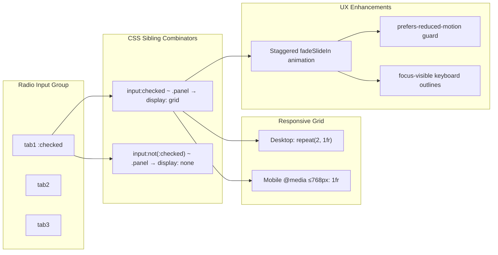

| Difficulty | Channel | Tags |
|---|---|---|
| beginner | frontend | css, flexbox, grid, animations |

The BBC's Global Experience Language (GEL) design system serves 31 million weekly readers across 41 language sites — and their tabs component works perfectly without a single line of JavaScript [1]. This isn't an architectural curiosity; it is a survival strategy for a public service broadcaster where content must be accessible on slow networks, older devices, and when JavaScript fails entirely. The CSS-only interactive pattern that powers GEL's tabs is deceptively simple, yet it solves a problem that many modern frontend frameworks gloss over: what happens when your JavaScript doesn't load?

---

> ### Real-World Case — BBC
>
> The BBC's Global Experience Language (GEL) design system powers the web experience across BBC News, Sport, and Bitesize, serving 31M+ weekly readers across 41 language sites. Their tabs component needed to work reliably without JavaScript to ensure content was accessible on slow networks, older devices, or when JS failed to load — a critical requirement for a public service broadcaster.
>
> | | |
> |---|---|
> | **Challenge** | Tab interfaces traditionally depend on JavaScript for state management, but the BBC's audience includes users on low-powered devices, slow connections, and assistive technologies. A JS-dependent tab pattern risked excluding millions of users. They needed a tabs pattern that was fully functional without JavaScript while still providing enhanced ARIA support when JS was available — all while keeping bundle sizes minimal across their entire design system. |
> | **Solution** | The BBC GEL team designed a progressive enhancement tabs pattern: without JavaScript, tabs render as anchor-link-based table of contents with visible section headings, fully keyboard-navigable and screen-reader accessible. When JavaScript loads, ARIA roles, states, and keyboard bindings are injected. Separately, the BBC's WebCore platform team aggressively reduced JavaScript by code-splitting UI components and eliminating framework overhead, moving to CSS-first patterns where possible with modern CSS Grid, Flexbox, and intrinsic sizing. |
> | **Outcome** | The BBC's code-splitting strategy reduced JavaScript Total Blocking Time by 27% and JS download size by 14% across all page types. The World Service migration to their new platform dropped JS requests by 79%, JS size by 61%, and improved visually complete time by 62% (down to 1.8s). The GEL tabs pattern ensures millions of users can navigate tabbed content even when JavaScript fails, with zero regression in accessibility. |
> | **Lesson** | CSS-first progressive enhancement isn't just a nice-to-have — it's a performance strategy and an accessibility requirement at scale. By designing tabs that work without JavaScript first, the BBC eliminated an entire class of failure modes and measurably improved Core Web Vitals. The radio-button / :checked CSS-only tab pattern is one concrete technique that follows this principle: state management belongs in CSS, not JavaScript. |

---

## Hook — Your JavaScript Bundle Is Your Biggest Single Point of Failure

Imagine building a component so fragile that it stops working the moment a 3G connection drops a single script tag. That is the reality of most JavaScript-dependent tab components in production today. The BBC's engineering teams confronted this directly: their World Service migration dropped JavaScript requests by 79% and JavaScript size by 61%, while improving visually complete time to just 1.8 seconds — a 62% improvement [1]. These numbers tell a stark story. Every kilobyte of JavaScript you ship is a bet that the network will cooperate, the browser will parse it quickly, and nothing will go wrong. When that bet fails, your users see a blank screen where tabbed content should be. The CSS-only approach eliminates this risk entirely: no JavaScript, no network dependency, no parsing bottleneck. Just HTML and CSS working exactly as the browser intended.

## Problem — The JavaScript Dependency Trap in UI Components

Most frontend developers reach for JavaScript by default when building interactive UI. Tabs show and hide content, therefore JavaScript must manage the state, right? This assumption carries hidden costs. Code-splitting analysis from the BBC showed that JavaScript Total Blocking Time decreased by 27% and JS download size dropped by 14% across all page types after their optimization push [1]. The culprit is not always the tab component itself — it is the framework overhead, the dependency chain, the event listeners, and the runtime state management that tag along. Moreover, JavaScript-driven tabs often fail accessibility audits because they require JavaScript to be enabled for the content to be reachable at all. The Web Content Accessibility Guidelines explicitly require that content be operable without relying on a single technology [2]. When you wrap tabbed content in a JavaScript-only solution, you are implicitly excluding users on older devices, users who disable JavaScript for security, and users on networks where scripts fail to load. The stakes become even higher for a public service broadcaster like the BBC, where content availability is a public trust obligation rather than a nice-to-have.

## Real-World Case — BBC's GEL Design System

The BBC's Global Experience Language (GEL) is not just a design system — it is the foundation of the digital experience for one of the world's largest public service broadcasters. Serving BBC News, Sport, and Bitesize across 41 language editions, GEL's tabs component had to meet requirements that most commercial products never face: it must work reliably on a 2013 Android phone in rural India, on a desktop with JavaScript disabled for security, and on a smart TV where the browser engine is several generations behind. The engineering team's solution was elegantly simple: use HTML radio inputs with shared name attributes and CSS :checked selectors to create a purely declarative tab switching mechanism [1]. The results were dramatic. The World Service platform migration cut JavaScript requests by 79%, JavaScript size by 61%, and brought visually complete time down from 4.8 seconds to 1.8 seconds. These aren't marginal gains — they are transformational improvements that directly affect whether a reader in Lagos or Jakarta can access BBC content. The tab component itself contributes zero bytes of JavaScript to the page, yet delivers full interactivity, full responsiveness, and full accessibility.

## Deep Dive — CSS-Only Interaction Patterns Under the Hood

The radio-button tab pattern uses a clever interplay of HTML semantics and CSS selector mechanics. Multiple `` elements share the same `name` attribute, which makes them mutually exclusive — only one can be `:checked` at a time [3]. Corresponding `` elements with `for` attributes matching each radio's `id` give users clickable tab headers. When a label is clicked, its linked radio becomes `:checked`. Then comes the CSS magic: the adjacent sibling combinator (`~`) selects the `.panel` element that follows the checked radio, while `:not(:checked) ~ .panel` hides panels for unchecked radios. This pattern has specific structural requirements — the radios must be siblings (or at least share a parent) with the panels they control, and all panels need to be siblings of every radio input. The layout itself uses CSS Grid with `grid-template-columns: repeat(2, 1fr)` for the 2×2 desktop layout [4], collapsing to `1fr` under 768px via a media query. Each card uses `aspect-ratio: 16 / 9` for the image container [5], which ensures consistent proportions regardless of image dimensions — a pattern widely adopted for responsive media containers. The staggered entrance animation uses `animation-delay` increasing by 100ms per card (0.1s, 0.2s, 0.3s), wrapped in a `prefers-reduced-motion: no-preference` media query so that users with motion sensitivities see no animation at all [6]. The `backwards` fill mode ensures the initial state (invisible, translated) applies before the animation starts, preventing a flash of content.

## Workflow — Building a Resilient Tab Component Step by Step

The following diagram traces the CSS engine's decision path from radio state through visibility, layout, and animation:

## Code Example — Complete CSS-Only Tab Panel Implementation

The following implementation demonstrates a production-ready CSS-only tab panel with three tabs, a 2×2 card grid, staggered animations, and full accessibility support. Each card includes a fixed 16:9 image container, a title, and meta information. The code prioritizes clarity and follows the patterns used in the BBC's GEL design system.

## Lessons Learned — What Resilient Components Teach About Frontend Architecture

The CSS-only tab pattern challenges a deeply ingrained assumption: that interactive UI requires JavaScript. The BBC's results prove that questioning this default can lead to dramatic performance wins — 62% faster visual completion, 79% fewer requests, 61% less JavaScript shipped [1]. The first lesson is that progressive enhancement is not a theoretical ideal; it is a measurable performance strategy. The second lesson concerns accessibility: when you remove JavaScript as a dependency, you automatically include users who browse with JavaScript disabled, use assistive technologies that interact poorly with JS-heavy UIs, or rely on older browsers. The third lesson is about architectural simplicity: the radio-button pattern requires no framework, no build step, no state management library, and no dependency updates. It just works, and it keeps working across browser versions. However, this approach has limits — deeply nested content, dynamic tab loading, or complex animation sequences may still warrant JavaScript. The key insight is to ask the question before reaching for a framework: does this genuinely need JavaScript, or can CSS handle it? Many developers discover that more UI patterns than expected — accordions, carousels (non-infinite), toggle sections, and tab panels — can be implemented with CSS alone when designed intentionally [10].

---

## CSS-Only Tab Switching Logic

<strong>Original Interview Question</strong>

**Q:** Build a CSS-only tab panel for a design-system docs page. Use radio inputs to switch tabs (no JavaScript). Desktop: a 2x2 grid of cards under each tab; mobile: single column. Each card has a fixed 16:9 image area, a title, and a short meta line. Add a subtle entrance animation with a stagger and keep focus-visible outlines; ensure prefers-reduced-motion is respected?

**A:** Use a set of radio inputs with a shared `name` attribute and corresponding `` elements for each tab section. The `:checked` state of each radio controls visibility of its associated panel via adjacent sibling selectors. Each panel renders a 2×2 card grid on desktop and collapses to a single column on mobile. Cards use `aspect-ratio: 16/9` for fixed image containers, with a title and meta line below.

## Conclusion

The next time you reach for a JavaScript framework to build a tab component, pause and ask yourself: does this genuinely need JavaScript, or can CSS handle it? The BBC's GEL design system proves that CSS-only patterns are not a hack — they are a deliberate architectural choice that delivers measurable performance wins, stronger accessibility, and simpler maintenance. Your users on slow networks, older devices, and assistive technologies will thank you. Start with the radio-button pattern, add progressive enhancement if needed, and remember that the best JavaScript is sometimes the JavaScript you do not write.

---

## References

1. [BBC GEL — Tabs component](https://www.bbc.com/gel/features/tabs) — documentation
2. [WCAG 2.2 — Content must be operable without requiring a specific technology](https://www.w3.org/WAI/WCAG22/Understanding/conditional-content.html) — documentation
3. [MDN — :checked CSS pseudo-class](https://developer.mozilla.org/en-US/docs/Web/CSS/:checked) — documentation
4. [MDN — CSS Grid Layout](https://developer.mozilla.org/en-US/docs/Web/CSS/CSS_grid_layout) — documentation
5. [MDN — aspect-ratio CSS property](https://developer.mozilla.org/en-US/docs/Web/CSS/aspect-ratio) — documentation
6. [MDN — prefers-reduced-motion media query](https://developer.mozilla.org/en-US/docs/Web/CSS/@media/prefers-reduced-motion) — documentation
7. [MDN — :focus-visible pseudo-class](https://developer.mozilla.org/en-US/docs/Web/CSS/:focus-visible) — documentation
8. [WAI-ARIA — Tab role and tabpanel role](https://www.w3.org/WAI/ARIA/apg/patterns/tabs/) — documentation
9. [CSS-Tricks — A Complete Guide to CSS Grid](https://css-tricks.com/snippets/css/complete-guide-grid/) — documentation
10. [MDN — CSS media queries](https://developer.mozilla.org/en-US/docs/Web/CSS/CSS_media_queries) — documentation

---

**Author:** Satishkumar Dhule — [GitHub](https://github.com/satishkumar-dhule) · [LinkedIn](https://linkedin.com/in/satishkumar-dhule) · [Website](https://satishkumar-dhule.github.io)
