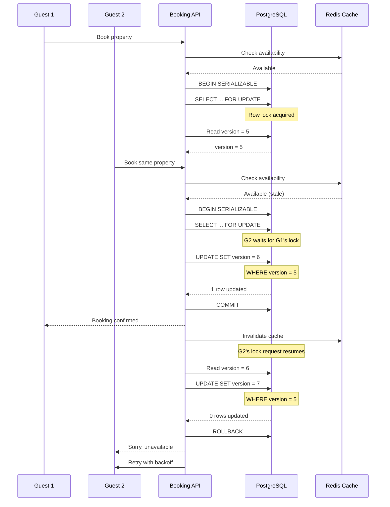

| Difficulty | Channel | Tags |
|---|---|---|
| intermediate | database | acid, isolation-levels, mvcc |

Uber's core fulfillment platform — the system matching riders with drivers — was built on Cassandra with an eventual-consistency model. As it scaled to millions of concurrent users, a terrifying problem emerged: two drivers could accept the same trip because Cassandra's last-write-wins semantics silently overwrote concurrent writes [1]. This 'split-brain' scenario is the exact race condition that threatens every booking system, from Airbnb properties to concert tickets, and your database might be doing the same thing right now without throwing a single error.

---

> ### Real-World Case — Uber
>
> Uber's core Fulfillment Platform — the system that matches riders with drivers and tracks trip state — was originally built on Cassandra with Ringpop for application-level serialization, prioritizing availability over consistency. As Uber scaled to millions of concurrent users across Mobility and Delivery, the eventual-consistency architecture began causing critical race conditions: during deploys and region failovers, two drivers could accept the same trip because Cassandra's last-write-wins semantics silently overwrote concurrent writes (a 'split-brain' scenario). The same pattern applied when a driver going offline raced with the matching system trying to assign a new trip.
>
> | | |
> |---|---|
> | **Challenge** | Concurrent read-modify-writes to the same entity and writes across multiple entities (trip + driver state + waypoints) needed to be atomic, but the architecture provided none. The Saga pattern for multi-entity transactions was brittle — between operations forming a logical transaction, the system was in an internally inconsistent state. With billions of trip-related database transactions per day, these race conditions were not theoretical edge cases but regular production incidents. |
> | **Solution** | Uber performed a complete ground-up rewrite, migrating from Cassandra to Google Cloud Spanner, which provides external consistency — the strictest concurrency-control guarantee (stronger than SERIALIZABLE — it serializes across regions using TrueTime). They also introduced a Business Transaction Coordinator that orchestrates multi-entity writes within a single Spanner read-write transaction, and Statecharts for deterministic entity lifecycle modeling. Spanner's automatic deadlock detection and row-level locking handled the contention that previously required fragile application-layer coordination. |
> | **Outcome** | The new platform handles 1M+ concurrent users, billions of trips per year, and billions of database transactions per day across 10,000+ cities, with 99.99% availability. 500+ developers now extend the platform to build 120+ unique fulfillment flows without fear of concurrent-write races. The migration eliminated the split-brain scenarios that plagued Cassandra-based deployments and failovers. |
> | **Lesson** | Availability-first architectures (eventual consistency with last-write-wins) are fundamentally incompatible with correct booking/fulfillment systems. The classic CAP tradeoff must lean strongly toward consistency (CP) when concurrent writes to shared resources carry real-world consequences like assigning two drivers to one trip. Uber's decade-long detour through Cassandra proved that eventual consistency creates correctness bugs that no amount of application-level locking can fully fix — the database itself must enforce serializability. |

---

## Hook — The Booking Nightmare Nobody Warns You About

Here is the thing most developers discover the hard way: race conditions do not always crash your application. Sometimes they quietly corrupt your data while every single transaction reports success. You test your booking flow, it works perfectly. You deploy to production, and three guests show up for the same room on the same night. This is not a hypothetical scenario. It is the direct consequence of assuming your database handles contention better than it actually does. And if you are using READ COMMITTED isolation — the default in PostgreSQL, MySQL, and most SQL databases — your booking system is vulnerable right now.

## Problem — The Two Transactions That Broke Your Data Model

The double-booking problem is a write-write conflict dressed in sheep's clothing. Two transactions read the same availability data simultaneously. Both see 'available'. Both write 'booked'. Both commit successfully. Your database, faithfully following its isolation semantics, lets both through because neither transaction ever saw the other's uncommitted data. The deeper issue is that application-level validation — checking availability before writing — is fundamentally broken under concurrent access [2]. The gap between read and write is where the race lives, and every millisecond of that gap is an opportunity for a second transaction to slip through. This is not a PostgreSQL problem, or a MySQL problem, or a Cassandra problem. It is a distributed concurrency problem that every system with concurrent writers must solve.

## Real-World Case — Uber's Cassandra Meltdown

Uber's original Fulfillment Platform was built on Cassandra and Ringpop, prioritizing availability over consistency [1]. This architecture worked well at small scale, but as Uber grew to millions of concurrent users across Mobility and Delivery, the cracks became chasms. During routine deploys and region failovers, the system experienced 'split-brain' scenarios where two drivers accepted the same trip. Cassandra's last-write-wins semantics did not prevent this — it silently accepted both writes, and the second one simply overwrote the first. The same race condition struck when a driver going offline overlapped with the matching system assigning a new trip. This was not a data corruption bug that threw errors you could catch in monitoring. It was a silent corruption of business logic. Uber's response was a complete rearchitecture of the Fulfillment Platform, moving to a system with stronger consistency guarantees. The result handles 1 million+ concurrent users, billions of trips per year, and billions of database transactions daily across 10,000+ cities with 99.99% availability [1]. More than 500 developers now build on the platform across 120+ unique fulfillment flows without fear of concurrent-write races.

## Deep Dive — SERIALIZABLE Isolation and the Two Concurrency Strategies

This is where the database theory you studied for interviews becomes the difference between a working system and a pager at 3 AM. Most databases default to READ COMMITTED isolation, which prevents dirty reads but does nothing to prevent phantom reads or serialization anomalies [3]. SERIALIZABLE isolation, on the other hand, guarantees that the outcome of concurrent transactions is equivalent to some sequential execution — meaning the double-booking scenario cannot happen within the database layer. However, SERIALIZABLE alone is not enough. You still need a concurrency control strategy, and this is where developers face a real trade-off. Pessimistic locking — using SELECT FOR UPDATE — acquires locks preemptively. It is simple to reason about but reduces concurrency, especially on hot resources like a popular property or a concert with limited tickets [4]. Optimistic concurrency control assumes conflicts are rare and checks for them at commit time using version columns or snapshot comparisons [5]. If the version has changed since you read the data, the transaction aborts and your application retries. The counterintuitive insight: optimistic locking often outperforms pessimistic locking under moderate contention because it avoids lock overhead entirely. But under high contention — think Taylor Swift tickets — pessimistic locking with short transactions wins because fewer retries means less wasted work.

## Workflow — The Optimistic Booking Flow

Building on these concepts, here is how a battle-tested booking flow works step by step. The Mermaid diagram below illustrates the entire sequence, including what happens when two guests attempt the same booking simultaneously.

**Step 1:** Both guests trigger a booking request for the same property and dates.
**Step 2:** The API checks an in-memory or Redis cache to short-circuit obvious conflicts.
**Step 3:** The application begins a SERIALIZABLE transaction and acquires row-level locks on the relevant availability records using SELECT FOR UPDATE [6].
**Step 4:** Under the locked rows, it reads the current version number.
**Step 5:** The application attempts an UPDATE with a WHERE clause that checks the version: `SET version = version + 1 WHERE version = :read_version`.
**Step 6:** If zero rows were updated, another transaction changed the version first. The transaction aborts, rolls back, and retries with exponential backoff.
**Step 7:** On success, the transaction commits and invalidates the cache.

This flow is symmetric: the first transaction acquires the lock and succeeds; the second transaction — which was waiting on the row lock — reads the already-updated version and correctly fails its optimistic check.

## Code Example — Optimistic Locking in Python with PostgreSQL

Here is a production-ready implementation of the optimistic booking flow using psycopg2 and PostgreSQL.

## Lessons Learned — What Every Developer Should Take Away

Several hard-won lessons emerge from Uber's experience and the broader patterns of building concurrent booking systems. First, never trust default isolation levels for operations that involve money, inventory, or reservations — READ COMMITTED will silently fail you [7]. Second, optimistic locking with version columns is the right default for most booking systems because it scales with concurrency rather than against it. Third, always combine database-level locking with application-level validation as a defense-in-depth strategy. Fourth, cache availability aggressively but invalidate on every successful booking — stale caches that show availability are worse than no cache at all [8]. Finally, monitor lock contention and implement circuit breakers for hot properties. If a single property generates more than 10% of your booking traffic, it deserves its own dedicated concurrency strategy — shard it, rate-limit it, or handle it separately [9]. The shared insight across every incident and post-mortem on this topic is simple: your database will not save you from your own concurrency bugs. You have to design for them.

---

## Booking Flow with Optimistic Locking

<strong>Original Interview Question</strong>

**Q:** You're building a booking system for Airbnb where multiple users can reserve the same property simultaneously. How would you design the transaction handling to prevent double bookings while maintaining high availability?

**A:** Use SERIALIZABLE isolation with optimistic concurrency control. Implement row-level locks on property availability tables, use MVCC snapshot reads for checking availability, and apply application-level validation to ensure atomic booking operations.

## Conclusion

The moral of the story is deceptively simple: your default database configuration is not safe for concurrent writes, and your application-level validation is not enough. The only reliable approach is a defense-in-depth strategy combining SERIALIZABLE isolation, optimistic locking with version columns, row-level locks on critical reads, and application-level retry logic. Start by auditing your transactional boundaries — every gap between a read and a write is a potential race condition. Add version columns to your availability tables. Test with concurrent load. Because the worst bug is not the one that crashes your system — it is the one that silently corrupts your data while every log line says everything is fine.

---

## References

1. [Uber Fulfillment Platform Re-architecture](https://www.uber.com/en-IN/blog/fulfillment-platform-rearchitecture/) — blog
2. [ACID — Wikipedia](https://en.wikipedia.org/wiki/ACID) — documentation
3. [Isolation (database systems) — Wikipedia](https://en.wikipedia.org/wiki/Isolation_(database_systems)) — documentation
4. [PostgreSQL Explicit Locking Documentation](https://www.postgresql.org/docs/current/explicit-locking.html) — documentation
5. [Optimistic Concurrency Control — Wikipedia](https://en.wikipedia.org/wiki/Optimistic_concurrency_control) — documentation
6. [Multiversion Concurrency Control — Wikipedia](https://en.wikipedia.org/wiki/Multiversion_concurrency_control) — documentation
7. [PostgreSQL Transaction Isolation Documentation](https://www.postgresql.org/docs/current/transaction-iso.html) — documentation
8. [CAP Theorem — Wikipedia](https://en.wikipedia.org/wiki/CAP_theorem) — documentation
9. [Eventual Consistency — Wikipedia](https://en.wikipedia.org/wiki/Eventual_consistency) — documentation

---

**Author:** Satishkumar Dhule — [GitHub](https://github.com/satishkumar-dhule) · [LinkedIn](https://linkedin.com/in/satishkumar-dhule) · [Website](https://satishkumar-dhule.github.io)
