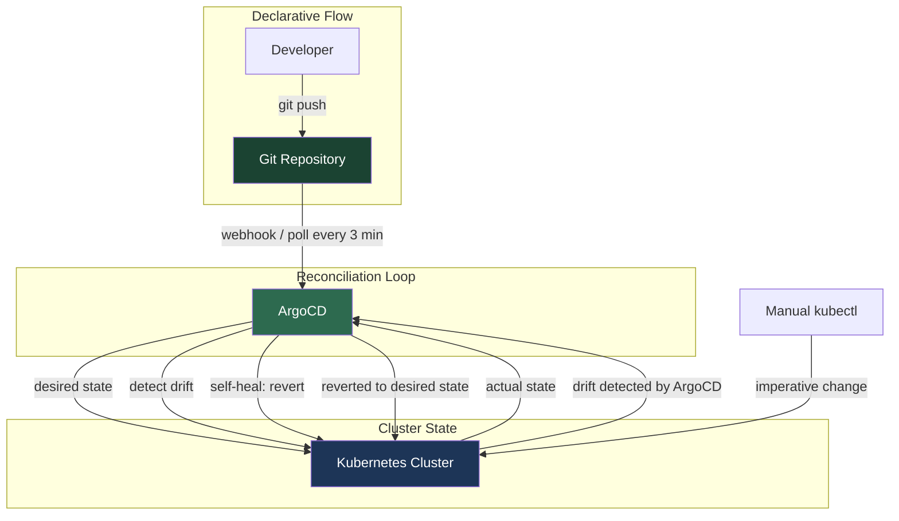

| Difficulty | Channel | Tags |
|---|---|---|
| beginner | devops | argocd, flux, declarative |

Adobe ran 10,400 deployment pipelines on a legacy internal platform called Moonbeam that had become impossible to scale, secure, or operate reliably. Configuration drift was rampant, deployment queues crawled, and teams had no single source of truth for what ran in production [1]. The fix? A GitOps-powered platform built on ArgoCD that ultimately saved millions, retired 80% of stale services, and transformed how 3,000+ developers ship code. Here is what that journey reveals about declarative vs imperative deployment—and what you can steal from their playbook.

---

> ### Real-World Case — Adobe
>
> Adobe ran 10,400 deployment pipelines on a legacy internal platform called Moonbeam (CaaS) that had become impossible to scale, secure, and operate reliably. Configuration drift was rampant, deployment queues were slow, and teams had no single source of truth for what ran in production.
>
> | | |
> |---|---|
> | **Challenge** | Adobe needed to migrate hundreds of teams and thousands of services from imperative, queue-based deployment workflows to a declarative GitOps model — without disrupting production. They had to establish Git as the single source of truth and eliminate manual `kubectl`-style changes across a sprawling enterprise with 3,000+ developers. |
> | **Solution** | Adobe built Flex, a GitOps delivery platform on Kubernetes and the Argo project ecosystem (Argo CD, Argo Workflows, Argo Events, Argo Rollouts). They operationalized Argo CD for continuous reconciliation, built a Node.js/React migration interface with Argo Workflows orchestration, and established Git as the source of truth with declarative manifests. The migration also let them discover and retire ~80% of stale/abandoned services that had accumulated on the legacy platform. |
> | **Outcome** | 10,400 pipelines migrated or decommissioned; 3,000+ developers and 3,000+ production services on GitOps; substantial infrastructure cost savings (partly from retiring 80% of stale services); significant reduction in deployment queue times; real-time audit trails; Git is now the standard deployment model across Adobe. |
> | **Lesson** | Mandates alone don't drive adoption — value does. Teams migrated when they experienced declarative GitOps benefits (faster rollbacks, auditability, no drift) firsthand. Also, the unexpected payoff was platform hygiene: the migration forced an inventory cleanup that retired thousands of forgotten services, generating cost savings that exceeded the direct efficiency gains. |

---

## Hook — The 3 AM Deployment That Broke Everything

You know the feeling. Someone makes a "quick fix" directly on a production cluster using kubectl. No PR. No review. No audit trail. The fix works — until it doesn't. Three hours later, you are digging through shell history trying to figure out who changed what and why the health checks are failing. This scenario plays out in organizations of every size, and it was exactly the kind of pain that drove Adobe to abandon its legacy Moonbeam platform [1]. The company was running 10,400 pipelines with zero centralized governance. You could deploy, but you could not answer the most basic question: *What is actually running in production right now?*

## Problem — The Configuration Drift Epidemic

Here is the dirty secret about Kubernetes: the platform itself does not prevent drift. You can have three environments — dev, staging, production — and within weeks they will all look different. Someone runs `kubectl scale deployment foo --replicas=5` in production but forgets to update the manifest. A hotfix is applied directly to the cluster to unblock a critical bug. The YAML in your Git repo becomes a work of fiction, not a source of truth. This is configuration drift, and it is the single biggest threat to reliable deployments at scale [2]. The imperative approach — typing kubectl commands directly — is the fastest path to drift. It is also the most common. Many developers reach for kubectl because it is fast and familiar. But every imperative change is a landmine. You lose auditability. You lose reproducibility. And when something breaks, rollback means guessing what the state was *before* the change instead of reverting a Git commit.

## Real-World Case — Adobe: 10,400 Pipelines to Zero Chaos

Adobe's legacy platform, Moonbeam (CaaS), had grown uncontrollably over years of organic adoption. By the time the Developer Experience team took stock, they found 10,400 pipelines spread across hundreds of teams, many of which pointed at services nobody could remember deploying [1]. The platform was slow, insecure, and impossible to govern. Every team had their own deployment scripts, their own conventions, and — more often than not — their own configuration drift. The solution was Flex, a GitOps delivery platform built on Kubernetes and the Argo Project ecosystem. The migration touched over 3,000 developers and 3,300 production services across nearly 19,000 production environments. One of the most surprising outcomes? During the migration, Adobe discovered and retired roughly 80% of previously identified services — thousands of stale or duplicated workloads nobody needed anymore [1]. That cleanup alone drove substantial infrastructure cost savings. The lesson is striking: when you force teams to declare what they actually run, you discover how much of your infrastructure is haunted.

## Deep Dive — Declarative vs Imperative: The Real Tradeoffs

The difference between declarative and imperative deployment is not academic — it determines how you sleep at night. With a declarative approach, you define the complete desired state in version control using YAML manifests, Helm charts, or Kustomize overlays [3]. ArgoCD continuously monitors the cluster and reconciles the actual state with the declared state. If someone sneaks in and runs `kubectl delete deployment nginx`, ArgoCD detects the drift within minutes and automatically recreates it. That is the self-healing behavior that makes declarative GitOps so powerful [4]. With the imperative approach, you execute kubectl commands directly against the cluster. The change happens immediately — but it exists nowhere except in etcd and possibly someone's terminal history. There is no audit trail. No rollback path. No way to prove what changed or who changed it. Here is the tradeoff that catches most teams off guard: imperative is faster in the moment, but exponentially slower over time. A kubectl command takes 200 milliseconds. But debugging a production incident caused by an undocumented imperative change can take hours. Multiply that by 10,400 pipelines, and you understand why Adobe abandoned the model entirely [1].

## Workflow — The GitOps Reconciliation Loop

The flow starts when a developer pushes changes to a Git repository. This triggers a webhook (or ArgoCD polls the repo every 3 minutes by default) [5]. ArgoCD pulls the desired state from the repository and compares it against the current state of the Kubernetes cluster. If they differ, ArgoCD synchronizes the cluster to match the repo — automatically applying, updating, or removing resources as needed. Meanwhile, the self-healing controller continuously monitors for drift. If anyone makes a manual change to the cluster (intentionally or accidentally), ArgoCD detects the divergence and reverts it back to the declared state [4]. This is the loop that turns Git into an unbreakable source of truth.

## Code Example — ArgoCD Application with Auto-Sync and Self-Healing

Here is how you configure an ArgoCD Application that connects a Git repository to a Kubernetes cluster with auto-sync and self-healing enabled. This is the production pattern Adobe teams use, and it is the foundation of any GitOps deployment:

## Lessons Learned — What Adobe's Migration Taught the Industry

Adobe's journey from 10,400 unruly pipelines to a governed GitOps platform offers several takeaways that apply at any scale [1]:

**🎯 Key Point: Invest in migration tooling first.** Adobe's biggest regret was relying on scripts instead of building a self-service migration workflow from day one. Teams need structured, automated paths — not documentation and hope.

**🔥 Hot Take: Value beats mandates every time.** Adobe initially tried to force migration via end-of-life deadlines. What actually worked was demonstrating that GitOps makes deployments faster, safer, and more auditable. Engineers adopt what makes their lives better.

**⚠️ Watch Out: Stale services accumulate silently.** Adobe retired ~80% of services during migration because nobody knew they still existed. GitOps forces you to inventory and justify every workload — which is a feature, not a bug.

**💡 Insight: Declarative is not just about tooling.** ArgoCD is powerful, but the real transformation is the operating model: Git as single source of truth, PRs as change mechanism, and automated reconciliation as the guardrail against human error [6].

For your own organization, start small. Pick one service, write its manifests in Git, configure an ArgoCD Application with `selfHeal: true`, and watch what happens the first time someone tries to kubectl edit a resource. That moment — when ArgoCD silently reverts the change — is when GitOps clicks.

---

## GitOps Reconciliation Loop with ArgoCD

<strong>Original Interview Question</strong>

**Q:** You're setting up GitOps for a microservices deployment. How would you configure ArgoCD to automatically sync changes from your Git repository to Kubernetes, and what's the difference between declarative and imperative approaches in this context?

**A:** I'd configure ArgoCD by setting up a Git repository containing Kubernetes manifests or Helm charts, creating an Application CRD that points to the Git repository, enabling auto-sync with a health check interval of 3 minutes, and implementing self-healing to automatically revert any manual changes. The declarative approach involves defining the desired state in Git through YAML manifests, Helm charts, or Kustomize configurations, where ArgoCD continuously reconciles the actual state with the desired state. In contrast, the imperative approach uses kubectl commands to make direct changes to the cluster, bypassing the Git repository as the single source of truth.

## Conclusion

Adobe's migration from Moonbeam to Flex proves that GitOps is not just a tooling choice — it is an operating model. The declarative approach transforms Git from a code repository into an unbreakable source of truth, turning every deployment into an auditable, reviewable, and reversible event. The next time you reach for kubectl to make a "quick fix" on a production cluster, pause. Ask yourself: is the speed of this one command worth the hours of debugging it could cause? Adobe's answer — backed by 10,400 pipelines and 3,000 developers — is a definitive no. Start your GitOps journey with one service, enable self-healing, and let the reconciliation loop show you what you have been missing.

---

## References

1. [Adobe Enabling GitOps at Scale with Argo — CNCF Case Study](https://www.cncf.io/case-studies/adobe/) — article
2. [Kubernetes Declarative Management](https://kubernetes.io/docs/tasks/manage-kubernetes-objects/declarative-config/) — documentation
3. [OpenGitOps — Principles of GitOps](https://opengitops.dev/) — documentation
4. [ArgoCD User Guide — Auto Sync and Self-Healing](https://argo-cd.readthedocs.io/en/stable/user-guide/auto_sync/) — documentation
5. [ArgoCD Architecture Overview](https://argo-cd.readthedocs.io/en/stable/operator-manual/architecture/) — documentation
6. [GitOps — Wikipedia](https://en.wikipedia.org/wiki/GitOps) — article
7. [Helm Documentation — Package Manager for Kubernetes](https://helm.sh/docs/) — documentation
8. [Kubernetes Object Management — Imperative vs Declarative](https://kubernetes.io/docs/concepts/architecture/) — documentation
9. [ArgoCD — Declarative GitOps for Kubernetes](https://argo-cd.readthedocs.io/en/stable/) — documentation
10. [Kustomize — Kubernetes Native Configuration Management](https://kubectl.docs.kubernetes.io/guides/) — documentation

---

**Author:** Satishkumar Dhule — [GitHub](https://github.com/satishkumar-dhule) · [LinkedIn](https://linkedin.com/in/satishkumar-dhule) · [Website](https://satishkumar-dhule.github.io)
