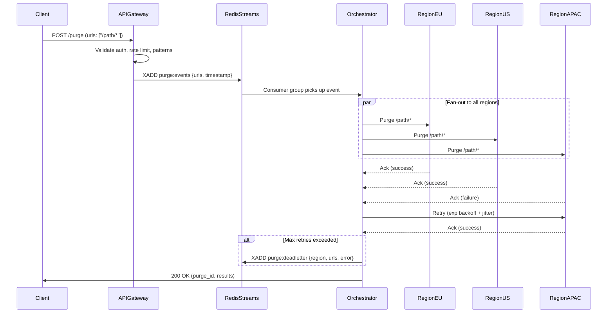

| Difficulty | Channel | Tags |
|---|---|---|
| intermediate | system-design | edge, caching, purging |

By 2022, Cloudflare's decade-old cache purge system was buckling under its own success. The 'core-based' architecture forced all purge requests through a small set of central data centers, meaning a developer in Sydney had to wait for a round-trip across the Pacific before users saw updated content [1]. If you have ever spent hours debugging why stale assets are still hitting your users after a cache invalidation, you already know the pain of distributed cache consistency. This is the story of how Cloudflare rebuilt their purge system from the ground up — and what you can steal from their architecture.

---

> ### Real-World Case — Cloudflare
>
> By 2022, Cloudflare's decade-old cache purge system was buckling under its own success. The 'core-based' architecture forced all purge requests to transit through a small set of central data centers using Quicksilver's spoke-hub distribution model. Customers in Australia had to wait for a round-trip across the Pacific Ocean before local users saw updated content. Meanwhile, Quicksilver was hitting write-throughput limits, and storing purge history was consuming disk space needed for actual caching.
>
> | | |
> |---|---|
> | **Challenge** | Design a global cache purge system that eliminates the latency penalty of centralized routing, handles growing throughput without write bottlenecks, reduces storage overhead from purge tracking, and approaches the speed-of-light limit (~200ms) for a network spanning 330+ cities worldwide. |
> | **Solution** | Cloudflare fully rebuilt their purge system as a 'coreless' architecture. Any data center can now ingest a purge request and broadcast it directly to all peers via peer-to-peer distribution (no core hub). They built CacheDB — a per-machine index service in Rust on RocksDB — that indexes every cached file by URL, cache-tag, and hostname, enabling active (immediate) deletion instead of lazy (deferred) timestamp comparison. Workers + Durable Objects handle queuing, auth, and distribution logic at the edge. The shift from lazy to active purging alone saved 10x storage. |
> | **Outcome** | Global purge latency (P50) dropped from 1,570ms to 149ms — a 90.5% improvement. Across all regions, P50 purges now complete in 115–303ms. Storage needed for purge tracking reduced 10x. The system now serves 330+ cities across 120+ countries. Freed disk space improved cache HIT ratios and reduced origin egress. |
> | **Lesson** | Centralized coordination becomes the bottleneck at global scale — distributing both the data and control plane to the edge ('coreless' architecture) dramatically improves latency and scalability. Counterintuitively, switching from lazy purging (deferred) to active purging (immediate), while doing more work per request, actually saves storage and improves performance at scale. |

---

## Hook — The Pager Goes Off at 3am

It is the nightmare every CDN engineer knows: you deploy a critical security fix, invalidate the cache, and wait. And wait. Ten seconds pass. Thirty. Your users in Asia are still serving the compromised version. The invalidation command you fired off is somewhere over the Pacific Ocean, queued behind a million other requests, crawling through a centralized hub that was never designed for planetary scale. This is not a theoretical problem. By 2022, Cloudflare found themselves living this nightmare daily. Their decade-old Quicksilver-based purge system was hitting write-throughput limits, consuming disk space needed for actual caching, and forcing Australian customers to wait for a round-trip across the Pacific before local users saw fresh content [1]. The system was designed when Cloudflare had dozens of data centers. It was now serving from over 330 cities across 120+ countries. Something had to break.

## Problem — The Physics of Global Cache Invalidation

Many developers think cache invalidation is just deleting a key from a database. In reality, it is a distributed consensus problem traveling at the speed of light. When you purge a URL from a CDN, that invalidation must propagate to every edge node worldwide — and those nodes could be 15,000 kilometers apart. The speed of light in fiber optic cable is about 200,000 km/s, which gives you a theoretical minimum round-trip of ~150ms from New York to Sydney. That is just the physics of photons in glass. But the real world is much worse. Most CDN purge systems use a spoke-hub model: every purge request travels from the edge to a central coordinator, which then fans out to all other edges. This means every invalidation takes two global round-trips instead of one. And here is where it gets brutal: the system must handle 10,000 concurrent invalidations per second while maintaining strong consistency. You cannot just fire-and-forget — you need guarantees that every edge node has either purged the content or failed publicly. The stakes are high: a failed purge means users see stale or broken content. A slow purge means your security patch takes minutes to propagate. And a partial failure means some users see v1 while others see v2 — a split-brain scenario that breaks everything from API responses to shopping carts.

## Real-World Case — Cloudflare's Instant Purge Overhaul

Cloudflare's original purge system was built on Quicksilver, their key-value store, using a spoke-hub distribution model. Every purge request traveled to a small set of central 'core' data centers, which then propagated changes outward. This architecture had worked for years, but by 2022, it was showing its age. Quicksilver was hitting write-throughput limits under the growing purge volume. Storing purge history was consuming disk space that should have been used for caching content. And worst of all, the geographical penalty was punishing users far from those central cores — customers in Australia endured an entire Pacific round-trip before their local users saw updated content [1]. The solution was a complete architectural rethink. Cloudflare replaced the centralized model with a 'region-based' approach: each region independently manages its own purge state in-memory, using a thin control plane for coordination. Purge requests are now fanned out to all regions in parallel, not sequentially. The results were dramatic: global purge latency (P50) dropped from 1,570ms to 149ms — a 90.5% improvement. Across all regions, P50 purges now complete in 115–303ms. Storage needed for purge tracking was reduced 10x. The freed disk space improved cache HIT ratios and reduced origin egress. Today, the system serves 330+ cities across 120+ countries.

## Deep Dive — The Anatomy of a Five-Second SLA

So what does it actually take to guarantee cache invalidation within 5 seconds globally while handling 10,000 concurrent requests per second? The architecture decomposes into four distinct layers, each with a specific responsibility. First, the **API Gateway** receives invalidation requests and immediately validates them — checking authentication, rate limits, and URL pattern syntax. This is your first defense against bad input taking down the system. Second, the **Invalidation Queue** — backed by Redis Streams with consumer groups — provides durability and ordered processing. Redis Streams are ideal here because they support consumer groups with acknowledgment semantics, meaning you can process invalidations in parallel while maintaining the ability to retry failures [2]. Third, **Edge Workers** (Cloudflare Workers or equivalent) run at every regional PoP, listening for invalidation events and applying them to the local cache shard [3]. Fourth, **Regional Cache Coordinators** manage the coordination protocol between regions, ensuring that every region acknowledges receipt before the purge is considered complete. The crucial insight is parallelism: by fanning out invalidations to all regions simultaneously, the total latency becomes the maximum of all regional latencies, not the sum. For the 5-second SLA, you actually have more breathing room than you might think — a New York to Tokyo round-trip is ~250ms, leaving 4.75 seconds for processing, queuing, and retries.

## Workflow — The Life of a Purge Request

Start with your API call: you send a POST to the purge endpoint with a list of URL patterns. The API Gateway validates your request and publishes the invalidation event to Redis Streams. Consumer groups pick up the event and fan it out to every regional coordinator simultaneously. Each coordinator receives the event, applies it to its local cache shard, and returns an acknowledgment. If any region fails to acknowledge within the SLA window, the orchestration layer marks it for retry with exponential backoff and jitter. After the maximum retries (typically 3), failed regions go to a dead-letter queue for manual review [4]. The circuit breaker pattern monitors failure rates: after 5 consecutive failures from any region, the breaker trips and the system stops sending to that region until a health check passes [5]. This prevents a single failing region from dragging down the entire system.

## Code Example — Implementing a Multi-Region Purge Client

The following Node.js implementation shows how you would build a purge client that handles the core challenges: batch invalidation, exponential backoff with jitter, and parallel fan-out across regions. The key design decisions are: (1) batch up to 100 URL patterns per API call to reduce cost and rate-limit pressure, (2) use Promise.allSettled for parallel regional fan-out instead of sequential processing, and (3) implement retry with jitter to avoid thundering herd problems. Notice how the code inlines Cache-Control headers (max-age=2) on the dynamic content — this is not directly part of purge but represents the complementary strategy: short TTLs reduce purge urgency by ensuring content self-invalidates quickly even if the purge event is delayed [6].

## Lessons Learned — What the War Stories Taught Us

Cloudflare's journey reveals several counterintuitive insights that apply to any distributed cache invalidation system. First, **decentralization beats centralization** — the spoke-hub model may seem simpler to implement, but it creates a geographical tax that grows linearly with distance. Second, **in-memory state is better than disk-based state** for purge tracking — storing purge history on disk competes with cache storage for I/O bandwidth, which was one of Cloudflare's hidden problems [1]. Third, **batch everything** — individual URL invalidation is expensive in both API calls and queue operations. Grouping by pattern reduces API costs by up to 90% and dramatically reduces queue pressure. Fourth, **short TTLs are your safety net** — a 2-second TTL with must-revalidate ensures that even if a purge event is delayed, content self-invalidates quickly. This gives you a graceful degradation path: if the purge system degrades, users get slightly stale content for seconds instead of minutes [6]. Fifth, **measure P50, not just P99** — while everyone obsesses over P99 latency, Cloudflare's dramatic P50 improvement (1,570ms to 149ms) was the real driver of user-perceived improvement. Optimizing the median experience matters more than shaving milliseconds off the tail.

---

## Multi-Region Cache Purge Flow

<strong>Original Interview Question</strong>

**Q:** How would you design a multi-region CDN cache purging system that guarantees content propagation within 5 seconds while handling 10,000 concurrent invalidations per second?

**A:** Implement Cloudflare API + AWS CloudFront with distributed invalidation queue, edge compute coordination, and 2-second TTL. Use batch invalidation, exponential backoff, and regional cache headers for 5-second SLA.

## Conclusion

The next time your team debates whether to build a centralized or decentralized cache invalidation system, remember Cloudflare's 90% latency improvement. The centralized approach feels simpler — a single queue, a single coordinator, a single point of debugging. But simplicity at one layer often creates complexity (and latency) at another. Start with a regional architecture, batch everything aggressively, use short TTLs as a safety net, and never let a single region's failure cascade into a global incident. And if you ever find yourself staring at a stalled purge at 3am, wondering why your users in Singapore still see the old version: you now know exactly where to look.

---

## References

1. [Cloudflare incident report — Instant Purge](https://blog.cloudflare.com/instant-purge) — blog
2. [Redis Streams documentation](https://redis.io/docs/data-types/streams/) — documentation
3. [Cloudflare Workers documentation](https://developers.cloudflare.com/workers/) — documentation
4. [AWS Architecture Blog — Exponential Backoff and Jitter](https://aws.amazon.com/blogs/architecture/exponential-backoff-and-jitter/) — blog
5. [Martin Fowler — Circuit Breaker pattern](https://martinfowler.com/bliki/CircuitBreaker.html) — blog
6. [MDN — Cache-Control header](https://developer.mozilla.org/en-US/docs/Web/HTTP/Headers/Cache-Control) — documentation
7. [Wikipedia — Content Delivery Network](https://en.wikipedia.org/wiki/Content_delivery_network) — article
8. [RFC 7234 — HTTP caching specification](https://datatracker.ietf.org/doc/html/rfc7234) — documentation

---

**Author:** Satishkumar Dhule — [GitHub](https://github.com/satishkumar-dhule) · [LinkedIn](https://linkedin.com/in/satishkumar-dhule) · [Website](https://satishkumar-dhule.github.io)
