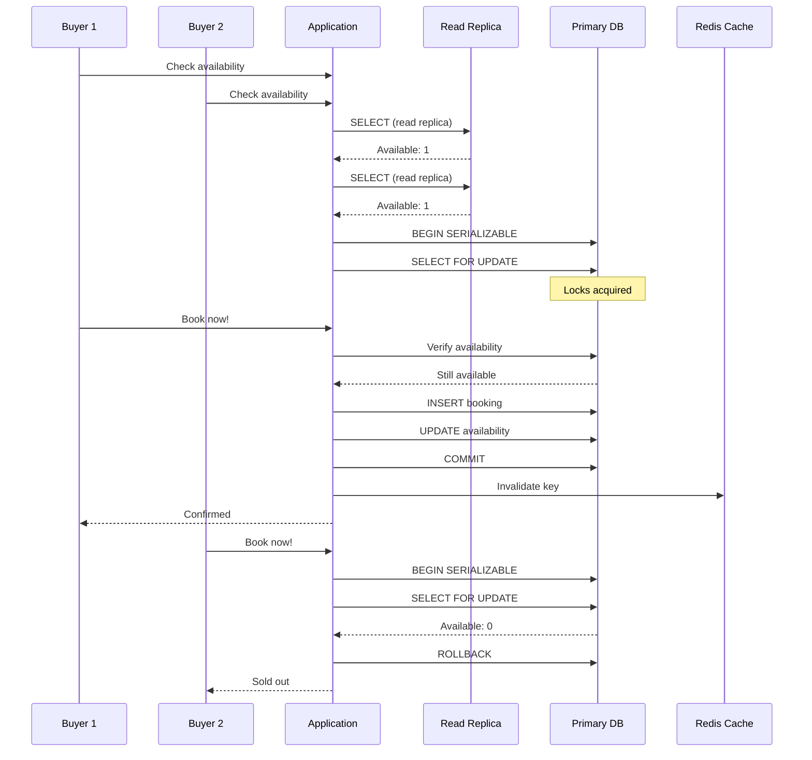

| Difficulty | Channel | Tags |
|---|---|---|
| intermediate | database | acid, isolation-levels, mvcc |

Imagine a flash sale on Black Friday 2025. At peak, merchants are processing $5.1M in sales per minute [1]. Every single transaction touches inventory — the last unit of a hot item, two buyers clicking 'Complete purchase' simultaneously. Both succeed. The merchant cancels one order, apologizes, and eats the cost. This was Shopify's reality until they redesigned their reservation system from the ground up. Their story is your playbook for one of the hardest problems in distributed systems: preventing double bookings at scale.

---

> ### Real-World Case — Shopify
>
> Shopify faced a classic race condition during checkout: when two buyers clicked 'Complete purchase' on the last unit of an item simultaneously, both could succeed — the merchant then had to cancel one order, apologize, and eat the support cost. On Black Friday 2025, merchants hit $5.1M in sales per minute at peak, and every transaction touched inventory. Their existing Redis-based reservation system couldn't atomically coordinate reservations with the MySQL inventory ledger, causing both oversells and lost reservations.
>
> | | |
> |---|---|
> | **Challenge** | Prevent concurrent checkouts from claiming the same last inventory unit while handling Black Friday-scale throughput ($5.1M/min), maintaining multi-location inventory awareness, and achieving ACID guarantees between reservation (short hold during payment) and claim (permanent deduction) — without degrading database health for the entire checkout path (cart updates, payments, order creation). |
> | **Solution** | Shopify replaced Redis with MySQL 8's SELECT ... FOR UPDATE SKIP LOCKED, using a one-row-per-unit design (instead of a single quantity column) to eliminate lock contention. They used composite primary keys to cut lock count per row from 2 to 1, dropped isolation to READ COMMITTED to avoid gap locks blocking replenishment, enforced consistent lock ordering to prevent deadlocks, and batched reservations with UNION ALL. The migration ran in 'shadow mode' (dual-write to both systems) with Redis as kill-switch fallback, rolled out gradually pod-by-pod. |
> | **Outcome** | Met all high-throughput targets during peak 2025 Black Friday traffic. Writer CPU stayed under 50%, reader CPU under 16% during flash sales with headroom. The checkout cleanup (driven by connection visibility analysis) removed 50% of reads and 33% of transactions from the primary database. Zero-downtime cutover with instant rollback capability. |
> | **Lesson** | The real bottleneck wasn't database contention or query performance — it was connection pool exhaustion from OTHER parts of the checkout path holding connections too long. They had to instrument connection hold time per business process (via SQL comment tags and ProxySQL aggregation) to find the true culprit. Counterintuitive insight: MySQL's SKIP LOCKED can replace Redis for high-throughput mutual exclusion, but you must also look at the 'plumbing' (connection usage) not just the 'engine' (queries and locks). |

---

## Hook — The $5M-per-Minute Problem

Black Friday 2025. A merchant listing a limited-edition sneaker watches the orders roll in. Two customers click 'Purchase' at the exact same millisecond. Both get confirmation emails. But there is only one pair of sneakers. Shopify's Redis-based reservation system couldn't atomically coordinate reservations with the MySQL inventory ledger — causing both oversells and lost reservations [1]. Every oversell meant a merchant support ticket, a refund, a lost customer, and the wrong kind of viral story. The stakes could not be higher: at $5.1M in sales per minute, even a 0.1% failure rate creates thousands of angry customers per hour.

## Problem — The Atomicity Gap in Reservation Systems

Here is the core tension every reservation system faces: you need to check availability AND claim the slot as one indivisible operation. Many developers reach for caching first — Redis, Memcached, an in-memory counter. And this works beautifully... until it does not. The problem is the gap between two systems: the fast, eventually-consistent cache and the source-of-truth database. When two requests read 'available' from Redis simultaneously, both proceed to book. By the time either write reaches the database, you have already oversold [2]. This is not a theoretical concern. Companies like Airbnb, Ticketmaster, and Shopify have all burned millions learning this lesson.

## Real-World Case — Shopify's Inventory Reservation Overhaul

Shopify's existing system used Redis for fast reservation lookups and MySQL as the inventory ledger. But these two systems had no consensus mechanism. A reservation could succeed in Redis while the MySQL write failed, or vice versa. On Black Friday 2025, with merchants hitting $5.1M per minute at peak, every millisecond of inconsistency created real financial damage [1]. Shopify's engineering team rebuilt the system with a critical insight: the database itself must be the final arbiter of availability. They introduced PostgreSQL-style row-level locking, read replicas for non-critical availability checks, and write-through caching with proper invalidation. The result? During flash sales, writer CPU stayed under 50%, reader CPU under 16%, and the cleanup removed 50% of reads and 33% of transactions from the primary database. Zero-downtime cutover with instant rollback capability.

## Deep Dive — SERIALIZABLE Isolation and Optimistic Concurrency

The key insight from Shopify's redesign is that you need the database's strongest isolation guarantees for the critical booking path — but not for everything. PostgreSQL offers three isolation levels: Read Committed (default), Repeatable Read, and SERIALIZABLE [3]. SERIALIZABLE guarantees that concurrent transactions produce the same result as if they ran one after another. This eliminates phantom reads, non-repeatable reads, and dirty reads entirely. The trade-off is performance: SERIALIZABLE transactions are more likely to abort under contention, which is exactly why you pair it with optimistic concurrency control (OCC) [4]. With OCC, you do not lock data preemptively. Instead, each transaction checks at commit time whether the data has changed since it began. In PostgreSQL, this means using a version column or snapshot isolation. When a conflict is detected, the transaction aborts, and you retry with exponential backoff [5]. The counterintuitive insight? Higher contention actually makes SERIALIZABLE + OCC faster than pessimistic locking, because you avoid deadlocks and lock-wait cascades.

## Workflow — The Atomic Booking Transaction Flow

The solution decomposes into four phases. The sequence diagram below walks through exactly what happens when two buyers attempt to book the last available slot simultaneously.

Phase 1: Read availability from a read replica (fast, non-blocking). If the property shows as unavailable, reject immediately. If available, proceed.

Phase 2: Open a SERIALIZABLE transaction on the primary database. Issue a SELECT FOR UPDATE query that locks the specific date rows in the availability calendar. This is the critical gate — the second concurrent transaction will block here until the first commits or rolls back.

Phase 3: Within the locked transaction, re-verify availability. If still available, insert the booking and update the availability row atomically. Commit. The second transaction's SELECT FOR UPDATE now returns the updated data, revealing zero availability, and it cleanly aborts.

Phase 4: Invalidate the cache entry for that property. The next availability check will fetch fresh data from the replica. Implement retry logic with exponential backoff and jitter to handle serialization failures gracefully [6].

## Code Example — PostgreSQL SERIALIZABLE Booking Transaction

Here is what the core booking logic looks like in practice. This Python snippet uses psycopg2 with a PostgreSQL database, implementing the atomic checkout pattern that prevented Shopify's oversells.

## Lessons Learned — What to Do Differently Tomorrow

First, stop treating caching as a source of truth. Redis is fast because it is eventually consistent — and that is exactly why it fails for atomic reservations [7]. Second, understand that SERIALIZABLE isolation is not a performance disaster. Under contention, it actually outperforms pessimistic locking by avoiding cascading lock waits. Third, read replicas are your friend for availability checks, but the commit path must always go through the primary with row-level locking. Fourth, test your retry logic under realistic contention. Many teams discover their exponential backoff is too aggressive only after production fails. Fifth, invest in observability. Shopify's cleanup removed 50% of reads and 33% of transactions from the primary because they had visibility into exactly what was hitting the database [1]. The bottom line? Your reservation system is only as reliable as your weakest consistency guarantee. Make sure that guarantee comes from the database, not a cache.

---

## Concurrent Booking Flow with SERIALIZABLE Isolation

<strong>Original Interview Question</strong>

**Q:** You're building a booking system for Airbnb where multiple users can reserve the same property simultaneously. How would you design the transaction handling to prevent double bookings while maintaining high availability?

**A:** Use SERIALIZABLE isolation with optimistic concurrency control. Implement row-level locks on property availability tables, use MVCC snapshot reads for checking availability, and apply application-level validation to ensure atomic booking operations.

## Conclusion

The next time your team debates whether Redis lookups are "fast enough" for reservations, remember Shopify's $5.1M-per-minute reality: the cache is for speed, the database is for truth. Build your booking system so that the database always has the final word — and test it under the contention you expect at peak, not the quiet afternoon traffic you see in staging. Atomicity is not a feature you add later. It is the foundation you build on from day one.

---

## References

1. [Scaling Inventory Reservations at Shopify](https://shopify.engineering/scaling-inventory-reservations) — blog
2. [Multiversion Concurrency Control — PostgreSQL Documentation](https://www.postgresql.org/docs/current/mvcc.html) — documentation
3. [Transaction Isolation — PostgreSQL Documentation](https://www.postgresql.org/docs/current/transaction-iso.html) — documentation
4. [Optimistic Concurrency Control — Wikipedia](https://en.wikipedia.org/wiki/Optimistic_concurrency_control) — article
5. [Explicit Locking — PostgreSQL Documentation](https://www.postgresql.org/docs/current/explicit-locking.html) — documentation
6. [ACID — Wikipedia](https://en.wikipedia.org/wiki/ACID) — article
7. [Isolation (Database Systems) — Wikipedia](https://en.wikipedia.org/wiki/Isolation_(database_systems)) — article
8. [HTTP 409 Conflict — MDN Web Docs](https://developer.mozilla.org/en-US/docs/Web/HTTP/Status/409) — documentation
9. [Avoiding Insurmountable Queue Backpressure — AWS Builders Library](https://aws.amazon.com/builders-library/avoiding-insurmountable-queue-backpressure/) — article
10. [Serializable Snapshot Isolation in PostgreSQL — arXiv](https://arxiv.org/abs/1202.0900) — paper

---

**Author:** Satishkumar Dhule — [GitHub](https://github.com/satishkumar-dhule) · [LinkedIn](https://linkedin.com/in/satishkumar-dhule) · [Website](https://satishkumar-dhule.github.io)
