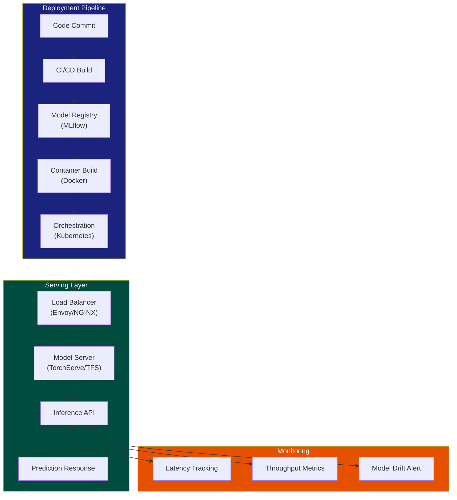

| Difficulty | Channel | Tags |
|---|---|---|
| beginner | devops | mlops, deployment |

Before 2015, Uber's ML teams were drowning. Each team built custom serving containers from scratch, there was no standardized deployment path, and shipping a single model took six to eight weeks [1]. Data scientists spent 60 to 70 percent of their time on infrastructure plumbing instead of actual model development. Then Uber built Michelangelo—a platform that now handles 10 million predictions per second across 5,000 models, with P95 latency under five milliseconds [1]. This is the story of why model deployment and model serving are two different beasts, and what happens when you treat them that way.

---

> ### Real-World Case — Uber
>
> Before 2015, Uber's ML teams were in chaos — each team built custom serving containers, there was no standardized deployment path, and deploying a single model took 6+ weeks. Data scientists spent 60-70% of their time on infrastructure plumbing instead of model development. The company built Michelangelo, an end-to-end ML platform that now serves 10M+ predictions per second across 5,000+ models.
>
> | | |
> |---|---|
> | **Challenge** | Uber needed to decouple model deployment (CI/CD pipelines, model registry, infrastructure provisioning, rollback strategies) from model serving (real-time inference APIs, load balancing, A/B testing, autoscaling). Teams had conflated the two, building bespoke one-off systems that were impossible to maintain at scale. |
> | **Solution** | Michelangelo introduced a clean architectural separation: a deployment layer with standardized packaging (ZIP archives of model artifacts), automated CI/CD via API/UI, model registry with versioning/tags/UUIDs, and monitoring — independent from a serving layer with three modes: online (sub-5ms P95 latency via RPC), offline (Spark batch jobs), and library deployment. Models could be deployed into production containers without serving traffic, enabling safe A/B testing via UUID/tag-based routing and gradual traffic shifting. |
> | **Outcome** | Deployment time dropped from 6+ weeks to hours. By 2024, Michelangelo managed 400+ active ML projects, 5,000+ production models, 10M+ real-time predictions/second at peak (up from 250K/sec in 2017), with P95 latency under 5ms for online models. The feature store grew to 20,000+ reusable features. The platform handled the full ML lifecycle across 10,000+ cities in 70+ countries. |
> | **Lesson** | Deployment and serving are fundamentally different concerns that must be separated. Deployment is about CI/CD, versioning, rollback, and infrastructure — treat it like software engineering. Serving is about runtime inference, latency, throughput, and resource management — treat it like distributed systems. Conflating them leads to fragile, unscalable systems where every team reinvents the wheel. |

---

## Hook — The Night Your Model Goes Silent

It deploys cleanly. The CI pipeline passes. Kubernetes schedules the pod. You watch the metrics dashboard, waiting for that first inference request. Nothing. Then: timeout errors. The model loads, but it takes thirty seconds to return the first prediction. Your pager goes off. Your boss is CC'd on the incident thread. Sound familiar? Many developers discover the hard way that getting a model into production is only half the battle. The other half—model serving—is where most systems quietly fail under real traffic. This gap between deployment and serving is the difference between a demo that looks great and a system that survives 2 AM on a Saturday.

## Problem — Two Jobs, One Confusing Name

The industry lumps deploying models into a single vague bucket, but the work splits into two fundamentally different disciplines. Deployment is the infrastructure and pipeline work: CI/CD automation, container orchestration, model registry, environment provisioning, and rollback strategies. Serving is the runtime work: loading models into memory, handling concurrent requests, batching inference, managing GPU memory, and returning predictions within strict latency budgets. Confuse these two, and you end up with a beautiful deployment pipeline that serves garbage—or worse, a model that serves predictions but cannot be updated without downtime. The tension between them shows up in every trade-off you make. Batch inference lets you maximize throughput but destroys real-time user experience. Real-time serving demands cold-start optimization but wastes resources during idle periods. Horizontal scaling via Kubernetes helps with traffic spikes but adds network hops that eat your latency budget.

## Real-World Case — Uber's Michelangelo Awakening

Uber felt this pain at hyperscale. By 2015, the company had dozens of ML use cases—ETA prediction, surge pricing, fraud detection, rider matching—but each team reinvented the wheel. One team used Flask with pickled models. Another built a custom Java serving layer. A third tried Node.js. There was no shared infrastructure, no common model format, no standardized way to A/B test or roll back a bad release [1]. The result: data scientists spent months shipping a single model, and when something broke at 3 AM, the person who built the container might be the only one who could fix it. Michelangelo changed that by building a unified platform. On the deployment side, it provided CI/CD pipelines, feature stores with 20,000 reusable features, and automated rollback. On the serving side, it delivered real-time inference APIs with sub-five-millisecond P95 latency, handling 10 million predictions per second across 5,000 production models [1]. The lesson: you cannot solve serving problems with deployment tools, and you cannot solve deployment problems with serving tools. You need both.

## Deep Dive — Deployment vs. Serving: The Real Differences

Let's get specific about what each discipline owns. **Deployment** handles the before and after: spinning up infrastructure with Terraform or Pulumi, building Docker images, pushing models to a registry like MLflow or Sagemaker, running CI/CD pipelines in GitHub Actions or Jenkins, health-checking pods in Kubernetes, and monitoring data drift in production [2][3]. **Serving** handles the during: loading model weights into GPU or CPU memory, deserializing requests into tensors or feature vectors, running inference with minimal overhead, serializing responses back, and managing graceful shutdown during scale-down events [4][5]. Here is where most teams get it wrong. They build a deployment pipeline that pushes a model to Kubernetes and call it done. But they forget to configure liveness probes correctly, so Kubernetes kills the pod during model loading. Or they serve the model with a generic web framework like Flask without async support, so a single slow request blocks the entire worker pool. Or they scale horizontally without thinking about GPU memory—each new pod needs its own model copy, and suddenly your memory budget is blown. The real art is understanding the trade-offs. Real-time inference (<100 ms) demands model servers like TorchServe or TensorFlow Serving that keep models warm in memory [4][5]. Batch inference (seconds to minutes) can use simpler tools but requires job scheduling and storage for intermediate results. A/B testing requires traffic splitting at the load balancer layer (Envoy, NGINX) along with model version routing [2]. Rollbacks need stateless serving containers that can swap model versions without restarts. Every architecture decision flows from one question: what latency does your user actually need?

## Workflow — From Notebook to Production Inference

The path from a Jupyter notebook to a production inference endpoint follows seven stages. First, **model registration**—log the model artifact, its hyperparameters, evaluation metrics, and training data hash to a registry like MLflow [3]. Second, **containerization**—package the model with its dependencies into a Docker image, including the serving framework. Third, **CI/CD validation**—run integration tests that send synthetic requests and verify the response format and latency. Fourth, **canary deployment**—route 5 percent of traffic to the new model version through the load balancer while monitoring error rates and latency [2]. Fifth, **full rollout**—gradually increase traffic to 100 percent with an automatic rollback trigger if P99 latency exceeds your threshold. Sixth, **runtime serving**—the model server handles individual requests, batches them when possible, and returns predictions with minimal overhead [4][5]. Seventh, **continuous monitoring**—track prediction distributions, feature drift, latency histograms, and throughput. The Mermaid diagram below visualizes this flow, showing how deployment infrastructure (CI/CD, Kubernetes, model registry) feeds into the serving layer (load balancer, model server, inference API), which feeds into monitoring and alerting.

## Code Example — A Production-Ready Serving Endpoint

Here is a FastAPI-based model server that handles the serving concerns your deployment pipeline cannot solve alone. It implements async inference, request batching, health checks, and versioned endpoints—patterns you will need the moment your model serves production traffic.

## Lessons Learned — What a Decade of ML Platforms Taught Us

Three patterns separate teams that sleep well from teams that do not. First, **separate deployment from serving in your architecture**. Use Kubernetes for orchestration, Terraform for provisioning, and MLflow for registry [2][3]. Use TorchServe or TensorFlow Serving for the critical path of loading models and running inference [4][5]. When you combine them into a single layer, you cannot update infrastructure without risking downtime on live predictions. Second, **design for cold starts before you need it**. Your model server will restart—pod evictions, rolling updates, spot instance reclaims. Use model servers that support model warming, keep a pool of preloaded model versions, and set readiness probes that only return healthy after the model loads [2]. Uber learned this the hard way: a pod restart that takes thirty seconds to load a model cascades into HTTP 503s across your fleet. Third, **monitor at both layers, not just one**. Deployment metrics tell you about pod health and CI success rates. Serving metrics tell you about latency, throughput, and prediction quality. You need both. Michelangelo's feature store of 20,000 reusable features did not help if the serving layer could not load them fast enough—and a perfect serving layer could not fix a model that was never deployed [1]. Start simple: FastAPI with async workers and a model preloaded at startup. Add batching when throughput demands it. Add Kubernetes when you need multi-replica fault tolerance. Add model version routing when you start A/B testing. Build the platform as you feel the pain, not before.

---

## Model Deployment and Serving Architecture

<strong>Original Interview Question</strong>

**Q:** Explain the key differences between model serving and model deployment in ML systems, including specific technologies, scaling considerations, and real-world implementation patterns?

**A:** Deployment encompasses CI/CD pipelines, infrastructure setup, and monitoring using tools like Kubernetes, MLflow, and SageMaker. Serving focuses on runtime inference APIs with frameworks like TensorFlow Serving, TorchServe, or BentoML, handling request routing, model versioning, and autoscaling. Key trade-offs include latency vs throughput, batch vs real-time inference, and cold start optimization.

## Conclusion

Uber's Michelangelo story proves one thing: the teams that distinguish deployment from serving build systems that scale. The teams that lump them together rebuild their serving layer every six months. Start by keeping these two concerns separate in your architecture. Preload your models, configure proper health checks, and measure latency at the serving layer—not just CPU utilization at the infrastructure layer. Your production models will thank you at 2 AM.

---

## References

1. [Uber Michelangelo ML Platform](https://www.uber.com/en-US/blog/michelangelo-machine-learning-platform/) — blog
2. [Kubernetes Production Best Practices](https://kubernetes.io/docs/setup/best-practices/) — documentation
3. [MLflow Documentation — Model Registry](https://mlflow.org/docs/latest/model-registry.html) — documentation
4. [TensorFlow Serving Overview](https://www.tensorflow.org/tfx/guide/serving) — documentation
5. [TorchServe Documentation](https://pytorch.org/serve/) — documentation
6. [BentoML Documentation](https://docs.bentoml.com/en/latest/) — documentation
7. [FastAPI Async Patterns](https://fastapi.tiangolo.com/async/) — documentation
8. [An Introduction to Kubernetes — DigitalOcean](https://www.digitalocean.com/community/tutorials/an-introduction-to-kubernetes) — documentation

---

**Author:** Satishkumar Dhule — [GitHub](https://github.com/satishkumar-dhule) · [LinkedIn](https://linkedin.com/in/satishkumar-dhule) · [Website](https://satishkumar-dhule.github.io)
