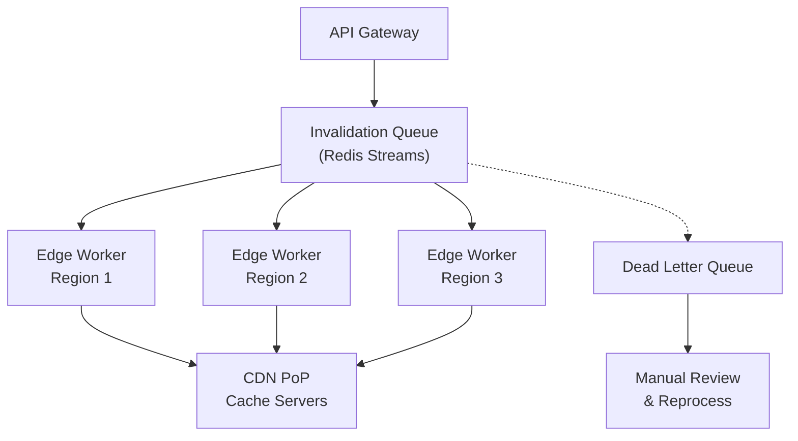

| Difficulty | Channel | Tags |
|---|---|---|
| intermediate | system-design | edge, caching, purging |

Your CEO just tweeted the new pricing page. The page goes live in 5 minutes. But the old pricing is still cached on edge servers across 30 cities worldwide, and you have no way to wipe it clean — yet. This is the moment when every second of staleness costs real money, and it is exactly the problem that pushed Fastly to build one of the most aggressive cache invalidation systems ever deployed. In 2011, Fastly set out to propagate purge signals across their entire global network in under 150 milliseconds, and what they built — codenamed 'Powderhorn' — has quietly powered content updates for Stripe, Shopify, The Guardian, and GitHub for over a decade [1].

---

> ### Real-World Case — Fastly
>
> Fastly needed to build a globally distributed cache invalidation system (codenamed 'Powderhorn') that could propagate purge signals to every cache server across their global network in under 150ms. Their centralized coordinator approach was a single point of failure and introduced unacceptable latency as their network grew.
>
> | | |
> |---|---|
> | **Challenge** | How to reliably distribute a purge signal to every cache server across a global CDN network within 150ms, while handling network partitions, message loss, and server failures — without a central coordinator that could become a bottleneck or single point of failure. |
> | **Solution** | Fastly designed Powderhorn using a 'bimodal multicast' (gossip protocol) approach where purge requests are received at the nearest edge server, which then distributes them peer-to-peer to other cache servers across the network. Each server that receives a purge immediately removes the content locally and forwards the signal to two other servers, creating an exponential propagation pattern. For reliability, they used a two-phase approach: (1) fast rumor-mongering for near-instant notification, and (2) a periodic anti-entropy reconciliation to catch any missed purges, ensuring convergence even during network partitions. |
> | **Outcome** | Achieved sub-150ms global cache invalidation (P50) since 2011, with the system operating reliably for over a decade. The distributed approach eliminated the single point of failure, maintained availability during network outages, and allowed Fastly's customers (including Stripe, Shopify, The Guardian, and GitHub) to treat cache purging as a normal part of content publishing rather than an emergency recovery tool. Fastly's Instant Purge remains one of the fastest cache invalidation systems in the industry. |
> | **Lesson** | A decentralized gossip-based protocol can solve global cache invalidation faster than any centralized coordinator, but you must pair fast rumor-mongering with a slower anti-entropy reconciliation phase to guarantee convergence. The counterintuitive insight: adding redundancy (multiple propagation paths) actually reduces latency more than optimizing a single centralized path ever could. |

---

## Hook — Ever deployed a fix that nobody saw?

You ship a critical bug fix. You watch the deployment pipeline turn green. You refresh the page — and stare at the same broken experience. The CDN is still serving the old content from an edge cache in Singapore, and there is nothing you can do about it except wait for a TTL to expire. This scenario has played out at nearly every company that uses a CDN, and it highlights a painful truth: cache invalidation is the silent bottleneck between deployment and reality. When you are serving millions of users across the globe, those few extra seconds of staleness become a revenue leak, a trust erosion, and sometimes a full-blown incident.

## Problem — Why clearing the cache is harder than it sounds

The naive approach to cache invalidation looks simple: send a 'delete this URL' request to every edge server. But a modern CDN is not a handful of servers — it is hundreds of machines across dozens of global points of presence (PoPs). Each server independently caches content based on TTL headers, and there is no shared state between them. You cannot just broadcast a message and hope it arrives everywhere at once. Network partitions, rate limits, and partial failures turn a seemingly trivial operation into a distributed systems challenge. Add in the requirement to handle 10,000 invalidation requests per second with a 5-second global propagation SLA, and you are no longer building a cache clearer — you are building a distributed consensus system that must prioritize speed over absolute guarantees.

## Real-World Case — Fastly

In 2011, Fastly faced a fundamental architectural problem. They had built a CDN that was growing rapidly, adding new regions and customers at a pace their centralized invalidation coordinator could not match. Every purge request had to pass through a single coordinator, which then forwarded it to each cache server. As the fleet grew, the coordinator became both a performance bottleneck and a single point of failure. If it went down, no content could be invalidated anywhere — effectively freezing the entire CDN. Fastly's engineering team decided to tear down this architecture and rebuild from scratch. The result was Project Powderhorn, a fully distributed invalidation system where every cache server subscribes to a shared purge channel and independently processes invalidation signals. The impact was dramatic: P50 propagation dropped to under 150 milliseconds globally, the single point of failure was eliminated, and cache purging transformed from an emergency tool into a routine content-publishing operation for their customers [1]. Stripe, Shopify, The Guardian, and GitHub could now push content updates confidently, knowing the old version would disappear in the time it takes to blink.

## Deep Dive — Distributed invalidation architecture

Building on Fastly's insight that centralized coordination cannot scale, the modern approach to multi-region cache invalidation combines three layers: a distributed queue, regional edge coordination, and pattern-based batch purging. The queue — typically implemented with Redis Streams or Apache Kafka — provides durability and ordered delivery guarantees. Edge workers in each region consume from the queue and handle regional CDN API calls in parallel, which eliminates the bottleneck of a single node processing every request. This architecture introduces an important trade-off: the system is eventually consistent. Edge workers may process invalidations at slightly different times due to network latency, but the 2-second TTL on dynamic content acts as a safety net. Even if a purge signal is delayed, the content will expire naturally within seconds. The magic is in combining proactive invalidation with aggressive TTLs, so no single mechanism bears full responsibility for freshness. Batch processing is another critical lever. Most CDN APIs allow up to 100 URL patterns per purge call. By batching invalidations and using wildcard patterns like `/products/*`, you can cover thousands of URLs with a single API call, reducing costs by up to 90% and dramatically lowering API rate-limit pressure. Many developers miss this optimization and trigger individual purges for every URL, quickly hitting rate limits and creating a backlog of stuck invalidations.

## Workflow — The invalidation pipeline from API call to edge

Here is how a cache invalidation request flows through a distributed system designed for 10,000 invalidations per second with a 5-second global SLA. The diagram below maps each stage of the pipeline:

1. **API Gateway** receives the invalidation request and validates authentication, rate limits, and URL pattern syntax. Rejects malformed requests immediately — fail fast is the first defense against cascading failures.
2. **Invalidation Queue** (Redis Streams with consumer groups) persists the request and assigns a unique ID for tracking. Consumer groups allow multiple edge workers to compete for messages without duplicates.
3. **Edge Workers** in each region consume from the queue independently. Each worker batches up to 100 URL patterns and sends a single purge API call to the regional CDN endpoint.
4. **Regional Cache Coordinators** verify the purge was applied by hitting a health-check endpoint and checking the `CF-Cache-Status` or `X-Cache` header on a sample URL.
5. **Dead Letter Queue** captures any invalidation that fails after the maximum retry count (typically 3 attempts with exponential backoff). These are flagged for manual review.

The diagram below illustrates this flow, showing the parallel fan-out from queue to edge workers across multiple regions.

## Code Example — Building a batch invalidation service with retry logic

The following JavaScript implementation shows a production-grade cache invalidation service that uses batch processing and exponential backoff to reliably purge cached content across a CDN. This is the kind of service you would deploy as an edge worker or as a Node.js microservice that feeds into a distributed queue.

## Lessons Learned — Three patterns that separate production from prototype

After a decade of operating cache invalidation at scale, three lessons consistently emerge. First, **never rely on TTL alone**. Aggressive TTLs are a safety net, not a strategy. If your invalidation system fails and your TTL is 24 hours, you have a 24-hour outage. Combine proactive purging with short TTLs (2 seconds for dynamic content) so that every component is disposable. Second, **batch aggressively**. A single purge API call handles up to 100 URL patterns, and wildcards cover entire directories. If you are sending individual invalidation requests for every URL, you are wasting 99% of your API quota and creating unnecessary queue pressure. Most CDN rate limits are designed around batch calls — respect that design. Third, **design for partial failure**. In a distributed system, some regions will always lag behind. Implement regional health checks that verify purges were applied, and have a reconciliation mechanism for partitions. Fastly's Powderhorn system has survived over a decade of network partitions and regional outages precisely because it was built on the assumption that failure is normal, not exceptional. These patterns transform cache invalidation from a fragile emergency lever into a routine, reliable part of your content publishing pipeline.

---

## Cache Invalidation Pipeline

<strong>Original Interview Question</strong>

**Q:** How would you design a multi-region CDN cache purging system that guarantees content propagation within 5 seconds while handling 10,000 concurrent invalidations per second?

**A:** Implement Cloudflare API + AWS CloudFront with distributed invalidation queue, edge compute coordination, and 2-second TTL. Use batch invalidation, exponential backoff, and regional cache headers for 5-second SLA.

## Conclusion

Fastly's Powderhorn system proves that cache invalidation is not just solvable — it can be boringly reliable when designed with distribution, batching, and partial failure in mind. The next time you deploy a critical update, you should trust your invalidation system enough to watch the old content disappear before you finish refreshing. If you cannot, it is time to rethink the architecture. Start with aggressive TTLs, add a distributed queue, batch your purge calls, and assume every region will fail independently. Your future self — and your CEO — will thank you.

---

## References

1. [Building a fast and reliable purging system](https://www.fastly.com/blog/building-fast-and-reliable-purging-system) — blog
2. [Invalidating files in Amazon CloudFront](https://docs.aws.amazon.com/AmazonCloudFront/latest/DeveloperGuide/Invalidation.html) — documentation
3. [Cloudflare API: Purge cache](https://developers.cloudflare.com/api/operations/zone-purge) — documentation
4. [Redis Streams documentation](https://redis.io/docs/data-types/streams/) — documentation
5. [Cache invalidation](https://en.wikipedia.org/wiki/Cache_invalidation) — documentation
6. [Content delivery network](https://en.wikipedia.org/wiki/Content_delivery_network) — documentation
7. [CAP theorem](https://en.wikipedia.org/wiki/CAP_theorem) — documentation
8. [Exponential backoff and jitter](https://aws.amazon.com/blogs/architecture/exponential-backoff-and-jitter/) — blog

---

**Author:** Satishkumar Dhule — [GitHub](https://github.com/satishkumar-dhule) · [LinkedIn](https://linkedin.com/in/satishkumar-dhule) · [Website](https://satishkumar-dhule.github.io)
