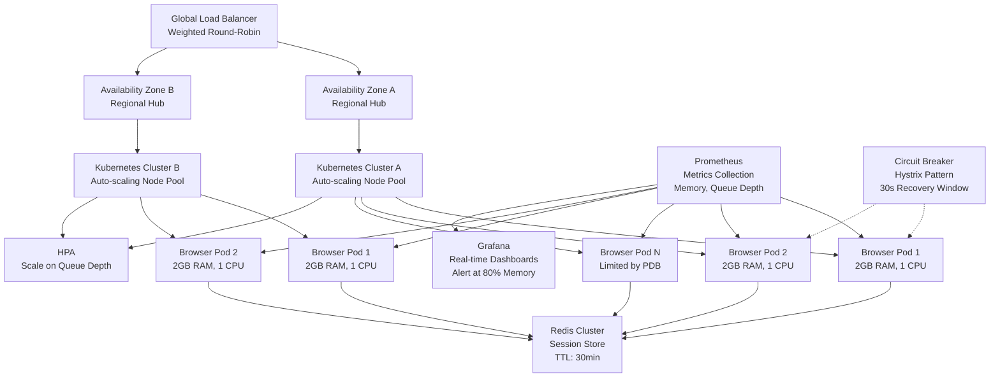

| Difficulty | Channel | Tags |
|---|---|---|
| advanced | system-design | selenium, webdriver, grid |

Your test suite is taking over an hour. Developers are waiting in queues. Your CI pipeline is a bottleneck. In 2017, Zalando's engineering productivity team faced this exact nightmare — and they solved it so elegantly that their open-source project gained 2,400 GitHub stars and changed how Selenium Grid works forever [1]. This is the story of how they did it, and how you can apply the same architecture to handle 10,000 concurrent sessions with 99.9% uptime.

---

> ### Real-World Case — Zalando
>
> Zalando's Engineering Productivity team needed to provide scalable UI test infrastructure across dozens of product teams. They relied on docker-selenium (fast but hard to maintain) and Sauce Labs (broad coverage but expensive). Maintaining browser versions, node configurations, and grid stability consumed significant engineering time.
>
> | | |
> |---|---|
> | **Challenge** | Selenium Grid infrastructure was brittle and labor-intensive: browser version updates required node-by-node manual patching, static node pools wasted resources when idle, and scaling to meet peak demand meant over-provisioning. Version drift between nodes caused flaky tests, and orphaned browser sessions leaked memory over time. |
> | **Solution** | Built Zalenium, an open-source Selenium Grid extension that dynamically provisions Docker containers on-demand per test session. Each test gets a fresh browser container created from scratch and disposed of after completion — eliminating memory leaks and state pollution. Chrome/Firefox run on local Docker containers for speed, while other browsers route to cloud providers (Sauce Labs, BrowserStack) via a relay pattern. Supports Kubernetes orchestration with video recording, live preview, and a dashboard for monitoring. |
> | **Outcome** | Test suite run times dropped from over an hour to six minutes (per user testimonial). Teams got disposable, consistent test environments with zero state leakage between runs. The project gained 2.4k GitHub stars and 555 forks, was presented at Selenium Conf 2017, and influenced upstream Selenium Grid 4 features (dynamic node management, session queues). |
> | **Lesson** | Ephemeral containers eliminate the classic Selenium Grid maintenance nightmare — no stale browser state, no version drift, no orphaned session memory leaks. A hybrid model (local Docker for speed + cloud providers for coverage) gives you fast Chrome/Firefox execution while only paying for cloud testing on edge browsers like Safari and IE. |

---

## Hook — The Test Infrastructure That Almost Broke Zalando

Picture this: dozens of product teams, each shipping code daily, all fighting for the same brittle test infrastructure. Browser versions were out of sync. One team's stray session would leak memory and crash nodes for everyone else. Maintaining docker-selenium images ate up engineering hours like candy, and the Sauce Labs bill was climbing fast [1]. Sound familiar? Zalando's team realized they had a choice: keep patching the old system with duct tape, or fundamentally rethink how Selenium Grid should work at scale. They chose the latter — and the result became Zalenium, a project that would eventually influence Selenium Grid 4 itself.

## Problem — Why Selenium Grid Crashes at Scale

Here is the thing most teams discover too late: Selenium Grid was designed for a world where a few hundred tests ran occasionally, not for thousands of concurrent sessions running 24/7. The classic hub-node architecture looks great on paper until you hit reality. Memory leaks accumulate across sessions because browser processes don't always clean up after themselves. A single misbehaving test can take down an entire node. Network partitions cause split-brain scenarios where the hub thinks a node is alive but it is actually dead. And when you have 10,000 sessions to run, even a 0.1% failure rate means 10 broken tests every run — each requiring a developer to manually investigate [2]. The stakes are high: when your test infrastructure is unreliable, developers stop trusting the tests. They skip runs. They merge without verification. The cycle of technical debt accelerates. Many teams respond by throwing more hardware at the problem — more nodes, bigger machines, more memory. But that just masks the underlying issues. The real challenge is three-fold: session lifecycle management, resource isolation, and failure recovery. Get those three right, and everything else follows.

## Real-World Case — Zalando's Zalenium Revolution

Zalando's Engineering Productivity team managed test infrastructure for dozens of product teams across Europe's largest fashion e-commerce platform. Their setup was a choice between two imperfect options: docker-selenium, which was fast but a maintenance nightmare, and Sauce Labs, which was comprehensive but expensive [1]. The maintenance burden was crushing. Browser versions needed constant updates. Node configurations drifted. Grid stability was a full-time job. The breaking point came when test suite run times stretched past an hour — developers were literally waiting all morning for test results. The team's response was Zalenium, a disposable Selenium Grid running on Docker. Each test got its own clean container — zero state leakage between runs, automatic cleanup, and dynamic node scaling. The impact was dramatic: test suite run times dropped from over an hour to just six minutes. Teams got disposable, consistent test environments. The project resonated so deeply with the community that it hit 2.4k GitHub stars and 555 forks. It was presented at Selenium Conf 2017 and directly influenced Selenium Grid 4's dynamic node management and session queue features [1]. This was not just a tool — it was proof that the hub-node pattern, when combined with container isolation and proper lifecycle management, could scale far beyond what anyone thought possible.

## Deep Dive — The Architecture of a 10,000-Session Grid

Building on Zalando's containerized approach, let's look at what it takes to reach 10,000 concurrent sessions with 99.9% uptime. The foundation is Kubernetes with auto-scaling node pools spread across multiple availability zones [3]. You need at least 200 nodes (assuming 50 sessions per node with 2GB RAM and 1 CPU each), plus a 30% buffer — that is 520GB of cluster memory minimum. However, raw capacity is not enough. You need session lifecycle management. Redis clusters with TTL-based expiration handle this — each session key expires automatically after a configurable timeout, and a background process scans for stale keys every 5 minutes [4]. Connection pooling prevents Redis from becoming a bottleneck. This leads to the monitoring layer. Prometheus collects metrics from every node — memory usage, session duration, queue depth — and Grafana visualizes it all in real-time dashboards [5]. Alerts fire at 80% memory usage. Weekly rolling restarts prevent long-term memory creep. Here is where it gets counterintuitive: many teams focus on adding more nodes when tests slow down. But the real bottleneck is often session queue management and resource contention, not raw compute [6]. The solution is a weighted round-robin load balancer that considers both node capacity and response time, with HTTP health checks every 10 seconds and automatic node removal after 3 consecutive failures. Circuit breakers using Hystrix patterns isolate failing nodes for 30-second recovery windows, preventing cascading failures [7]. You might think this is overkill for a test grid. But consider what happens during a zero-day failure. With canary deployments and traffic splitting, you can roll out new node versions to 5% of traffic first. Pod Disruption Budgets ensure at least 85% capacity during maintenance [3]. Split-brain prevention uses leader election with etcd consensus. Every edge case has a corresponding defense.

## Workflow — From Test Submission to Result in 6 Minutes

The architecture follows a clear flow that turns a test submission into a result with minimal latency and maximum reliability. Here is how it works:

1. Test request hits the global load balancer, which routes to the nearest regional Selenium hub based on latency and capacity.
2. The hub checks the Redis session store for available capacity and assigns the test to the least-loaded node.
3. Kubernetes schedules a new pod if all existing nodes are at capacity, scaling horizontally based on queue depth.
4. The browser runs inside an isolated container — no state shared with any other session.
5. Prometheus records session metrics — duration, memory, browser version — for real-time dashboards.
6. On completion or timeout, the container is destroyed, Redis TTL expires the session entry, and the node reports back to the hub.
7. If a node fails health checks, the circuit breaker isolates it for 30 seconds while Kubernetes restarts the pod.

This workflow handles 10,000 concurrent sessions because every component is designed for failure. Nodes crash — the system adapts. Sessions leak — TTL cleans them up. Traffic spikes — auto-scaling adds capacity.

The Mermaid diagram below visualizes this architecture, showing how traffic flows from load balancers through regional hubs to individual browser nodes, with Redis providing session state and Prometheus providing observability.

## Code Example — Automated Session Lifecycle Management

The heart of a 10,000-session grid is not the browser nodes — it is the session lifecycle management. Here is a Python implementation showing how to manage sessions with Redis, health checks, and circuit breakers:

## Lessons Learned — What Zalando Taught the Testing World

If there is one thing Zalando's story teaches, it is this: test infrastructure is production infrastructure. Treat it that way. Apply the same reliability patterns — Kubernetes orchestration, circuit breakers, health checks, auto-scaling — that you use for your customer-facing services. Five key takeaways stand out. First, container isolation is non-negotiable. Zalenium's disposable containers eliminated state leakage entirely [1]. Second, session lifecycle management is the linchpin — if you do not have automatic TTL-based cleanup, memory leaks will eventually crash everything [4]. Third, monitoring is not optional. Prometheus metrics saved Zalando's team from flying blind — you cannot fix what you cannot measure [5]. Fourth, design for graceful degradation. Circuit breakers and Pod Disruption Budgets ensure a node failure does not become a grid failure [7]. Fifth, invest in the developer experience. The six-minute test run was not a technical win — it was a culture win. Developers trusted the tests again. What should you do tomorrow? Audit your current test infrastructure. Do you have automatic session cleanup? Can you survive a node failure without manual intervention? Do you know your P99 session initiation latency? If the answer to any of these is "no," you have your starting point.

---

## Multi-AZ Selenium Grid Architecture

<strong>Original Interview Question</strong>

**Q:** Design a scalable Selenium Grid architecture to handle 10,000 concurrent test sessions with 99.9% uptime, ensuring zero memory leaks through automatic session lifecycle management, real-time monitoring, and graceful node failure recovery across multiple data centers?

**A:** Deploy Kubernetes cluster with auto-scaling node pools, Redis session store with TTL policies, Prometheus metrics for memory monitoring, circuit breakers for node isolation, and sidecar containers for session cleanup. Implement health checks, resource quotas, and rolling updates.

## Conclusion

Zalando proved that test infrastructure is not a second-class citizen — it deserves the same architectural rigor as your production services. Container isolation, automatic lifecycle management, circuit breakers, and real-time monitoring transformed their grid from an hour-long bottleneck to a six-minute breeze. The same patterns apply whether you are running 100 sessions or 10,000. Start with session lifecycle management — cleanup your sessions automatically, monitor your memory usage, and design for failure. Your test suite, and your developers, will thank you.

---

## References

1. [Zalando Engineering Blog: Zalenium — A disposable and flexible Selenium Grid infrastructure](https://engineering.zalando.com/posts/2017/02/zalenium-a-disposable-and-flexible-selenium-grid-infrastructure.html) — blog
2. [Selenium Grid Documentation](https://www.selenium.dev/documentation/grid/) — documentation
3. [Kubernetes Documentation: Concepts](https://kubernetes.io/docs/concepts/) — documentation
4. [Redis Documentation: Key expiration and TTL](https://redis.io/docs/latest/develop/use/keyspace/) — documentation
5. [Prometheus Documentation: Overview](https://prometheus.io/docs/introduction/overview/) — documentation
6. [Docker Documentation: Overview](https://docs.docker.com/get-started/overview/) — documentation
7. [Martin Fowler: Circuit Breaker Pattern](https://martinfowler.com/bliki/CircuitBreaker.html) — blog
8. [Grafana Documentation: Dashboards](https://grafana.com/docs/grafana/latest/dashboards/) — documentation

---

**Author:** Satishkumar Dhule — [GitHub](https://github.com/satishkumar-dhule) · [LinkedIn](https://linkedin.com/in/satishkumar-dhule) · [Website](https://satishkumar-dhule.github.io)
