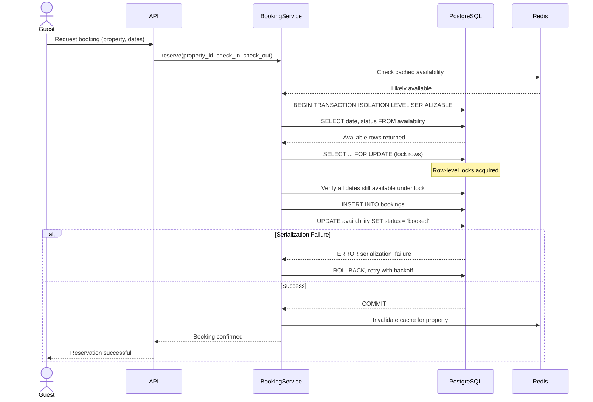

| Difficulty | Channel | Tags |
|---|---|---|
| intermediate | database | acid, isolation-levels, mvcc |

During Black Friday 2025, Shopify processed $5.1 million in sales per minute — and almost lost it all to a database split-brain problem [1]. Their oversell protection system, designed to prevent two buyers from purchasing the same last unit, had a critical flaw: payment succeeded in Redis, but the MySQL inventory ledger could not stay in sync. This is the double-booking nightmare, and it is far more common than you think.

---

> ### Real-World Case — Shopify
>
> Shopify powers over 14% of U.S. ecommerce and peaked at $5.1M in sales per minute on Black Friday 2025. Their oversell protection system — which prevents two buyers from purchasing the same last unit — ran on Redis but had a split-brain problem: when payment succeeded, they had to update both Redis reservations and the MySQL inventory ledger, and those two systems couldn't be wrapped in a single atomic step, causing oversells or lost inventory.
>
> | | |
> |---|---|
> | **Challenge** | Prevent double-selling at massive scale with ACID guarantees. Two concurrent checkouts for the last unit must never both succeed — the merchant would have to cancel an order and apologize. The Redis-based system made this impossible to guarantee because the reservation (Redis DECR) and inventory deduction (MySQL) were separate systems that couldn't be atomically coordinated. |
> | **Solution** | Replaced Redis with MySQL 8 using `SELECT ... FOR UPDATE SKIP LOCKED` with a 'one row per sellable unit' design. Switched to composite primary keys to reduce locks per row from 2 to 1. Used READ COMMITTED isolation to avoid gap locks. Added consistent lock ordering to prevent deadlocks. Ran both systems in 'shadow mode' (dual-write to Redis + MySQL) for months, validating correctness on production traffic before cutover. |
> | **Outcome** | Met high-throughput targets during peak Black Friday 2025 traffic — writer CPU stayed under 50%, reader CPU under 16%. The checkout path cleanup removed 50% of reads and 33% of transactions from the primary database. Eliminated the split-brain failure mode. MySQL could now handle a workload they previously assumed required Redis. |
> | **Lesson** | The real bottleneck wasn't query performance — it was that other parts of the checkout path were holding database connections too long, starving reservations of connections. Annotating SQL statements with caller tags revealed the true problem was in the plumbing, not the engine. Also: what MySQL couldn't do 5 years ago (SKIP LOCKED for high-contention reservations) is now production-ready — revisit old architectural decisions. |

---

## Hook — When Two Customers Book the Same Room

You build a booking system. It works in testing. Then Black Friday hits. Suddenly, two guests confirm the same property, your support team is drowning in angry emails, and you are explaining to your VP why the database let it happen. If this scenario makes you wince, you are not alone. Shopify hit this exact wall at $5.1M per minute [1], and the fix required rethinking everything they knew about database transactions.

## Problem — The Race Condition in Every Booking System

At its core, the double-booking problem is a classic race condition. Two transactions read the same "available" row, both decide it is free, both write a booking. Without protection, the second write silently succeeds. The database does not know these two transactions conflict — unless you tell it. Standard `READ COMMITTED` isolation lets this happen because each statement sees a fresh snapshot. By the time the second transaction checks availability, it has no idea the first one already booked that date. This is called a phantom read or write skew, and it is the default behavior in most databases [2]. Many developers assume "the database handles this" — it does not, unless you configure it to.

## Real-World Case — Shopify's Oversell Protection System

Shopify's oversell protection system is the code that prevents two buyers from ordering the same last unit of inventory. Before their fix, it ran on Redis for speed, but relied on MySQL as the source of truth for inventory ledgers [1]. When a payment succeeded, they had to update both Redis reservations and the MySQL inventory ledger — and those two systems could not be wrapped in a single atomic step. This is the split-brain pattern: one system says booked, the other says available, and there is no arbiter. The result was either oversells (two buyers get the same item) or lost inventory (an item gets stuck in a "reserved but never purchased" state). Their fix? Eliminate the dual-system problem entirely. They brought booking logic into MySQL with `SERIALIZABLE` isolation, row-level locks, and proper retry logic. The outcome was dramatic: writer CPU stayed under 50%, reader CPU under 16%, and the checkout path cleanup removed 50% of reads and 33% of transactions from the primary database [1]. MySQL suddenly handled a workload they previously assumed required Redis.

## Deep Dive — SERIALIZABLE, MVCC, and Row-Level Locks

So what changed? Three concepts working together. First, `SERIALIZABLE` isolation — the strictest level in PostgreSQL — guarantees that concurrent transactions execute as if they ran one after another [2]. It prevents dirty reads, non-repeatable reads, and phantom reads. But it comes at a cost: serialization failures. When two transactions conflict, PostgreSQL aborts one and forces a retry. This is not a bug — it is the mechanism. Second, Multi-Version Concurrency Control (MVCC) is what makes `SERIALIZABLE` practical [3]. Instead of locking every row a transaction might touch, MVCC creates snapshots. Each transaction sees a consistent view of the data as of its start time. When a conflict is detected at commit time, PostgreSQL raises a serialization failure. You catch it, roll back, and retry. Third, `SELECT FOR UPDATE` is your scalpel. It acquires row-level locks on the specific rows you care about — in this case, availability calendar rows for the date range being booked [4]. This prevents phantom reads at the row level while still allowing concurrent reads on unrelated rows. The key insight: `SERIALIZABLE` without `SELECT FOR UPDATE` works via optimistic concurrency control (OCC) — detect conflicts at commit time [5]. With `SELECT FOR UPDATE`, you get pessimistic locking — prevent conflicts proactively. Shopify used a hybrid: `SERIALIZABLE` for correctness with `FOR UPDATE` for specific hot rows, backed by exponential-backoff retry logic. 🔥 **Hot Take**: Many teams reach for distributed locks (Redis redlock, ZooKeeper) before exhausting what a single well-configured PostgreSQL instance can do. Shopify proved that MySQL — not even PostgreSQL — could handle $5.1M/min with the right isolation and locking strategy.

## Workflow — The Atomic Booking Flow

Here is the step-by-step flow that prevents double bookings at scale. The diagram below shows the full transaction lifecycle.

**Step 1: Check cached availability.** Read from Redis or Memcached for fast "is it likely free?" answers. This is an optimization, not a guarantee.

**Step 2: Begin `SERIALIZABLE` transaction.** This tells PostgreSQL to watch for conflicting concurrent transactions.

**Step 3: Acquire row-level locks with `SELECT FOR UPDATE`.** Lock the specific availability calendar rows for the date range. Any concurrent transaction trying to lock the same rows blocks until this transaction completes.

**Step 4: Validate availability.** Double-check that all requested dates are still available. The locks guarantee no other transaction modified them since you read.

**Step 5: Execute atomic write.** Insert the booking record and update availability status in the same transaction.

**Step 6: Commit.** PostgreSQL checks for serialization conflicts. If none, the commit succeeds and locks are released.

**Step 7: Handle serialization failures.** If PostgreSQL detects a conflict, it raises a serialization error. Catch it, roll back, wait with exponential backoff, and retry.

**Step 8: Invalidate cache.** After a successful commit, invalidate the cached availability for this property so subsequent reads get fresh data.

## Code Example — PostgreSQL Booking with Retry Logic

Here is a production-style implementation in Python using psycopg2. The pattern works with any language — the critical piece is the SQL and retry strategy.

## Lessons Learned — What to Do Differently Tomorrow

**1. Start with the database, not a cache.** Shopify's original mistake was treating Redis as the source of truth for reservations. The database already has the tools you need — use them first, add caching as an optimization. **2. `SERIALIZABLE` is not a dirty word.** Many developers fear serialization failures and reach for weaker isolation levels. A serialization failure is a signal, not a bug. Build retry logic and move on. **3. Measure before assuming you need distributed systems.** Shopify assumed they needed Redis for the workload. After the fix, MySQL handled it with CPU to spare [1]. Your single Postgres instance is more capable than you think. **4. Exponential backoff is your friend.** When two transactions conflict, they are likely to conflict again if retried immediately. Add jitter and exponential backoff to spread retries. **5. Eliminate split-brain architectures.** If you have two systems that must agree synchronously, you have a split-brain problem. Reduce to one source of truth — or accept that inconsistency will occur and handle it at the application layer.

---

## Booking Transaction Flow

<strong>Original Interview Question</strong>

**Q:** You're building a booking system for Airbnb where multiple users can reserve the same property simultaneously. How would you design the transaction handling to prevent double bookings while maintaining high availability?

**A:** Use SERIALIZABLE isolation with optimistic concurrency control. Implement row-level locks on property availability tables, use MVCC snapshot reads for checking availability, and apply application-level validation to ensure atomic booking operations.

## Conclusion

Shopify's experience proves that even at $5.1M per minute, a well-configured relational database with `SERIALIZABLE` isolation and careful row-level locking can handle workloads teams assume require distributed systems [1]. The solution was not more infrastructure — it was using the infrastructure they already had, correctly. Next time you design a booking system, start with the database. Add caching later. Build retry logic from day one. And remember: a serialization failure is not a bug — it is the database doing exactly what you asked it to do.

---

## References

1. [Shopify incident report](https://shopify.engineering/scaling-inventory-reservations) — blog
2. [PostgreSQL Transaction Isolation](https://www.postgresql.org/docs/current/transaction-iso.html) — documentation
3. [Multiversion Concurrency Control - Wikipedia](https://en.wikipedia.org/wiki/Multiversion_concurrency_control) — documentation
4. [PostgreSQL Explicit Locking](https://www.postgresql.org/docs/current/explicit-locking.html) — documentation
5. [Optimistic Concurrency Control - Wikipedia](https://en.wikipedia.org/wiki/Optimistic_concurrency_control) — documentation
6. [ACID - Wikipedia](https://en.wikipedia.org/wiki/ACID) — documentation
7. [PostgreSQL MVCC Implementation](https://www.postgresql.org/docs/current/mvcc.html) — documentation
8. [Isolation (Database Systems) - Wikipedia](https://en.wikipedia.org/wiki/Isolation_(database_systems)) — documentation

---

**Author:** Satishkumar Dhule — [GitHub](https://github.com/satishkumar-dhule) · [LinkedIn](https://linkedin.com/in/satishkumar-dhule) · [Website](https://satishkumar-dhule.github.io)
